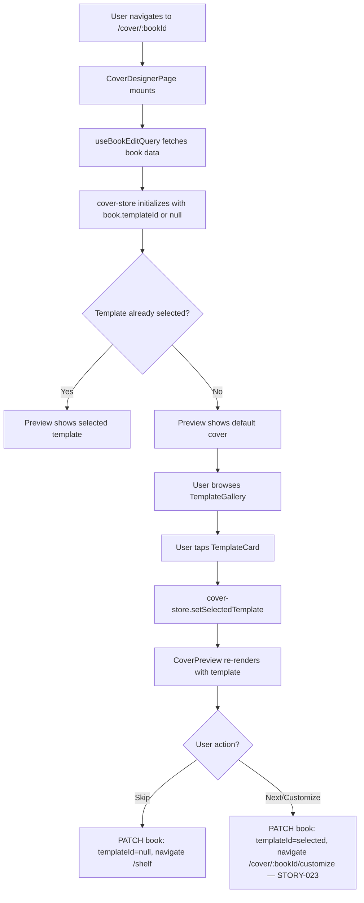
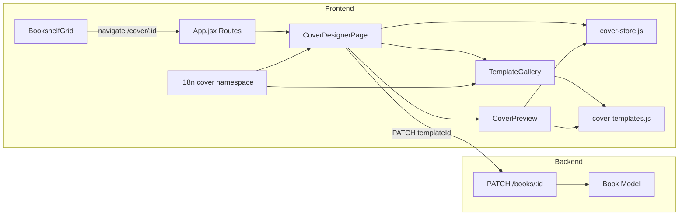
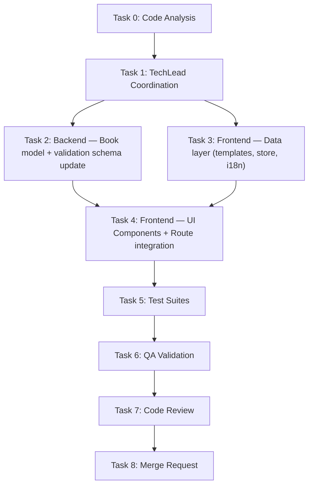

# STORY-022: Cover Designer UI & Template Selection — Technical Analysis

**Epic**: EPIC-004
**Persona**: Julia — The Young Author
**Dependencies**: STORY-006 (Asset Storage — ✅), STORY-020 (Publish Book — ✅)
**Stack Source**: `docs/architecture/TECH-STACK.md`

---

## 1. Story Summary

Julia finishes writing or taps "Design Cover" from the shelf. A cover designer opens with a gallery of 10–15 kid-friendly templates (Galaxy, Adventure, Nature, Stripes, etc.). Tapping a template instantly previews it with the book's title/author prefilled. Responsive: horizontal scroll on mobile, grid on tablet/desktop. Accessible (WCAG 2.1 AA). "Skip" assigns default cover and returns to shelf. "Next/Customize" proceeds to STORY-023 color/text customization.

---

## 2. Stack Detection

| Indicator | Result |
|-----------|--------|
| `package.json`, `vite.config.js`, `tsconfig` absent | **Node.js** (JSX, no TS) |
| `react` in deps, `.jsx` files | **React 18** |
| `tailwind.config.js`, Tailwind in deps | **Tailwind CSS 3.x** |
| `fabric` in deps (v6.4.0) | **Fabric.js** available (for STORY-023, NOT this story) |
| Zustand + TanStack Query | State: Zustand (client) + React Query (server) |

**Frontend-Backend Integration**: Node.js SPA mode — Vite dev proxy to Express; typed API client via `lib/api-client.js`.

---

## 3. Impact Analysis

### 3.1 New Files to Create

| Path | Purpose |
|------|---------|
| `frontend/src/app/cover/CoverDesignerPage.jsx` | Page orchestrator — template gallery + preview + actions |
| `frontend/src/app/cover/TemplateGallery.jsx` | Horizontal scroll / grid of template thumbnails |
| `frontend/src/app/cover/TemplateCard.jsx` | Single template thumbnail in gallery |
| `frontend/src/app/cover/CoverPreview.jsx` | Live preview pane (cover + spine + edge) |
| `frontend/src/app/cover/CoverDesignerActions.jsx` | Skip / Next buttons bar |
| `frontend/src/lib/cover-templates.js` | Template definitions (10–15 templates: id, name, background, palette, decoration) |
| `frontend/src/stores/cover-store.js` | Zustand store for cover designer state |
| `frontend/src/i18n/locales/en/cover.json` | English translations for cover namespace |
| `frontend/src/i18n/locales/pt-BR/cover.json` | Portuguese translations for cover namespace |
| `frontend/src/styles/cover.css` | Template-specific CSS (patterns, decorations) |

### 3.2 Existing Files to Modify

| File | Change |
|------|--------|
| `frontend/src/App.jsx` | Add `/cover/:bookId` route |
| `frontend/src/i18n/index.js` | Register `cover` namespace |
| `frontend/src/components/shelf/BookshelfGrid.jsx` | Update `onDesignCover` to navigate `/cover/:bookId` |
| `backend/src/app/book/book-model.js` | Add `templateId` field to Book schema |
| `backend/src/app/book/book-router.js` | No change needed — PATCH /:bookId already accepts arbitrary fields (via `bookUpdateSchema`) |
| `backend/src/app/book/book-dao.js` | No change — `updateBookById` handles schema fields |

### 3.3 Backend Changes

Minimal. Add `templateId` field to Book schema so the selected template is persisted. The existing `PATCH /api/books/:bookId` endpoint with `bookUpdateSchema` handles the update — just need to add `templateId` to the allowed update fields in `book-manager.js`.

---

## 4. Architecture & Flow

### 4.1 Entry Points

Two entry paths trigger the cover designer:

1. **From shelf** → Pull out book → tap "Design Cover" (`/cover/:bookId`)
2. **From editor** → After writing → navigate to cover tab (`/cover/:bookId`)

Current shelf code navigates to `/editor/:bookId?tab=cover`. We redirect this to `/cover/:bookId` as a dedicated route.

### 4.2 Component Tree

```
CoverDesignerPage
├── CoverPreview (right/center pane)
│   └── TemplateCoverRenderer (renders selected template CSS/SVG)
├── TemplateGallery (bottom panel)
│   └── TemplateCard[] (10–15 cards, horizontal scroll or grid)
└── CoverDesignerActions (skip + next buttons)
```

### 4.3 Data Flow



### 4.4 Template Data Model

Each template is a static JS object (no network loading, NFR-SEC-07):

```js
// frontend/src/lib/cover-templates.js
export const COVER_TEMPLATES = [
  {
    id: 'galaxy',
    nameKey: 'cover.templates.galaxy',         // i18n key
    descriptionKey: 'cover.templates.galaxyDesc', // i18n key
    background: { type: 'gradient', colors: ['#0f0c29', '#302b63', '#24243e'] },
    decoration: { type: 'stars' },               // CSS pattern
    textColor: '#FFFFFF',
    accentColor: '#FFD700',
  },
  {
    id: 'adventure',
    nameKey: 'cover.templates.adventure',
    descriptionKey: 'cover.templates.adventureDesc',
    background: { type: 'gradient', colors: ['#F97316', '#EA580C'] },
    decoration: { type: 'compass' },
    textColor: '#FFFFFF',
    accentColor: '#FEF3C7',
  },
  // ... 13 more templates
];
```

### 4.5 Impacted Components Diagram



---

## 5. Technical Decisions & Trade-offs

### 5.1 Templates: CSS/SVG vs Fabric.js Canvas

| Option | Pros | Cons |
|--------|------|------|
| **CSS/SVG render** (CHOSEN) | Instant preview (<200ms NFR), no canvas overhead, accessible DOM, lightweight | Less flexible for pixel-level customization |
| Fabric.js canvas render | Pixel-level control, export as image | Slow initial render, DOM invisible to screen readers, heavy for 15 previews |

**Decision**: Use CSS/SVG rendering for template gallery and preview. Fabric.js canvas is reserved for STORY-023 customization (color picker, text drag, etc.). When STORY-023 loads, it will instantiate a Fabric canvas seeded from the selected template's data.

### 5.2 Route: Dedicated `/cover/:bookId` vs Editor Tab

| Option | Pros | Cons |
|--------|------|------|
| **Dedicated route** (CHOSEN) | Clean URL, independent page lifecycle, no tab state coupling | Extra route definition |
| Editor tab `?tab=cover` | Reuses editor layout | Tab state complexity, editor loads unnecessary data |

**Decision**: Dedicated `/cover/:bookId` route. The shelf already has `onDesignCover` callback — just redirect it to the new route. This also makes the STORY-023 `/cover/:bookId/customize` path natural.

### 5.3 Template Storage: Client Bundle vs API

| Option | Pros | Cons |
|--------|------|------|
| **Client bundle** (CHOSEN) | Zero network requests (NFR-SEC-07), instant load, offline PWA support | Bundle size increase (~15-20KB for 15 SVG/CSS templates) |
| API endpoint | Dynamic template updates | Extra fetch, CDN dependency, security risk (NFR-SEC-07) |

**Decision**: Templates are static data + CSS in client bundle. This satisfies NFR-SEC-07 (no third-party scripts) and ensures PWA offline capability.

### 5.4 Backend: `templateId` on Book vs Separate Cover Document

| Option | Pros | Cons |
|--------|------|------|
| **`templateId` field on Book** (CHOSEN) | Simple, no new model, matches current schema patterns | Couples template to book (acceptable — a book has one cover design) |
| Separate Cover document | Cover can have complex nested data, supports versioning | Over-engineering for current needs, extra model/DAO/router |

**Decision**: Add `templateId: String` field to Book schema. Default `null`. When a template is selected, PATCH the book. This is lean and sufficient.

---

## 6. Implementation Steps (Checklist)

### Phase 1: Foundation (Backend + Data)

- [ ] **1.1** Add `templateId` field to `backend/src/app/book/book-model.js` (String, default null, trim, maxlength 50)
- [ ] **1.2** Add `templateId` to allowed update fields in `backend/src/app/book/book-manager.js` `updateBookManager()`
- [ ] **1.3** Add `templateId` to `bookUpdateSchema` in `backend/src/app/common/validation-schemas.js` (optional string, max 50 chars)
- [ ] **1.4** Backend unit test: PATCH book with templateId persists correctly

### Phase 2: Frontend Data Layer

- [ ] **2.1** Create `frontend/src/lib/cover-templates.js` with 12–15 template definitions (id, nameKey, descriptionKey, background, decoration, textColor, accentColor)
- [ ] **2.2** Create `frontend/src/stores/cover-store.js` (Zustand) with: `selectedTemplateId`, `setSelectedTemplate()`, `clearSelection()`, `resetStore()`
- [ ] **2.3** Create `frontend/src/i18n/locales/en/cover.json` and `pt-BR/cover.json` with template names, descriptions, action labels
- [ ] **2.4** Register `cover` namespace in `frontend/src/i18n/index.js`

### Phase 3: UI Components

- [ ] **3.1** Create `frontend/src/styles/cover.css` with CSS patterns for each decoration type (stars, compass, leaves, stripes, waves, dots, etc.)
- [ ] **3.2** Create `frontend/src/app/cover/TemplateCard.jsx` — thumbnail card with: template mini-preview, aria-label with name+description, focus ring, selected state (border + scale)
- [ ] **3.3** Create `frontend/src/app/cover/TemplateGallery.jsx` — container with: horizontal scroll on mobile (`overflow-x: auto`, snap), 3-col grid on tablet, 4-col on desktop; keyboard navigation (Tab/Enter)
- [ ] **3.4** Create `frontend/src/app/cover/CoverPreview.jsx` — large preview pane: renders selected template CSS/SVG with book title + authorName; fallback to DefaultCover when no template selected; includes spine mini-preview on side
- [ ] **3.5** Create `frontend/src/app/cover/CoverDesignerActions.jsx` — bottom bar: "Skip" button (left), "Customize" button (right, disabled when no template selected)
- [ ] **3.6** Create `frontend/src/app/cover/CoverDesignerPage.jsx` — page orchestrator: fetches book via `useBookEditQuery`, initializes cover-store, renders CoverPreview + TemplateGallery + CoverDesignerActions; handles Skip (PATCH templateId=null, navigate /shelf) and Customize (PATCH templateId=selected, navigate /cover/:bookId/customize)

### Phase 4: Routing Integration

- [ ] **4.1** Add `/cover/:bookId` route to `frontend/src/App.jsx` inside protected routes
- [ ] **4.2** Update `frontend/src/components/shelf/BookshelfGrid.jsx` `onDesignCover` to navigate `/cover/${bookId}` instead of `/editor/${bookId}?tab=cover`
- [ ] **4.3** Update `PulledOutBookCard.jsx` `onDesignCover` aria-label if needed

### Phase 5: Hook for Saving Template

- [ ] **5.1** Create `frontend/src/hooks/useSaveTemplate.js` — TanStack mutation: PATCH `/api/books/:bookId` with `{ templateId }`, invalidates book query on success

### Phase 6: Tests

- [ ] **6.1** Unit test: `cover-templates.js` — verify all templates have required fields, unique IDs
- [ ] **6.2** Unit test: `cover-store.js` — set/clear/reset actions
- [ ] **6.3** Component test: `TemplateCard.jsx` — renders, accepts focus, shows selected state
- [ ] **6.4** Component test: `TemplateGallery.jsx` — responsive layout, keyboard nav, template selection
- [ ] **6.5** Component test: `CoverPreview.jsx` — renders template with title/author, falls back to default
- [ ] **6.6** Integration test: `CoverDesignerPage.jsx` — full flow: load → select → skip; load → select → customize
- [ ] **6.7** E2E: navigate from shelf → cover designer → back to shelf

---

## 7. NFR Analysis

| NFR | Requirement | Implementation | Verification |
|-----|------------|----------------|--------------|
| NFR-PERF-01/04 | Preview update <200ms on mobile | CSS/SVG rendering (no canvas), React.memo on TemplateCard/CoverPreview, zustand direct subscription | Lighthouse + manual mobile testing |
| NFR-ACC-01 | WCAG 2.1 AA keyboard navigable | Template gallery items are `button`/`role="button"`, Tab order sequential, Enter to select, Skip/Customize keyboard accessible | axe-core + manual keyboard test |
| NFR-ACC-03 | Screen reader announces template names | Each TemplateCard has `aria-label` with localized name + description (e.g., "Galaxy template, dark blue with stars"); `aria-live="polite"` region announces selection changes | VoiceOver/TalkBack test |
| NFR-ACC-04 | Sufficient contrast on thumbnails | Template thumbnails use the template's own palette; verify each palette meets 4.5:1 contrast for text overlays | Contrast checker tool |
| NFR-ACC-07 | Template names localized | All template names/descriptions use i18n keys with pt-BR and en translations | i18n test with both locales |
| NFR-SEC-04 | No malicious content in template metadata | Templates are hardcoded JS data, no user-generated content, no eval/dynamic imports | Code review |
| NFR-SEC-07 | No third-party scripts in designer | Templates are pure CSS/SVG, no CDN, no external URLs; all in client bundle | Network tab verification (zero external requests) |

---

## 8. Persona Impact

**Julia — The Young Author**:
- Entry from shelf via "Design Cover" button (already exists in PulledOutBookCard)
- Template gallery should feel playful and inviting (kid-friendly names, colorful previews)
- Instant feedback on selection (<200ms) prevents frustration
- "Skip" option removes pressure — she can always come back
- Mobile horizontal scroll is natural gesture for young users

---

## 9. Risks & Mitigations

| Risk | Likelihood | Impact | Mitigation |
|------|------------|--------|------------|
| Bundle size bloat from 15 template assets | Low | Medium | Templates are CSS+small SVG patterns (~1-2KB each); total ~20KB gzipped. Lazy-load cover route with `React.lazy` |
| CSS pattern rendering varies across browsers | Medium | Medium | Use standard CSS gradients + SVG; avoid experimental properties; test Chrome/Safari/Firefox |
| Template preview doesn't match final Fabric.js render | Medium | High | STORY-023 must seed Fabric canvas from the same template data object; template data is the single source of truth |
| `templateId` on Book schema creates migration for existing books | Low | Low | Field defaults to `null`; existing books unaffected; default cover renders when `templateId` is null |
| Skip flow must update shelf cover display | Low | Medium | After PATCH, invalidate TanStack Query cache for the book; shelf re-renders with updated data |
| Keyboard navigation in horizontal scroll (mobile) | Medium | Low | Use `scroll-snap-type: x mandatory` + native scroll; Tab moves between cards naturally; test with arrow keys |

---

## 10. Template List (Proposed 15 Templates)

| # | ID | Name (en) | Name (pt-BR) | Background | Decoration |
|---|----|-----------|-------------|------------|------------|
| 1 | galaxy | Galaxy | Galáxia | Dark blue gradient | Stars (SVG) |
| 2 | adventure | Adventure | Aventura | Orange gradient | Compass rose (SVG) |
| 3 | nature | Nature | Natureza | Green gradient | Leaves (SVG) |
| 4 | stripes | Stripes | Listras | Alternating stripes | Horizontal stripes (CSS) |
| 5 | ocean | Ocean | Oceano | Teal gradient | Waves (SVG) |
| 6 | polka | Polka Dots | Bolinhas | Pink/cream | Dots pattern (CSS) |
| 7 | sunset | Sunset | Pôr do Sol | Warm gradient | Sun rays (SVG) |
| 8 | castle | Castle | Castelo | Purple gradient | Tower silhouette (SVG) |
| 9 | rainbow | Rainbow | Arco-íris | Multi-color bands | Rainbow bands (CSS) |
| 10 | forest | Forest | Floresta | Dark green gradient | Tree silhouettes (SVG) |
| 11 | space | Space | Espaço | Black gradient | Planet + orbit (SVG) |
| 12 | chevron | Chevron | Chevron | Mustard/brown | Chevron pattern (CSS) |
| 13 | sparkles | Sparkles | Brilhos | Lavender gradient | Star sparkles (SVG) |
| 14 | waves | Waves | Ondas | Blue gradient | Flowing waves (SVG) |
| 15 | geometric | Geometric | Geométrico | Coral/cyan | Geometric shapes (CSS) |

---

## 11. Execution Order & Agent Assignments



| Task | Agent | Description |
|------|-------|-------------|
| 0 | CodeAnalyzer | Analyze existing cover/Book patterns, confirm schema extension points |
| 1 | TechLead | Coordinate all tasks, reference this analysis + PM story |
| 2 | BackendDeveloper | Add `templateId` to Book model, update validation, update `book-manager.js` allowed fields |
| 3 | FrontendDeveloperReact | Create `cover-templates.js`, `cover-store.js`, i18n JSON files, `useSaveTemplate.js` hook |
| 4 | FrontendDeveloperReact | Build CoverDesignerPage + all sub-components, add route, update shelf navigation |
| 5 | TestEngineer | Unit + component + integration tests (all items from §6) |
| 6 | QAAnalyst | WCAG audit, perf check, skip/customize flows, responsive layout |
| 7 | CodeReviewer | Code quality, security, accessibility compliance |
| 8 | MergeRequestCreator | Create PR with full traceability |

**Parallelization**: Tasks 2 and 3 CAN run in parallel (independent: backend model vs frontend data layer). Task 4 depends on both completing. Tasks 5–8 are sequential.

---

## 12. Key File References

- PM Story: `/docs/stories/STORY-022.md`
- Tech Stack: `/docs/architecture/TECH-STACK.md`
- Book Model: `/backend/src/app/book/book-model.js`
- Book Manager: `/backend/src/app/book/book-manager.js`
- Validation Schemas: `/backend/src/app/common/validation-schemas.js`
- App Routes: `/frontend/src/App.jsx`
- Shelf Grid: `/frontend/src/components/shelf/BookshelfGrid.jsx`
- DefaultCover: `/frontend/src/components/shelf/DefaultCover.jsx`
- CoverDisplay: `/frontend/src/components/shelf/CoverDisplay.jsx`
- Spine Colors: `/frontend/src/lib/spine-colors.js`
- i18n Config: `/frontend/src/i18n/index.js`
- Package deps: `/frontend/package.json` (Fabric.js v6.4.0 already installed)