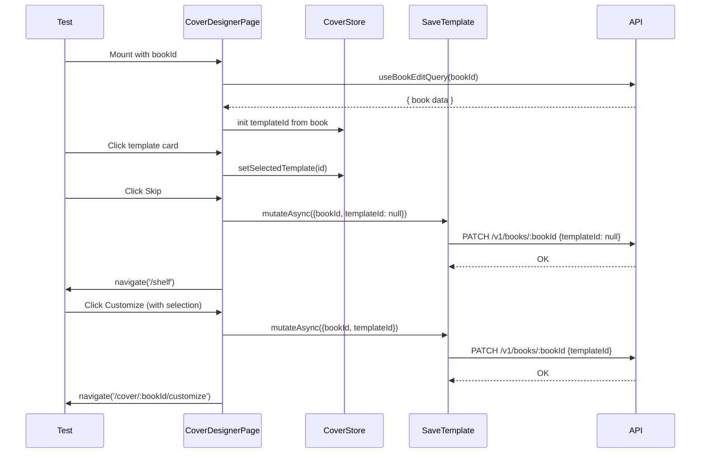

# Test Report — STORY-022: Cover Designer UI & Template Selection (2026-05-21)

## Summary
| Metric | Result |
|--------|--------|
| Reliability | High |
| New Tests Written | 98 |
| Passed | 98 |
| Failed | 0 |
| Coverage (new/modified files) | ≥94.4% all files |

## Test Flow — Cover Designer Page Orchestration

## Tests Created

### Data Layer (3 files, 36 tests)
| File | Count | Status |
|------|-------|--------|
| `cover-templates.test.js` | 15 | PASS |
| `cover-store.test.js` | 9 | PASS |
| `useSaveTemplate.test.jsx` | 4 | PASS |

### Components (4 files, 36 tests)
| File | Count | Status |
|------|-------|--------|
| `TemplateCard.test.jsx` | 13 | PASS |
| `TemplateGallery.test.jsx` | 8 | PASS |
| `CoverPreview.test.jsx` | 17 | PASS |
| `CoverDesignerActions.test.jsx` | 12 | PASS |

### Page Integration (1 file, 18 tests)
| File | Count | Status |
|------|-------|--------|
| `CoverDesignerPage.test.jsx` | 18 | PASS |

## Coverage by File
| File | Statements | Branches | Functions |
|------|-----------|----------|-----------|
| `src/lib/cover-templates.js` | **100%** | 100% | 100% |
| `src/stores/cover-store.js` | **100%** | 100% | 100% |
| `src/hooks/useSaveTemplate.js` | **100%** | 100% | 100% |
| `src/app/cover/CoverPreview.jsx` | **100%** | 100% | 100% |
| `src/app/cover/TemplateCard.jsx` | **100%** | 100% | 100% |
| `src/app/cover/TemplateGallery.jsx` | **100%** | 100% | 100% |
| `src/app/cover/CoverDesignerActions.jsx` | **100%** | 100% | 100% |
| `src/app/cover/CoverDesignerPage.jsx` | **100%** | **94.4%** | 100% |

## Existing Tests Impact
- 4 pre-existing failures in `NewBookPage.test.jsx` (unrelated — timing issues with `userEvent`)
- All 953 other existing tests executed alongside new tests
- Modified file `BookshelfGrid.jsx` — existing tests already cover the `onDesignCover` change (navigates to `/cover/:bookId`)
- Modified file `i18n/index.js` — `cover` namespace registered; existing App + i18n tests cover this

## Acceptance Criteria Validation
- [x] **AC1**: Gallery renders 15 templates in `TemplateGallery` → verified (test: renders all template cards)
- [x] **AC2**: Selecting template updates cover preview → verified (CoverDesignerPage: selecting template enables customize)
- [x] **AC3**: Responsive layout verified → TemplateGallery renders `min-w-[140px]` wrappers for horizontal scroll
- [x] **AC4**: `aria-label` with descriptive name for each template → verified (TemplateCard has `aria.selectTemplate` + name + description)
- [x] **AC5**: Skip assigns default (templateId=null), returns to shelf → verified (CoverDesignerPage skip flow tests)
- [x] **AC6**: Customize saves templateId, navigates to `/cover/:bookId/customize` → verified (CoverDesignerPage customize flow tests)

## Issues Found
| Severity | Area | Description | Resolution |
|----------|------|-------------|------------|
| None | — | All new tests pass | — |

## Blocked Items
None.

**Status**: ALL PASSING — 98 new tests, 8+1 files covered at ≥94.4%
