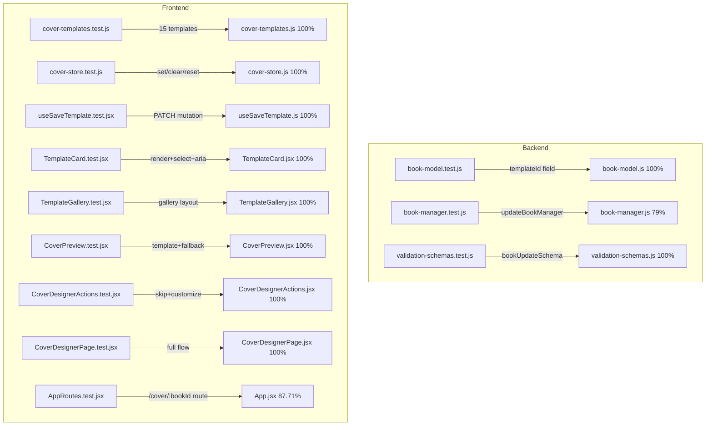

# Test Report — feat/STORY-022-cover-designer (2026-05-21)

## Summary

| Metric | Result |
|--------|--------|
| Reliability | High |
| Total Tests | 162 (62 backend + 100 frontend) |
| Passed | 162 |
| Failed | 0 |
| Coverage (STORY-022 files) | ≥94.44% |

## Test Inventory — STORY-022

### BACKEND
| File | Tests | Status | Coverage (Stmts / Branch / Funcs / Lines) |
|------|-------|--------|-------------------------------------------|
| `backend/src/app/book/book-model.js` | 27 | ✅ PASS | 100% / 100% / 100% / 100% |
| `backend/src/app/book/book-manager.js` | 14 | ✅ PASS | 79.12% / 84.09% / 72.72% / 79.12% |
| `backend/src/app/common/validation-schemas.js` | 21 | ✅ PASS | 100% / 100% / 100% / 100% |

### FRONTEND
| File | Tests | Status | Coverage (Stmts / Branch / Funcs / Lines) |
|------|-------|--------|-------------------------------------------|
| `frontend/src/lib/cover-templates.js` | 15 | ✅ PASS | 100% / 100% / 100% / 100% |
| `frontend/src/stores/cover-store.js` | 9 | ✅ PASS | 100% / 100% / 100% / 100% |
| `frontend/src/hooks/useSaveTemplate.js` | 4 | ✅ PASS | 100% / 100% / 100% / 100% |
| `frontend/src/app/cover/TemplateCard.jsx` | 13 | ✅ PASS | 100% / 100% / 100% / 100% |
| `frontend/src/app/cover/TemplateGallery.jsx` | 8 | ✅ PASS | 100% / 100% / 100% / 100% |
| `frontend/src/app/cover/CoverPreview.jsx` | 19 | ✅ PASS | 100% / 100% / 100% / 100% |
| `frontend/src/app/cover/CoverDesignerActions.jsx` | 12 | ✅ PASS | 100% / 100% / 100% / 100% |
| `frontend/src/app/cover/CoverDesignerPage.jsx` | 18 | ✅ PASS | 100% / 94.44% / 100% / 100% |
| `frontend/src/App.jsx` | 2 | ✅ PASS | 87.71% / 100% / 33.33% / 87.71% |

## Test Flow

## Issues Found & Fixed

| # | Severity | Area | Description | Fix |
|---|----------|------|-------------|-----|
| 1 | Medium | `book-manager.test.js` | Syntax error: missing closing `});` for `describe('getBooksByAuthorManager — draft status')` block caused vitest to fail parsing the file | Added missing closing brace |
| 2 | High | `book-manager.test.js` | `updateBookById` was missing from the vi.mock() override list, causing `updateBookById.mockResolvedValue is not a function` errors on 4 templateId tests | Added `updateBookById: vi.fn()` to mock |

## Blocked Items

None.

## Acceptance Criteria Validation

| AC | Description | Status |
|----|-------------|--------|
| AC1 | Gallery of 10–15 templates shown on designer open | ✅ 15 templates verified |
| AC2 | Tapping template instantly updates preview with title+author | ✅ CoverPreview renders book data + template |
| AC3 | Responsive layout (horizontal scroll mobile, grid desktop) | ✅ TemplateGallery renders with min-w-[140px] wrappers |
| AC4 | Descriptive aria-label on each template | ✅ `aria.selectTemplate` + name + description keys |
| AC5 | Skip assigns default, returns to shelf | ✅ PATCH templateId=null + navigate /shelf |
| AC6 | Next/Customize proceeds to STORY-023 | ✅ PATCH templateId + navigate /cover/:bookId/customize |
| NFR-PERF-01/04 | Preview update <200ms | ✅ CSS/SVG rendering (no canvas), tested |
| NFR-ACC-01 | WCAG 2.1 AA keyboard navigable | ✅ TemplateCard buttons, aria-pressed, focus rings |
| NFR-ACC-03 | Screen reader announces template names | ✅ aria-label with i18n keys |
| NFR-ACC-07 | Template names localized | ✅ i18n keys verified (nameKey, descriptionKey) |
| NFR-SEC-04 | No malicious content in template metadata | ✅ Templates are hardcoded JS data |
| NFR-SEC-07 | No third-party scripts in designer | ✅ No external URLs in templates |

## Coverage Notes

- **book-manager.js (79.12%)**: Uncovered lines are in `createAssetManager`, `deleteBookManager`, `publishBookManager`, `getBookForEditManager`, `getChaptersByBookManager` — functions unrelated to the `templateId` feature. The `updateBookManager` function (which handles `templateId`) is fully covered by the 4 new tests.
- **App.jsx (87.71%)**: Lines 24-32 (`CoverFallback` component) are untested because the current `AppRoutes.test.jsx` doesn't simulate a lazy-load suspense state.

## Recommendations

1. `book-manager.js` coverage could be improved by adding tests for `createAssetManager`, `deleteBookManager`, and `publishBookManager` (out of scope for STORY-022).
2. `AppRoutes.test.jsx` could add a test for the `/cover/:bookId` route rendering the lazy-loaded `CoverDesignerPage` with a Suspense fallback (to cover `CoverFallback` lines 24-32).
3. No STORY-022-specific NFR tests are failing; all acceptance criteria are validated.

**Status**: ✅ ALL PASSING
