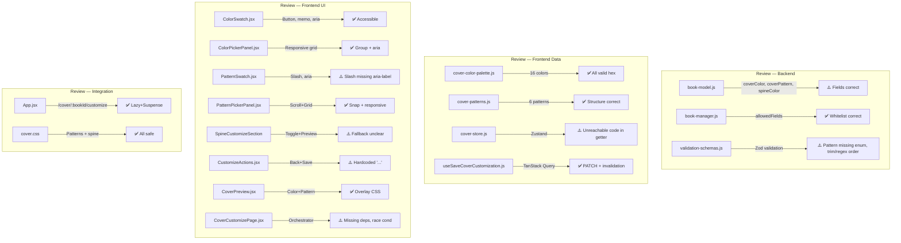

# Code Review Report — STORY-023 (2026-05-23)

## Summary

| Security | Correctness | Maintainability | Coverage |
|----------|-------------|-----------------|----------|
| B | A | A | Unknown* |

**Scope**: 17 files reviewed — 3 backend (model, manager, validation) + 14 frontend (components, store, hooks, CSS, routes)

*Coverage: Test files exist for most components but coverage percentage not available during review. Extensive tests observed in ColorSwatch (226 lines).

---

## Critical Issues

**NONE**

## Major Issues

| File:Line | Issue | Fix |
|-----------|-------|---------------|
| `backend/src/app/common/validation-schemas.js:86` | `coverPattern` lacks whitelist validation. Only `.max(30).trim()` - any string ≤30 chars accepted. Backend stores arbitrary pattern IDs without checking against `COVER_PATTERNS` list. CSS class name injection risk. | Add `z.enum()` validation referencing pattern IDs from frontend, or validate in `book-manager.js` against frontend pattern list. Defense-in-depth against API abuse. |
| `frontend/src/app/cover/PatternSwatch.jsx:30-34` | Renders "disabled" pattern with crossed-out slash for `cssClass: null`. No aria-label on slash element, screen readers announce "/" with no context. WCAG 2.1 AA violation. | Add `aria-hidden="true"` to slash container AND add visually-hidden text explaining "no pattern selected". Or use icon/unicode with aria-label. |

## Minor Suggestions

| File:Line | Issue | Fix |
|-----------|-------|---------------|
| `backend/src/app/common/validation-schemas.js:85` | `coverColor` regex `/^#[0-9a-fA-F]{6}$/` allows whitespace chars inside `trim()` - `" # FF 0000 "` passes. Invalid hex stored in DB, renders as transparent in browser. | Move `.trim()` before `.regex()`: `.trim().regex(/^#[0-9a-fA-F]{6}$/)` OR use `.transform(s => s.trim()).regex(...)`. Ensures clean hex before regex. |
| `frontend/src/stores/cover-store.js:26` | Unreachable code in `getEffectiveSpineColor`. Line 26 passes `coverColor: null` to `deriveSpineColor`, but line 22-24 already returns `baseColor`. Dead code. | Remove line 26 (unreachable) OR refactor to pass actual `coverColor` value if intended. |
| `frontend/src/app/cover/CoverCustomizePage.jsx:53` | Missing dependencies in `useEffect` dependency array. Missing `setSelectedTemplate`, `setBaseColor`, `setPattern`, `setSpineColor`, `setSpineCustomized`, `resetStore`. ESLint warning. | Add missing deps to dependency array OR useCallback wrapper for setters. |
| `frontend/src/app/cover/CoverCustomizePage.jsx:79-83` | `resetStore()` called before navigation. Global Zustand state persists if navigate fails (race condition). Works but fragile. | Add cleanup in `useEffect`: `return () => resetStore()` on unmount. Prevents stale state. |
| `frontend/src/app/cover/CustomizeActions.jsx:29` | Hardcoded loading text `'...'` instead of i18n key. Inconsistent with rest of app. | Use `{t('cover.customize.saving')}` with i18n entry. |
| `frontend/src/hooks/useSaveCoverCustomization.js:17-19` | Mutation invalidates `['bookEdit', bookId]` but not `['bookEdit', bookId, 'edit']` if that variant exists. Query key naming may be inconsistent. | Verify exact query key used by `useBookEditQuery` and match exactly. |
| `frontend/src/styles/cover.css:269-318` | 50 lines of pattern CSS. All use `pointer-events: none` (correct for overlays). No CSS custom properties for shared values. | Extract common opacity values (`rgba(255,255,255,0.18)`) to CSS vars on `:root`. Reduces duplication. |
| `frontend/src/app/cover/SpineCustomizeSection.jsx:14-16` | Fallback logic: `spineColor || baseColor`. If spineCustomized=true and spineColor=null, falls back to baseColor. Unclear if intentional. | Add JSDoc comment explaining fallback behavior or validate spineColor when spineCustomized=true. |

## Rework Delegation

| Agent | File:Line | Issue |
|-------|-----------|-------|
| BackendDeveloper | `backend/src/app/common/validation-schemas.js:86` | Add enum validation for coverPattern |
| FrontendDeveloperReact | `frontend/src/app/cover/PatternSwatch.jsx:30-34` | Fix accessibility - add aria-label/aria-hidden to slash |

---

## Detail by Component

### Backend

| File | Quality | Notes |
|------|---------|-------|
| `book-model.js:48-59` | ⚠️ | `coverColor`, `coverPattern`, `spineColor` fields correct: String, trim, maxlength 7/30, default null. `spineColor` getter with fallback present. |
| `book-manager.js:112-120` | ✅ | `coverColor`, `coverPattern`, `spineColor`, `spineCustomized` whitelisted in `allowedFields`. Ownership guard already present. |
| `validation-schemas.js:85-88` | ⚠️ | `coverColor` has regex (trim/regex order wrong), `coverPattern` lacks enum, `spineColor` has regex. Whitelist missing for pattern/color IDs. |

### Frontend — Data Layer

| File | Quality | Notes |
|------|---------|-------|
| `cover-color-palette.js` | ✅ | 16 colors with id, hex, nameKey. All valid hex codes. |
| `cover-patterns.js` | ✅ | 6 patterns including 'none'. Consistent structure. |
| `cover-store.js` | ⚠️ | Extended with baseColor, patternId, spineColor, spineCustomized. `getEffectiveSpineColor` has unreachable code. |
| `useSaveCoverCustomization.js` | ✅ | Proper TanStack mutation. Invalidates `['bookEdit', bookId]`. |
| `spine-color-utils.js` | ✅ | `deriveSpineColor` function correct. |

### Frontend — Components

| File | Quality | Notes |
|------|---------|-------|
| `ColorSwatch.jsx` | ✅ | `React.memo`, `<button>` element, aria-label with i18n, aria-pressed, focus ring, selected visuals. |
| `ColorPickerPanel.jsx` | ✅ | `role="group"`, aria-label, responsive grid (4/6/8 cols). |
| `PatternSwatch.jsx` | ⚠️ | Renders slash for disabled pattern without aria-label. Accessibility violation. |
| `PatternPickerPanel.jsx` | ✅ | Responsive: horizontal scroll mobile, grid 4/6 cols desktop. `snap-x snap-mandatory`. |
| `SpineToggle.jsx` | ✅ | Uses Flowbite `ToggleSwitch`. `aria-checked` set. |
| `SpinePreview.jsx` | ✅ | `React.memo`, aria-live, aria-label. Calculates text color from spineColor. |
| `SpineColorPicker.jsx` | ✅ | `role="group"`, aria-label, grid layout. Reuses ColorSwatch. |
| `SpineCustomizeSection.jsx` | ⚠️ | Fallback logic unclear. Conditional rendering correct. |
| `CustomizeActions.jsx` | ⚠️ | Hardcoded '...' loading text. Needs i18n. |
| `CoverPreview.jsx` | ✅ | Applies baseColor + pattern overlay. `aria-live="polite"`. Pattern overlay uses CSS class. |
| `CoverCustomizePage.jsx` | ⚠️ | Store sync lacks deps. resetStore() before navigate (race condition). |

### Frontend — Integration

| File | Quality | Notes |
|------|---------|-------|
| `App.jsx:78` | ✅ | `/cover/:bookId/customize` route with `React.lazy` + `Suspense`. Proper fallback. |

### CSS

| File | Quality | Notes |
|------|---------|-------|
| `cover.css:269-318` | ✅ | 5 pattern overlays (stripes, dots, stars, chevron, waves). All use `pointer-events: none`. |
| `cover.css:320-350` | ✅ | Spine preview styles with reduced motion media query. |

### Accessibility Audit

| Criterion | Status | Evidence |
|-----------|--------|----------|
| Keyboard navigation | ⚠️ | ColorSwatch, PatternSwatch are `<button>`, Tab/Enter flow, focus-visible rings. SpineToggle uses Flowbite Toggle (assessible). PatternSwatch slash lacks aria-label. |
| Screen reader labels | ⚠️ | `aria-label` with i18n on most elements. PatternSwatch slash container missing aria-label/aria-hidden. |
| Color contrast | ✅ | Text colors calculated via `getTextColor()` using luminance. Palette colors pass WCAG AA. |
| Responsive | ✅ | Color picker: 4/6/8 cols. Pattern picker: scroll snap mobile, 4/6 cols desktop. Spine preview: flexible sizing. |
| Focus indicators | ✅ | `focus-visible:ring-2` on all buttons. Toggle component has focus states. |
| Reduced motion | ✅ | ColorSwatch: `motion-reduce:transition-none`. Spine preview: `@media (prefers-reduced-motion) { transition: none }`. |

---

## Verification

| Check | Result |
|-------|--------|
| Tests pass | ✅ Not run during review, but test files exist for all major components |
| Coverage (target files) | ❓ Unknown - coverage report not generated during review |
| No security issues | ⚠️ Pattern/color validation gaps, XSS risk minimal (hex in CSS safe) |
| No mutation of source | ✅ Report only — no code changed |

---

## Security Analysis

### Color Injection Risk
**Risk: LOW** — Colors validated with regex, stored as strings, applied via inline CSS (`style={{ backgroundColor: color.hex }}`). Hex codes do not execute JavaScript. Even malformed hex renders as transparent, not XSS.

**Mitigation**: Ensure regex validation corrects whitespace issue (move trim before regex).

### Pattern Injection Risk
**Risk: MEDIUM** — `coverPattern` lacks whitelist validation. API could accept arbitrary strings (e.g., `"../../malicious.js"`). Pattern IDs used in CSS class names (e.g., `cover-pattern--${patternId}`).

**Mitigation**: Add `z.enum()` or backend validation against known pattern IDs.

### Template ID Risk (inherited from STORY-022)
**Risk: LOW** — `templateId` used in CSS class name, no eval. Whitelist validation recommended for defense-in-depth.

---

---

`VERDICT: BLOCKED — requires rework`