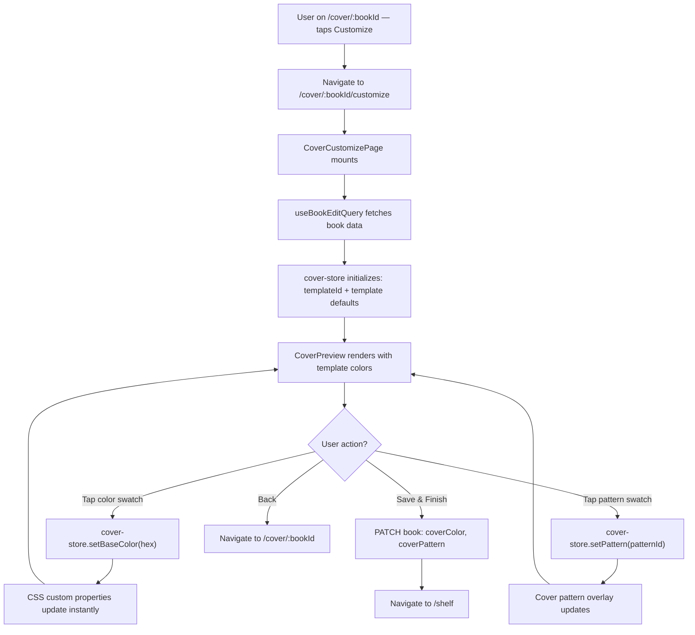
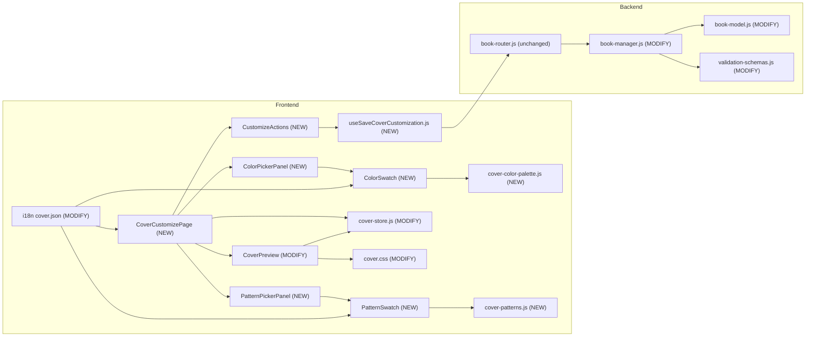
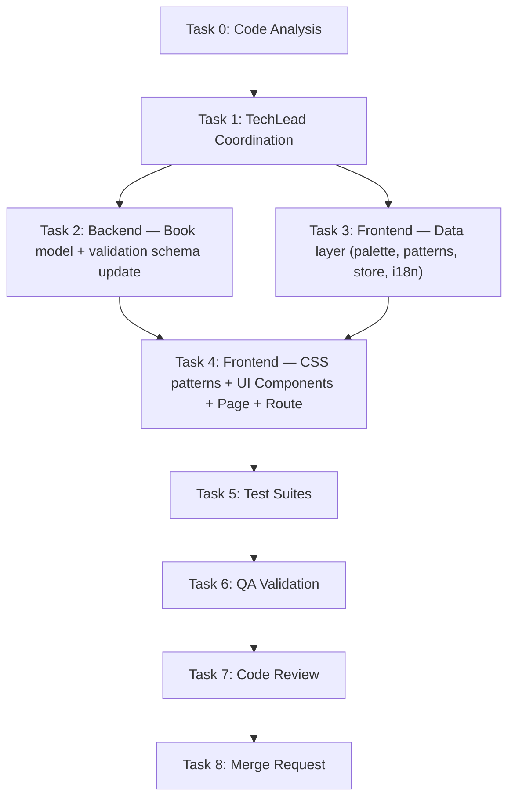

# STORY-023: Color Picker & Background Customization — Technical Analysis

**Epic**: EPIC-004
**Persona**: Julia — The Young Author
**Dependencies**: STORY-022 (Cover Designer UI & Template Selection — ✅ merged)
**Stack Source**: `docs/architecture/TECH-STACK.md`

---

## 1. Story Summary

Julia has selected a template in STORY-022 and tapped "Customize". The `/cover/:bookId/customize` route opens a color & pattern customization panel. She can pick from 12–20 child-friendly color swatches and a few background patterns (stripes, dots, stars). Swatch selection instantly updates the cover, spine, and edge previews. Accessibility: screen readers announce color names, `prefers-reduced-motion` disables transitions, keyboard-navigable swatches. Security: no freeform color input — curated hex/RGB values only (NFR-SEC-04).

---

## 2. Stack Detection

| Indicator | Result |
|-----------|--------|
| `package.json`, `vite.config.*` | **Node.js** (JSX, no TS) |
| `react` in deps, `.jsx` files | **React 18** |
| `tailwind.config.js`, Tailwind in deps | **Tailwind CSS 3.x** |
| `fabric` v6.4.0 in deps | **Fabric.js** installed (candidate for canvas-based preview) |
| Zustand + TanStack Query | State: Zustand (client) + React Query (server) |
| i18n: react-i18next | Locales: `en` + `pt-BR` — `cover` namespace exists |

**Frontend-Backend Integration**: Node.js SPA mode — Vite dev proxy to Express; typed API client via `lib/api-client.js`.

---

## 3. Existing Codebase (STORY-022 Output)

### 3.1 Files Already Built

| File | Purpose | Key Details |
|------|---------|-------------|
| `frontend/src/app/cover/CoverDesignerPage.jsx` | Template gallery page | Navigates to `/cover/:bookId/customize` on "Customize" |
| `frontend/src/app/cover/CoverPreview.jsx` | CSS-based cover preview | Renders `cover-template--<id>` class, spine, title/author text |
| `frontend/src/app/cover/TemplateGallery.jsx` | Gallery container | Horizontal scroll (mobile) / grid (tablet/desktop), snap-x |
| `frontend/src/app/cover/TemplateCard.jsx` | Single template card | `memo`'d, aria-pressed, focus ring |
| `frontend/src/app/cover/CoverDesignerActions.jsx` | Skip/Customize buttons | Customize → navigates `/cover/:bookId/customize` |
| `frontend/src/stores/cover-store.js` | Zustand store | `selectedTemplateId`, `setSelectedTemplate`, `clearSelection`, `resetStore` |
| `frontend/src/lib/cover-templates.js` | 15 template defs | Each: `id`, `nameKey`, `descriptionKey`, `background{type,colors}`, `decoration{type}`, `textColor`, `accentColor` |
| `frontend/src/styles/cover.css` | Template CSS | Per-template CSS classes `cover-template--<id>` with gradients, `::before` pseudo-elements for decorations |
| `frontend/src/hooks/useSaveTemplate.js` | TanStack mutation | PATCH `/v1/books/:bookId` with `{ templateId }` |
| `backend/src/app/book/book-model.js` | Book schema | Has `templateId` field (String, default null) |
| `backend/src/app/book/book-manager.js` | Business logic | `updateBookManager` allows `templateId` in allowedFields |
| `backend/src/app/common/validation-schemas.js` | Zod schemas | `bookUpdateSchema` has `templateId: z.string().max(50).trim().optional().nullable()` |
| `frontend/src/i18n/locales/en/cover.json` | English i18n | Template names, descriptions, actions, aria labels |
| `frontend/src/i18n/locales/pt-BR/cover.json` | Portuguese i18n | Same keys, pt-BR translations |
| `frontend/src/lib/spine-colors.js` | Spine palette | 7 pastel hex colors, `isLightColor()`, `getTextColor()`, `spineColorFromId()` |
| `frontend/src/App.jsx` | Routes | `/cover/:bookId/customize` exists but renders `CoverDesignerPage` (placeholder) |

### 3.2 Key Gaps to Fill

1. **No customize page** — `/cover/:bookId/customize` route renders wrong component (CoverDesignerPage from STORY-022)
2. **No color picker component** — color swatch grid does not exist
3. **No pattern selector** — pattern options UI does not exist
4. **No cover customization state** — cover-store only tracks `selectedTemplateId`, not color/pattern overrides
5. **No backend persistence** — Book schema has no fields for `coverColor`, `coverPattern`, `spineColor` overrides
6. **No CSS custom properties** — current cover.css uses static class-per-template; no `--cover-bg` / `--spine-bg` theming
7. **No color palette config** — the 12–20 child-friendly colors aren't defined yet
8. **No pattern config** — pattern definitions (CSS/SVG) not extracted as selectable options

---

## 4. Architecture & Flow

### 4.1 Customization Flow



### 4.2 Component Tree

```
CoverCustomizePage
├── CoverPreview (extended with CSS custom properties)
│   ├── Base color background (CSS var --cover-bg)
│   ├── Pattern overlay (CSS var --cover-pattern)
│   ├── Decorator overlay (template decoration, unchanged)
│   └── Text layer (title, author, accent dividers)
├── ColorPickerPanel
│   └── ColorSwatch[] (12–20 buttons, aria-label with name)
├── PatternPickerPanel
│   └── PatternSwatch[] (4–6 patterns, aria-label with name)
└── CustomizeActions (Back / Save & Finish buttons)
```

### 4.3 CSS Custom Properties Strategy

The story's technical notes specify: *"Implement with CSS custom properties (`--cover-bg`, `--spine-bg`) for rapid theme switching."*

Current `cover.css` uses static per-template classes `cover-template--<id>`. For customization, we need to override these at runtime. The approach:

1. **CoverPreview** sets inline CSS custom properties on its root div based on store state
2. `cover.css` patterns reference `var(--cover-bg)` where possible
3. When `coverColor` is set in the store, it overrides the template's default background via `--cover-bg`
4. Spine derives from base color (auto-darken 20%) unless overridden later in STORY-025 → `--spine-bg: calc-overlay(--cover-bg, 0.2)`

### 4.4 Pattern Implementation

Patterns are CSS gradients or SVG patterns rendered in the DOM (not images). We extract the decoration patterns from templates into a reusable pattern palette:

| Pattern ID | Technique | Description |
|-----------|-----------|-------------|
| `none` | — | No pattern overlay, solid/gradient base color only |
| `stripes` | `repeating-linear-gradient` | Horizontal or diagonal stripes |
| `dots` | `radial-gradient` repeating | Polka dots grid |
| `stars` | `radial-gradient` positioned | Small star-like sparkles |
| `chevron` | `repeating-linear-gradient` 45deg | Zigzag/chevron lines |
| `waves` | `radial-gradient` ellipses | Flowing wave curves |

Pattern overlay is a separate `<div>` in CoverPreview positioned absolutely over the base color, with `pointer-events: none`.

### 4.5 Impacted Components Diagram



---

## 5. Technical Decisions & Trade-offs

### 5.1 Color Picker: Curated Palette vs Freeform Input

| Option | Pros | Cons |
|--------|------|------|
| **Curated palette** (CHOSEN) | NFR-SEC-04: no injection surface; child-safe colors; simple UI; instant selection | Limited creativity — but 12–20 colors is plenty for children |
| Freeform hex/RGB input | Full flexibility | Injection risk (NFR-SEC-04), confusing UI for children, validation overhead |

**Decision**: Hardcoded array of 12–20 hex colors in `cover-color-palette.js`. Each color has `id`, `hex`, `nameKey` (i18n). No user text input for colors.

### 5.2 Pattern Implementation: CSS/SVG vs Fabric.js Canvas

| Option | Pros | Cons |
|--------|------|------|
| **CSS/SVG patterns in DOM** (CHOSEN) | Instant updates (<200ms NFR-PERF-04), DOM accessible to screen readers (NFR-ACC-03), lightweight, matches STORY-022 rendering approach | Limited pattern complexity |
| Fabric.js canvas render | Pixel-level control, future text drag (STORY-024) | Slow for rapid color switching, DOM invisible to screen readers, heavy for children's mobile devices |

**Decision**: CSS patterns for this story. Fabric.js canvas is deferred to STORY-024 (text customization / drag). When STORY-024 loads, it seeds a Fabric canvas from the same color/pattern/template data — same data model, different renderer.

### 5.3 Preview Updates: CSS Custom Properties vs React Re-render

| Option | Pros | Cons |
|--------|------|------|
| **CSS custom properties on preview root** (CHOSEN) | O(1) updates — browser repaints only the preview div, no React re-render cycle, <200ms guaranteed | Requires careful fallback when no custom color set |
| React state → className swap | Familiar pattern | Full re-render cycle including children, potential >200ms on low-end mobile |

**Decision**: CoverPreview reads `baseColor` and `patternId` from CoverStore, sets them as inline CSS custom properties on the preview root `<div>`. Pattern overlay `<div>` uses `class` based on `patternId`. When baseColor changes, only `style="--cover-bg: #hex"` updates on the root — browser repaints instantly.

### 5.4 Backend Schema: Separate Cover Sub-document vs Flat Fields

| Option | Pros | Cons |
|--------|------|------|
| **Flat fields on Book** (CHOSEN) | Simple, matches `templateId` pattern from STORY-022, 2 new fields: `coverColor`, `coverPattern` | Will grow as STORY-024/025 add more cover fields |
| Separate `cover` sub-document | Grouped, extensible | Over-engineering for 2 fields; schema change more invasive now |

**Decision**: Add `coverColor` (String, hex, default null) and `coverPattern` (String, default null) as flat fields on Book schema. When these grow (STORY-024 text, STORY-025 spine), we can refactor into a sub-document then — YAGNI now.

### 5.5 Default Behavior: Template Colors vs Custom Overrides

| Option | Behavior |
|--------|---------|
| `coverColor = null` | Cover renders with template's default `background.colors` |
| `coverColor = "#FF6B6B"` | Cover renders with custom base color, overlaying template decoration |
| `coverPattern = null` | Cover uses template's default `decoration.type` |
| `coverPattern = "dots"` | Cover overlays selected pattern on base color (replaces template decoration) |

When a user selects a custom color, the template's gradient is replaced with a solid `--cover-bg` of that color + template decoration still shows. When user also picks a pattern, the pattern replaces the template decoration.

---

## 6. Implementation Steps (Checklist)

### Phase 1: Backend — Schema & Validation

- [ ] **1.1** Add `coverColor` field to `backend/src/app/book/book-model.js` (String, trim, match `/^#[0-9a-fA-F]{6}$/`, default null, maxlength 7)
- [ ] **1.2** Add `coverPattern` field to `backend/src/app/book/book-model.js` (String, trim, maxlength 30, default null)
- [ ] **1.3** Add `coverColor` and `coverPattern` to allowed update fields in `backend/src/app/book/book-manager.js` `updateBookManager()`
- [ ] **1.4** Add `coverColor` and `coverPattern` to `bookUpdateSchema` in `backend/src/app/common/validation-schemas.js` (coverColor: optional nullable string matching `/^#[0-9a-fA-F]{6}$/`, max 7; coverPattern: optional nullable string, max 30)
- [ ] **1.5** Backend unit test: PATCH book with coverColor + coverPattern persists correctly

### Phase 2: Frontend — Data Layer

- [ ] **2.1** Create `frontend/src/lib/cover-color-palette.js` — curated array of 16 child-friendly colors: `{ id, hex, nameKey }` (e.g., sky-blue, sunset-orange, forest-green, cotton-candy-pink, etc.)
- [ ] **2.2** Create `frontend/src/lib/cover-patterns.js` — pattern definitions: `{ id, nameKey, type, cssClass }` for none, stripes, dots, stars, chevron, waves
- [ ] **2.3** Extend `frontend/src/stores/cover-store.js` — add: `baseColor` (default null), `patternId` (default null), `setBaseColor(hex)`, `setPattern(id)`, `resetCustomization()`. Update `resetStore()` to include new fields.
- [ ] **2.4** Add i18n keys to `frontend/src/i18n/locales/en/cover.json` — color palette names, pattern names, customize panel labels, aria labels
- [ ] **2.5** Add i18n keys to `frontend/src/i18n/locales/pt-BR/cover.json` — same keys in Portuguese

### Phase 3: Frontend — CSS Patterns & Custom Properties

- [ ] **3.1** Extend `frontend/src/styles/cover.css` — add pattern overlay classes (`.cover-pattern--stripes`, `.cover-pattern--dots`, `.cover-pattern--stars`, `.cover-pattern--chevron`, `.cover-pattern--waves`), each `position: absolute; inset: 0; pointer-events: none;` with CSS gradient patterns
- [ ] **3.2** Add fallback in CoverPreview for CSS custom properties: `--cover-bg` defaults to template's gradient when not overridden

### Phase 4: Frontend — UI Components

- [ ] **4.1** Create `frontend/src/app/cover/ColorSwatch.jsx` — memo'd button with: colored circle, aria-label with localized color name + selection state (`aria-pressed`), focus ring, selected state (ring + scale), respects `prefers-reduced-motion` (no `transition` when active)
- [ ] **4.2** Create `frontend/src/app/cover/ColorPickerPanel.jsx` — grid of ColorSwatches (4 cols mobile, 6 cols tablet, 8 cols desktop), section heading from i18n, `role="group"` with `aria-label`
- [ ] **4.3** Create `frontend/src/app/cover/PatternSwatch.jsx` — memo'd button with: mini preview of pattern (CSS pattern at small scale), aria-label with localized pattern name + selection state, focus ring, selected state
- [ ] **4.4** Create `frontend/src/app/cover/PatternPickerPanel.jsx` — horizontal scroll / grid of PatternSwatches (3–4 visible), section heading from i18n, includes "none" option
- [ ] **4.5** Create `frontend/src/app/cover/CustomizeActions.jsx` — "Back" button (navigate `/cover/:bookId`), "Save & Finish" button (PATCH book, navigate `/shelf`)
- [ ] **4.6** Modify `frontend/src/app/cover/CoverPreview.jsx` — read `baseColor` and `patternId` from cover-store; when `baseColor` set, apply inline `style="--cover-bg: {baseColor}"` to root div; when `patternId` set, render pattern overlay div with matching class; preserve template decoration when no custom overrides; add `aria-live="polite"` updates

### Phase 5: Frontend — Customize Page & Route

- [ ] **5.1** Create `frontend/src/app/cover/CoverCustomizePage.jsx` — page orchestrator: fetches book, initializes cover-store from book data (templateId + coverColor + coverPattern), renders CoverPreview + ColorPickerPanel + PatternPickerPanel + CustomizeActions
- [ ] **5.2** Create `frontend/src/hooks/useSaveCoverCustomization.js` — TanStack mutation: PATCH `/v1/books/:bookId` with `{ templateId, coverColor, coverPattern }`, invalidates book query on success
- [ ] **5.3** Update `frontend/src/App.jsx` — change `/cover/:bookId/customize` route to render `CoverCustomizePage` (replace current `CoverDesignerPage` placeholder)

### Phase 6: Tests

- [ ] **6.1** Unit test: `cover-color-palette.js` — verify all colors have required fields, valid hex values, unique IDs
- [ ] **6.2** Unit test: `cover-patterns.js` — verify all patterns have required fields, unique IDs
- [ ] **6.3** Unit test: `cover-store.js` — setBaseColor, setPattern, resetCustomization, full resetStore
- [ ] **6.4** Component test: `ColorSwatch.jsx` — renders color, aria-label, aria-pressed, focus, selected ring
- [ ] **6.5** Component test: `ColorPickerPanel.jsx` — grid layout, keyboard navigation (Tab/Enter)
- [ ] **6.6** Component test: `PatternSwatch.jsx` — renders pattern preview, aria-label, selection
- [ ] **6.7** Component test: `CoverPreview.jsx` — renders with template defaults, renders with custom baseColor (--cover-bg), renders with pattern overlay
- [ ] **6.8** Integration test: `CoverCustomizePage.jsx` — full flow: load with book data → select color → preview updates → select pattern → preview updates → save → navigate
- [ ] **6.9** Backend test: PATCH book with coverColor + coverPattern
- [ ] **6.10** Accessibility test: keyboard Tab through all color swatches, Enter to select; screen reader announces color names; `prefers-reduced-motion` disables transitions

---

## 7. NFR Analysis

| NFR | Requirement | Implementation | Verification |
|-----|------------|----------------|--------------|
| NFR-PERF-04 | Preview update <200ms on mobile | CSS custom properties (`--cover-bg`) for color changes — browser repaint only, no React re-render of children; `React.memo` on ColorSwatch/PatternSwatch; Zustand direct subscription in CoverPreview | Lighthouse + manual mobile testing; performance.now() measurement |
| NFR-ACC-01 | WCAG 2.1 AA keyboard navigable | ColorSwatch/PatternSwatch are `<button>` elements; Tab order sequential through grid; Enter to select; CustomizeActions buttons keyboard accessible | axe-core + manual keyboard test |
| NFR-ACC-03 | Screen reader announces color names | Each ColorSwatch has `aria-label` with localized color name (e.g., "Sky blue") and `aria-pressed` for selection state; CoverPreview has `aria-live="polite"` announcing color/pattern change | VoiceOver/TalkBack test |
| NFR-ACC-04 | Color swatches sufficient contrast | Swatches rendered as colored circles on white/light panel background; container has sufficient contrast; focus ring visible (blue 500 ring 2px) | Contrast checker; visual inspection |
| NFR-ACC-07 | Color and pattern names localized | All color palette entries use `nameKey` i18n keys with pt-BR and en translations; pattern names also i18n'd | Test with both locales |
| NFR-SEC-04 | All color values validated as safe CSS | Colors are hardcoded hex values in palette config; backend validates `coverColor` against `/^#[0-9a-fA-F]{6}$/` regex; no freeform user input | Backend validation test + code review |

---

## 8. Persona Impact

**Julia — The Young Author**:
- Enters customize page after selecting a template — natural next step
- Color swatches are visually inviting and fun — large colored circles, playful names (e.g., "Cotton candy pink", "Ocean blue")
- Instant feedback (<200ms) on color tap prevents frustration
- Pattern options add playfulness — "dots!", "stripes!", "stars!"
- "Back" button lets her return to template selection without losing progress (store keeps state)
- "Save & Finish" gives clear completion signal — she's done designing

---

## 9. Risks & Mitigations

| Risk | Likelihood | Impact | Mitigation |
|------|------------|--------|------------|
| CSS custom properties not supported in older browsers | Low | Medium | CSS custom properties have 97%+ browser support; Contopia targets modern mobile browsers (Chrome 90+, Safari 15+) |
| Pattern overlay conflicts with template decoration | Medium | Medium | When custom `patternId` is set, it REPLACES template decoration entirely (clear separation); template decoration only shows when `patternId` is null |
| CoverPreview re-renders entire tree on color change | Medium | High | Use CSS custom properties for color (no React re-render needed); Zustand selector subscriptions in CoverPreview — only subscribe to `baseColor` and `patternId`, not full store |
| `prefers-reduced-motion` not respected in pattern transitions | Low | Medium | Add `@media (prefers-reduced-motion: reduce)` in cover.css: disable all transitions on swatches and preview; use `transition: none` |
| Backend accepts invalid hex values | Low | High | Zod schema validates `coverColor` with regex `/^#[0-9a-fA-F]{6}$/`; Mongoose schema also validates match pattern |
| `/cover/:bookId/customize` route currently renders CoverDesignerPage | High | Low | Phase 5 step 5.3 updates App.jsx route to render CoverCustomizePage instead |

---

## 10. Proposed Color Palette (16 colors)

| # | ID | hex | Name (en) | Name (pt-BR) |
|---|----|-----|-----------|-------------|
| 1 | sky-blue | #87CEEB | Sky blue | Azul céu |
| 2 | ocean-blue | #1E90FF | Ocean blue | Azul oceano |
| 3 | teal | #2DD4BF | Teal | Verde água |
| 4 | forest-green | #22C55E | Forest green | Verde floresta |
| 5 | lime | #84CC16 | Lime | Limão |
| 6 | sunny-yellow | #FACC15 | Sunny yellow | Amarelo sol |
| 7 | tangerine | #FB923C | Tangerine | Tangerina |
| 8 | coral | #F87171 | Coral | Coral |
| 9 | bubblegum | #F472B6 | Bubblegum | Chiclete |
| 10 | lavender | #A78BFA | Lavender | Lavanda |
| 11 | plum | #A855F7 | Plum | Ameixa |
| 12 | midnight | #1E1B4B | Midnight | Azul noite |
| 13 | cotton-candy | #FBCFE8 | Cotton candy | Algodão doce |
| 14 | peach | #FED7AA | Peach | Pêssego |
| 15 | mint | #A7F3D0 | Mint | Hortelã |
| 16 | snow | #F1F5F9 | Snow | Neve |

---

## 11. Proposed Pattern Palette (6 options)

| # | ID | Name (en) | Name (pt-BR) | CSS Technique |
|---|----|-----------|-------------|---------------|
| 1 | none | None | Nenhum | — (no overlay) |
| 2 | stripes | Stripes | Listras | `repeating-linear-gradient(0deg, ...)` |
| 3 | dots | Dots | Bolinhas | `radial-gradient(circle, ...) repeat` |
| 4 | stars | Stars | Estrelinhas | Small `radial-gradient` sparkles positioned |
| 5 | chevron | Chevron | Zigue-zague | `repeating-linear-gradient(45deg, ...)` |
| 6 | waves | Waves | Ondinhas | `radial-gradient(ellipse ...)` wave shapes |

---

## 12. Execution Order & Agent Assignments



| Task | Agent | Description |
|------|-------|-------------|
| 0 | CodeAnalyzer | Analyze existing cover components, store, CSS, book schema extension points |
| 1 | TechLead | Coordinate all tasks, reference this analysis + PM story |
| 2 | BackendDeveloper | Add `coverColor` + `coverPattern` to Book model, validation schema, book-manager allowed fields |
| 3 | FrontendDeveloperReact | Create `cover-color-palette.js`, `cover-patterns.js`, extend `cover-store.js`, add i18n keys |
| 4 | FrontendDeveloperReact | Build ColorSwatch, ColorPickerPanel, PatternSwatch, PatternPickerPanel, CustomizeActions, CoverCustomizePage; modify CoverPreview with CSS vars; update App.jsx route |
| 5 | TestEngineer | Unit + component + integration tests (all items from §6) |
| 6 | QAAnalyst | WCAG audit, perf check (<200ms), keyboard nav, screen reader, reduced-motion, responsive layout |
| 7 | CodeReviewer | Code quality, security (color validation), accessibility compliance |
| 8 | MergeRequestCreator | Create PR with full traceability |

**Parallelization**: Tasks 2 and 3 CAN run in parallel (independent: backend model vs frontend data layer). Task 4 depends on both completing. Tasks 5–8 are sequential.

---

## 13. Key File References

- PM Story: `/docs/stories/STORY-023.md`
- Previous Story Analysis: `/docs/stories/STORY-022-technical-analysis.md`
- Tech Stack: `/docs/architecture/TECH-STACK.md`
- Book Model: `/backend/src/app/book/book-model.js`
- Book Manager: `/backend/src/app/book/book-manager.js`
- Validation Schemas: `/backend/src/app/common/validation-schemas.js`
- Cover Store: `/frontend/src/stores/cover-store.js`
- Cover Templates: `/frontend/src/lib/cover-templates.js`
- Spine Colors: `/frontend/src/lib/spine-colors.js`
- Cover CSS: `/frontend/src/styles/cover.css`
- Cover Preview: `/frontend/src/app/cover/CoverPreview.jsx`
- Cover Designer Page: `/frontend/src/app/cover/CoverDesignerPage.jsx`
- Save Template Hook: `/frontend/src/hooks/useSaveTemplate.js`
- App Routes: `/frontend/src/App.jsx`
- i18n EN: `/frontend/src/i18n/locales/en/cover.json`
- i18n pt-BR: `/frontend/src/i18n/locales/pt-BR/cover.json`