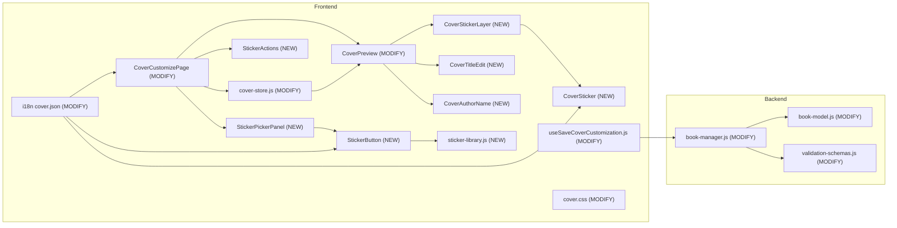
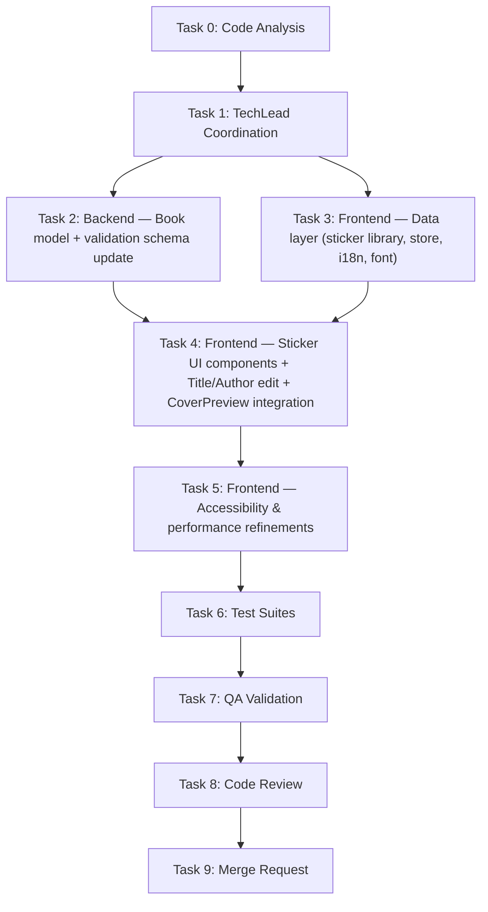

# STORY-024: Sticker Placement & Text on Cover — Technical Analysis

**Epic**: EPIC-004
**Persona**: Julia — The Young Author
**Dependencies**: STORY-023 (Color Picker & Background Customization — **IMPLEMENTED & MERGED**)
**Stack Source**: `docs/architecture/TECH-STACK.md`

---

## 1. Story Summary

Julia has customized her cover color and pattern via STORY-023. Now she wants to add **stickers** (20–30 inline SVG illustrations), **edit her book title** directly on the cover preview, and **see her author name**. Stickers appear at cover center on placement and can be drag-repositioned (touch + mouse) or nudged (arrow keys). Double-tap or "Remove" button deletes a sticker. Title is editable inline (max 120 chars, DOMPurify-sanitized). Author name is read-only on cover (sourced from `book.author.name`). All interactions must meet <200ms response (NFR-PERF-04), WCAG 2.1 AA keyboard operability (NFR-ACC-01), screen reader announcements (NFR-ACC-03), 4.5:1 contrast (NFR-ACC-04), and XSS-safe input (NFR-SEC-04).

---

## 2. Stack Detection

| Indicator | Result |
|-----------|--------|
| `frontend/package.json`, `vite.config.*` | **Node.js** (JSX, ESM, no TS) |
| `react` 18.3 in deps, `.jsx` files | **React 18** |
| `tailwindcss` 3.x in deps | **Tailwind CSS 3.x** |
| `fabric` 6.4 in deps | **Fabric.js** installed |
| `dompurify` 3.4 in deps | **DOMPurify** available for title sanitization |
| `@dnd-kit/core` + `@dnd-kit/modifiers` in deps | **dnd-kit** available for drag-and-drop |
| Zustand 5 + TanStack Query 5 | State: Zustand (client) + React Query (server) |
| i18n: react-i18next | Locales: `en` + `pt-BR` — `cover` namespace exists |

**Frontend-Backend Integration**: Node.js SPA mode — Vite dev proxy to Express; typed API client via `lib/api-client.js`.

**Language**: Node.js (ESM, JSX, no TypeScript)
**Frontend Framework**: React 18 → **FrontendDeveloperReact**

---

## 3. Existing Codebase (STORY-023 Output — Current State)

### 3.1 Files Already Built (from STORY-022 + STORY-023)

| File | Purpose | Key Details |
|------|---------|-------------|
| `frontend/src/app/cover/CoverCustomizePage.jsx` | Customize page orchestrator | Fetches book, initializes cover-store, renders CoverPreview + panels + actions |
| `frontend/src/app/cover/CoverPreview.jsx` | CSS-based cover preview | Reads `baseColor`, `patternId` from store; renders template, overlay, spine, text; uses CSS custom properties |
| `frontend/src/app/cover/ColorPickerPanel.jsx` | Color swatch grid | Reuses curated palette |
| `frontend/src/app/cover/ColorSwatch.jsx` | Single color button | `memo`'d, aria-pressed, focus ring |
| `frontend/src/app/cover/PatternPickerPanel.jsx` | Pattern selector | Horizontal scroll of CSS pattern swatches |
| `frontend/src/app/cover/PatternSwatch.jsx` | Single pattern button | `memo`'d, mini CSS pattern preview |
| `frontend/src/app/cover/SpineCustomizeSection.jsx` | Spine color override | Toggle + color picker + spine preview |
| `frontend/src/app/cover/SpinePreview.jsx` | Spine vertical preview | `writing-mode: vertical-rl` |
| `frontend/src/app/cover/SpineColorPicker.jsx` | Spine color swatches | Uses same palette as cover colors |
| `frontend/src/app/cover/SpineToggle.jsx` | Auto/custom spine toggle | Keyboard-accessible toggle |
| `frontend/src/app/cover/CustomizeActions.jsx` | Back / Save & Finish buttons | Triggers PATCH mutation |
| `frontend/src/stores/cover-store.js` | Zustand store | `selectedTemplateId`, `baseColor`, `patternId`, `spineColor`, `spineCustomized` + setters + `resetStore` |
| `frontend/src/lib/cover-templates.js` | 15 template defs | `id`, `nameKey`, `background`, `decoration`, `textColor`, `accentColor` |
| `frontend/src/lib/cover-color-palette.js` | 16 curated colors | `{ id, hex, nameKey }` |
| `frontend/src/lib/cover-patterns.js` | 6 patterns | `{ id, nameKey, type, cssClass }` |
| `frontend/src/lib/spine-colors.js` | Spine palette helpers | `isLightColor()`, `getTextColor()`, `spineColorFromId()` |
| `frontend/src/lib/spine-color-utils.js` | Spine color derivation | `deriveSpineColor()` from template or base color |
| `frontend/src/lib/sanitize.js` | DOMPurify helpers | `sanitizeText()` (strips all tags), `sanitizeRichContent()`, `sanitizeImageUrl()` |
| `frontend/src/styles/cover.css` | Template CSS + patterns | Per-template classes, `.cover-pattern-overlay`, `.cover-spine-preview`, `prefers-reduced-motion` |
| `frontend/src/hooks/useSaveCoverCustomization.js` | TanStack mutation | PATCH `/v1/books/:bookId` with `{ templateId, coverColor, coverPattern, spineColor, spineCustomized }` |
| `frontend/src/i18n/locales/en/cover.json` | English i18n | Template names, color names, pattern names, customize labels, aria labels |
| `frontend/src/i18n/locales/pt-BR/cover.json` | Portuguese i18n | Same keys, pt-BR translations |
| `backend/src/app/book/book-model.js` | Book schema | Has `templateId`, `coverColor`, `coverPattern`, `spineColor`, `spineCustomized` fields |
| `backend/src/app/book/book-manager.js` | Business logic | `updateBookManager` allows all cover fields in `allowedFields` |
| `backend/src/app/common/validation-schemas.js` | Zod schemas | `bookUpdateSchema` includes `coverColor`, `coverPattern`, `spineColor`, `spineCustomized` |

### 3.2 Key Gaps to Fill for STORY-024

1. **No sticker library** — 20–30 inline SVG sticker definitions do not exist
2. **No sticker state** — cover-store has no `stickers` array, no `addSticker`, `removeSticker`, `moveSticker` actions
3. **No title text editing state** — cover-store has no `coverTitle` override, no `setCoverTitle`; CoverPreview uses `book.title` directly
4. **No sticker placement component** — no draggable, keyboard-navigable sticker UI
5. **No sticker menu** — no grid of sticker choices for Julia to pick from
6. **No inline text editing** — CoverPreview renders `<h2>` for title and `<p>` for author; no click-to-edit
7. **No Backend schema fields** — `stickers` (positioned sticker data array) and `coverTitle` (user-customized title) don't exist on Book model
8. **No font preloading** — child-friendly font (e.g., Nunito) not loaded
9. **No sticker accessibility** — no `aria-label`, keyboard interaction, or screen reader announcements for stickers
10. **No sticker sanitization** — stickers are SVG IDs only (safe), but title input needs DOMPurify

---

## 4. Architecture & Flow

### 4.1 Sticker Placement Flow

```mermaid
flowchart TD
    A["User on /cover/:bookId/customize"] --> B["CoverCustomizePage loads book data"]
    B --> C["cover-store initializes: stickers[], coverTitle"]
    C --> D["CoverPreview renders with current stickers + text"]
    D --> E{User action?}
    E -->|"Tap sticker menu"| F["StickerPickerPanel shows 20–30 stickers"]
    F --> G["User taps sticker SVG"]
    G --> H["cover-store.addSticker({id, svgId, x:50, y:50, scale:1})"]
    H --> D
    E -->|"Drag sticker"| I["touch/mouse events → update sticker x%, y%"]
    I --> D
    E -->|"Arrow keys on sticker"| J["nudge sticker by 2% in direction"]
    J --> D
    E -->|"Double-tap sticker"| K["cover-store.removeSticker(id)"]
    K --> D
    E -->|"Click title text"| L["Inline edit mode: <input> replaces <h2>"]
    L --> M["User types (max 120 chars, DOMPurify on blur)"]
    M --> N["cover-store.setCoverTitle(sanitizedText)"]
    N --> D
    E -->|"Save & Finish"| O["PATCH book: stickers[], coverTitle + story-023 fields"]
    O --> P["Navigate to /shelf"]
```



### 4.2 Component Tree (New + Modified)

```
CoverCustomizePage (MODIFY)
├── CoverPreview (MODIFY — render stickers, editable title)
│   ├── CoverStickerLayer (NEW — relative container for positioned stickers)
│   │   └── CoverSticker[] (NEW — draggable, keyboard-navigable SVG sticker)
│   ├── CoverTitleEdit (NEW — inline editable title with auto-scale font)
│   ├── CoverAuthorName (NEW — read-only author name display)
│   ├── Template background (existing)
│   ├── Base color overlay (existing)
│   ├── Pattern overlay (existing)
│   └── Spine preview (existing)
├── ColorPickerPanel (existing — no change)
├── PatternPickerPanel (existing — no change)
├── SpineCustomizeSection (existing — no change)
├── StickerPickerPanel (NEW — grid of sticker choices)
│   └── StickerButton[] (NEW — tappable sticker thumbnail in grid)
├── StickerActions (NEW — Remove selected, Clear all stickers)
└── CustomizeActions (MODIFY — save includes stickers + coverTitle)
```

### 4.3 Impacted Components Diagram



---

## 5. Technical Decisions & Trade-offs

### 5.1 Sticker Drag: dnd-kit vs Custom Touch/Mouse Events

| Option | Pros | Cons |
|--------|------|------|
| **dnd-kit** (`@dnd-kit/core`) (CHOSEN) | Already in dependencies; accessible by default; handles touch + mouse + keyboard; collision detection built-in; `useDraggable` + `useDroppable` hooks | Extra bundle weight (~12KB); API complexity for simple drag; need custom sensors for restricted bounds |
| Custom touch/mouse event handlers | Zero extra bundle; full control over coordinate math; simpler for constrained bounding box | Must implement keyboard support separately (NFR-ACC-01); must implement passive listeners; no collision detection; re-creates dnd-kit functionality |

**Decision**: Use `@dnd-kit/core` + `@dnd-kit/modifiers` (already in `package.json`) for drag. For keyboard nudging, add custom `onKeyDown` handler on each `CoverSticker` — arrow keys nudge by 2% in each direction. dnd-kit provides touch/mouse drag; keyboard is supplemental.

### 5.2 Sticker Rendering: Inline SVG Components vs SVG Sprite Sheet

| Option | Pros | Cons |
|--------|------|------|
| **Inline SVG React components** (CHOSEN) | Tree-shakeable (only used stickers bundled); each sticker is a React component with `aria-label`; no HTTP requests; easy to color-scale via CSS `currentColor` | 20–30 SVGs in bundle (~5–10KB uncompressed); each needs its own file or named export |
| SVG sprite sheet with `<use>` | Single HTTP request; cached | No individual `aria-label` per sticker easily; harder to color-scale; not tree-shakeable |

**Decision**: Each sticker is a named export from `frontend/src/lib/sticker-library.js` as a React component wrapping inline SVG. Stickers are grouped by category for maintainability. Total bundle impact: ~5–10KB gzipped for 25 SVGs.

### 5.3 Sticker Data Model: Normalized Coordinates

The PM story specifies: *"Store normalized coordinates (x%, y%) relative to cover dimensions."*

Each sticker stored as:
```js
{
  id: "sticker-uuid",    // unique instance ID (crypto.randomUUID())
  svgId: "star",         // references sticker library key
  x: 50,                 // percentage (0–100) from left
  y: 50,                 // percentage (0–100) from top
  scale: 1               // scale factor (0.5–2.0)
}
```

**Rationale**: Percentages make stickers resolution-independent and portable across cover sizes. The `id` is per-placement (not per sticker type), allowing multiple instances of the same sticker type at different positions.

### 5.4 Title Editing: Inline ContentEditable vs Input Replacement

| Option | Pros | Cons |
|--------|------|------|
| **Click-to-swap `<input>`** (CHOSEN) | Simple; `maxLength` attribute enforces 120 chars natively; DOMPurify on `onChange`/`onBlur`; screen reader announces edit mode via `role`; auto-focus on edit | Brief layout shift when swapping `<h2>` → `<input>`; need to manage focus carefully |
| ContentEditable `<div>` | No layout shift; rich text potential | `maxLength` hard to enforce; sanitization complex; accessibility harder; overkill for plain text |

**Decision**: Click on title → swap `<h2>` for a focused `<input type="text" maxLength={120}>`. On blur/Enter → sanitize with `sanitizeText()` from existing `lib/sanitize.js`, store in cover-store, swap back to `<h2>`. Auto-scale font size via CSS `font-size: clamp()` based on text length.

### 5.5 Font Selection: Preloaded Web Font

The story specifies: *"a friendly, readable sans-serif (e.g., Nunito, Fira Sans, or Comic Neue) preloaded in the app."*

**Decision**: Use **Nunito** (Google Fonts) — well-tested for children's UI, semi-rounded terminals, good x-height for readability, supports Latin + Latin Extended (covers pt-BR diacritics). Add `@font-face` with `font-display: swap` and preload the regular (400) and bold (700) weights in `frontend/src/styles/cover.css`. A `font-family: 'Nunito', sans-serif` fallback on `.cover-preview-text` class.

### 5.6 Backend Schema: stickers Array + coverTitle on Book

| Option | Pros | Cons |
|--------|------|------|
| **Flat fields on Book**: `coverTitle` (String) + `stickers` (Array of Mixed) | Simple, matches existing pattern (`coverColor`, `coverPattern`); Mongoose supports Mixed arrays; stickers are cover-level data | Validation must validate each sticker in the array |
| Separate `CoverDecoration` collection | Normalized; stickers can be shared | Over-engineering for 0–10 stickers per cover; extra queries; not needed |

**Decision**: Add two fields to Book schema:
- `coverTitle` — String, trim, maxlength 120, default null (null = use `book.title`)
- `stickers` — Array of Mixed sub-documents, each validated against sticker schema: `{ svgId: String, x: Number, y: Number, scale: Number }`. The `id` per-placement is generated client-side and NOT stored — stickers are identified by their array position. Max 10 stickers.

### 5.7 Max Stickers Limit

**Decision**: 10 stickers maximum per cover. Enforced on both client (disable "Add" button when stickers.length === 10) and server validation (Zod: `stickers` array max 10 items).

### 5.8 Default Behavior: coverTitle Override vs book.title

| `coverTitle` value | Display behavior |
|---|---|
| `null` | Cover shows `book.title` (default from book metadata) |
| `"My Awesome Book"` | Cover shows `"My Awesome Book"` (user's custom title) |

This lets Julia customize the title on the cover independently of the book's internal title (e.g., abbreviating a long title for the cover).

---

## 6. Data Models

### 6.1 Sticker Library Entry (frontend)

```js
// frontend/src/lib/sticker-library.js
export const STICKER_CATEGORIES = [
  { id: 'nature', nameKey: 'cover.stickers.categories.nature' },
  { id: 'animals', nameKey: 'cover.stickers.categories.animals' },
  { id: 'shapes', nameKey: 'cover.stickers.categories.shapes' },
  { id: 'hearts', nameKey: 'cover.stickers.categories.hearts' },
  { id: 'space', nameKey: 'cover.stickers.categories.space' },
];

export const STICKER_LIBRARY = [
  // Nature
  { svgId: 'flower', nameKey: 'cover.stickers.flower', category: 'nature', component: FlowerSticker },
  { svgId: 'leaf', nameKey: 'cover.stickers.leaf', category: 'nature', component: LeafSticker },
  { svgId: 'sun', nameKey: 'cover.stickers.sun', category: 'nature', component: SunSticker },
  { svgId: 'rainbow-arc', nameKey: 'cover.stickers.rainbowArc', category: 'nature', component: RainbowArcSticker },
  { svgId: 'cloud', nameKey: 'cover.stickers.cloud', category: 'nature', component: CloudSticker },
  // Animals
  { svgId: 'cat', nameKey: 'cover.stickers.cat', category: 'animals', component: CatSticker },
  { svgId: 'butterfly', nameKey: 'cover.stickers.butterfly', category: 'animals', component: ButterflySticker },
  { svgId: 'fish', nameKey: 'cover.stickers.fish', category: 'animals', component: FishSticker },
  { svgId: 'bird', nameKey: 'cover.stickers.bird', category: 'animals', component: BirdSticker },
  { svgId: 'ladybug', nameKey: 'cover.stickers.ladybug', category: 'animals', component: LadybugSticker },
  // Shapes
  { svgId: 'star', nameKey: 'cover.stickers.star', category: 'shapes', component: StarSticker },
  { svgId: 'heart', nameKey: 'cover.stickers.heart', category: 'shapes', component: HeartSticker },
  { svgId: 'moon', nameKey: 'cover.stickers.moon', category: 'shapes', component: MoonSticker },
  { svgId: 'diamond', nameKey: 'cover.stickers.diamond', category: 'shapes', component: DiamondSticker },
  { svgId: 'circle', nameKey: 'cover.stickers.circle', category: 'shapes', component: CircleSticker },
  // Hearts & Flowers
  { svgId: 'rose', nameKey: 'cover.stickers.rose', category: 'hearts', component: RoseSticker },
  { svgId: 'double-heart', nameKey: 'cover.stickers.doubleHeart', category: 'hearts', component: DoubleHeartSticker },
  { svgId: 'tulip', nameKey: 'cover.stickers.tulip', category: 'hearts', component: TulipSticker },
  // Space & Fantasy
  { svgId: 'rocket', nameKey: 'cover.stickers.rocket', category: 'space', component: RocketSticker },
  { svgId: 'crown', nameKey: 'cover.stickers.crown', category: 'space', component: CrownSticker },
  { svgId: 'sparkle', nameKey: 'cover.stickers.sparkle', category: 'space', component: SparkleSticker },
  { svgId: 'comet', nameKey: 'cover.stickers.comet', category: 'space', component: CometSticker },
  { svgId: 'planet', nameKey: 'cover.stickers.planet', category: 'space', component: PlanetSticker },
  // Celebration
  { svgId: 'party-hat', nameKey: 'cover.stickers.partyHat', category: 'shapes', component: PartyHatSticker },
  { svgId: 'balloon', nameKey: 'cover.stickers.balloon', category: 'celebration', component: BalloonSticker },
];
// Target: 25 stickers across 6 categories
```

Each sticker SVG component uses `currentColor` for fill so it matches `template.textColor`. SVGs are simple (≤20 path elements), viewBox 24×24, rendered at 48×48px default, scaled by `sticker.scale`.

### 6.2 Placed Sticker (cover-store state)

```js
// In cover-store.js
stickers: [], // Array of { id: string, svgId: string, x: number, y: number, scale: number }
coverTitle: null, // null = use book.title; string = user-customized title
selectedStickerId: null, // ID of currently selected placed sticker (for keyboard nav)
```

### 6.3 Backend Sticker Schema (Zod + Mongoose)

```js
// Zod validation (validation-schemas.js)
const stickerSchema = z.object({
  svgId: z.string().trim().max(30),
  x: z.number().min(0).max(100),
  y: z.number().min(0).max(100),
  scale: z.number().min(0.5).max(2).default(1),
});

// In bookUpdateSchema:
coverTitle: z.string().trim().max(120).optional().nullable(),
stickers: z.array(stickerSchema).max(10).optional().default([]),
```

```js
// Mongoose (book-model.js)
coverTitle: { type: String, trim: true, maxlength: 120, default: null },
stickers: [{
  svgId: { type: String, trim: true, maxlength: 30 },
  x: { type: Number, min: 0, max: 100 },
  y: { type: Number, min: 0, max: 100 },
  scale: { type: Number, min: 0.5, max: 2, default: 1 },
}],
```

---

## 7. Implementation Steps (Checklist)

### Phase 1: Backend — Schema & Validation

- [ ] **1.1** Add `coverTitle` field to `backend/src/app/book/book-model.js` — String, trim, maxlength 120, default null
- [ ] **1.2** Add `stickers` field to `backend/src/app/book/book-model.js` — Array of sub-documents `{ svgId, x, y, scale }`, default `[]`, max 10 items (enforced at validation layer)
- [ ] **1.3** Add `coverTitle` and `stickers` to `updateBookManager` allowed fields in `backend/src/app/book/book-manager.js`
- [ ] **1.4** Add `coverTitle`, `stickers` (with `stickerSchema`) to `bookUpdateSchema` in `backend/src/app/common/validation-schemas.js`
- [ ] **1.5** Backend unit test: PATCH book with coverTitle + stickers array persists correctly

### Phase 2: Frontend — Data Layer

- [ ] **2.1** Create `frontend/src/lib/sticker-library.js` — 25 inline SVG sticker components, `STICKER_LIBRARY` array, `STICKER_CATEGORIES` array, each entry: `{ svgId, nameKey, category, component }`
- [ ] **2.2** Extend `frontend/src/stores/cover-store.js` — add: `stickers: []`, `coverTitle: null`, `selectedStickerId: null`, actions: `addSticker(svgId)`, `removeSticker(id)`, `moveSticker(id, x, y)`, `setScale(id, scale)`, `setCoverTitle(text)`, `selectSticker(id)`, `deselectSticker()`, `clearStickers()`. Update `resetStore()` and `resetCustomization()` to include new fields.
- [ ] **2.3** Add i18n keys to `frontend/src/i18n/locales/en/cover.json` — sticker names (25), category names (6), sticker panel heading, remove sticker button, title edit placeholder, aria labels for stickers
- [ ] **2.4** Add i18n keys to `frontend/src/i18n/locales/pt-BR/cover.json` — same keys in Portuguese
- [ ] **2.5** Add Nunito font preloading to `frontend/src/styles/cover.css` — `@font-face` declarations for Nunito 400/700, `font-display: swap`, apply to `.cover-preview-text`

### Phase 3: Frontend — Sticker UI Components

- [ ] **3.1** Create `frontend/src/app/cover/StickerButton.jsx` — memo'd button displaying sticker SVG thumbnail, `aria-label` with localized sticker name, `aria-pressed` when selected, focus ring, disabled when stickers.length >= 10
- [ ] **3.2** Create `frontend/src/app/cover/StickerPickerPanel.jsx` — grid of StickerButtons grouped by category tabs, section heading from i18n, `role="group"` with `aria-label`, max sticker count indicator
- [ ] **3.3** Create `frontend/src/app/cover/CoverStickerLayer.jsx` — relative container overlaid on CoverPreview, renders `stickers.map()` → `CoverSticker` components, z-index management
- [ ] **3.4** Create `frontend/src/app/cover/CoverSticker.jsx` — renders SVG from sticker-library via `svgId`, positioned with `left: ${x}%` + `top: ${y}%`, dnd-kit `useDraggable` for mouse/touch drag, `onKeyDown` for arrow nudge (2% per press, Shift=10%), `role="button"`, `aria-label="{{stickerName}} sticker, position {{x}}% from left, {{y}}% from top"`, `aria-selected` when `selectedStickerId === id`, double-tap handler → `removeSticker(id)`, scale transform from `sticker.scale`
- [ ] **3.5** Create `frontend/src/app/cover/StickerActions.jsx` — "Remove sticker" button (active when sticker selected), "Clear all" button (visible when stickers.length > 0), both keyboard-accessible with confirmation for "Clear all"

### Phase 4: Frontend — Title & Author Text

- [ ] **4.1** Create `frontend/src/app/cover/CoverTitleEdit.jsx` — click-to-edit title component: renders `<h2>` by default, on click swaps to `<input type="text" maxLength={120}>`, auto-focus, on blur/Enter → `sanitizeText(text)` from `lib/sanitize.js` → `cover-store.setCoverTitle(sanitized)`, swap back to `<h2>`. Font size auto-scales: `font-size: clamp(0.875rem, 2.5vw, 1.5rem)` for short titles, shrinks for longer titles. `aria-label="Book title, editable, 120 characters max"`, `role="textbox"` when in edit mode. Max 2 lines with `line-clamp-2`.
- [ ] **4.2** Create `frontend/src/app/cover/CoverAuthorName.jsx` — read-only `<p>` rendering `book.author.name`, same font family (Nunito), smaller size, `aria-label="Author name: {{name}}"`. Uses `book.author.name` directly — not editable (user account name).
- [ ] **4.3** Modify `frontend/src/app/cover/CoverPreview.jsx` — replace hardcoded `<h2>` and `<p>` in `.cover-preview-text` with `CoverTitleEdit` and `CoverAuthorName`. Add `CoverStickerLayer` between background overlays and text layer. Update z-index layering: (bottom) template → base color overlay → pattern overlay → **stickers** → text layer → spine.

### Phase 5: Frontend — Integration & Page Updates

- [ ] **5.1** Modify `frontend/src/app/cover/CoverCustomizePage.jsx` — add `StickerPickerPanel` and `StickerActions` to the customize panel. Pass `stickers`, `selectedStickerId`, `addSticker`, `removeSticker`, `moveSticker` from cover-store. Handle `coverTitle` initialization from book data.
- [ ] **5.2** Modify `frontend/src/hooks/useSaveCoverCustomization.js` — extend mutation payload to include `coverTitle` and `stickers` array.
- [ ] **5.3** Update cover-store initialization in CoverCustomizePage — when book loads, if `book.coverTitle` is set, initialize `coverTitle`; if `book.stickers` is non-empty, initialize `stickers`.

### Phase 6: Frontend — Accessibility & Performance

- [ ] **6.1** Add `prefers-reduced-motion` handling to `frontend/src/styles/cover.css` — disable sticker drag transitions, disable title edit transitions
- [ ] **6.2** Add keyboard navigation support to StickerPickerPanel — Tab through sticker buttons, Enter to place sticker at center, Tab into placed stickers on cover, Arrow keys to nudge, Delete to remove
- [ ] **6.3** Add focus management for CoverSticker — when a sticker is placed, auto-select it and announce via `aria-live="polite"` region; when removed, focus returns to sticker picker
- [ ] **6.4** Performance: memo all sticker components (`React.memo`), use Zustand selector subscriptions (not full store), use `useCallback` for event handlers

### Phase 7: Tests

- [ ] **7.1** Unit test: `sticker-library.js` — verify all stickers have required fields (svgId, nameKey, category, component), unique svgIds, categories exist
- [ ] **7.2** Unit test: `cover-store.js` — addSticker, removeSticker, moveSticker, setScale, setCoverTitle, selectSticker, deselectSticker, clearStickers, resetStore with new fields
- [ ] **7.3** Component test: `StickerButton.jsx` — renders SVG thumbnail, aria-label, aria-pressed, disabled state at max stickers
- [ ] **7.4** Component test: `StickerPickerPanel.jsx` — renders grouped stickers, keyboard navigation (Tab/Enter)
- [ ] **7.5** Component test: `CoverSticker.jsx` — renders positioned SVG, drag events update position, arrow keys nudge, Delete removes, double-tap removes, aria-label
- [ ] **7.6** Component test: `CoverTitleEdit.jsx` — renders title, click enters edit mode, types text, sanitizes XSS on blur/Enter, maxLength 120, auto-scales font
- [ ] **7.7** Component test: `CoverPreview.jsx` — renders stickers layer, renders CoverTitleEdit, renders CoverAuthorName, z-ordering correct
- [ ] **7.8** Integration test: `CoverCustomizePage.jsx` — full flow: load book → add stickers → move stickers → edit title → save → PATCH payload includes stickers + coverTitle
- [ ] **7.9** Backend test: PATCH book with coverTitle + stickers array; validation rejects stickers exceeding 10, invalid svgId, coordinates outside 0–100, scale outside 0.5–2
- [ ] **7.10** Accessibility test: Tab through all sticker buttons in picker, Enter to place, Tab into placed sticker, Arrow to nudge, Delete to remove, screen reader announces sticker names and positions, title edit announces state changes
- [ ] **7.11** Performance test: Place 10 stickers and verify <200ms add/remove/reposition on mobile viewport
- [ ] **7.12** XSS test: Paste `<script>alert(1)</script>` into title input → verify sanitized; paste `` → verify stripped

---

## 8. NFR Analysis

| NFR | Requirement | Implementation | Verification |
|-----|------------|----------------|--------------|
| NFR-PERF-04 | Sticker add/remove/reposition <200ms on mobile | Zustand direct subscriptions (selector slices, not full store); `React.memo` on CoverSticker/StickerButton; dnd-kit passive touch listeners; no heavy re-renders on position update | Lighthouse + manual mobile testing; `performance.now()` on add/remove |
| NFR-ACC-01 | WCAG 2.1 AA keyboard navigable | StickerButton: `<button>`, Tab order, Enter to place; CoverSticker: Arrow keys to nudge (2%), Shift+Arrow for 10%, Delete/Backspace to remove; CoverTitleEdit: Enter to edit, Escape to cancel, Tab to next | axe-core + manual keyboard test |
| NFR-ACC-03 | Screen reader announces sticker names and cover text | Each StickerButton: `aria-label="{{name}} sticker"`, `aria-pressed`; each CoverSticker: `aria-label="{{name}} sticker, {{x}}% from left, {{y}}% from top"`, `aria-selected`; CoverTitleEdit: `role="textbox"`, `aria-label` announces editable state; `aria-live="polite"` region on sticker layer | VoiceOver/TalkBack manual test |
| NFR-ACC-04 | Sticker colors and text contrast meet 4.5:1 | Stickers use `currentColor` inheriting `template.textColor` (already high contrast on templates); title font uses `template.textColor` (same); sticker border/ring: blue-500 ring (#3B82F6) on white = 4.6:1 | Contrast checker; manual inspection |
| NFR-SEC-04 | Title text sanitized, no HTML/script injection | `sanitizeText()` from `lib/sanitize.js` (DOMPurify with `ALLOWED_TAGS: []`) runs on input blur and on save; backend Zod schema validates `coverTitle` as `z.string().trim().max(120)`; Mongoose `trim: true, maxlength: 120` | XSS test suite (paste `<script>`, ``, etc.); backend validation test |

---

## 9. Persona Impact

**Julia — The Young Author**:
- Sees a fun sticker library with categories (animals, stars, flowers, hearts) — culturally inclusive and age-appropriate
- Tapping a sticker places it at center — feels instant and responsive (<200ms)
- Dragging a sticker (touch or mouse) is smooth and intuitive — no lag on mobile
- Arrow keys nudge stickers precisely — great for perfectionists and keyboard users
- Double-tap to remove is discoverable; "Remove" button provides alternative access
- Title editing makes the cover feel professional — she can write her own title
- Auto-scaling font means even long titles look good (no overflow)
- Author name auto-populates from her account — no extra work
- Screen reader announces everything — inclusive for all children

---

## 10. Risks & Mitigations

| Risk | Likelihood | Impact | Mitigation |
|------|------------|--------|------------|
| Sticker SVG bundle size too large | Low | Medium | Target ≤20 path elements per SVG; 25 stickers × ~500 bytes each = ~12KB uncompressed, ~4KB gzipped; monitor bundle size |
| dnd-kit touch handling conflicts with CoverPreview scroll on mobile | Medium | High | Use `touch-action: none` on sticker elements only; CoverPreview itself remains scrollable; test on real devices |
| Many stickers (10) cause lag on low-end mobile | Medium | Medium | `React.memo` on CoverSticker; Zustand selector subscriptions update only changed sticker; requestAnimationFrame for drag position updates |
| Sticker coordinates drift on different cover aspect ratios | Low | Medium | Store normalized coordinates (0–100%); CoverStickerLayer uses `position: relative` with percentage-based positioning; test with different viewport sizes |
| Title edit layout shift between `<h2>` and `<input>` | Medium | Low | Use same font-family, font-size, line-height, padding in both states; animate with `transition: opacity` rather than layout shift |
| XSS via title input | High | Critical | DOMPurify `sanitizeText()` on blur/Enter; backend Zod validation strips tags; Mongoose `trim + maxlength`; test with payloads |
| Keyboard navigation complexity (stickers vs. sticker picker) | Medium | Medium | Clear Tab order: sticker picker → placed stickers → title edit → action buttons; Escape to exit sticker focus mode; use roving tabindex for sticker layer |
| Nunito font FOUT (flash of unstyled text) | Medium | Low | `font-display: swap` + `<link rel="preload">` for Nunito woff2; fallback to `sans-serif` during load |

---

## 11. Proposed Sticker Library (25 stickers, 6 categories)

### Nature (5)
| # | svgId | Name (en) | Name (pt-BR) |
|---|-------|-----------|-------------|
| 1 | flower | Flower | Flor |
| 2 | leaf | Leaf | Folha |
| 3 | sun | Sun | Sol |
| 4 | rainbow-arc | Rainbow | Arco-íris |
| 5 | cloud | Cloud | Nuvem |

### Animals (5)
| # | svgId | Name (en) | Name (pt-BR) |
|---|-------|-----------|-------------|
| 6 | cat | Cat | Gato |
| 7 | butterfly | Butterfly | Borboleta |
| 8 | fish | Fish | Peixe |
| 9 | bird | Bird | Pássaro |
| 10 | ladybug | Ladybug | Joaninha |

### Shapes (5)
| # | svgId | Name (en) | Name (pt-BR) |
|---|-------|-----------|-------------|
| 11 | star | Star | Estrela |
| 12 | heart | Heart | Coração |
| 13 | moon | Moon | Lua |
| 14 | diamond | Diamond | Diamante |
| 15 | circle | Circle | Círculo |

### Hearts & Flowers (3)
| # | svgId | Name (en) | Name (pt-BR) |
|---|-------|-----------|-------------|
| 16 | rose | Rose | Rosa |
| 17 | double-heart | Double heart | Coração duplo |
| 18 | tulip | Tulip | Tulipa |

### Space & Fantasy (5)
| # | svgId | Name (en) | Name (pt-BR) |
|---|-------|-----------|-------------|
| 19 | rocket | Rocket | Foguete |
| 20 | crown | Crown | Coroa |
| 21 | sparkle | Sparkle | Brilho |
| 22 | comet | Comet | Cometa |
| 23 | planet | Planet | Planeta |

### Celebration (2)
| # | svgId | Name (en) | Name (pt-BR) |
|---|-------|-----------|-------------|
| 24 | party-hat | Party hat | Chapéu de festa |
| 25 | balloon | Balloon | Balão |

---

## 12. Execution Order & Agent Assignments



| Task | Agent | Description |
|------|-------|-------------|
| 0 | CodeAnalyzer | Analyze existing cover components, store, CSS, book schema extension points |
| 1 | TechLead | Coordinate all tasks, reference this analysis + PM story |
| 2 | BackendDeveloper | Add `coverTitle` + `stickers` array to Book model, Zod validation schema, book-manager allowed fields |
| 3 | FrontendDeveloperReact | Create `sticker-library.js` (25 SVGs + categories), extend `cover-store.js` (stickers, coverTitle, actions), add i18n keys, add Nunito font preloading |
| 4 | FrontendDeveloperReact | Build StickerButton, StickerPickerPanel, CoverSticker, CoverStickerLayer, CoverTitleEdit, CoverAuthorName, StickerActions; modify CoverPreview, CoverCustomizePage, useSaveCoverCustomization |
| 5 | FrontendDeveloperReact | Accessibility: keyboard navigation, aria labels, roving tabindex, focus management, `prefers-reduced-motion` CSS; Performance: memoization, Zustand selectors, drag optimization |
| 6 | TestEngineer | Unit + component + integration tests (all items from §7) |
| 7 | QAAnalyst | WCAG audit, perf check (<200ms), keyboard nav, screen reader, XSS test, reduced-motion, responsive layout |
| 8 | CodeReviewer | Code quality, security (title sanitization, sticker validation), accessibility compliance, sticker SVG review for inclusivity |
| 9 | MergeRequestCreator | Create PR with full traceability |

**Parallelization**: Tasks 2 and 3 CAN run in parallel (independent: backend model vs frontend data layer). Task 4 depends on both completing. Task 5 depends on Task 4. Tasks 6 → 7 → 8 → 9 are sequential.

---

## 13. Acceptance Criteria Traceability

| AC# | Acceptance Criteria | Implementation | Test |
|-----|---------------------|---------------|------|
| AC-1 | Julia sees 20–30 inclusive vector stickers in a library she can tap to place | `StickerPickerPanel` renders `STICKER_LIBRARY` (25 stickers) grouped by `STICKER_CATEGORIES`; tap places at cover center | 7.3, 7.4, 7.8 |
| AC-2 | Placed sticker appears at center; can drag (touch/mouse) and arrow-nudge to reposition | `CoverSticker` uses dnd-kit `useDraggable` + `onKeyDown` arrows; initial placement at (50%, 50%); coordinates stored as normalized % | 7.5, 7.10 |
| AC-3 | Double-tap or "Remove" button removes sticker | `CoverSticker` handles double-tap via `onDoubleClick`; `StickerActions` has "Remove" button; both call `removeSticker(id)` | 7.5, 7.10 |
| AC-4 | Book title and author name displayed with readable, child-friendly font that auto-scales | `CoverTitleEdit` renders Nunito font, `clamp()` sizing, max 2 lines; `CoverAuthorName` renders author name in smaller Nunito | 7.6, 7.7, 7.8 |
| AC-5 | Tapping title makes it editable; max 120 chars; sanitized | `CoverTitleEdit` swaps `<h2>` → `<input maxLength={120}>`; `sanitizeText()` on blur/Enter; `cover-store.setCoverTitle()` | 7.6, 7.8, 7.12 |
| AC-6 | Screen reader announces sticker names and cover text | `StickerButton`: `aria-label="{{name}} sticker"`; `CoverSticker`: `aria-label` with name + position; `CoverTitleEdit`: `role="textbox"` with announcement | 7.10 |

---

## 14. Key File References

- PM Story: `/docs/stories/STORY-024.md`
- Dependency Story Analysis: `/docs/stories/STORY-023-technical-analysis.md`
- Tech Stack: `/docs/architecture/TECH-STACK.md`
- Book Model: `/backend/src/app/book/book-model.js`
- Book Manager: `/backend/src/app/book/book-manager.js`
- Validation Schemas: `/backend/src/app/common/validation-schemas.js`
- Cover Store: `/frontend/src/stores/cover-store.js`
- Cover Templates: `/frontend/src/lib/cover-templates.js`
- Cover Color Palette: `/frontend/src/lib/cover-color-palette.js`
- Cover Patterns: `/frontend/src/lib/cover-patterns.js`
- Sanitize Helpers: `/frontend/src/lib/sanitize.js`
- Spine Color Utils: `/frontend/src/lib/spine-color-utils.js`
- Cover Preview: `/frontend/src/app/cover/CoverPreview.jsx`
- Cover Customize Page: `/frontend/src/app/cover/CoverCustomizePage.jsx`
- Customize Actions: `/frontend/src/app/cover/CustomizeActions.jsx`
- Cover CSS: `/frontend/src/styles/cover.css`
- Save Hook: `/frontend/src/hooks/useSaveCoverCustomization.js`
- API Client: `/frontend/src/lib/api-client.js`
- i18n EN: `/frontend/src/i18n/locales/en/cover.json`
- i18n pt-BR: `/frontend/src/i18n/locales/pt-BR/cover.json`
- App Routes: `/frontend/src/App.jsx`