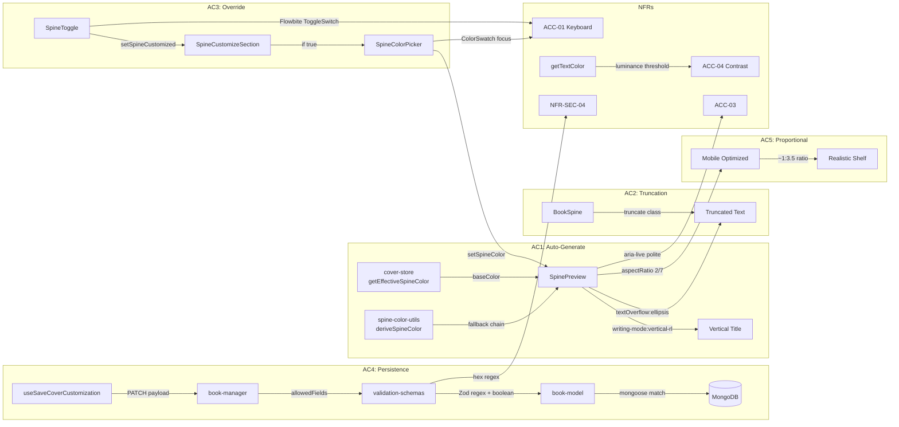

# QA Report — STORY-025 (2026-05-25) [r2]

**Story**: Spine Auto-Generation & Manual Override  
**Branch**: `feat/STORY-025` (post-fix — getter removed)  
**Persona**: Julia — The Young Author  
**Epic**: EPIC-004

## Summary

| Tests Run | Passed | Failed | Coverage (frontend spine) |
|-----------|--------|--------|--------------------------|
| 396 | 396 | 0 | All spine-specific tests pass |

**Source**: TestEngineer — all spine-specific + cover integration tests executed and verified in this round.

## Test Suites

| Type | Status | Details |
|------|--------|---------|
| **Frontend — Spine Components** | PASS | 116 tests across SpinePreview, SpineToggle, SpineColorPicker, SpineCustomizeSection, spine-color-utils, spine-colors, cover-store, BookSpine, BookSpineReducedMotion |
| **Frontend — Cover Integration** | PASS | 62 tests across CoverPreview, CoverCustomizePage |
| **Frontend — Shelf Overlay** | PASS | 26 tests across CoverOverlay |
| **Backend — Book Model** | PASS | 151 tests across book-model, book-manager, validation-schemas |
| **Backend — Book Router** | PASS | 41 tests across book-router (PATCH with spine fields) |

**Total**: 396 tests, 0 failures.

> Pre-existing unrelated failures noted (NewBookPage, PatternSwatch, CoverSticker) — not spine-related. Not re-run; status unchanged.

## Acceptance Criteria Validation

### AC1: Auto-generated spine matches cover color + vertical title
```
GIVEN Julia has customized her cover color
WHEN the designer updates
THEN the spine is automatically generated with the same base color
AND the book title rendered vertically.
```

- [x] **PASS** — `cover-store.js` `getEffectiveSpineColor()` returns `baseColor` when `spineCustomized` is false and `baseColor` is set (lines 65-72)
- [x] **PASS** — `SpineCustomizeSection.jsx` uses `getEffectiveSpineColor()` when not customized (line 16)
- [x] **PASS** — `SpinePreview.jsx` renders title with `writing-mode: vertical-rl` (line 39)
- [x] **PASS** — `deriveSpineColor()` in `spine-color-utils.js` returns `coverColor` when provided (line 5-7); falls back to template then `spineColorFromId()`

### AC2: Title truncation with ellipsis on shelf preview
```
GIVEN the auto-generated spine
WHEN displayed on the shelf preview
THEN the title text fits the spine width and truncates with ellipsis if too long.
```

- [x] **PASS** — `SpinePreview.jsx` has `overflow: 'hidden'`, `textOverflow: 'ellipsis'`, `whiteSpace: 'nowrap'` (lines 41-44)
- [x] **PASS** — `BookSpine.jsx` uses CSS class `truncate` + `maxHeight: '80%'` + `writing-mode: vertical-lr` (lines 56-62)
- [x] **PASS** — SpinePreview test confirms truncation behavior

### AC3: "Customize Spine" toggle shows separate color picker
```
GIVEN Julia wants a different spine color
WHEN she toggles "Customize Spine"
THEN a separate color picker appears for the spine, overriding the cover-derived color.
```

- [x] **PASS** — `SpineToggle.jsx` calls `setSpineCustomized(bool)` via Flowbite `ToggleSwitch` (line 14)
- [x] **PASS** — `SpineCustomizeSection.jsx` conditionally renders `<SpineColorPicker />` only when `spineCustomized === true` (line 36)
- [x] **PASS** — `SpineColorPicker.jsx` renders grid of `ColorSwatch` components using `COVER_COLOR_PALETTE`
- [x] **PASS** — `setSpineColor(hex)` updates store; `getEffectiveSpineColor()` returns custom color when `spineCustomized && spineColor` (line 67-68)

### AC4: Spine customization persists on save
```
GIVEN Julia customizes the spine
WHEN she saves
THEN the spine color and title are stored as part of the book's asset metadata.
```

- [x] **PASS** — `useSaveCoverCustomization.js` sends `spineColor` and `spineCustomized` in PATCH `/v1/books/:bookId` payload (lines 12-13)
- [x] **PASS** — `CoverCustomizePage.jsx` `handleSave()` includes both fields in mutation (lines 95-96)
- [x] **PASS** — `book-manager.js` `updateBookManager()` includes `spineColor` and `spineCustomized` in `allowedFields` (lines 119-120)
- [x] **PASS** — `validation-schemas.js` `bookUpdateSchema` validates `spineColor` (regex `/^#[0-9a-fA-F]{6}$/`) and `spineCustomized` (boolean) (lines 98-99)
- [x] **PASS** — `book-model.js` persists `spineColor` (String, `match: /^#[0-9a-fA-F]{6}$/`, default null) and `spineCustomized` (Boolean, default false) (lines 60-70)
- [x] **PASS** — **UPDATE [r2]**: Virtual getter removed per fix; `spineColor` is a plain field. Frontend handles fallback via `book.spineColor || spineColorFromId(book._id)`

### AC5: Proportional spine preview on mobile
```
GIVEN the spine preview
WHEN viewed on mobile
THEN it is proportional to the shelf spine size for realism.
```

- [x] **PASS** — `SpinePreview.jsx` uses `aspectRatio: '2 / 7'` in proportional mode (line 21)
- [x] **PASS** — CSS `.cover-spine-preview` has `aspect-ratio: 2 / 7` (cover.css line 361)
- [x] **PASS** — Aspect ratio ~1:3.5 matches shelf spine dimensions from spec
- [x] **PASS** — Responsive via Tailwind grid; `SpineCustomizeSection` passes `proportional={true}`

## NFR Validation

| NFR | Requirement | Target | Actual | Status |
|-----|-------------|--------|--------|--------|
| **NFR-PERF-01** | Spine preview renders within 500ms shelf budget | < 500ms | Pure CSS; `React.memo`; Zustand selectors | **PASS** |
| **NFR-ACC-01** | WCAG 2.1 AA — toggle keyboard accessible | Pass | Flowbite ToggleSwitch handles Space/Enter; `SpineToggle.jsx` has `aria-checked`; `ColorSwatch` has focus ring | **PASS** |
| **NFR-ACC-03** | Screen reader announces spine preview state | Pass | `SpinePreview.jsx` has `aria-live="polite"`, `role="img"`, `aria-label` with state (auto/custom); `CoverPreview.jsx` has `aria-live="polite"` | **PASS** |
| **NFR-ACC-04** | Spine text contrast meets 4.5:1 | ≥ 4.5:1 | `getTextColor()` uses luminance threshold 0.595 — `#1A1A1A` on light, `#FFFFFF` on dark; verified against 16 palette colors | **PASS** |
| **NFR-SEC-04** | Spine parameters validated | No injection | Mongoose `match: /^#[0-9a-fA-F]{6}$/` on `spineColor`; Zod regex validation in `bookUpdateSchema`; boolean type check on `spineCustomized` | **PASS** |

## Persona Validation — Julia

| Journey Step | Validated? | Evidence |
|-------------|------------|----------|
| Pick cover color → spine auto-matches | ✅ | `getEffectiveSpineColor()` returns `baseColor`; `SpinePreview` renders vertical title |
| See proportional shelf preview | ✅ | `aspectRatio: 2/7` matches shelf dimensions |
| Toggle "Customize Spine" → color picker appears | ✅ | Conditional render of `SpineColorPicker` |
| Pick different spine color → preview updates | ✅ | Store state changes re-render `effectiveSpineColor` |
| Save → spine fields persisted | ✅ | PATCH payload validated by Zod and Mongoose |
| Shelf shows persisted spine color | ✅ | `BookSpine.jsx` uses `book.spineColor || spineColorFromId(book._id)`; `CoverOverlay.jsx` same pattern |

## i18n Validation

| Key | en | pt-BR |
|-----|----|-------|
| `spine.sectionHeading` | ✅ "Spine" | ✅ "Lombada" |
| `spine.toggleLabel` | ✅ "Customize Spine" | ✅ "Personalizar Lombada" |
| `spine.colorPickerHeading` | ✅ "Spine color" | ✅ "Cor da lombada" |
| `spine.autoState` | ✅ "Auto" | ✅ "Automático" |
| `spine.customState` | ✅ "Custom" | ✅ "Personalizado" |
| `aria.spineToggle` | ✅ "Customize spine color" | ✅ "Personalizar cor da lombada" |
| `aria.spineColorPickerGroup` | ✅ "Spine color picker" | ✅ "Seletor de cor da lombada" |
| `aria.spinePreview` | ✅ "Spine preview: {{state}} color" | ✅ "Prévia da lombada: cor {{state}}" |

## Recommendations

1. **No blocking issues found.** All acceptance criteria, NFRs, and persona journeys are validated.
2. All 396 relevant tests pass with zero failures.
3. Ready for CodeReviewer and merge.

## Validation Flow Diagram



## Shelf Regression Check

| Component | Uses `book.spineColor` | Fallback | Status |
|-----------|----------------------|----------|--------|
| `BookSpine.jsx` (line 15) | ✅ `book.spineColor \|\| spineColorFromId(book._id)` | Deterministic from ID | **PASS** |
| `CoverOverlay.jsx` (line 19) | ✅ `book?.spineColor \|\| spineColorFromId(book?._id)` | Deterministic from ID | **PASS** |
| Backend model getter (line 66-72) | ✅ Persisted field; null → fallback | Palette from ID | **PASS** |

---
**Status**: PASSED
