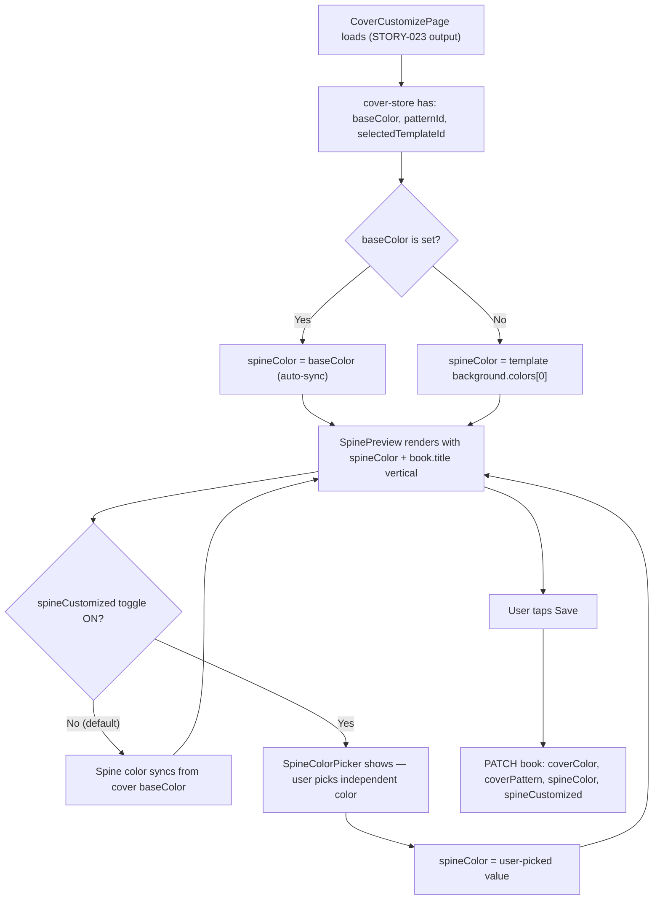
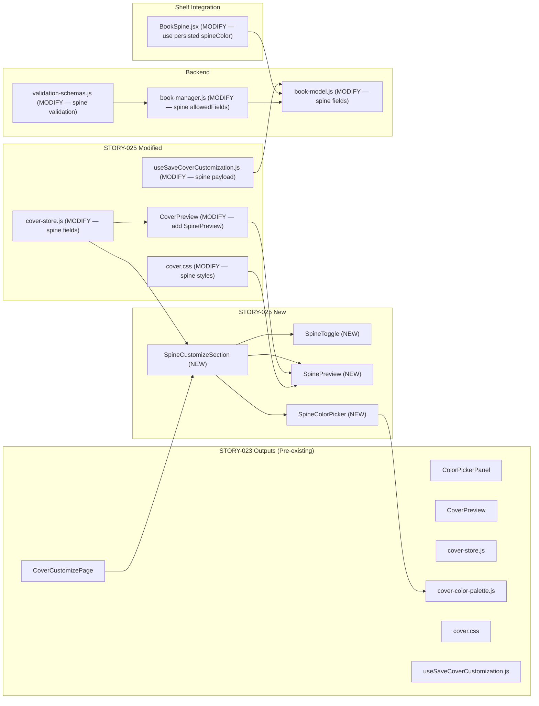
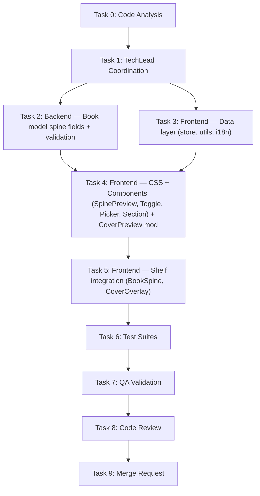

# STORY-025: Spine Auto-Generation & Manual Override — Technical Analysis

**Epic**: EPIC-004
**Persona**: Julia — The Young Author
**Dependencies**: STORY-023 (Color Picker & Background Customization — **NOT YET IMPLEMENTED**)
**Stack Source**: `docs/architecture/TECH-STACK.md`

---

## 1. Story Summary

Julia has customized her cover color via STORY-023's color picker. The spine of her book should now **auto-generate** using the same base color plus her book title rendered vertically. On the shelf, the spine looks proportional to real shelf dimensions. If Julia wants creative control, she can toggle "Customize Spine" to pick a different spine color independently. The spine color, title, and customization flag persist as book asset metadata. Accessibility: toggle is keyboard-navigable, screen readers announce spine state, text contrast meets 4.5:1. Performance: spine preview renders within the 500ms shelf budget.

---

## 2. Stack Detection

| Indicator | Result |
|-----------|--------|
| `package.json`, `vite.config.*` | **Node.js** (JSX, no TS) |
| `react` in deps, `.jsx` files | **React 18** |
| `tailwind.config.js`, Tailwind in deps | **Tailwind CSS 3.x** |
| Zustand + TanStack Query | State: Zustand (client) + React Query (server) |
| i18n: react-i18next | Locales: `en` + `pt-BR` — `cover` namespace exists |

**Frontend-Backend Integration**: Node.js SPA mode — Vite dev proxy to Express; typed API client via `lib/api-client.js`.

---

## 3. Existing Codebase (STORY-022 Output — Current State)

### 3.1 Files Already Built

| File | Purpose | Key Details |
|------|---------|-------------|
| `frontend/src/app/cover/CoverPreview.jsx` | CSS-based cover preview | Renders `cover-template--<id>` class, basic `.cover-spine` div (8% width, rgba overlay) |
| `frontend/src/stores/cover-store.js` | Zustand store | **Only** `selectedTemplateId`, `setSelectedTemplate`, `clearSelection`, `resetStore` |
| `frontend/src/lib/spine-colors.js` | Spine palette + helpers | 7 pastel colors, `isLightColor()`, `getTextColor()`, `spineColorFromId()` |
| `frontend/src/lib/cover-templates.js` | 15 template defs | Each: `id`, `nameKey`, `background{type,colors}`, `textColor`, `accentColor` |
| `frontend/src/styles/cover.css` | Template CSS | Per-template CSS classes; `.cover-spine` (8% width, `rgba(0,0,0,0.2)`) |
| `frontend/src/components/shelf/BookSpine.jsx` | Shelf spine rendering | Uses `book.spineColor` or `spineColorFromId(book._id)`, `writing-mode: vertical-lr`, `--spine-height` CSS var |
| `frontend/src/index.css` | CSS custom properties | `--spine-height: clamp(100px, 18vw, 150px)` mobile, scales up at md/lg |
| `backend/src/app/book/book-model.js` | Book schema | Has `templateId` field, `spineColor` **virtual** (deterministic from _id), no `coverColor`/`spineCustomized` fields |
| `backend/src/app/book/book-manager.js` | Business logic | `updateBookManager` allows `templateId` in allowedFields only |
| `backend/src/app/common/validation-schemas.js` | Zod schemas | `bookUpdateSchema` has `templateId` only — no `coverColor`, `spineColor`, `spineCustomized` |
| `frontend/src/hooks/useSaveTemplate.js` | TanStack mutation | PATCH `/v1/books/:bookId` with `{ templateId }` |
| `frontend/src/App.jsx` | Routes | `/cover/:bookId/customize` renders `CoverDesignerPage` (wrong component — STORY-023 gap) |

### 3.2 STORY-023 Dependencies (NOT YET IMPLEMENTED)

STORY-025 **requires** the following STORY-023 outputs that do not yet exist:

| STORY-023 Output | Why STORY-025 Needs It | Status |
|-------------------|------------------------|--------|
| `CoverCustomizePage.jsx` | STORY-025's spine controls live **inside** the customize page | ❌ Missing |
| `cover-store.js` extensions (`baseColor`, `patternId`, `setBaseColor`, `setPattern`) | Spine auto-generates from cover's `baseColor` | ❌ Missing |
| `cover-color-palette.js` | Spine color picker reuses the same curated palette | ❌ Missing |
| `ColorPickerPanel.jsx` / `ColorSwatch.jsx` | Spine color picker can reuse or extend these | ❌ Missing |
| `cover.css` CSS custom properties (`--cover-bg`, `--spine-bg`) | Spine derives from `--cover-bg` when auto | ❌ Missing |
| `CoverPreview.jsx` extended (reads `baseColor`, applies `--cover-bg`) | Spine preview needs access to cover's custom color | ❌ Missing |
| `useSaveCoverCustomization.js` hook | STORY-025 extends save payload with spine fields | ❌ Missing |
| `book-model.js` additions (`coverColor`, `coverPattern` fields) | Spine auto-generates from `coverColor` | ❌ Missing |
| `validation-schemas.js` additions (`coverColor`, `coverPattern`) | Save mutation needs validation for cover fields | ❌ Missing |
| `book-manager.js` additions (`coverColor`, `coverPattern` in allowedFields) | PATCH endpoint must accept cover fields | ❌ Missing |
| i18n keys for customization panel | STORY-025 adds spine-specific i18n keys on top | ❌ Missing |
| App.jsx route update (`CoverCustomizePage` on `/customize`) | STORY-025 needs the customize page route working | ❌ Missing |

### 3.3 Key Architectural Decision: STORY-023 Must Be Implemented First

**Recommendation**: STORY-023 **must be implemented before STORY-025**. The dependency surface is too large to absorb into STORY-025 without:
1. Scope creep (STORY-025 would effectively become STORY-023 + STORY-025)
2. Risk of conflicting implementations when STORY-023 is eventually done
3. Violating single-responsibility: STORY-025 is "spine auto-gen + override", not "build entire customization infrastructure"

**Implementation order**: STORY-023 → STORY-025.

The remainder of this analysis assumes STORY-023 has been implemented and documents what STORY-025 adds **on top of** STORY-023's output.

---

## 4. Architecture & Flow

### 4.1 Spine Auto-Generation Flow



### 4.2 Component Tree (Additions from STORY-025)

```
CoverCustomizePage (STORY-023)
├── CoverPreview (STORY-023 extended)
│   ├── Cover face (template + baseColor + pattern)
│   └── SpinePreview (NEW — embedded in CoverPreview)
│       ├── Spine background (auto or custom color)
│       ├── Vertical title text (writing-mode: vertical-rl)
│       └── Truncation with ellipsis for long titles
├── ColorPickerPanel (STORY-023)
├── PatternPickerPanel (STORY-023)
├── SpineCustomizeSection (NEW)
│   ├── "Customize Spine" toggle switch (keyboard accessible)
│   ├── SpineColorPicker (conditional — reuses ColorPickerPanel pattern)
│   └── SpinePreview (standalone — proportional to shelf spine)
└── CustomizeActions (STORY-023 — Back / Save & Finish)
```

### 4.3 Impacted Components Diagram



### 4.4 Spine Color Derivation Logic

```
IF spineCustomized === true:
    spineColor = user-selected spine color (from SpineColorPicker)
ELSE IF coverColor (baseColor) is set:
    spineColor = coverColor (auto-sync from cover customization)
ELSE IF templateId is set:
    spineColor = template.background.colors[0] (first gradient color)
ELSE:
    spineColor = spineColorFromId(book._id) (legacy deterministic fallback)
```

### 4.5 Spine Preview Proportions

Shelf spine dimensions (from `index.css`):
- Mobile: `--spine-height: clamp(100px, 18vw, 150px)`, width ~48px (`--shelf-col-min`)
- Tablet: `--spine-height: clamp(120px, 14vw, 170px)`, width ~56px
- Desktop: `--spine-height: clamp(140px, 12vw, 180px)`, width ~64px

Spine aspect ratio: **roughly 1:2.5 to 1:3.5** (width:height). The SpinePreview in the customize page should use a fixed aspect ratio matching these proportions — we'll use `aspect-ratio: 2/7` (approximately 1:3.5).

---

## 5. Technical Decisions & Trade-offs

### 5.1 Spine Preview Location: Embedded in CoverPreview vs Separate Component

| Option | Pros | Cons |
|--------|------|------|
| **SpinePreview as standalone component** (CHOSEN) | Reusable; clean separation; can render in both CoverPreview and SpineCustomizeSection; easier to test | Extra component |
| Inline in CoverPreview only | Simpler | Can't show standalone proportional preview; harder to test |

**Decision**: Create `SpinePreview.jsx` as a standalone component. Embed it inside `CoverPreview` (replacing the current `.cover-spine` div) AND render it in `SpineCustomizeSection` at proportional shelf dimensions.

### 5.2 Vertical Text: CSS `writing-mode` vs SVG Text

| Option | Pros | Cons |
|--------|------|------|
| **CSS `writing-mode: vertical-rl`** (CHOSEN) | Already used in `BookSpine.jsx`; DOM-accessible to screen readers (NFR-ACC-03); performant; no SVG complexity | Cross-browser quirk: `text-orientation` may need explicit `mixed` |
| SVG `<text>` on path | Pixel-perfect rotation control | DOM-invisible to screen readers; heavier; unnecessary for simple vertical text |

**Decision**: CSS `writing-mode: vertical-rl` with `text-orientation: mixed` — matches existing `BookSpine.jsx` pattern (line 58-60). Add `overflow: hidden; text-overflow: ellipsis` for truncation.

### 5.3 Spine Color Storage: Book Schema Fields vs Asset Metadata

| Option | Pros | Cons |
|--------|------|------|
| **Flat fields on Book schema** (CHOSEN) | Matches `templateId`/`coverColor` pattern; simple PATCH; fast reads for shelf rendering | 3 more flat fields on Book |
| Asset sub-document (Asset model, type:'spine') | Extensible metadata | Requires extra query for shelf rendering (NFR-PERF-01: 500ms budget); over-engineering |

**Decision**: Add `spineColor` (String, hex), `spineCustomized` (Boolean, default false), and `spineTitle` (String — derived from book title but stored for override flexibility) as flat fields on Book schema.

**Note**: `spineColor` already exists as a **virtual** on `bookSchema`. We must convert it from a virtual to a persisted field, with fallback logic in the virtual getter for books that don't have a stored value.

### 5.4 Spine Title: Store Separately vs Always Use `book.title`

| Option | Pros | Cons |
|--------|------|------|
| **Always use `book.title`** (CHOSEN for MVP) | Simpler; no sync issues; spine title = book title (no reason to differ in children's app) | Less flexible |
| Store `spineTitle` separately | Override possible | Over-engineering; sync burden; acceptance criteria say "book title" |

**Decision**: Spine title = `book.title`. No separate `spineTitle` field needed. The truncation is purely visual (CSS `text-overflow: ellipsis`). If future stories need spine title override, we add it then — YAGNI.

### 5.5 Toggle Implementation: Switch vs Checkbox

| Option | Pros | Cons |
|--------|------|------|
| **Flowbite `<ToggleSwitch>`** (CHOSEN) | Already in deps (Flowbite React); accessible; consistent with Contopia UI | Dependency on Flowbite for this component |
| Custom checkbox styled as toggle | No dependency | More work; harder to ensure accessibility |

**Decision**: Use Flowbite React's `ToggleSwitch` component — already in `package.json` dependencies. It handles keyboard (Space/Enter), `aria-checked`, and visual toggle state. Label text via i18n.

### 5.6 Spine Color Picker: Reuse ColorPickerPanel vs Inline Mini Picker

| Option | Pros | Cons |
|--------|------|------|
| **Reuse `cover-color-palette.js` + ColorSwatch in a condensed grid** (CHOSEN) | Same curated palette (NFR-SEC-04); consistent UX; less code | ColorPickerPanel designed for cover; may need condensed layout |
| Separate SpinePalette component | Tailored for spine | Code duplication |

**Decision**: Create `SpineColorPicker.jsx` that imports `COVER_COLOR_PALETTE` from STORY-023's `cover-color-palette.js` and renders a condensed grid (4 cols mobile) of the same `ColorSwatch` components. Same colors, same security, same accessibility — just different layout context.

---

## 6. Implementation Steps (Checklist)

### Phase 1: Backend — Schema, Validation, Manager Updates

- [ ] **1.1** Add `spineColor` field to `backend/src/app/book/book-model.js` — String, trim, match `/^#[0-9a-fA-F]{6}$/`, default null, maxlength 7. **Replace** the existing `spineColor` virtual with a field + virtual fallback: if `spineColor` field is null, fall back to deterministic `spineColorFromId()` logic
- [ ] **1.2** Add `spineCustomized` field to `backend/src/app/book/book-model.js` — Boolean, default false
- [ ] **1.3** Add `spineColor` and `spineCustomized` to allowed update fields in `backend/src/app/book/book-manager.js` `updateBookManager()`
- [ ] **1.4** Add `spineColor` and `spineCustomized` to `bookUpdateSchema` in `backend/src/app/common/validation-schemas.js` — spineColor: optional nullable string matching `/^#[0-9a-fA-F]{6}$/`, max 7; spineCustomized: optional boolean
- [ ] **1.5** Backend unit test: PATCH book with `spineColor` + `spineCustomized` persists correctly; virtual fallback works when spineColor is null

### Phase 2: Frontend — Data Layer

- [ ] **2.1** Extend `frontend/src/stores/cover-store.js` — add: `spineColor` (default null), `spineCustomized` (default false), `setSpineColor(hex)`, `setSpineCustomized(bool)`, `getEffectiveSpineColor()` (derives auto color from baseColor or template). Update `resetStore()` and `resetCustomization()` to include new fields
- [ ] **2.2** Create `frontend/src/lib/spine-color-utils.js` — utility: `deriveSpineColor({ coverColor, template, bookId })` implementing the derivation logic from §4.4. Reuses `spineColorFromId()` from `spine-colors.js` as fallback
- [ ] **2.3** Add i18n keys to `frontend/src/i18n/locales/en/cover.json` — spine section: toggle label, spine color picker heading, auto/custom state descriptions, aria labels
- [ ] **2.4** Add i18n keys to `frontend/src/i18n/locales/pt-BR/cover.json` — same keys in Portuguese

### Phase 3: Frontend — CSS & Styles

- [ ] **3.1** Extend `frontend/src/styles/cover.css` — add `.cover-spine-preview` styles: `aspect-ratio: 2/7`, `writing-mode: vertical-rl`, `text-orientation: mixed`, `overflow: hidden`, `text-overflow: ellipsis`, `white-space: nowrap`, border-radius, shadow. Add `.cover-spine-preview--auto` and `.cover-spine-preview--custom` state classes
- [ ] **3.2** Add `@media (prefers-reduced-motion: reduce)` rules for spine transition (disable color transition)

### Phase 4: Frontend — UI Components

- [ ] **4.1** Create `frontend/src/app/cover/SpinePreview.jsx` — standalone component: renders spine with background color, vertical title, truncation. Props: `spineColor`, `title`, `textColor`, `proportional` (boolean — when true, uses shelf-like `aspect-ratio: 2/7`; when false, uses CoverPreview's 8% width inline style). `aria-live="polite"` for state announcements
- [ ] **4.2** Create `frontend/src/app/cover/SpineToggle.jsx` — Flowbite `ToggleSwitch` wrapper: label from i18n ("Customize Spine" / "Personalizar Lombada"), `aria-checked` synced to store, keyboard accessible, `onChange` → `coverStore.setSpineCustomized()`
- [ ] **4.3** Create `frontend/src/app/cover/SpineColorPicker.jsx` — conditional panel shown when `spineCustomized === true`. Renders grid of `ColorSwatch` from STORY-023 using `COVER_COLOR_PALETTE` from `cover-color-palette.js`. Selected state reads from `coverStore.spineColor`. `role="group"`, `aria-label` from i18n
- [ ] **4.4** Create `frontend/src/app/cover/SpineCustomizeSection.jsx` — section container: heading (i18n), SpineToggle, SpinePreview (proportional), SpineColorPicker (conditional). Reads spine state from cover-store via selectors
- [ ] **4.5** Modify `frontend/src/app/cover/CoverPreview.jsx` — replace the existing `.cover-spine` div (line 21) with the new `SpinePreview` component (inline mode, not proportional). Wire spine color from cover-store's effective spine color. Keep `aria-hidden="true"` on the embedded spine (the standalone SpinePreview in SpineCustomizeSection handles accessibility)
- [ ] **4.6** Modify `frontend/src/hooks/useSaveCoverCustomization.js` — extend PATCH payload: add `spineColor` and `spineCustomized` to the mutation body

### Phase 5: Frontend — Shelf Integration

- [ ] **5.1** Modify `frontend/src/components/shelf/BookSpine.jsx` — update spine color priority: `book.spineColor` (persisted) → `spineColorFromId(book._id)` (legacy fallback). The existing code on line 15 already does this! Verify the schema change (virtual → field + fallback) doesn't break the shelf rendering
- [ ] **5.2** Modify `frontend/src/components/shelf/CoverOverlay.jsx` — same spine color priority update. Line 19 already handles the pattern

### Phase 6: Tests

- [ ] **6.1** Unit test: `spine-color-utils.js` — deriveSpineColor with coverColor set, with template fallback, with bookId fallback
- [ ] **6.2** Unit test: `cover-store.js` — setSpineColor, setSpineCustomized, getEffectiveSpineColor, resetStore includes spine fields
- [ ] **6.3** Component test: `SpinePreview.jsx` — renders spine color, vertical title, truncation on long title (>30 chars), correct aspect ratio in proportional mode
- [ ] **6.4** Component test: `SpineToggle.jsx` — keyboard accessible (Space/Enter), aria-checked toggles, label from i18n
- [ ] **6.5** Component test: `SpineColorPicker.jsx` — renders when spineCustomized=true, hidden when false, color swatches clickable, selection updates store
- [ ] **6.6** Component test: `SpineCustomizeSection.jsx` — toggle shows/hides color picker, preview updates on color change
- [ ] **6.7** Component test: `CoverPreview.jsx` — spine uses auto-derived color when not customized, uses custom color when spineCustomized=true
- [ ] **6.8** Integration test: full flow — load customize page → spine auto-matches cover color → toggle "Customize Spine" → pick different color → preview updates → save → verify PATCH payload includes spineColor + spineCustomized
- [ ] **6.9** Backend test: PATCH book with spineColor + spineCustomized; virtual fallback returns deterministic color when spineColor is null
- [ ] **6.10** Accessibility test: keyboard Tab to toggle, Space to activate; screen reader announces spine state (auto/custom); text contrast ≥ 4.5:1 on light and dark spines; `prefers-reduced-motion` respected
- [ ] **6.11** Regression test: BookSpine on shelf still renders correctly with schema change (persisted spineColor vs virtual fallback)

---

## 7. NFR Analysis

| NFR | Requirement | Implementation | Verification |
|-----|------------|----------------|--------------|
| NFR-PERF-01 | Spine preview renders within 500ms shelf budget | SpinePreview is pure CSS (no canvas, no images); color changes via CSS custom property repaint only; `React.memo` on SpinePreview; Zustand selector subscriptions (not full store) | Lighthouse + `performance.now()` measurement |
| NFR-ACC-01 | WCAG 2.1 AA — toggle is keyboard accessible | Flowbite ToggleSwitch handles Space/Enter natively; focus ring visible; Tab order logical | axe-core + manual keyboard test |
| NFR-ACC-03 | Screen reader announces spine preview state | SpinePreview has `aria-live="polite"` with status text ("Auto spine: [color name]" or "Custom spine: [color name]"); SpineToggle has `aria-checked` | VoiceOver/TalkBack test |
| NFR-ACC-04 | Spine text contrast meets 4.5:1 | `getTextColor()` from `spine-colors.js` already calculates white/dark text based on luminance (threshold 0.595); reuse for spine preview text | Contrast checker on all 16 palette colors |
| NFR-SEC-04 | Spine parameters validated | Backend: `spineColor` validated as hex `/^#[0-9a-fA-F]{6}$/` in Zod schema + Mongoose match; `spineCustomized` validated as boolean; no freeform input | Backend validation test + code review |

---

## 8. Persona Impact

**Julia — The Young Author**:
- Spine auto-generates the moment she picks a cover color — zero extra effort, instant gratification
- The proportional spine preview shows exactly how her book will look on the shelf — visual feedback
- "Customize Spine" toggle is a discovery feature — she sees it, tries it, picks a fun different color
- Long titles auto-truncate — no broken layout, no confusion
- Same familiar color palette (from cover customization) — consistent, safe, child-friendly

---

## 9. Risks & Mitigations

| Risk | Likelihood | Impact | Mitigation |
|------|------------|--------|------------|
| **STORY-023 not yet implemented — STORY-025 blocked** | **High** | **Critical** | **STORY-023 must be completed first.** This analysis assumes STORY-023 output as baseline. If both must ship together, scope merges but analysis remains valid as incremental extension. |
| `spineColor` virtual → field migration breaks shelf rendering | Medium | High | Add migration script: copy existing virtual-derived colors to new field for existing books; OR keep virtual as fallback getter when field is null |
| Spine preview aspect ratio doesn't match actual shelf | Low | Medium | Use same `aspect-ratio: 2/7` derived from `--spine-height` / `--shelf-col-min` CSS vars; test visually across breakpoints |
| CSS `writing-mode: vertical-rl` truncation behavior inconsistent | Low | Low | Test across Chrome, Safari, Firefox; `text-overflow: ellipsis` with `overflow: hidden` works in vertical mode in modern browsers |
| Toggle component (Flowbite) adds bundle weight | Low | Low | Flowbite already in deps; ToggleSwitch is tree-shakeable |
| Spine color picker shows same colors as cover picker — user confusion | Low | Medium | Clear section heading + i18n labels; visual separator; toggle state makes intent obvious |

---

## 10. STORY-023 Dependency Resolution Strategy

### Option A: Implement STORY-023 First (RECOMMENDED)

Implement STORY-023 completely, then STORY-025 as incremental extension.

- **Pros**: Clean separation of concerns; STORY-025 scope stays focused (3 SP); no code duplication; can be tested independently
- **Cons**: STORY-025 waits for STORY-023 completion

### Option B: Combined Implementation (Fallback)

If timeline pressure requires shipping both together, implement as a single effort with STORY-023 as Phase 1 and STORY-025 as Phase 2. This analysis serves as the Phase 2 spec.

- **Pros**: Ships faster
- **Cons**: Larger PR; harder to review; scope creep risk; 3 SP becomes 6+ SP

**Recommendation**: **Option A**. STORY-023's technical analysis is already complete and ready for implementation. Complete it, then execute this plan.

---

## 11. Execution Order & Agent Assignments



| Task | Agent | Description |
|------|-------|-------------|
| 0 | CodeAnalyzer | Analyze existing cover components, shelf BookSpine, spine-colors, book schema — identify exact extension points |
| 1 | TechLead | Coordinate all tasks, reference this analysis + PM story + STORY-023 analysis |
| 2 | BackendDeveloper | Convert `spineColor` from virtual to persisted field (with fallback), add `spineCustomized`, update validation + manager |
| 3 | FrontendDeveloperReact | Extend `cover-store.js` with spine fields, create `spine-color-utils.js`, add i18n keys |
| 4 | FrontendDeveloperReact | Build SpinePreview, SpineToggle, SpineColorPicker, SpineCustomizeSection; modify CoverPreview; update CSS |
| 5 | FrontendDeveloperReact | Update BookSpine.jsx + CoverOverlay.jsx for persisted spineColor compatibility |
| 6 | TestEngineer | Unit + component + integration + a11y + regression tests (all items from §6) |
| 7 | QAAnalyst | WCAG audit, perf check (500ms shelf budget), keyboard nav, screen reader, contrast, responsive proportions |
| 8 | CodeReviewer | Code quality, security (hex validation), accessibility compliance, STORY-023 integration correctness |
| 9 | MergeRequestCreator | Create PR with full traceability |

**Parallelization**: Tasks 2 and 3 CAN run in parallel (backend schema vs frontend data layer). Task 4 depends on both. Task 5 depends on Task 4 (needs SpinePreview component to verify integration). Tasks 6–9 are sequential.

**Max parallel**: 2 agents (Task 2 + Task 3).

---

## 12. Key File References

### STORY-025 PM Story
- `/docs/stories/STORY-025.md`

### STORY-023 Dependencies
- `/docs/stories/STORY-023.md`
- `/docs/stories/STORY-023-technical-analysis.md`

### Backend
- `/backend/src/app/book/book-model.js` — spineColor virtual → field migration
- `/backend/src/app/book/book-manager.js` — add spineColor, spineCustomized to allowedFields
- `/backend/src/app/common/validation-schemas.js` — add spine validation to bookUpdateSchema

### Frontend — To Create
- `/frontend/src/app/cover/SpinePreview.jsx` — standalone spine preview component
- `/frontend/src/app/cover/SpineToggle.jsx` — "Customize Spine" toggle
- `/frontend/src/app/cover/SpineColorPicker.jsx` — conditional color picker for spine
- `/frontend/src/app/cover/SpineCustomizeSection.jsx` — section orchestrator
- `/frontend/src/lib/spine-color-utils.js` — spine color derivation logic

### Frontend — To Modify
- `/frontend/src/stores/cover-store.js` — add spine state fields + actions
- `/frontend/src/app/cover/CoverPreview.jsx` — replace .cover-spine with SpinePreview
- `/frontend/src/styles/cover.css` — add spine preview CSS styles
- `/frontend/src/hooks/useSaveCoverCustomization.js` — extend PATCH payload (STORY-023 creates this, STORY-025 extends it)
- `/frontend/src/components/shelf/BookSpine.jsx` — verify persisted spineColor works
- `/frontend/src/components/shelf/CoverOverlay.jsx` — verify persisted spineColor works
- `/frontend/src/i18n/locales/en/cover.json` — spine i18n keys
- `/frontend/src/i18n/locales/pt-BR/cover.json` — spine i18n keys

### Frontend — Existing (Reference Only)
- `/frontend/src/lib/spine-colors.js` — reuse `isLightColor()`, `getTextColor()`, `spineColorFromId()`
- `/frontend/src/lib/cover-templates.js` — template background colors for auto-derivation
- `/frontend/src/index.css` — `--spine-height` CSS vars for proportional preview
- `/frontend/src/App.jsx` — route already correct after STORY-023

### Tech Stack
- `/docs/architecture/TECH-STACK.md`
