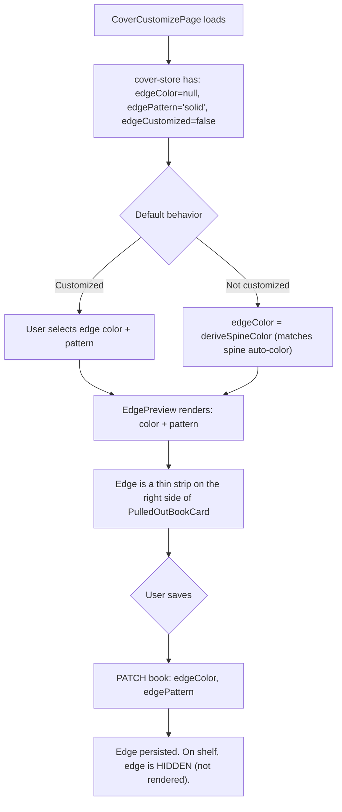
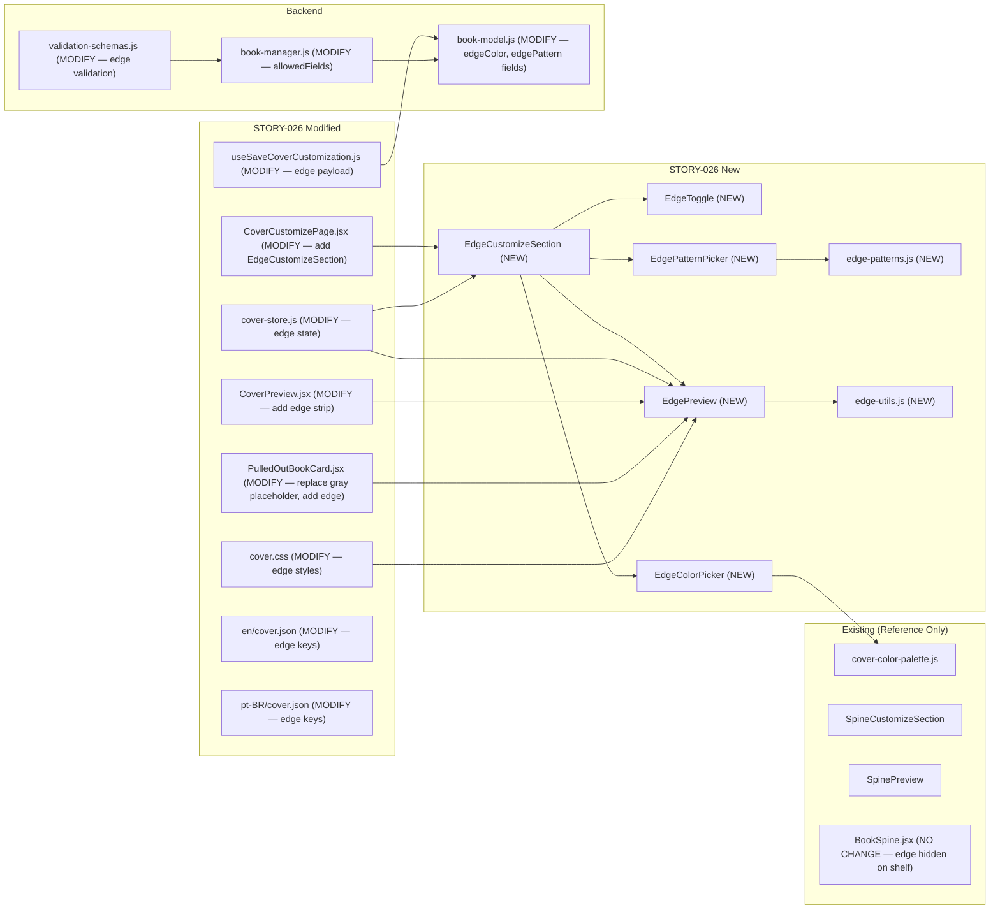
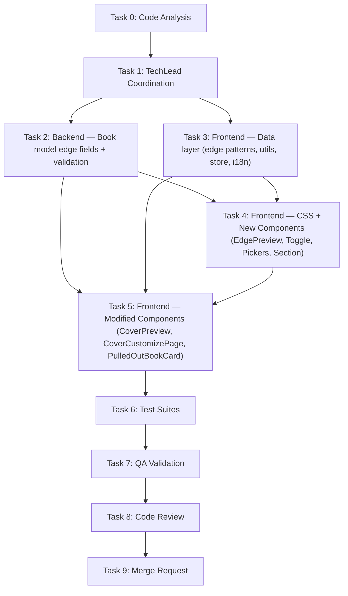

# STORY-026: Edge Design — Technical Analysis

**Epic**: EPIC-004
**Persona**: Julia — The Young Author
**Dependencies**: STORY-025 (✅ merged)
**Stack Source**: `docs/architecture/TECH-STACK.md`

---

## 1. Story Summary

Julia has customized her cover color and spine. She can now optionally decorate the edge of her book — the visible "corte" (book edge) that appears only when the book is pulled out from the shelf. The edge has 5 simple options: solid color (default, matching spine), gradient, marbling, dots, or chevron. The edge is invisible when the book sits on the shelf; it appears during the pull-out animation. Accessibility: screen readers announce edge as decorative (not required), keyboard-navigable, respects `prefers-reduced-motion`. Performance: edge preview updates <200ms on mobile.

---

## 2. Stack Detection

| Indicator | Result |
|-----------|--------|
| `package.json`, `vite.config.*` | **Node.js** (JSX, no TS) |
| `react` in deps, `.jsx` files | **React 18** |
| `tailwind.config.js`, Tailwind in deps | **Tailwind CSS 3.x** |
| Zustand + TanStack Query | State: Zustand (client) + React Query (server) |
| i18n: react-i18next | Locales: `en` + `pt-BR` — `cover` namespace exists |

**Frontend-Backend Integration**: Node.js SPA mode — Vite dev proxy to Express; typed API client via `lib/api-client.js`.

---

## 3. Existing Codebase (Post STORY-023/025)

### 3.1 Files Already Built

| File | Purpose | Key Details |
|------|---------|-------------|
| `frontend/src/app/cover/CoverCustomizePage.jsx` | Customization page orchestration | Renders CoverPreview + ColorPickerPanel + PatternPickerPanel + SpineCustomizeSection + StickerPickerPanel + CustomizeActions |
| `frontend/src/app/cover/CoverPreview.jsx` | CSS-based cover preview | Layered divs: template bg → base color → pattern → stickers → spine (8% width) → text |
| `frontend/src/app/cover/SpineCustomizeSection.jsx` | Spine section in customize page | Wraps SpinePreview + SpineToggle, conditionally shows SpineColorPicker |
| `frontend/src/app/cover/SpinePreview.jsx` | Spine rendering | Two modes: **proportional** (aspect-ratio 2/7) and **inline** (8% width inside CoverPreview). `aria-live="polite"`, `role="img"` |
| `frontend/src/app/cover/SpineToggle.jsx` | "Customize Spine" toggle | Flowbite `ToggleSwitch`, keyboard-accessible |
| `frontend/src/app/cover/SpineColorPicker.jsx` | Spine color grid | Reuses `COVER_COLOR_PALETTE` + `ColorSwatch` components |
| `frontend/src/app/cover/ColorPickerPanel.jsx` | Cover color swatch grid | 16 curated colors, 4/6/8 col responsive grid |
| `frontend/src/app/cover/PatternPickerPanel.jsx` | Cover pattern grid | 6 patterns (none, stripes, dots, stars, chevron, waves) |
| `frontend/src/app/cover/ColorSwatch.jsx` | Individual color button | Memo'd, `aria-pressed`, focus ring, `prefers-reduced-motion` |
| `frontend/src/app/cover/CustomizeActions.jsx` | Back / Save & Finish buttons | Navigation + mutation trigger |
| `frontend/src/stores/cover-store.js` | Zustand store | State: `selectedTemplateId`, `baseColor`, `patternId`, `spineColor`, `spineCustomized`, `stickers`, `coverTitle`, `selectedStickerId`; Actions: setters, `getEffectiveSpineColor()`, `resetCustomization()`, `resetStore()` |
| `frontend/src/lib/cover-color-palette.js` | 16 curated colors | `{ id, hex, nameKey }` — shared by cover and spine pickers |
| `frontend/src/lib/cover-patterns.js` | 6 cover patterns | `{ id, nameKey, type, cssClass }` |
| `frontend/src/lib/spine-colors.js` | Spine palette + helpers | `SPINE_PALETTE`, `isLightColor()`, `getTextColor()`, `spineColorFromId()` |
| `frontend/src/lib/spine-color-utils.js` | Spine derivation logic | `deriveSpineColor({ coverColor, template, bookId })` |
| `frontend/src/styles/cover.css` | Cover + spine CSS | Template backgrounds (15), pattern overlays (6), spine styles, `prefers-reduced-motion` |
| `frontend/src/hooks/useSaveCoverCustomization.js` | TanStack mutation | PATCH `/v1/books/:bookId` with `{ templateId, coverColor, coverPattern, spineColor, spineCustomized, coverTitle, stickers }` |
| `frontend/src/components/shelf/BookSpine.jsx` | Shelf spine rendering | Uses `book.spineColor \|\| spineColorFromId(book._id)`, `writing-mode: vertical-lr` |
| `frontend/src/components/shelf/PulledOutOverlay.jsx` | Pull-out modal | `AnimatePresence` + `motion.div`, backdrop, focus trap |
| `frontend/src/components/shelf/PulledOutBookCard.jsx` | Pulled-out book card | **Currently shows gray placeholder box** — `w-full h-16 rounded bg-gray-200`. No actual cover/spine/edge rendering. |
| `backend/src/app/book/book-model.js` | Book schema | `coverColor`, `coverPattern`, `spineColor` (field + getter fallback), `spineCustomized`, `coverTitle`, `stickers`, `templateId`. Asset type enum includes `'edge'` but unused. |
| `backend/src/app/book/book-manager.js` | Business logic | `updateBookManager` allows: title, description, language, templateId, coverColor, coverPattern, spineColor, spineCustomized, coverTitle, stickers |
| `backend/src/app/common/validation-schemas.js` | Zod schemas | `bookUpdateSchema` validates all cover/spine fields. Pattern enum: `none, stripes, dots, stars, chevron, waves` |

### 3.2 Key Gap: PulledOutBookCard

**Critical**: `PulledOutBookCard.jsx` line 47 renders a **gray placeholder** (`w-full h-16 rounded bg-gray-200`) instead of the actual book cover. STORY-026's edge is only visible "when the book is pulled out" — but there's currently no book rendering in the pull-out view. This must be addressed as part of STORY-026's implementation.

### 3.3 Architectural Precedent: Spine Pattern (STORY-025)

The edge implementation follows the exact same architecture as spine:
- DB: flat field on Book schema (hex color + pattern string)
- Validation: Zod enum for pattern, regex for hex color
- Manager: add to `allowedFields`
- Store: add state + setters + effective color getter
- UI: `EdgeCustomizeSection` (≡ `SpineCustomizeSection`), `EdgePreview` (≡ `SpinePreview`), `EdgeToggle` (≡ `SpineToggle`), `EdgePatternPicker` (≡ `SpineColorPicker` but for patterns)
- CSS: `.cover-edge` classes (≡ `.cover-spine` classes)
- i18n: `edge` namespace (≡ `spine` namespace)
- Save hook: extend PATCH payload

**Key difference**: Edge has **pattern selection** (not just color). Spine only had a color picker. Edge needs both a color picker (for solid/gradient base) AND a pattern picker (for marbling, dots, chevron, etc.).

---

## 4. Architecture & Flow

### 4.1 Edge Customization Flow



### 4.2 Edge Visibility Rules

| Context | Edge Visible? | Rendering Approach |
|---------|--------------|-------------------|
| Book **on shelf** (BookSpine) | ❌ Hidden | No DOM rendering. Edge is occluded by adjacent books. |
| Book **pulled out** (PulledOutBookCard) | ✅ Visible | Thin strip (4-6px) on right side of book cover, showing edgeColor + pattern |
| CoverPreview **in customize page** | ✅ Visible (preview) | Edge preview component shows edge as decorative strip |
| CoverPreview **2D flat view** | ⚠️ Optional | Small strip on right side of cover preview (non-interactive) |

### 4.3 Component Tree (Additions from STORY-026)

```
CoverCustomizePage
├── CoverPreview (MODIFY — optional edge strip on right side)
│   ├── Base color overlay
│   ├── Pattern overlay
│   ├── Sticker layer
│   ├── Inline SpinePreview (8% width)
│   ├── Edge strip (NEW — 4-6px on right, aria-hidden="true")
│   └── Cover text layer
├── ColorPickerPanel (existing)
├── PatternPickerPanel (existing)
├── SpineCustomizeSection (existing)
├── EdgeCustomizeSection (NEW)
│   ├── EdgeToggle (NEW — "Customize Edge" toggle)
│   ├── EdgePreview (NEW — standalone proportional preview)
│   ├── EdgeColorPicker (NEW — conditional, reuses COVER_COLOR_PALETTE)
│   └── EdgePatternPicker (NEW — conditional, 5 edge patterns)
├── StickerPickerPanel (existing)
└── CustomizeActions (existing — MODIFY: add edge fields to save)
```

### 4.4 Impacted Components Diagram



### 4.5 Edge Color Derivation Logic

```
IF edgeCustomized === true:
    edgeColor = user-selected edge color (from EdgeColorPicker)
ELSE IF spineColor is set (custom or auto):
    edgeColor = effective spine color (matches spine by default)
ELSE IF coverColor is set:
    edgeColor = coverColor (inherit from cover)
ELSE IF templateId is set:
    edgeColor = template.background.colors[0]
ELSE:
    edgeColor = spineColorFromId(book._id) (legacy deterministic fallback)
```

This ensures default behavior: **edge matches spine color** (AC4: "a simple solid color matching the spine is shown by default").

### 4.6 Edge Pattern Rendering

Edge patterns are CSS layers on a thin strip. Per AC1, options are:
- **solid** (default) — solid color fill
- **gradient** — subtle linear gradient (light to dark of edgeColor)
- **marbling** — swirl pattern (CSS `radial-gradient` + `background-blend-mode`)
- **dots** — small polka dots (CSS `radial-gradient` repeat)
- **chevron** — zigzag stripes (CSS `repeating-linear-gradient` 45deg)

The edge strip is **4-6px wide** in the pulled-out preview and **8-12px wide** in the standalone EdgePreview component (for visibility during customization).

---

## 5. Technical Decisions & Trade-offs

### 5.1 Edge in CoverPreview: Thin Strip vs Separate Preview Only

| Option | Pros | Cons |
|--------|------|------|
| **Thin strip on right side of CoverPreview + standalone EdgePreview** (CHOSEN) | Visual context — user sees edge relative to cover; matches how edge appears on a real book; consistent with SpinePreview approach | Slightly more complex CoverPreview modification; strip might be hard to see at 2D scale |
| Standalone EdgePreview only | Simpler CoverPreview | User loses spatial context of where edge sits on the book |

**Decision**: Add a thin (4-6px) edge strip on the right side of `CoverPreview` (similar to how spine is on the left). Also render a wider `EdgePreview` standalone in `EdgeCustomizeSection`. The strip uses `aria-hidden="true"` — the standalone `EdgePreview` handles accessibility.

### 5.2 PulledOutBookCard: Replace Gray Placeholder with Book Rendering

| Option | Pros | Cons |
|--------|------|------|
| **Render 3D-ish book with cover + spine + edge** (CHOSEN) | Shows actual designed book; edge is visible; matches the story's "pull-out preview" vision; replaces placeholder with real content | More complex component; needs CSS 3D transform or perspective view |
| Simple book thumbnail + edge strip | Simpler | Doesn't show actual designed cover; less impressive |

**Decision**: Replace the gray placeholder in `PulledOutBookCard` with a `PulledOutBookCover` component that renders a mini book card with: cover (template + color + pattern), spine (on left), and edge strip (on right). Use CSS `perspective` / `transform: rotateY()` for a subtle 3D effect showing the edge. The edge strip is the **rightmost visual element** — thin strip matching `edgeColor` with `edgePattern`.

### 5.3 Edge Patterns: Enum vs Freeform

| Option | Pros | Cons |
|--------|------|------|
| **Zod enum** `['solid', 'gradient', 'marbling', 'dots', 'chevron']` (CHOSEN) | Secure (NFR-SEC-04: no injection); simple; matches story's "5 edge-specific styles"; consistent with `coverPattern` validation | Less flexible |
| Freeform string | Extensible | Injection risk; validation overhead; doesn't match story spec |

**Decision**: Zod enum matching the story's 5 options. Same pattern as `coverPattern` validation in `validation-schemas.js`.

### 5.4 Edge Pattern Picker: Reuse PatternPickerPanel vs New EdgePatternPicker

| Option | Pros | Cons |
|--------|------|------|
| **New EdgePatternPicker with edge-specific patterns** (CHOSEN) | Edge patterns are different from cover patterns (solid, gradient, marbling, dots, chevron vs none, stripes, dots, stars, chevron, waves); different visual at thin scale; clearer UX separation | Slightly more code |
| Reuse PatternPickerPanel with subset | Less code | Cover patterns don't all work at edge scale (waves, stars look bad at 4-6px); "none" is replaced by "solid" (default edge is solid color, not "no edge") |

**Decision**: Create `edge-patterns.js` with 5 edge-specific pattern definitions. Create `EdgePatternPicker.jsx` that renders them in a small grid (3 cols mobile, 5 desktop). The patterns are CSS-based, optimized for thin strips.

### 5.5 Database Migration: Flat Fields vs No Migration

| Option | Pros | Cons |
|--------|------|------|
| **No migration, Mongoose schema addition** (CHOSEN) | MongoDB is schemaless; existing books default to `null` for `edgeColor` and `'solid'` for `edgePattern`; Mongoose handles defaults; no downtime | Field doesn't exist on old documents until first PATCH |
| Migration script | All documents get fields immediately | Unnecessary for 2 optional fields; adds deployment complexity |

**Decision**: No migration needed. Add `edgeColor` (String, default `null`) and `edgePattern` (String, default `'solid'`) to Book schema. Existing books get `null`/`'solid'` via Mongoose defaults (applied on first read that triggers getters/setters) or the `getEffectiveEdgeColor()` derivation logic on the frontend.

### 5.6 Edge on Shelf: Not Rendered (Explicit Decision)

The story is clear: **"the edge is hidden; it only appears when the book is pulled out."** This means:
- `BookSpine.jsx` is **NOT modified** — no edge rendering on the shelf
- No DOM elements for edge in shelf view = better performance (NFR-PERF-04: <200ms)
- Edge DOM is only created during pull-out animation in `PulledOutOverlay`/`PulledOutBookCard`

---

## 6. Implementation Steps (Checklist)

### Phase 1: Backend — Schema, Validation, Manager Updates

- [ ] **1.1** Add `edgeColor` field to `backend/src/app/book/book-model.js` — String, trim, match `/^#[0-9a-fA-F]{6}$/`, default `null`, maxlength 7
- [ ] **1.2** Add `edgePattern` field to `backend/src/app/book/book-model.js` — String, trim, maxlength 30, default `'solid'`
- [ ] **1.3** Add `edgeColor` and `edgePattern` to allowed update fields in `backend/src/app/book/book-manager.js` `updateBookManager()`
- [ ] **1.4** Add `edgeColor` and `edgePattern` to `bookUpdateSchema` in `backend/src/app/common/validation-schemas.js` — edgeColor: optional nullable string matching `/^#[0-9a-fA-F]{6}$/`, max 7; edgePattern: optional enum `['solid', 'gradient', 'marbling', 'dots', 'chevron']` with nullable
- [ ] **1.5** Backend unit test: PATCH book with `edgeColor` + `edgePattern` persists correctly; null/defaults behave as expected

### Phase 2: Frontend — Data Layer

- [ ] **2.1** Create `frontend/src/lib/edge-patterns.js` — 5 edge pattern definitions: `{ id, nameKey, type, cssClass }` for solid, gradient, marbling, dots, chevron
- [ ] **2.2** Create `frontend/src/lib/edge-utils.js` — utility: `deriveEdgeColor({ edgeColor, spineColor, coverColor, template, bookId })` implementing the derivation logic from §4.5. Falls back through edgeColor → spineColor → coverColor → template → deterministic
- [ ] **2.3** Extend `frontend/src/stores/cover-store.js` — add: `edgeColor` (default null), `edgePattern` (default 'solid'), `edgeCustomized` (default false), `setEdgeColor(hex)`, `setEdgePattern(id)`, `setEdgeCustomized(bool)`, `getEffectiveEdgeColor()`. Update `resetCustomization()` and `resetStore()` to include edge fields
- [ ] **2.4** Add i18n keys to `frontend/src/i18n/locales/en/cover.json` — edge section: sectionHeading, toggleLabel, colorPickerHeading, patternHeading, autoState, customState, pattern names (solid, gradient, marbling, dots, chevron), aria labels
- [ ] **2.5** Add i18n keys to `frontend/src/i18n/locales/pt-BR/cover.json` — same keys in Portuguese (solid → Sólido, gradient → Gradiente, marbling → Marmorizado, dots → Bolinhas, chevron → Zigue-zague)

### Phase 3: Frontend — CSS & Styles

- [ ] **3.1** Extend `frontend/src/styles/cover.css` — add `.cover-edge` styles: `position: absolute; right: 0; top: 0; bottom: 0; width: 4px; pointer-events: none;` for CoverPreview inline mode
- [ ] **3.2** Add `.cover-edge-preview` styles: standalone edge preview in customize section — `width: 12px; border-radius: 2px; overflow: hidden;` to make patterns visible
- [ ] **3.3** Add edge pattern CSS classes: `.cover-edge--solid` (default, solid bg), `.cover-edge--gradient` (linear-gradient), `.cover-edge--marbling` (radial-gradient blend), `.cover-edge--dots` (radial-gradient repeat), `.cover-edge--chevron` (repeating-linear-gradient 45deg). Each at both 4px (inline) and 12px (preview) widths
- [ ] **3.4** Add `.pulled-out-cover` styles: mini book card with perspective/3D transform showing cover + spine + edge strip
- [ ] **3.5** Add `@media (prefers-reduced-motion: reduce)` rules for edge transition (disable color/pattern transitions)

### Phase 4: Frontend — UI Components (New)

- [ ] **4.1** Create `frontend/src/app/cover/EdgePreview.jsx` — renders edge strip with background color + pattern. Props: `edgeColor`, `edgePattern`, `standalone` (boolean — when true, renders at 12px width with pattern details visible; when false, renders at 4px width as inline strip). `aria-live="polite"` for state announcements in standalone mode; `aria-hidden="true"` in inline mode. Reuses `isLightColor()` from `spine-colors.js` for text-free rendering (edge preview is purely decorative)
- [ ] **4.2** Create `frontend/src/app/cover/EdgeToggle.jsx` — Flowbite `ToggleSwitch` wrapper: label from i18n ("Customize Edge" / "Personalizar Corte"), `aria-checked` synced to store, `onChange` → `coverStore.setEdgeCustomized()`. Mirrors `SpineToggle.jsx` pattern
- [ ] **4.3** Create `frontend/src/app/cover/EdgeColorPicker.jsx` — conditional panel shown when `edgeCustomized === true`. Renders grid of `ColorSwatch` from `ColorPickerPanel.jsx` using `COVER_COLOR_PALETTE` from `cover-color-palette.js`. Selected state reads from `coverStore.edgeColor`. `role="group"`, `aria-label` from i18n. Mirrors `SpineColorPicker.jsx` pattern
- [ ] **4.4** Create `frontend/src/app/cover/EdgePatternPicker.jsx` — conditional panel shown when `edgeCustomized === true`. Renders grid of pattern swatches using `EDGE_PATTERNS` from `edge-patterns.js`. Each swatch shows a mini edge strip preview (12px wide) with the pattern applied. `role="radiogroup"`, `aria-label` from i18n. Selected state reads from `coverStore.edgePattern`
- [ ] **4.5** Create `frontend/src/app/cover/EdgeCustomizeSection.jsx` — section container: heading (i18n), EdgeToggle, EdgePreview (standalone), EdgeColorPicker (conditional), EdgePatternPicker (conditional). Reads edge state from cover-store via selectors. Mirrors `SpineCustomizeSection.jsx` pattern

### Phase 5: Frontend — UI Components (Modified)

- [ ] **5.1** Modify `frontend/src/app/cover/CoverPreview.jsx` — add edge strip on right side (4px wide, `aria-hidden="true"`). Wire edge color from `getEffectiveEdgeColor()` and pattern from `edgePattern` state. Strip renders below the text layer in z-order
- [ ] **5.2** Modify `frontend/src/app/cover/CoverCustomizePage.jsx` — add `EdgeCustomizeSection` after `SpineCustomizeSection` in the customization panel. Pass book data as needed
- [ ] **5.3** Modify `frontend/src/components/shelf/PulledOutBookCard.jsx` — **replace gray placeholder** with a `PulledOutBookCover` sub-component that renders: mini book cover (using book's template/color/pattern data), spine strip on left, edge strip on right. Edge should be visible as a thin colored strip with pattern. If edge data isn't loaded, derive from spineColor (per §4.5 logic)
- [ ] **5.4** Modify `frontend/src/hooks/useSaveCoverCustomization.js` — add `edgeColor` and `edgePattern` to the PATCH payload and destructured parameters

### Phase 6: Tests

- [ ] **6.1** Unit test: `edge-patterns.js` — verify all 5 patterns have required fields, valid CSS classes, unique IDs
- [ ] **6.2** Unit test: `edge-utils.js` — deriveEdgeColor with edgeColor set, with spineColor fallback, with coverColor fallback, with template fallback, with bookId deterministic fallback
- [ ] **6.3** Unit test: `cover-store.js` — setEdgeColor, setEdgePattern, setEdgeCustomized, getEffectiveEdgeColor, resetCustomization includes edge fields
- [ ] **6.4** Component test: `EdgePreview.jsx` — renders edge color, renders pattern, correct width in standalone vs inline mode, aria-live in standalone, aria-hidden in inline
- [ ] **6.5** Component test: `EdgeToggle.jsx` — keyboard accessible (Space/Enter), aria-checked toggles, label from i18n
- [ ] **6.6** Component test: `EdgeColorPicker.jsx` — renders when edgeCustomized=true, hidden when false, color swatches clickable, selection updates store
- [ ] **6.7** Component test: `EdgePatternPicker.jsx` — renders when edgeCustomized=true, 5 pattern options rendered, selection updates store, default "solid" pre-selected
- [ ] **6.8** Component test: `EdgeCustomizeSection.jsx` — toggle shows/hides color+pattern pickers, preview updates on color/pattern change
- [ ] **6.9** Component test: `CoverPreview.jsx` — edge strip renders on right side, uses effective edge color when not customized, uses custom color when edgeCustomized=true
- [ ] **6.10** Component test: `PulledOutBookCard.jsx` — edge is visible in pulled-out view, edge pattern renders correctly, edge matches spine when not customized
- [ ] **6.11** Integration test: full flow — load customize page → edge matches spine (auto) → toggle "Customize Edge" → pick color → pick pattern → preview updates → save → verify PATCH payload includes edgeColor + edgePattern
- [ ] **6.12** Backend test: PATCH book with edgeColor + edgePattern; defaults (null/solid) for books without edge data
- [ ] **6.13** Accessibility test: keyboard Tab to toggle, Space to activate; screen reader announces edge as "decorative book edge"; `prefers-reduced-motion` respected
- [ ] **6.14** Shelf regression test: edge is NOT rendered in BookSpine (shelf view); pull-out animation works correctly with edge visible

---

## 7. NFR Analysis

| NFR | Requirement | Implementation | Verification |
|-----|------------|----------------|--------------|
| NFR-PERF-04 | Edge preview updates <200ms on mobile | CSS custom properties for edge color changes — browser repaint only; no React re-render for color swaps; `React.memo` on EdgePreview; Zustand selector subscriptions (not full store) | Lighthouse + `performance.now()` measurement |
| NFR-ACC-01 | WCAG 2.1 AA — edge panel keyboard navigable | EdgeToggle is Flowbite `ToggleSwitch` (Space/Enter); EdgePatternPicker uses `<button>` with `role="radio"`; Tab order through section; focus ring visible | axe-core + manual keyboard test |
| NFR-ACC-03 | Screen reader describes edge options | EdgeToggle has `aria-checked`; EdgePreview standalone has `aria-live="polite"` announcing state ("Solid edge" / "Gradient edge" / etc.); EdgePatternPicker has `role="radiogroup"` with `aria-label`; edge in CoverPreview is `aria-hidden="true"` (decorative) | VoiceOver/TalkBack test |
| NFR-ACC-05 | Respects `prefers-reduced-motion` | `@media (prefers-reduced-motion: reduce)` disables Edge color/pattern transitions; PulledOutBookCard animation respects reduced-motion (Framer Motion `useReducedMotion`) | CSS media query test + Framer Motion test |

---

## 8. Persona Impact

**Julia — The Young Author**:
- Edge is a **discovery feature** — she sees "Customize Edge" toggle and tries it
- Default behavior: edge matches spine color automatically — she doesn't have to customize it unless she wants
- Pattern options (marbling, dots, etc.) add a "fun surprise" visible only when pulling the book out — moment of delight
- The edge preview in the customize section shows exactly how the edge will look on the pulled-out book
- Small number of options (5) — not overwhelming for a young user
- Screen reader announces it as "decorative" — clear that it's optional, not required

---

## 9. Risks & Mitigations

| Risk | Likelihood | Impact | Mitigation |
|------|------------|--------|------------|
| **PulledOutBookCard gray placeholder** — must replace with book rendering | **High** (current state) | **High** (edge has nowhere to appear) | STORY-026 must build `PulledOutBookCover` component. This is the primary visual deliverable. |
| Edge patterns look bad at 4-6px width | Medium | Medium | Design patterns specifically for thin strips; marbling uses wider preview (12px) in customize section; use `background-blend-mode` for visual richness |
| Edge color derivation chain has wrong priority | Low | Medium | Clear spec in §4.5 with fallback chain; unit tests cover all branches |
| CoverPreview gets visually cluttered with spine (left) + edge (right) + text | Medium | Low | Edge strip is only 4px (vs spine at 8%); `aria-hidden` prevents accessibility clutter; visually subtle by design |
| Edge + spine toggles confuse users (two similar toggle sections) | Low | Medium | Clear section headings + i18n labels; visual separator between sections; different color picker (spine) vs pattern picker (edge) differentiate them |
| Backend enum mismatch between cover patterns and edge patterns | Low | Low | Edge patterns are a **separate enum** (`solid, gradient, marbling, dots, chevron`) distinct from cover patterns (`none, stripes, dots, stars, chevron, waves`). Zod validates independently. |

---

## 10. Edge Pattern Definitions

### 10.1 Edge Pattern Palette (5 options)

| # | ID | Name (en) | Name (pt-BR) | CSS Technique |
|---|----|-----------|-------------|---------------|
| 1 | solid | Solid | Sólido | `background-color: var(--edge-color)` (default, no overlay) |
| 2 | gradient | Gradient | Gradiente | `background: linear-gradient(to bottom, var(--edge-color), var(--edge-color-dark))` where dark = color - 20% lightness |
| 3 | marbling | Marbling | Marmorizado | `radial-gradient` swirls with `background-blend-mode: overlay` on solid color |
| 4 | dots | Dots | Bolinhas | `radial-gradient(circle, rgba(255,255,255,0.3) 1px, transparent 1px) repeat` — 4px spacing for thin strips |
| 5 | chevron | Chevron | Zigue-zague | `repeating-linear-gradient(45deg, var(--edge-color) 0px, var(--edge-color) 2px, transparent 2px, transparent 4px)` |

### 10.2 Precedent Note

The 5 edge patterns are a **subset** of the 6 cover patterns, but:
- "solid" replaces "none" (edge always has a color; "none" doesn't make sense for edge)
- "gradient" is edge-specific (subtle vertical gradient)
- "marbling" is edge-specific (the book edge marbling is a classic book design element)
- "dots" and "chevron" overlap with cover patterns but are adapted for thin-strip scale

---

## 11. Execution Order & Agent Assignments



| Task | Agent | Description |
|------|-------|-------------|
| 0 | CodeAnalyzer | Analyze existing cover/spine/pull-out components — confirm extension points for edge |
| 1 | TechLead | Coordinate all tasks, reference this analysis + PM story + STORY-025 analysis |
| 2 | BackendDeveloper | Add `edgeColor` + `edgePattern` to Book model, validation schema, book-manager allowed fields |
| 3 | FrontendDeveloperReact | Create `edge-patterns.js`, `edge-utils.js`, extend `cover-store.js` with edge state, add i18n keys |
| 4 | FrontendDeveloperReact | Build EdgePreview, EdgeToggle, EdgeColorPicker, EdgePatternPicker, EdgeCustomizeSection; add edge CSS styles |
| 5 | FrontendDeveloperReact | Modify CoverPreview (edge strip), CoverCustomizePage (add EdgeCustomizeSection), PulledOutBookCard (replace gray placeholder with book + edge rendering), useSaveCoverCustomization (edge payload) |
| 6 | TestEngineer | Unit + component + integration + a11y + regression tests (all items from §6) |
| 7 | QAAnalyst | WCAG audit, perf check (<200ms), keyboard nav, screen reader, reduced-motion, shelf edge-hidden verification |
| 8 | CodeReviewer | Code quality, security (hex validation, enum validation), accessibility compliance, STORY-025 integration correctness |
| 9 | MergeRequestCreator | Create PR with full traceability |

**Parallelization**: Tasks 2 and 3 CAN run in parallel (backend model vs frontend data layer). Task 4 depends on Task 3 (needs store + patterns). Task 5 depends on Tasks 2, 3, and 4 (needs all edge pieces). Tasks 6–9 are sequential.

**Max parallel**: 2 agents (Task 2 + Task 3).

---

## 12. Key File References

### STORY-026 PM Story
- `/docs/stories/STORY-026.md`

### STORY-025 Dependencies (merged)
- `/docs/stories/STORY-025.md`
- `/docs/stories/STORY-025-technical-analysis.md`

### STORY-023 Dependencies (merged)
- `/docs/stories/STORY-023.md`
- `/docs/stories/STORY-023-technical-analysis.md`

### Backend — To Modify
- `/backend/src/app/book/book-model.js` — add edgeColor, edgePattern fields
- `/backend/src/app/book/book-manager.js` — add edgeColor, edgePattern to allowedFields
- `/backend/src/app/common/validation-schemas.js` — add edge validation to bookUpdateSchema

### Frontend — To Create
- `/frontend/src/app/cover/EdgePreview.jsx` — standalone edge preview component
- `/frontend/src/app/cover/EdgeToggle.jsx` — "Customize Edge" toggle
- `/frontend/src/app/cover/EdgeColorPicker.jsx` — conditional color picker for edge
- `/frontend/src/app/cover/EdgePatternPicker.jsx` — conditional pattern picker for edge (5 options)
- `/frontend/src/app/cover/EdgeCustomizeSection.jsx` — section orchestrator
- `/frontend/src/lib/edge-patterns.js` — 5 edge pattern definitions
- `/frontend/src/lib/edge-utils.js` — edge color derivation logic

### Frontend — To Modify
- `/frontend/src/stores/cover-store.js` — add edge state fields + actions
- `/frontend/src/app/cover/CoverPreview.jsx` — add edge strip on right side
- `/frontend/src/app/cover/CoverCustomizePage.jsx` — add EdgeCustomizeSection
- `/frontend/src/components/shelf/PulledOutBookCard.jsx` — **replace gray placeholder with book + edge rendering**
- `/frontend/src/hooks/useSaveCoverCustomization.js` — add edgeColor, edgePattern to PATCH payload
- `/frontend/src/styles/cover.css` — add edge styles + edge pattern classes
- `/frontend/src/i18n/locales/en/cover.json` — add edge section keys
- `/frontend/src/i18n/locales/pt-BR/cover.json` — add edge section keys (Portuguese)

### Frontend — Existing (Reference Only)
- `/frontend/src/app/cover/SpineCustomizeSection.jsx` — architectural pattern to mirror
- `/frontend/src/app/cover/SpinePreview.jsx` — component structure to mirror
- `/frontend/src/app/cover/SpineToggle.jsx` — toggle pattern to mirror
- `/frontend/src/app/cover/SpineColorPicker.jsx` — picker pattern to mirror
- `/frontend/src/lib/spine-colors.js` — reuse `isLightColor()`, `getTextColor()`, `spineColorFromId()`
- `/frontend/src/lib/spine-color-utils.js` — derivation pattern to mirror
- `/frontend/src/lib/cover-color-palette.js` — reuse `COVER_COLOR_PALETTE` for EdgeColorPicker
- `/frontend/src/lib/cover-patterns.js` — reference for pattern structure
- `/frontend/src/components/shelf/PulledOutOverlay.jsx` — pull-out animation container
- `/frontend/src/styles/cover.css` — existing cover/spine CSS

### Tech Stack
- `/docs/architecture/TECH-STACK.md`