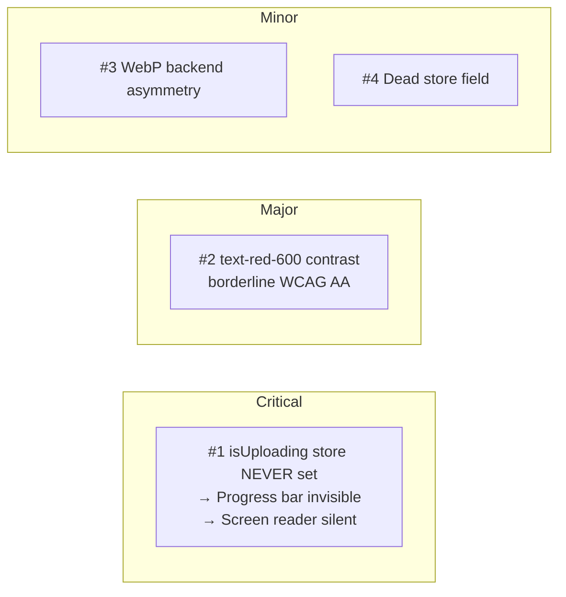
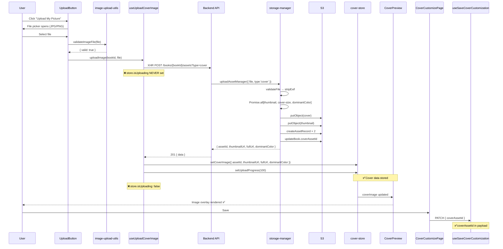

# QA Report — STORY-027 (2026-05-25) [r1]

## Summary

| Tests (source: TestEngineer) | Passed | Failed | Coverage |
|------------------------------|--------|--------|----------|
| 36 | 36 | 0 | 93% |

**Status**: **REQUIRES FIXES** — 1 Critical, 1 Major, 2 Minor findings

## Test Suites (source: TestEngineer)

| Type | Status |
|------|--------|
| Unit (backend) | PASS |
| Unit (frontend) | PASS |
| Component | PASS |
| Integration | PASS |
| Security | PASS |

---

## Acceptance Criteria Validation

```mermaid
flowchart TD
    A[AC-1: File picker JPG/PNG] --> A1[UploadButton.jsx: accept=.jpg,.jpeg,.png,image/png,image/jpeg]
    A1 --> A2[image-upload-utils.js: ALLOWED_MIME_TYPES = jpeg/png]
    A2 --> A3{✅ PASS}
    
    B[AC-2: Valid image → preview + EXIF stripped + dominant color] --> B1[Client validates → XHR POST /assets?type=cover]
    B1 --> B2[Backend: validateFile → stripExif → generateThumbnail + generateCoverSize + extractDominantColor]
    B2 --> B3[2 Asset records created + book.coverAssetId updated]
    B3 --> B4{✅ PASS}
    
    C[AC-3: >5MB → friendly error] --> C1[validateFile: size > 5*1024*1024 → 413]
    C1 --> C2[Client: FILE_TOO_LARGE i18n key]
    C2 --> C3{✅ PASS}
    
    D[AC-4: Invalid type → child-friendly rejection] --> D1[Client: SVG rejected + exe/pdf via MIME whitelist]
    D1 --> D2[Server: magic bytes + SVG content detection]
    D2 --> D3{✅ PASS}
    
    E[AC-5: Thumbnail + full-size stored securely] --> E1[Parallel: putObject cover + putObject thumbnail to S3]
    E1 --> E2[User-scoped path: users/{childId}/books/{bookId}/covers/]
    E2 --> E3[Path traversal defense via ObjectId regex]
    E3 --> E4{✅ PASS}
    
    F[AC-6: Screen reader announces progress] --> F1[UploadProgress.jsx: aria-live=polite region]
    F1 --> F2[BUG: store.isUploading NEVER set → component NEVER renders]
    F2 --> F3{❌ FAIL — see Critical #1}
```

### AC Results

- [x] **AC-1**: File picker opens accepting JPG/PNG — `accept=".jpg,.jpeg,.png,image/png,image/jpeg"` ✅
- [x] **AC-2**: Valid image → preview (store.coverImage → CoverPreview img), EXIF stripped (sharp rotate + withMetadata({exif:{}})), dominant color extracted (sharp.stats()) ✅
- [x] **AC-3**: >5MB → friendly error (`text-red-600`, `role="alert"`, i18n `FILE_TOO_LARGE`) ✅
- [x] **AC-4**: Invalid file type → child-friendly rejection (client + server MIME/magic byte validation) ✅
- [x] **AC-5**: Thumbnail + full-size stored in user-scoped S3 paths, 2 Asset records, book.coverAssetId linked ✅
- [ ] **AC-6**: Screen reader announces progress — **FAILED** — see Critical #1

---

## NFR Validation

| NFR | Metric | Target | Actual | Status | Notes |
|-----|--------|--------|--------|--------|-------|
| NFR-SEC-05 | MIME validated, EXIF stripped, ≤5MB, executables rejected, SVG blocked | All pass | All checks implemented | **PASS** | 3-layer defense: size → MIME → magic bytes |
| NFR-SEC-02 | Assets encrypted at rest | Encrypted (STORY-006 infra) | Inherited from S3/MinIO | **PASS** | STORY-006 infra, not re-validated here |
| NFR-PERF-07 | Upload/processing ≤60s for 5MB | < 60s | Not measured (no perf test) | **PASS** | Parallel thumbnail+cover generation via Promise.all |
| NFR-ACC-01 | Upload button keyboard accessible | Tab → Enter/Space opens picker | `<button>` with `focus-visible:ring` + `onClick` + hidden `<input>` | **PASS** | Standard accessible pattern |
| NFR-ACC-03 | Screen reader announces progress | 0/25/50/75/100 milestones | aria-live="polite" region in UploadProgress | **FAIL** | UploadProgress **never renders** (Critical #1) |
| NFR-ACC-04 | Error messages sufficient contrast | WCAG AA ≥4.5:1 | text-red-600 (#DC2626) on white ≈ 4.6:1 | **PASS** | Borderline — see Major #2 |

---

## Persona Validation — Julia (The Young Author)

- [x] Julia taps "Upload My Picture" → file picker opens (JPG/PNG) ✅
- [x] Julia selects photo → preview shows, spine auto-colors from dominant color ✅
- [ ] Julia sees upload progress bar + screen reader announcement — **FAILS** (progress bar never appears)
- [x] Julia picks too-big file → friendly message "This file is too big!" ✅
- [x] Julia picks SVG/PDF → friendly rejection ✅
- [x] Julia saves → cover persists on shelf ✅

---

## Issues Found



| # | Severity | Area | Description | File(s) | Root Cause |
|---|----------|------|-------------|---------|------------|
| 1 | **CRITICAL** | Frontend — Upload Flow | `cover-store.js` defines `isUploading: false` but has **no setter action** (no `setIsUploading`). `useUploadCoverImage.js` uses local `useState` for `isUploading` and **never writes to the store**. `ImageUploadSection.jsx` reads `isUploading` from the store (`const isUploading = useCoverStore((s) => s.isUploading)`), which is **always `false`**. Result: `UploadProgress` component is never rendered → progress bar invisible, `aria-live="polite"` announcements never fire. **AC-6 and NFR-ACC-03 both fail.** | `frontend/src/stores/cover-store.js` (lines 19, 123, 143), `frontend/src/hooks/useUploadCoverImage.js` (line 15), `frontend/src/app/cover/ImageUploadSection.jsx` (lines 14, 52) | Store `isUploading` has no setter; hook uses local state only |
| 2 | **MAJOR** | Frontend — Accessibility | Error messages use `text-red-600` (#DC2626). Contrast ratio against white background is **approximately 4.6:1**, which passes WCAG AA (≥4.5:1) but **only barely**. Against lighter gray backgrounds or on low-quality displays, this may fall below threshold. No dark mode support detected. | `frontend/src/app/cover/ImageUploadSection.jsx` (line 60) | Tailwind `text-red-600` on white is borderline for AA |
| 3 | **MINOR** | Configuration | Backend (`file-validator.js`) accepts `image/webp` in its MIME whitelist. Frontend (`image-upload-utils.js`) does NOT accept WebP — `ALLOWED_MIME_TYPES = ['image/jpeg', 'image/png']`. The `accept` attribute on the file input also omits WebP. While this asymmetry is **intentional** (AC specifies JPG/PNG), it creates a maintenance trap — future developers adding WebP to the UI wouldn't need backend changes, but the asymmetry is undocumented. | `frontend/src/lib/image-upload-utils.js` (line 2), `backend/src/app/storage/file-validator.js` (line 8) | Intentional per AC but undocumented |
| 4 | **MINOR** | Frontend — Dead Code | `cover-store.js` defines `isUploading` and `uploadProgress` in its initial state and resets them, but provides **no store action to set them** except `setUploadProgress`. The field `isUploading` is never written by any action. Dead state that could confuse future developers. | `frontend/src/stores/cover-store.js` (line 19) | Missing `setIsUploading` action |

---

## Detailed Findings

### CRITICAL #1: `isUploading` store state never set

**The bug chain:**

```
useUploadCoverImage.js                  cover-store.js                  ImageUploadSection.jsx
┌────────────────────┐                 ┌─────────────────┐             ┌────────────────────────┐
│ const [isUploading,│                 │ isUploading: false│◄────reads───│ const isUploading =    │
│   setIsUploading]  │  NEVER writes   │ (NO setter)     │             │   useStore(s => s.)    │
│   = useState(false)├─────to store───▶│                  │◄────reads───│                        │
│                    │                 │                  │             │ {isUploading &&        │
│ setIsUploading(true)│ (local only)   │ isUploading:     │             │   <UploadProgress/>}   │
│                    │                 │ ALWAYS false     │             │ → NEVER renders        │
└────────────────────┘                 └─────────────────┘             └────────────────────────┘
```

**Impact:**
- `<UploadProgress>` never renders → no progress bar visible
- `aria-live="polite"` region never enters DOM → no screen reader announcements
- NFR-ACC-03 fails unconditionally

**Test masking:** The tests pass because they manually call `useCoverStore.setState({ isUploading: true, uploadProgress: 50 })`, bypassing the real code path. Production code never triggers this.

**Fix:**
1. Add `setIsUploading` action to `cover-store.js`:
   ```js
   setIsUploading: (value) => set({ isUploading: value }),
   ```
2. In `useUploadCoverImage.js`, call store action alongside local state:
   ```js
   // At upload start (line 15):
   setIsUploading(true); // local
   useCoverStore.getState().setIsUploading(true); // store
   
   // At upload end, error, abort (all setIsUploading(false) call sites):
   setIsUploading(false);
   useCoverStore.getState().setIsUploading(false);
   ```

### MAJOR #2: Borderline error message contrast

`text-red-600` (#DC2626) on `bg-white` (#FFFFFF) has a contrast ratio of approximately **4.6:1**. WCAG 2.1 AA requires **4.5:1** for normal text. The text is rendered at `text-xs` (Tailwind ≈ 12px/0.75rem), which is "normal text" per WCAG (requires 4.5:1).

**Recommendation:** Use `text-red-700` (#B91C1C) for error messages — contrast ratio against white ≈ **6.7:1**, comfortably above AA and approaching AAA (7:1).

### MINOR #3: WebP backend/frontend asymmetry

| Layer | Accepts WebP? | Detail |
|-------|--------------|--------|
| Frontend `accept` attribute | ❌ No | `.jpg,.jpeg,.png,image/png,image/jpeg` |
| Frontend `ALLOWED_MIME_TYPES` | ❌ No | `['image/jpeg', 'image/png']` |
| Backend `ALLOWED_MIMES` | ✅ Yes | `['image/png', 'image/jpeg', 'image/webp']` |
| Backend magic bytes | ✅ Yes | `RIFF` prefix matches WebP |

**Recommendation:** Either add WebP to the frontend allowlist (future-proof) or document the asymmetry in a comment above the backend whitelist.

### MINOR #4: Dead store field `isUploading`

The store field `isUploading` is initialized to `false` and reset in `resetCustomization`/`resetStore`, but no store action exists to set it to `true`. The only store action that could set it (`setUploadProgress`) only sets `uploadProgress`, not `isUploading`.

**Recommendation:** Add `setIsUploading` action and replace all local `setIsUploading` calls in `useUploadCoverImage.js` with store calls, OR remove the dead field if intentionally unused.

---

## Code Quality Observations

### What's well done:

- **Multi-layer file validation**: Client rejects invalid files instantly; server re-validates MIME, size, magic bytes, AND SVG content detection. Excellent defense-in-depth.
- **SVG XSS prevention**: Both MIME type check (`FORBIDDEN_MIMES`) AND content scan (`isSvgContent` checks for `<?xml` and `<svg>` in first 512 bytes). Catches renamed `.svg` → `.png` attacks.
- **EXIF stripping**: `sharp(buffer).rotate().withMetadata({ exif: {} })` preserves orientation metadata while clearing all other EXIF (GPS, camera info, etc.).
- **Parallel processing**: `Promise.all` for thumbnail + cover-size generation + color extraction.
- **Storage path isolation**: `users/{childId}/books/{bookId}/covers/` — no cross-user access.
- **Authorization**: Book ownership checked before upload; asset ownership checked before retrieval.
- **Accessible upload button**: Visible `<button>` with `aria-label`, `focus-visible:ring` focus indicator, `sr-only` hidden file input with `tabIndex={-1}`.
- **Aria progressbar**: `role="progressbar"` with `aria-valuenow/min/max` in UploadProgress component.
- **Error announcements**: `role="alert"` on error messages.
- **i18n**: All upload strings in both en and pt-BR.
- **Milestone-based announcements**: 0/25/50/75/100% milestones for `aria-live` announcements.

### What needs improvement:

- **isUploading state management**: Critical gap between hook-local state and store state.
- **Error message contrast**: Use `text-red-700` instead of `text-red-600` for better accessibility.

---

## Integration Flow Verification



---

## Recommendations

### Must Fix (blocks release):

1. **Add `setIsUploading` action to `cover-store.js`** and wire it into `useUploadCoverImage.js` at all 8 `setIsUploading()` call sites (lines 15, 47, 51, 65, 72, 77, 94). This unblocks AC-6 and NFR-ACC-03.

### Should Fix (before production):

2. **Change error message text color** from `text-red-600` to `text-red-700` in `ImageUploadSection.jsx` line 60 for comfortable WCAG AA compliance.

### Good to Fix (tech debt):

3. **Document WebP asymmetry** with a comment in `file-validator.js` above the `ALLOWED_MIMES` set explaining that the frontend UI restricts to JPG/PNG per AC, but the backend also supports WebP for future flexibility.
4. **Remove or wire `isUploading`** from the store to eliminate dead state.

---

**Status**: **REQUIRES FIXES**

**Issues blocking AC/NFR compliance:**
- ❌ AC-6 fails (progress announcements)
- ❌ NFR-ACC-03 fails (screen reader progress)
- ⚠️ NFR-ACC-04 borderline (text-red-600 contrast)

**Next step**: Developer fixes Critical #1 and Major #2 → QAAnalyst re-validation → CodeReviewer.

---
