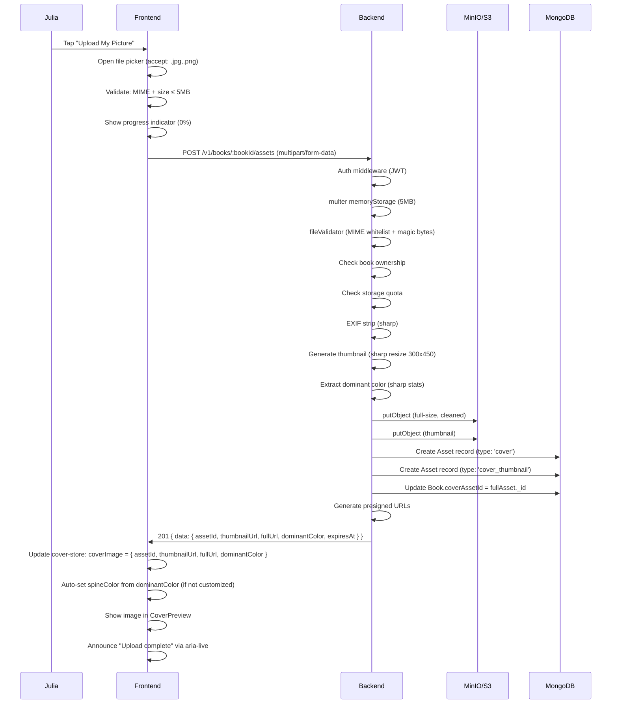
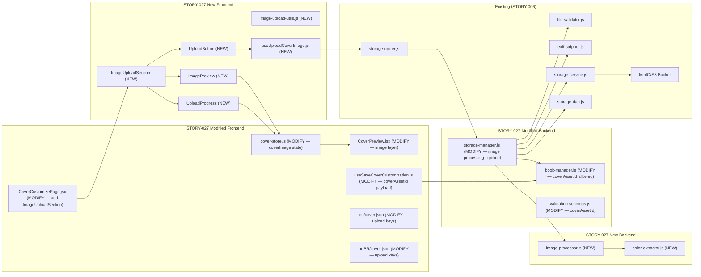
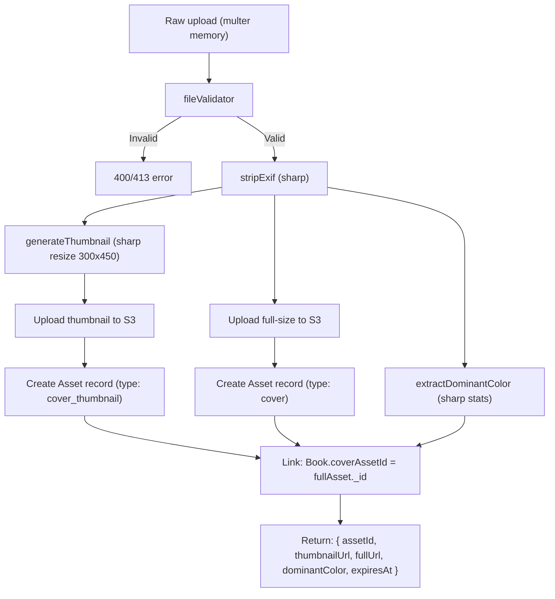
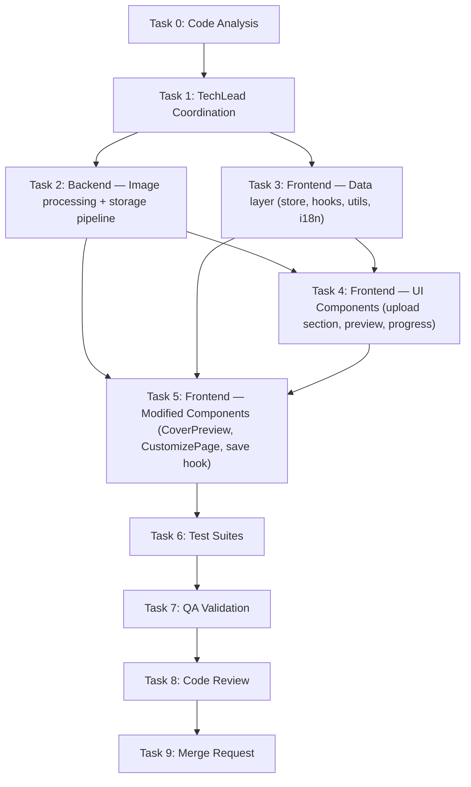

# STORY-027: Image Upload for Cover — Technical Analysis

**Epic**: EPIC-004
**Persona**: Julia — The Young Author
**Dependencies**: STORY-006 (✅ merged — Secure Asset Storage), STORY-022 (✅ merged — Cover Designer Infrastructure)
**Stack Source**: `docs/architecture/TECH-STACK.md`

---

## 1. Story Summary

Julia is in the cover designer and wants to upload her own photo or drawing as the book cover image. Tapping "Upload My Picture" opens a file picker (JPG/PNG, ≤5MB). The image is validated client-side (type + size), uploaded via multipart/form-data, then server-processed: MIME magic-bytes validation, EXIF stripping, thumbnail + full-size generation, dominant color extraction for spine auto-color. The cover preview shows the uploaded image. Accessibility: keyboard-navigable upload button, `aria-live="polite"` for progress announcements. Security: client + server MIME validation, EXIF strip, size cap, encrypted storage, virus scan defense-in-depth.

---

## 2. Stack Detection

| Indicator | Result |
|-----------|--------|
| `package.json`, `vite.config.js` | **Node.js** (JSX, no TS) |
| `react` in deps, `.jsx` files | **React 18** |
| `tailwind.config.js`, Tailwind in deps | **Tailwind CSS 3.x** |
| Zustand + TanStack Query | State: Zustand (client) + React Query (server) |
| i18n: react-i18next | Locales: `en` + `pt-BR` — `cover` namespace exists |
| Backend: Express + Mongoose + multer + sharp + MinIO/S3 | Full storage pipeline ready (STORY-006) |

**Frontend-Backend Integration**: Node.js SPA mode — Vite dev proxy to Express; typed API client via `lib/api-client.js`. Upload uses existing `POST /api/v1/books/:bookId/assets` endpoint from STORY-006.

---

## 3. Existing Codebase (Post STORY-023/024/025/026)

### 3.1 STORY-006 Infrastructure (Already Merged)

STORY-006 built a complete secure asset storage pipeline. Key files:

| File | Purpose | Key Details |
|------|---------|-------------|
| `backend/src/app/storage/storage-router.js` | Upload + download routes | `POST /books/:bookId/assets` (multer memoryStorage, 5MB limit), `GET /assets/:assetId` (302 redirect to presigned URL) |
| `backend/src/app/storage/storage-manager.js` | Business logic | Validates file → checks ownership → checks quota → strips EXIF → uploads to S3 → creates DB record → returns presigned URL |
| `backend/src/app/storage/storage-service.js` | S3/MinIO operations | `putObject()`, `getSignedUrl()`, `deleteObject()` — AES-256 at rest, presigned URLs, `Cache-Control: immutable` |
| `backend/src/app/storage/file-validator.js` | MIME + magic bytes + size | Whitelist: `image/png`, `image/jpeg`, `image/webp`; magic bytes check; max 5MB |
| `backend/src/app/storage/exif-stripper.js` | Sharp EXIF removal | `sharp(buffer).rotate().withMetadata({ exif: {} }).toBuffer()` |
| `backend/src/app/storage/storage-dao.js` | Asset CRUD in MongoDB | `createAssetRecord()`, `findAssetRecordById()`, `hardDeleteAssetRecord()`, `softDeleteAssetsByAuthor()` |
| `backend/src/app/storage/asset-model.js` | Re-export from book-model | Asset schema: `bookId`, `authorId`, `url`, `type` (enum: cover/spine/edge/upload), `mimeType`, `sizeBytes`, `deletedAt` |
| `backend/src/app/storage/storage-config.js` | S3 client init | MinIO/R2-compatible, `contopia-assets` bucket |

### 3.2 Cover Designer Components (STORY-022–026, Merged)

| File | Purpose | Key Details |
|------|---------|-------------|
| `frontend/src/app/cover/CoverCustomizePage.jsx` | Customization page orchestration | Renders CoverPreview + ColorPicker + PatternPicker + SpineSection + EdgeSection + StickerPicker + StickerActions + CustomizeActions |
| `frontend/src/app/cover/CoverPreview.jsx` | CSS-based cover preview | Layered divs: template bg → base color → pattern → stickers → spine → edge → text |
| `frontend/src/stores/cover-store.js` | Zustand store | State: `selectedTemplateId`, `baseColor`, `patternId`, `spineColor`, `spineCustomized`, `edgeColor`, `edgePattern`, `edgeCustomized`, `stickers`, `coverTitle`, `selectedStickerId` |
| `frontend/src/hooks/useSaveCoverCustomization.js` | TanStack mutation | PATCH `/v1/books/:bookId` with all cover fields |
| `frontend/src/lib/api-client.js` | Axios client with auth | Base URL `/api`, Bearer token, 401 auto-refresh |
| `frontend/src/i18n/locales/en/cover.json` | English translations | Templates, colors, patterns, spine, edge, stickers, aria labels |
| `backend/src/app/book/book-model.js` | Book + Asset schemas | `coverAssetId` field (ObjectId ref Asset, default null); Asset type enum includes `'cover'` |
| `backend/src/app/book/book-manager.js` | Book business logic | `allowedFields` includes all cover fields but NOT `coverAssetId` — needs update for STORY-027 |

### 3.3 Key Observation: coverAssetId

The Book schema already has a `coverAssetId` field (ObjectId ref Asset, default null). The Asset schema's `type` enum includes `'cover'`. However, `coverAssetId` is NOT in the `allowedFields` list of `updateBookManager()`. STORY-027 needs to:

1. **Upload**: Use `POST /books/:bookId/assets` (STORY-006 endpoint, `type: 'cover'`)
2. **Process**: Generate thumbnail + full-size, extract dominant color
3. **Link**: Update book's `coverAssetId` with the uploaded asset's `_id`
4. **Display**: Frontend fetches presigned URL and shows the image in CoverPreview

---

## 4. Architecture & Flow

### 4.1 Upload Flow (End-to-End)



### 4.2 Component Tree (Additions from STORY-027)

```
CoverCustomizePage
├── CoverPreview (MODIFY — add image layer after pattern, before stickers)
│   ├── Template bg
│   ├── Base color overlay
│   ├── Pattern overlay
│   ├── Sticker layer
│   ├── Uploaded Image overlay (NEW — if coverImage exists in store)
│   ├── Inline SpinePreview (8% width)
│   ├── Edge strip (4-6px)
│   └── Cover text layer
├── ColorPickerPanel (existing)
├── PatternPickerPanel (existing)
├── SpineCustomizeSection (existing)
├── EdgeCustomizeSection (existing)
├── ImageUploadSection (NEW)
│   ├── UploadButton (NEW — "Upload My Picture" button + file input)
│   ├── UploadProgress (NEW — linear/circular progress with aria-live)
│   └── ImagePreview (NEW — thumbnail of uploaded image with remove button)
├── StickerPickerPanel (existing)
├── StickerActions (existing)
└── CustomizeActions (existing — MODIFY: include coverImage in save payload)
```

### 4.3 Impacted Components Diagram



### 4.4 Image Processing Pipeline (Backend)



### 4.5 Dominant Color → Spine Color Auto-Link

When `dominantColor` is extracted from the uploaded image:
1. Frontend receives `dominantColor` in the upload response
2. `cover-store` receives `dominantColor` and stores it as `coverImageDominantColor`
3. If `spineCustomized === false`, the effective spine color becomes the `dominantColor` (overriding the current derivation)
4. If `spineCustomized === true`, the dominant color is stored but not applied — user's explicit spine color choice wins
5. On save, the `dominantColor` is NOT persisted to Book schema — it's derived at upload time and cached in the store for the session

---

## 5. Technical Decisions & Trade-offs

### 5.1 Upload Architecture: Extend Existing Endpoint vs New Endpoint

| Option | Pros | Cons |
|--------|------|------|
| **Extend `POST /books/:bookId/assets`** (CHOSEN) | Reuses existing security pipeline (validation, EXIF strip, storage); STORY-006 already handles auth, ownership, quota; single upload infrastructure | Need to add image processing (thumbnail, color) to the pipeline; `type: 'cover'` Asset already supported |
| New `/books/:bookId/cover-image` endpoint | Can tailor response specifically for covers | Duplicate code with STORY-006 pipeline; maintenance burden; divergent security handling |

**Decision**: Extend the existing `POST /books/:bookId/assets` endpoint. When `type=cover` (default for this story), the manager runs additional processing: thumbnail generation, dominant color extraction, and linking `coverAssetId` on the Book. This keeps a single secure upload pipeline while adding cover-specific behavior.

### 5.2 Image Processing: Server-Side vs Client-Side

| Option | Pros | Cons |
|--------|------|------|
| **Server-side with sharp** (CHOSEN) | No browser compatibility issues; consistent results; virus/malware scanning possible at server; EXIF strip + thumbnail + color in one pipeline; no client dependency on Canvas API | Server CPU cost; async processing adds latency; thumbnail + full = 2 S3 puts |
| Client-side (Canvas API) | Instant thumbnail preview; reduced bandwidth (resize before upload) | No EXIF strip guarantee; inconsistent cross-browser; no virus scan; can't extract color without server round-trip anyway |

**Decision**: Server-side processing with `sharp`. The existing `exif-stripper.js` already uses sharp. We extend the pipeline with thumbnail generation and color extraction — all in the same sharp processing pass. Client does lightweight validation only (file type + size check before upload to provide instant feedback).

### 5.3 Thumbnail + Full-Size Storage Strategy

| Option | Pros | Cons |
|--------|------|------|
| **Two separate Asset records** (type: `cover` + `cover_thumbnail`) (CHOSEN) | Clean data model; each asset has own presigned URL; thumbnails can have different cache/CDN configs; easy to delete individually | Two S3 puts per upload; two DB records |
| Single Asset with two S3 keys | Fewer DB records | Non-standard asset model; harder to manage thumbnails independently |

**Decision**: Two Asset records. The full-size image is `type: 'cover'` and the thumbnail is `type: 'cover_thumbnail'`. Both reference the same `bookId`. The Book's `coverAssetId` points to the *full-size* asset. Thumbnails are derived — they don't have a separate field on Book.

### 5.4 Dominant Color Extraction Library

| Option | Pros | Cons |
|--------|------|------|
| **sharp `stats()` (channel histogram)** (CHOSEN) | Already using sharp for EXIF strip + thumbnail; no new dependency; fast; extracts average RGB which is sufficient for spine auto-color | Average color may not match perceived dominant color for multi-colored images |
| `node-vibrant` | Extracts full palette with dominant color; industry-standard | New dependency; heavier; async processing; needs separate buffer pass |
| `color-thief` | Simple, well-known | Additional dependency; similar limitations to node-vibrant |

**Decision**: Use sharp's built-in `stats()` method, which provides channel means (average R, G, B). After EXIF stripping, a single `sharp(buffer).stats()` call gives us the average color. We convert to hex for the spine. This avoids any new dependency and integrates into the existing sharp pipeline. If a more sophisticated color palette is needed later, `node-vibrant` can be added as an enhancement.

**Algorithm**:
```js
async function extractDominantColor(buffer) {
  const stats = await sharp(buffer).stats();
  const [r, g, b] = stats.channels.map(c => Math.round(c.mean));
  return `#${r.toString(16).padStart(2, '0')}${g.toString(16).padStart(2, '0')}${b.toString(16).padStart(2, '0')}`;
}
```

### 5.5 Frontend State Management: coverImage in Cover Store

| Option | Pros | Cons |
|--------|------|------|
| **Add coverImage object to cover-store** (CHOSEN) | Consistent with existing pattern (all cover state in one store); `coverImage` includes `{ assetId, thumbnailUrl, fullUrl, dominantColor }`; easy to persist on save | Slightly larger store |
| Separate `useUploadCoverImage` hook with local state | Separation of concerns | Two sources of truth for cover state; harder to coordinate save + preview |

**Decision**: Add `coverImage` to `cover-store.js`. The upload hook (`useUploadCoverImage`) calls the storage API, then updates the store. On save, `useSaveCoverCustomization` includes `coverAssetId` (from `coverImage.assetId`) in the PATCH payload.

### 5.6 Upload Progress: XMLHttpRequest vs fetch with Streams

| Option | Pros | Cons |
|--------|------|------|
| **XMLHttpRequest with onprogress** (CHOSEN) | Widely supported; `onprogress` event gives upload progress percentage; simple implementation; works with axios if using xhr adapter | Slightly older API; not available in fetch |
| fetch with ReadableStream | Modern API | Upload progress not widely supported; requires `request.body` streaming which isn't standardized; requires `setTimeout` + Content-Length math |

**Decision**: Use XMLHttpRequest via a thin wrapper for progress. The `useUploadCoverImage` hook creates an `XMLHttpRequest` directly (not through axios) to get `onprogress` events. The response is parsed as JSON manually. This gives us reliable progress tracking (0%, 25%, 50%, 75%, 100%) for `aria-live` announcements.

### 5.7 coverAssetId Update: Separate API Call vs Part of Upload Response Flow

| Option | Pros | Cons |
|--------|------|------|
| **Include in upload flow** (CHOSEN) | Atomic operation: upload → process → create assets → link book in one server call; no race condition where book has an uploaded image but no link | Upload endpoint now does two things (upload + update book) |
| Separate PATCH call after upload | Clean separation of concerns | Race condition: image uploaded but book not updated; requires two round-trips; frontend must handle partial failure |

**Decision**: The `uploadAssetManager` function (extended) will atomically: upload files → create asset records → update `Book.coverAssetId`. The frontend makes one `POST` request. If any step fails, the entire transaction is rolled back (or best-effort cleanup).

### 5.8 Client-Side Image Validation

To provide instant, child-friendly feedback before the network round-trip, the frontend validates:

- **File type**: `accept=".jpg,.jpeg,.png"` on the `<input type="file">`; additionally check `file.type` startsWith `image/` and is PNG or JPEG
- **File size**: `file.size <= 5 * 1024 * 1024`; show friendly message if exceeded
- **No SVG**: Reject `image/svg+xml` explicitly (security: no embedded scripts)
- **Visual preview**: Generate a local `URL.createObjectURL(file)` for immediate preview before upload completes

---

## 6. Implementation Steps (Checklist)

### Phase 1: Backend — Image Processing Pipeline

- [ ] **1.1** Create `backend/src/app/storage/image-processor.js` — `generateThumbnail(buffer, width=300, height=450)` using sharp, returns `{ buffer, width, height, format }`; `generateCoverSize(buffer, width=600, height=900)` using sharp; both strip EXIF (reuse exif-stripper logic via sharp pipeline)
- [ ] **1.2** Create `backend/src/app/storage/color-extractor.js` — `extractDominantColor(buffer)` using `sharp(buffer).stats()`, returns hex color string; `isLightColor(hex)` helper for text contrast
- [ ] **1.3** Modify `backend/src/app/storage/storage-manager.js` — extend `uploadAssetManager()` to:
  - Accept optional `type` parameter (default: `'upload'`, cover images: `'cover'`)
  - When `type === 'cover'`: after EXIF strip, run `generateThumbnail()` + `extractDominantColor()`, upload both full-size and thumbnail to S3, create two Asset records, update `Book.coverAssetId` with full-size asset ID, return `{ assetId, thumbnailUrl, fullUrl, dominantColor, expiresAt }`
- [ ] **1.4** Modify `backend/src/app/storage/storage-router.js` — add `type` query parameter to `POST /books/:bookId/assets` (default: `'upload'`, cover upload: `'cover'`); pass to manager
- [ ] **1.5** Modify `backend/src/app/book/book-manager.js` — add `coverAssetId` to `allowedFields` in `updateBookManager()`
- [ ] **1.6** Modify `backend/src/app/common/validation-schemas.js` — add `coverAssetId: z.string().regex(objectIdRegex).optional().nullable()` to `bookUpdateSchema`
- [ ] **1.7** Add upload error for SVG/XSS: modify `file-validator.js` to explicitly reject SVG MIME (`image/svg+xml`) and check for SVG magic bytes (`<svg`, `<?xml`)
- [ ] **1.8** Backend unit test: `image-processor.js` — thumbnail generation (correct dimensions, format), cover size generation, EXIF stripped in output
- [ ] **1.9** Backend unit test: `color-extractor.js` — extractDominantColor from various images, isLightColor for dark/light colors
- [ ] **1.10** Backend integration test: `POST /books/:bookId/assets?type=cover` — upload flow returns `{ assetId, thumbnailUrl, fullUrl, dominantColor }`; book `coverAssetId` updated; thumbnail asset created

### Phase 2: Frontend — Data Layer

- [ ] **2.1** Create `frontend/src/lib/image-upload-utils.js` — client-side validation: `validateImageFile(file)` → `{ valid, error, errorCode }` where error codes: `FILE_TOO_LARGE`, `INVALID_TYPE`, `SVG_NOT_ALLOWED`; `getImagePreviewUrl(file)` → object URL for preview; `cleanupPreviewUrl(url)` → `URL.revokeObjectURL()`
- [ ] **2.2** Create `frontend/src/hooks/useUploadCoverImage.js` — custom hook using XMLHttpRequest for progress tracking:
  - `uploadImage(bookId, file)` → returns `{ data, error }`
  - `progress` state: 0–100 percentage
  - `isUploading` state
  - On success: update `cover-store.coverImage` with `{ assetId, thumbnailUrl, fullUrl, dominantColor }`; if `!spineCustomized`, auto-set `dominantColor` as spine color candidate
  - On error: set `uploadError` with child-friendly message (mapped from error codes)
  - Abort controller for cancellation
- [ ] **2.3** Extend `frontend/src/stores/cover-store.js` — add:
  - `coverImage: null` (shape: `{ assetId, thumbnailUrl, fullUrl, dominantColor }`)
  - `isUploading: false`
  - `uploadProgress: 0`
  - `uploadError: null`
  - `setCoverImage(data)` action
  - `setUploadProgress(percent)` action
  - `setUploadError(error)` action
  - `clearCoverImage()` action (removes uploaded image)
  - Add `coverImage.dominantColor` to `getEffectiveSpineColor()` fallback chain (after spineColor, before coverColor)
  - Add `coverImage` and `coverAssetId` to `resetCustomization()` and `resetStore()`
- [ ] **2.4** Modify `frontend/src/hooks/useSaveCoverCustomization.js` — add `coverAssetId` to PATCH payload (from `coverImage.assetId`)
- [ ] **2.5** Add i18n keys to `frontend/src/i18n/locales/en/cover.json` — upload section: `upload.sectionHeading`, `upload.buttonLabel`, `upload.previewAlt`, `upload.removeButton`, `upload.progressAnnouncement`, `upload.completeAnnouncement`, `upload.errors.FILE_TOO_LARGE`, `upload.errors.INVALID_TYPE`, `upload.errors.SVG_NOT_ALLOWED`, `upload.errors.UPLOAD_FAILED`, `upload.errors.PROCESSING_ERROR`
- [ ] **2.6** Add i18n keys to `frontend/src/i18n/locales/pt-BR/cover.json` — same keys in Portuguese (e.g., "Enviar Minha Foto", "Arquivo muito grande!", "Só aceitamos fotos (PNG, JPG).", etc.)

### Phase 3: Frontend — UI Components (New)

- [ ] **3.1** Create `frontend/src/app/cover/ImageUploadSection.jsx` — section container with heading from i18n; renders UploadButton, UploadProgress, ImagePreview conditionally; reads from cover-store
- [ ] **3.2** Create `frontend/src/app/cover/UploadButton.jsx` — `<button>` styled as primary action ("Upload My Picture") with hidden `<input type="file" accept=".jpg,.jpeg,.png,image/png,image/jpeg">`; triggers `validateImageFile()` then `uploadImage()`; `aria-label` from i18n; disabled during upload; keyboard accessible
- [ ] **3.3** Create `frontend/src/app/cover/UploadProgress.jsx` — linear progress bar with percentage text; `aria-live="polite"` announces progress at 0%, 25%, 50%, 75%, 100%; `role="progressbar"`, `aria-valuenow`, `aria-valuemin=0`, `aria-valuemax=100`; smooth CSS transition; success state (green) and error state (red)
- [ ] **3.4** Create `frontend/src/app/cover/ImagePreview.jsx` — Shows thumbnail of uploaded image from `cover-store.coverImage.thumbnailUrl`; "Remove" button (trash icon) that calls `clearCoverImage()` and resets `coverAssetId`; `alt` text from i18n; loading skeleton while thumbnail loads

### Phase 4: Frontend — UI Components (Modified)

- [ ] **4.1** Modify `frontend/src/app/cover/CoverPreview.jsx` — add image overlay layer: if `coverImage` exists in store, render `` with `src={coverImage.fullUrl || coverImage.thumbnailUrl}`, positioned after pattern layer, before sticker layer; `object-fit: cover`, `width: 100%`, `height: 100%`; `alt=""` (decorative — described in parent); `loading="lazy"` for full-size URL
- [ ] **4.2** Modify `frontend/src/app/cover/CoverCustomizePage.jsx` — add `ImageUploadSection` after `EdgeCustomizeSection` (or before sticker section); initialize `coverImage` from `book.coverAssetId` on load (fetch presigned URL from `GET /v1/assets/:assetId`)
- [ ] **4.3** Modify `frontend/src/stores/cover-store.js` — add `getEffectiveSpineColor()` logic: if `!spineCustomized && coverImage?.dominantColor`, return `dominantColor` (overrides default derivation); this means uploaded image's dominant color auto-applies to spine when spine is not explicitly customized

### Phase 5: Backend — Cover Image Display API

- [ ] **5.1** Modify `backend/src/app/book/book-manager.js` or `book-dao.js` — when fetching a book for editing (via `getBookForEditManager()`), if `book.coverAssetId` exists, populate the asset URL:
  - Fetch the asset record → generate presigned URL
  - Attach `coverImageUrl` and `coverThumbnailUrl` to the response
  - Include `dominantColor` (stored in Asset metadata or re-computed; see 5.2)
- [ ] **5.2** Modify `backend/src/app/storage/asset-model.js` / `backend/src/app/book/book-model.js` — add `dominantColor` (String, hex color) and `width`/`height` (Number) fields to Asset schema for cover assets; stored at upload time so we don't need to re-extract on every read
- [ ] **5.3** Consider: Alternatively, store `dominantColor` on the Book schema as a denormalized field for quick access (avoids join). If Book schema gets `coverDominantColor` field, it can be derived from the uploaded image and persisted once.
  - **Decision**: Store `dominantColor` on the Asset record (as metadata). The `getBookForEditManager` populates the Asset and returns `coverImageUrl` + `coverThumbnailUrl` + `dominantColor`. This avoids schema changes on Book and keeps color data with the image.

### Phase 6: Tests

- [ ] **6.1** Unit test: `image-processor.js` — thumbnail generation returns correct dimensions (300x450), cover size (600x900), output is PNG/JPEG, EXIF metadata removed
- [ ] **6.2** Unit test: `color-extractor.js` — `extractDominantColor()` returns valid hex for various test images; `isLightColor()` returns correct boolean for light/dark hex values
- [ ] **6.3** Unit test: `image-upload-utils.js` — `validateImageFile()` rejects: files >5MB, non-JPG/PNG MIME types, SVG files, .exe renamed to .png; accepts: valid JPG/PNG under 5MB
- [ ] **6.4** Unit test: `cover-store.js` — setCoverImage, clearCoverImage, uploadProgress, uploadError, getEffectiveSpineColor with dominantColor fallback
- [ ] **6.5** Component test: `UploadButton.jsx` — renders button, keyboard accessible (Enter/Space triggers file picker), accept attribute correct, disabled during upload
- [ ] **6.6** Component test: `UploadProgress.jsx` — renders progress bar, aria-live announcements at milestones, role="progressbar", success and error states
- [ ] **6.7** Component test: `ImagePreview.jsx` — renders thumbnail, remove button works, loading state, empty state (no image)
- [ ] **6.8** Component test: `ImageUploadSection.jsx` — integrates UploadButton + UploadProgress + ImagePreview; upload flow end-to-end with mock XHR
- [ ] **6.9** Component test: `CoverPreview.jsx` — renders image overlay when coverImage exists in store; no image overlay when coverImage is null; image positioned correctly (after pattern, before stickers)
- [ ] **6.10** Integration test: `CoverCustomizePage.jsx` — upload flow: click button → validate → upload → progress → preview → save → verify PATCH includes coverAssetId
- [ ] **6.11** Backend integration test: `POST /v1/books/:bookId/assets?type=cover` — full upload flow: creates two assets (cover + thumbnail), updates book coverAssetId, returns dominantColor, presigned URLs valid
- [ ] **6.12** Backend integration test: Upload SVG → rejected with `INVALID_FILE_TYPE`; Upload .exe renamed .png → rejected by magic bytes; Upload 6MB image → rejected with `PAYLOAD_TOO_LARGE`
- [ ] **6.13** Backend integration test: Upload valid JPG → EXIF stripped (verify output buffer has no EXIF); thumbnail dimensions correct; dominantColor returned
- [ ] **6.14** Accessibility test: keyboard-only upload (Tab → Enter → file picker → Tab through progress), screen reader announcements (aria-live at 25/50/75/100%), sufficient contrast on error messages
- [ ] **6.15** Security test: Upload SVG with embedded `<script>` → rejected; Upload polyglot file (PNG header + HTML) → rejected; Upload oversized file → rejected with friendly message

---

## 7. NFR Analysis

| NFR | Requirement | Implementation | Verification |
|-----|------------|----------------|--------------|
| NFR-SEC-05 | MIME validated, EXIF stripped, ≤5MB, executables rejected | Existing `file-validator.js` (MIME whitelist + magic bytes) + extended to reject SVG; `exif-stripper.js` (sharp); multer `limits.fileSize`; client-side validation for instant feedback | Unit tests: file-validator, exif-stripper, integration tests: SVG rejection, oversized file, spoofed extension |
| NFR-SEC-02 | Uploaded assets encrypted at rest | MinIO AES-256 server-side encryption (STORY-006 already configured) | `mc stat` on uploaded objects |
| NFR-PERF-07 | Upload/processing within 60s for 5MB | sharp EXIF strip + thumbnail + color extraction is fast (~1-2s for 5MB); S3 upload depends on connection; progress tracking gives user feedback | Integration test with 5MB file; measure end-to-end timing |
| NFR-ACC-01 | Upload button keyboard accessible | `<button>` + hidden `<input type="file">` with `accept`; focus ring visible; Enter/Space triggers file picker | axe-core + manual keyboard test |
| NFR-ACC-03 | Screen reader announces progress | `aria-live="polite"` on progress region; announcements at 0%, 25%, 50%, 75%, 100% milestones; complete/error announcement | VoiceOver/TalkBack test |
| NFR-ACC-04 | Error messages sufficient contrast | Error text uses `text-red-600` (Tailwind) on white/light background; 4.5:1+ ratio | Contrast checker tool |

---

## 8. Persona Impact

**Julia — The Young Author**:
- "Upload My Picture" is a clear, inviting button — she can use a photo from her device
- Progress bar gives feedback during upload — no mystery about what's happening
- Friendly error messages: "This file is too big! Try a smaller picture." (not "413 Payload Too Large")
- Dominant color auto-applies to spine — her cover and spine match instantly
- Remove button lets her try a different image — no penalty for mistakes
- Screen reader announces upload progress — accessible for visually impaired users

---

## 9. Risks & Mitigations

| Risk | Likelihood | Impact | Mitigation |
|------|------------|--------|------------|
| **Sharp fails to process corrupted/unusual images** | Medium | High (upload fails silently) | Wrap sharp processing in try/catch; return `PROCESSING_ERROR` with child-friendly message; allow retry |
| **Dominant color is inaccurate for multi-colored images** | Medium | Low (spine color mismatch) | Average color from `sharp.stats()` is reasonable for most covers. If needed, add `node-vibrant` later for palette-based extraction |
| **Upload timeout on slow connections** | Medium | Medium | 60s server timeout; client shows progress; allow retry without losing other cover state; XHR abort capability |
| **SVG with embedded script bypasses MIME check** | Low | High (XSS) | Explicit SVG MIME rejection in `file-validator.js`; magic bytes check catches `<?xml` and `<svg` prefixes; EXIF strip with sharp (which doesn't process SVG) |
| **Large image upload fills server memory (multer memoryStorage)** | Medium | Medium | 5MB multer limit; memory usage: ~5MB per concurrent upload; scale with worker threads/cluster if needed; consider streaming to temp file for production scale-up |
| **Presigned URL expires before user saves cover** | Low | Low | 1-hour TTL on presigned URLs; on page load, re-fetch presigned URLs for existing assets; save flow uses `coverAssetId` (not URL) |
| **Thumbnail and full-size get out of sync** | Low | Medium | Atomic upload flow creates both in one transaction; if thumbnail fails, entire upload rolls back; cleanup orphaned S3 objects on failure |

---

## 10. Execution Order & Agent Assignments



| Task | Agent | Description |
|------|-------|-------------|
| 0 | CodeAnalyzer | Analyze existing storage pipeline, cover-store, CoverPreview, book-manager extension points |
| 1 | TechLead | Coordinate all tasks, reference this analysis + PM story + STORY-006/022 analysis |
| 2 | BackendDeveloper | Create `image-processor.js`, `color-extractor.js`; extend `storage-manager.js` for thumbnail + cover type; extend `storage-router.js` for `?type=cover`; add `coverAssetId` to `book-manager.js` allowedFields; add SVG rejection to `file-validator.js`; add `dominantColor` + `width` + `height` to Asset schema |
| 3 | FrontendDeveloperReact | Create `image-upload-utils.js`, `useUploadCoverImage.js`; extend `cover-store.js` with `coverImage` state; extend `useSaveCoverCustomization.js` with `coverAssetId`; add i18n keys for upload section |
| 4 | FrontendDeveloperReact | Build ImageUploadSection, UploadButton, UploadProgress, ImagePreview components; add upload CSS styles |
| 5 | FrontendDeveloperReact | Modify CoverPreview (image layer), CoverCustomizePage (add ImageUploadSection, load existing cover image); extend `getEffectiveSpineColor()` with dominantColor fallback; modify book edit query to include cover image URLs |
| 6 | TestEngineer | Unit tests (backend + frontend), component tests, integration tests, accessibility tests, security tests |
| 7 | QAAnalyst | WCAG audit (keyboard nav, screen reader progress), perf check (upload timing), error handling (oversized, invalid types), full flow (upload → preview → save → reload) |
| 8 | CodeReviewer | Security review (MIME validation, SVG rejection, EXIF stripping, file size limits), accessibility compliance, STORY-006 integration correctness |
| 9 | MergeRequestCreator | Create PR with full traceability |

**Parallelization**: Tasks 2 and 3 CAN run in parallel (backend processing vs frontend data layer). Task 4 depends on Task 3 (needs store + hooks). Task 5 depends on Tasks 2, 3, and 4 (needs backend endpoint + store + components). Tasks 6–9 are sequential.

**Max parallel**: 2 agents (Task 2 + Task 3).

---

## 11. Key File References

### STORY-027 PM Story
- `/docs/stories/STORY-027.md`

### Dependencies (Merged)
- `/docs/stories/STORY-006-technical-analysis.md` — Secure Asset Storage
- `/docs/stories/STORY-022-technical-analysis.md` — Cover Designer UI
- `/docs/stories/STORY-026-technical-analysis.md` — Edge Design

### Backend — To Create
- `/backend/src/app/storage/image-processor.js` — Thumbnail + cover-size generation with sharp
- `/backend/src/app/storage/color-extractor.js` — Dominant color extraction using sharp stats

### Backend — To Modify
- `/backend/src/app/storage/storage-manager.js` — Extend `uploadAssetManager()` for `type=cover` processing
- `/backend/src/app/storage/storage-router.js` — Add `type` query param to upload route
- `/backend/src/app/storage/file-validator.js` — Add SVG rejection (MIME + magic bytes)
- `/backend/src/app/book/book-model.js` — Add `dominantColor`, `width`, `height` to Asset schema
- `/backend/src/app/book/book-manager.js` — Add `coverAssetId` to `allowedFields`; extend `getBookForEditManager()` to populate cover asset URLs + dominantColor
- `/backend/src/app/common/validation-schemas.js` — Add `coverAssetId` to `bookUpdateSchema`

### Frontend — To Create
- `/frontend/src/lib/image-upload-utils.js` — Client-side file validation helpers
- `/frontend/src/hooks/useUploadCoverImage.js` — XHR-based upload hook with progress
- `/frontend/src/app/cover/ImageUploadSection.jsx` — Upload section container
- `/frontend/src/app/cover/UploadButton.jsx` — Upload button + hidden file input
- `/frontend/src/app/cover/UploadProgress.jsx` — Progress bar with aria-live
- `/frontend/src/app/cover/ImagePreview.jsx` — Thumbnail preview + remove button

### Frontend — To Modify
- `/frontend/src/stores/cover-store.js` — Add `coverImage`, `isUploading`, `uploadProgress`, `uploadError` state + actions; extend `getEffectiveSpineColor()` with dominantColor fallback
- `/frontend/src/app/cover/CoverPreview.jsx` — Add image overlay layer (after pattern, before stickers)
- `/frontend/src/app/cover/CoverCustomizePage.jsx` — Add ImageUploadSection; load existing coverImage from book data
- `/frontend/src/hooks/useSaveCoverCustomization.js` — Add `coverAssetId` to PATCH payload

### Existing (Reference Only — STORY-006)
- `/backend/src/app/storage/storage-service.js` — S3 operations (unchanged)
- `/backend/src/app/storage/storage-config.js` — S3 config (unchanged)
- `/backend/src/app/storage/exif-stripper.js` — EXIF stripping (called inside image-processor pipeline)
- `/backend/src/app/storage/storage-dao.js` — Asset CRUD (unchanged)

### Existing (Reference Only — Cover Designer)
- `/frontend/src/lib/spine-color-utils.js` — Derivation pattern for dominantColor fallback
- `/frontend/src/lib/edge-utils.js` — Derivation pattern reference
- `/frontend/src/lib/cover-templates.js` — Template data reference
- `/frontend/src/lib/api-client.js` — API client (upload uses XHR directly, not api-client)

### Tech Stack
- `/docs/architecture/TECH-STACK.md`