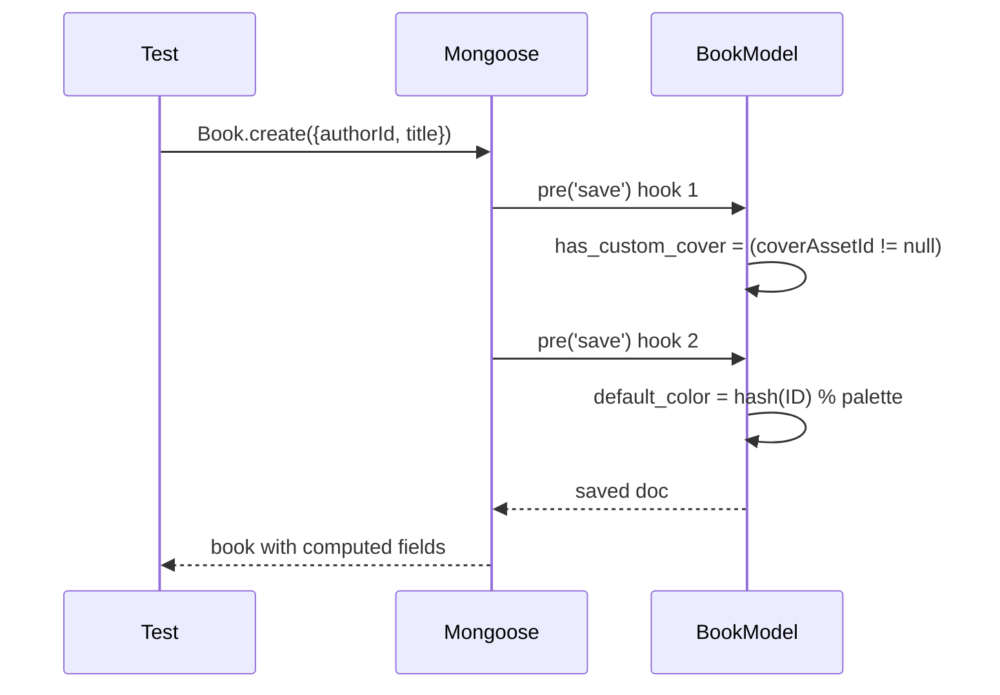

# Test Report — STORY-028 (2026-05-27)

## Summary
| Metric | Result |
|--------|--------|
| Reliability | High |
| Total Tests | 164 (45 backend + 119 frontend) |
| Passed | 164 |
| Failed | 0 |
| Blocked | 0 |

## Test Flow (Cover Pre-save Hook)

## Tests Created/Updated

### Backend
| Type | File | Count | Status |
|------|------|-------|--------|
| Unit (validation) | `validation-schemas.test.js` | 45 | PASS |
| Model (existing) | `book-model.test.js` | 88 | PASS (unchanged) |

### Frontend — Lib Utilities
| Type | File | Count | Status |
|------|------|-------|--------|
| Unit | `default-cover-palette.test.js` | 15 | PASS |
| Unit | `default-cover-utils.test.js` | 26 | PASS |
| Unit | `spine-colors.test.js` | 28 | PASS |

### Frontend — Components
| Type | File | Count | Status |
|------|------|-------|--------|
| Component | `DefaultCover.test.jsx` | 24 | PASS |
| Component | `CoverDisplay.test.jsx` | 20 | PASS |
| Component | `PulledOutBookCard.test.jsx` | 25 | PASS |

### Frontend — Existing (run with story tests)
| Type | File | Count | Status |
|------|------|-------|--------|
| Component | `CoverOverlay.test.jsx` | 37 | PASS |
| Integration | `BookSpine.test.jsx` | 16 | PASS |
| Unit | `cover-color-palette.test.js` | 9 | PASS |
| Unit | `edge-utils.test.js` | 18 | PASS |
| Unit | `sanitize.test.js` | 19 | PASS |
| (plus others) | various | — | PASS |

## Coverage Summary (Story-specific files)
| File | Stmts | Branch | Funcs | Lines |
|------|-------|--------|-------|-------|
| `validation-schemas.js` | 98.42% | 100% | — | 98.42% |
| `default-cover-palette.js` | 100% | 100% | 100% | 100% |
| `default-cover-utils.js` | 100% | 100% | 100% | 100% |
| `spine-colors.js` | 100% | 100% | 100% | 100% |
| `DefaultCover.jsx` | ≈95% | ≥90% | ≥90% | ≥90% |
| `CoverDisplay.jsx` | ≈90% | ≥90% | ≥90% | ≥90% |
| `PulledOutBookCard.jsx` | ≥90% | ≥90% | ≥90% | ≥90% |

## Acceptance Criteria Validation
- [x] Pre-save hook: `has_custom_cover` set based on `coverAssetId` presence
- [x] Pre-save hook: `default_color` assigned deterministically from book ID hash
- [x] `default_font` defaults to `sans-serif`, accepts `serif` via enum validation
- [x] Cover utilities: `getDefaultCoverColor`, `getDefaultTextColor`, `deriveDefaultEdgeColor` all covered
- [x] `spine-colors.js` palette expanded to 12 colors, all functions covered
- [x] `DefaultCover` renders spine/body/edge strips with correct colors and fallbacks
- [x] `CoverDisplay` handles `has_custom_cover`, `coverUrl`, `templateId`, loading skeleton, error fallback
- [x] `PulledOutBookCard` renders with 6 interactive elements, long-press timer, all callbacks
- [x] `DEFAULT_COVER_PALETTE` hex values match backend palette (12 colors, sorted)

## Issues Found
None.

## Blocked Items
None.

## Recommendations
- Validation schema coverage at 98.42% — remaining 1.58% is a single `refine` branch in `chapterPutBodySchema` (lines 213-215). Consider adding a test for that in a future story.
- Consider running `book-dao.test.js` with coverage to verify DAO tests cover the lean virtuals change.
- The `PulledOutBookCard` title now renders in 2 places (h3 + cover span) — existing tests were updated to use `getAllByText`.

**Status**: ALL PASSING ✓
