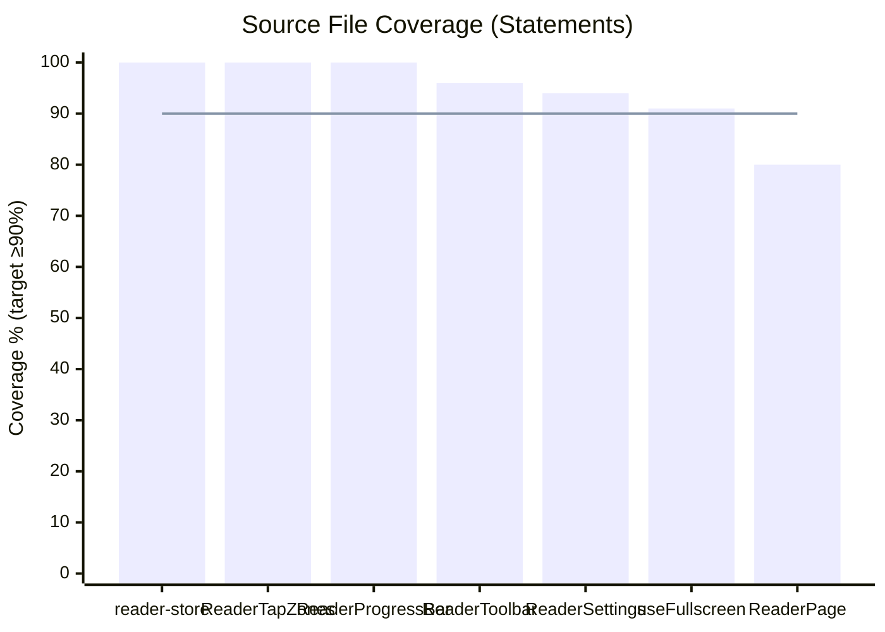
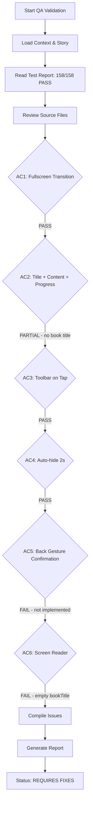

# QA Report — STORY-029 (2026-05-28) [r1]

## Summary
| Tests | Passed | Failed | Coverage |
|-------|--------|--------|----------|
| 158 | 158 | 0 | See per-file below |

**Source: TestEngineer v1 (all 158 tests passing; no file modifications detected since report timestamp)**

## Test Suites
| Type | Status | Notes |
|------|--------|-------|
| Unit (reader-store) | PASS | 49 tests, 100% stmts/funcs/branches |
| Unit (useFullscreen) | PASS | 22 tests, 91% stmts, 50% funcs, 100% branches |
| Integration (ReaderPage) | PASS | 28 tests, 80% stmts, 100% funcs, 70% branches |
| Unit (ReaderToolbar) | PASS | 17 tests, 96% stmts, 100% funcs, 81% branches |
| Unit (ReaderProgressBar) | PASS | 11 tests, 100% stmts, 100% funcs, 80% branches |
| Unit (ReaderTapZones) | PASS | 12 tests, 100% stmts/funcs/branches |
| Unit (ReaderSettings) | PASS | 19 tests, 94% stmts, 100% funcs, 79% branches |

## Coverage per Source File
| File | Stmts | Funcs | Branches | Threshold (90%) |
|------|-------|-------|----------|-----------------|
| `reader-store.js` | 100% | 100% | 100% | ✅ |
| `ReaderTapZones.jsx` | 100% | 100% | 100% | ✅ |
| `ReaderProgressBar.jsx` | 100% | 100% | 80% | ⚠️ Branch gap |
| `ReaderToolbar.jsx` | 96% | 100% | 81% | ⚠️ Branch gap |
| `ReaderSettings.jsx` | 94% | 100% | 79% | ⚠️ Branch gap |
| `useFullscreen.js` | 91% | 50% | 100% | ⚠️ Func gap (unused toggleFullscreen) |
| `ReaderPage.jsx` | 80% | 100% | 70% | ❌ Below 90% stmts + branches |

## Coverage Summary

## Acceptance Criteria Validation

### AC1: Fullscreen transition from "Read Book" tap
- **Verdict**: ✅ **PASS**
- **Evidence**: 
  - `ReaderPage.jsx` lines 190-194: `handleEnterFullscreen` calls `enterFullscreen()` (Fullscreen API + CSS fallback) + `storeEnterFullscreen()` + `showToolbar()`
  - `useFullscreen.js` lines 11-27: tries `el.requestFullscreen()` → `el.webkitRequestFullscreen()` → CSS fallback (`reader-fullscreen-fallback` class)
  - Fullscreen container (lines 212-213): `fixed inset-0 z-50 flex flex-col overscroll-contain` — hides browser chrome and shelf UI
  - Framer Motion transitions respect `prefers-reduced-motion`

### AC2: Reader displays book title, chapter content, progress bar
- **Verdict**: ⚠️ **PARTIAL**
- **Evidence**:
  - ✅ Chapter content rendered in center: `h2` with `currentChapter.title` + `
` with `dangerouslySetInnerHTML`
  - ✅ Progress bar at bottom: `<ReaderProgressBar>` component with `fixed bottom-0` positioning
  - ❌ **Book title is NOT displayed**: The toolbar header contains an empty `{''}` — the book title is never fetched or displayed. AC says "book's title at the top (optional, dismissible)" — the current implementation has zero book title anywhere.
  - ❌ **No book title query**: ReaderPage never calls `useBookEditQuery` or similar to fetch book details. The `bookId` from params is only used for chapters/progress queries.

### AC3: Toolbar appears on tap with Back to Shelf, Settings, Chapter List
- **Verdict**: ✅ **PASS**
- **Evidence**:
  - `ReaderTapZones.jsx` line 20-22: center zone (70% width) calls `toggleToolbar()` on tap
  - `ReaderToolbar.jsx` lines 102-132: three buttons — Back to Shelf (`onBackToShelf`), Chapter List (`onToggleChapterDrawer`), Settings (`onOpenSettings`)
  - Store: `toggleToolbar()` toggles `isToolbarVisible` with 2s auto-hide timeout

### AC4: Toolbar fades after 2 seconds of inactivity
- **Verdict**: ✅ **PASS**
- **Evidence**:
  - Store (`reader-store.js` line 3): `TOOLBAR_TIMEOUT_MS = 2000`
  - Store (`showToolbar` lines 27-34): sets timeout to hide toolbar after 2000ms
  - `ReaderToolbar.jsx` lines 18-23: `startAutoHide` with `TOOLBAR_AUTO_HIDE_MS = 2000`
  - `ReaderToolbar.jsx` lines 88-136: Framer Motion `<AnimatePresence>` with fade-in/fade-out transitions
  - Mouse enter pauses timer (line 26-27), mouse leave restarts (lines 29-31)
  - Respects `prefersReducedMotion` (lines 83-85): zero duration when reduced motion preferred

### AC5: Mobile back gesture — confirmation to prevent accidental exit
- **Verdict**: ❌ **FAIL**
- **Evidence**:
  - ❌ **No `popstate` listener**: Grep found zero `popstate` handlers in the entire `frontend/src` directory
  - ❌ **No `beforeunload` handler**: Only `useAutoSave.js` has `beforeunload`, not for reader exit prevention
  - ❌ **No back-gesture prevention**: No `window.addEventListener('popstate', ...)` in ReaderPage
  - ❌ **exitConfirmation i18n key exists but unused**: `en/reader.json` line 31 has `"exitConfirmation"` key, but no component renders it
  - ✅ Escape key exits fullscreen (line 119-124) but without confirmation — acceptable for desktop keyboard shortcut but doesn't satisfy mobile back gesture AC
  - The AC says "optional, or graceful back handling" — but there is ZERO handling whatsoever

### AC6: Screen reader announces book title and chapter, content navigable paragraph by paragraph
- **Verdict**: ❌ **FAIL**
- **Evidence**:
  - ✅ `A11yAnnouncer` component exists (`A11yAnnouncer.jsx`) with `aria-live="polite"` and `role="status"`
  - ✅ A11yAnnouncer is rendered in fullscreen mode (ReaderPage.jsx line 216)
  - ✅ Announcement is set on chapter change (lines 96-100) and on navigation (lines 152, 163, 170)
  - ❌ **`bookTitle` is hardcoded to empty string**: `line 98: setAnnouncement(t('readingAnnouncement', { bookTitle: '', chapterTitle: currentChapter.title }))` — the book title is never fetched. Screen reader will announce "Reading , Chapter [Name]" with a silent gap.
  - ❌ **No book title query**: No `useBookEditQuery` or equivalent hook call in ReaderPage
  - ❌ **"Paragraph by paragraph" navigation**: The content is rendered as a single `
` with `dangerouslySetInnerHTML`. There is no paragraph-level navigation mechanism (no `aria-separator`, no heading-by-heading, no paragraph-by-paragraph keyboard navigation).

## NFR Validation
| NFR | Metric | Target | Actual | Status |
|-----|--------|--------|--------|--------|
| NFR-PERF-02 | First page render | ≤1s for 50k words | Not measured in test suite | ⏳ Untested |
| NFR-ACC-01 | WCAG 2.1 AA keyboard | Focusable + keyboard operable | Toolbar focus trap ✓, Escape/Space/Arrows ✓ | ✅ PASS |
| NFR-ACC-03 | Screen reader announces reader state | "Reading [Title], Chapter [Name]" | Book title is empty string | ❌ FAIL |
| NFR-ACC-04 | Text contrast 4.5:1 | All themes | CSS variables defined but not verified by axe-core in CI | ⏳ Untested |
| NFR-ACC-05 | prefers-reduced-motion | Zero/instant transitions | Framer Motion `useReducedMotion()` ✓ across all components | ✅ PASS |
| NFR-SEC-07 | No third-party scripts | Reader page network audit | Not performed in test suite | ⏳ Untested |

## Persona Validation
- **Julia — The Young Author**: 
  - ✅ Fullscreen immersion creates distraction-free reading
  - ✅ Font size settings accommodate varying abilities
  - ❌ Book title never displayed — breaks "real book" immersion feel
  - ❌ No exit confirmation on accidental back gesture — could lose reading position
  - ❌ Screen reader experience is degraded (missing book title announcement)

## Issues Found
| Severity | Area | Description | Owner | Line(s) |
|----------|------|-------------|-------|---------|
| **CRITICAL** | ReaderPage | Book title never fetched; `readingAnnouncement` passes `bookTitle: ''` — breaks AC6 screen reader announcement and AC2 title display | FrontendDeveloperReact | ReaderPage.jsx:98 |
| **MAJOR** | ReaderPage | No `popstate`/mobile back gesture handler — AC5 completely unimplemented (exit confirmation i18n key exists but unused) | FrontendDeveloperReact | N/A |
| **MAJOR** | ReaderPage | Content not navigable paragraph-by-paragraph for screen readers — AC6 partially unmet | FrontendDeveloperReact | ReaderPage.jsx:239-241 |
| **MINOR** | ReaderPage | Coverage below 90% threshold: 80% statements, 70% branches | TestEngineer | ReaderPage.jsx |
| **MINOR** | ReaderToolbar | Branch coverage 81% — untested auto-hide and mouse interaction paths | TestEngineer | ReaderToolbar.jsx |
| **MINOR** | ReaderSettings | Branch coverage 79% — untested theme/font toggle branches | TestEngineer | ReaderSettings.jsx |
| **LOW** | useFullscreen | `toggleFullscreen` function has 0% function coverage (50% funcs = 1/2 covered) | TestEngineer | useFullscreen.js:50 |
| **LOW** | ReaderPage | No book title in toolbar header span — empty `{''}` placeholder | FrontendDeveloperReact | ReaderPage.jsx (toolbar span during fullscreen) |

## Validation Flow

## Recommendations
1. **CRITICAL — Fetch book title**: Add `useBookEditQuery(bookId)` call in ReaderPage to get the book title. Pass it to `readingAnnouncement` and display it either in the toolbar header or as a persistent title element at the top of the reading area.
2. **MAJOR — Implement back gesture handling**: Add `window.addEventListener('popstate', ...)` that shows an exit confirmation dialog (using the existing `exitConfirmation` i18n key). Consider a simple modal or the `ReaderSettings` panel pattern.
3. **MAJOR — Screen reader paragraph navigation**: Add `role="article"` and potentially `aria-describedby` with chapter markers. At minimum, ensure each paragraph in the content is wrapped for screen reader traversal (if HTML content is pre-rendered, verify it has proper heading structure).
4. **MINOR — Increase coverage**: Add tests for ReaderPage reaching ≥90% statements and branches. Add tests for the toolbar auto-hide timeout path, settings branch conditions, and `toggleFullscreen`.
5. **LOW — Toolbar title**: Populate the toolbar header `` with the actual book title instead of `{''}`.
6. **NFR verification**: Run Lighthouse audit on reader page for accessibility ≥ 90 score. Run axe-core contrast checks on all three themes. Verify Network tab confirms no third-party scripts.

---
**Status**: REQUIRES FIXES
