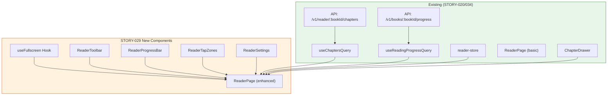
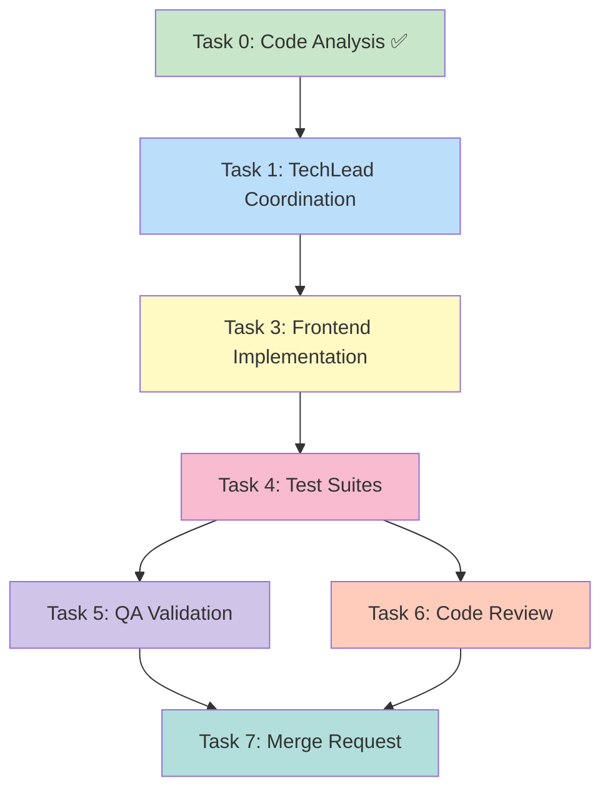

# STORY-029: Reader UI & Fullscreen View — Technical Analysis

**Epic**: EPIC-002
**Persona**: Julia — The Young Author
**Priority**: Must Have | **Story Points**: 5
**Dependencies**: STORY-012 (Shelf/Cover Overlay), STORY-020 (Book Content API)
**Stack Source**: `docs/architecture/TECH-STACK.md`

---

## Language & Framework Detection

| Indicator | Detected | Language/Framework |
|-----------|----------|-------------------|
| `package.json`, `vite.config.*` | ✅ | **Node.js** |
| `react` in deps, `.jsx` files | ✅ | **React 18** |
| `tailwindcss` in deps | ✅ | **Tailwind CSS** |
| `framer-motion` in deps | ✅ | **Framer Motion** |
| `zustand` in deps | ✅ | **Zustand** |

**Frontend Framework**: React → **FrontendDeveloperReact**
**Backend**: Node.js/Express → **BackendDeveloper**
**Integration Pattern**: React SPA → Express API proxy (Vite dev proxy → nginx in prod)

---

## Existing Codebase Analysis

### What Already Exists (STORY-020/STORY-034 output)

| Component | File | Status |
|-----------|------|--------|
| Reader route | `App.jsx` line 76: `/reader/:bookId` | ✅ Active |
| ReaderPage | `frontend/src/app/reader/ReaderPage.jsx` | ✅ 165 lines |
| ChapterDrawer | `frontend/src/components/reader/ChapterDrawer.jsx` | ✅ Exists |
| NextChapterButton | `frontend/src/components/reader/NextChapterButton.jsx` | ✅ Exists |
| ChapterDrawerItem | `frontend/src/components/reader/ChapterDrawerItem.jsx` | ✅ Exists |
| Reader store | `frontend/src/stores/reader-store.js` | ✅ 13 lines (chapter index + drawer) |
| Chapters hook | `frontend/src/hooks/useChaptersQuery.js` | ✅ Fetches `/v1/reader/:bookId/chapters` |
| Progress hook | `frontend/src/hooks/useReadingProgressQuery.js` | ✅ Fetches `/v1/books/:bookId/progress` |
| Backend router | `backend/src/app/reader/reader-router.js` | ✅ GET `/:bookId/chapters` |
| Backend manager | `backend/src/app/reader/reader-manager.js` | ✅ Access control + fetch |
| i18n | `en/reader.json`, `pt-BR/reader.json` | ✅ Reader namespace |

### What's Missing (STORY-029 scope)

| Feature | Status |
|---------|--------|
| Fullscreen/immersive reading mode | ❌ Not implemented |
| Reader toolbar with auto-hide (2s) | ❌ Current header is always visible |
| Fullscreen API (`requestFullscreen`) | ❌ Not used |
| CSS fullscreen fallback (`position: fixed`, `inset: 0`) | ❌ Not implemented |
| Progress bar at bottom | ❌ Not implemented |
| Tap zones (center = toggle toolbar, edges = prev/next) | ❌ Not implemented |
| Keyboard shortcuts (Space, ArrowRight, ArrowLeft, Escape) | ❌ Only `G` for drawer exists |
| Exit confirmation on back gesture | ❌ Not implemented |
| `overscroll-behavior: contain` | ❌ Not applied |
| Settings panel (font/theme) | ❌ Not implemented |
| `prefers-reduced-motion` respect | ⚠️ Partial — Framer Motion uses `useReducedMotion` but no CSS fallback |
| Screen reader announcements for reader state | ⚠️ Partial — `A11yAnnouncer` exists but no chapter/state announcements on load |

---

## Technical Task Breakdown

### Task 0: Code Analysis ✅ (completed above)

### Task 1: TechLead Coordination
- **Agent**: TechLead
- **Dependencies**: None
- **Output**: Orchestrate Tasks 2-7

### Task 2: Backend — No Changes Required
The backend already exposes:
- `GET /v1/reader/:bookId/chapters` — chapter data for reading
- `GET /v1/books/:bookId/progress` — reading progress
- `PUT /v1/books/:bookId/progress` — save progress

**No backend modifications needed.** All required API endpoints exist.

### Task 3: Frontend — Fullscreen Reader UI Implementation
- **Agent**: FrontendDeveloperReact
- **Dependencies**: None (enhances existing component)
- **Files to modify**:
  - `frontend/src/app/reader/ReaderPage.jsx` — Refactor to support fullscreen mode
  - `frontend/src/stores/reader-store.js` — Add fullscreen + toolbar state
  - `frontend/src/i18n/en/reader.json` — Add fullscreen/toolbar strings
  - `frontend/src/i18n/pt-BR/reader.json` — Add fullscreen/toolbar strings
- **Files to create**:
  - `frontend/src/components/reader/ReaderToolbar.jsx` — Auto-hiding toolbar overlay
  - `frontend/src/components/reader/ReaderProgressBar.jsx` — Bottom progress bar
  - `frontend/src/components/reader/ReaderTapZones.jsx` — Tap zone overlay for touch/click interaction
  - `frontend/src/components/reader/ReaderSettings.jsx` — Font size / theme settings panel (basic MVP)
  - `frontend/src/hooks/useFullscreen.js` — Fullscreen API hook with fallback

### Task 4: Test Suites
- **Agent**: TestEngineer
- **Dependencies**: Task 3 complete
- **Scope**:
  - Unit tests for `useFullscreen` hook
  - Unit tests for reader store (new fullscreen + toolbar state)
  - Integration tests for ReaderPage fullscreen behavior
  - Keyboard navigation tests
  - Accessibility tests (`prefers-reduced-motion`, screen reader announcements)

### Task 5: QA Validation
- **Agent**: QAAnalyst
- **Dependencies**: Task 4 complete
- **Scope**: Verify all 6 acceptance criteria against implementation

### Task 6: Code Review
- **Agent**: CodeReviewer
- **Dependencies**: Task 4 complete
- **Scope**: Full frontend PR review

### Task 7: Merge Request
- **Agent**: MergeRequestCreator
- **Dependencies**: Tasks 5 + 6 complete

---

## Architecture Diagram



## Execution Flow



---

## Detailed Implementation Plan

### 3.1 Fullscreen Hook (`useFullscreen.js`)

```javascript
// Custom hook wrapping Fullscreen API with CSS fallback
// - requestFullscreen() on document.documentElement
// - Fallback: position:fixed + inset:0 CSS class on <body>
// - Listen to fullscreenchange event for exit detection
// - Return: isFullscreen, enterFullscreen, exitFullscreen, toggleFullscreen
```

### 3.2 Reader Store Extensions (`reader-store.js`)

New state fields:
- `isFullscreen: false` — Fullscreen mode active
- `isToolbarVisible: false` — Toolbar overlay visible
- `toolbarTimeout: null` — Timer ID for auto-hide
- `isSettingsOpen: false` — Settings panel visible

New actions:
- `enterFullscreen()` / `exitFullscreen()`
- `showToolbar()` / `hideToolbar()` — with 2s timeout logic
- `toggleToolbar()`
- `openSettings()` / `closeSettings()`

### 3.3 ReaderPage Refactor

Transform from simple scrollable page → fullscreen immersive reader:
- **Normal mode**: current layout preserved (backward compat)
- **Fullscreen mode**: position fixed, inset 0, no browser chrome, `overscroll-behavior: contain`
- Enter fullscreen on mount (or via "Read Book" button)
- Exit fullscreen on Escape key or back button

### 3.4 ReaderToolbar Component

- **Auto-hiding overlay**: appears on tap, fades after 2s
- **Contents**: Back to Shelf, Chapter List toggle, Settings toggle
- **Accessibility**: Focusable, keyboard navigable
- **Transitions**: Framer Motion fade with `prefers-reduced-motion` check

### 3.5 ReaderProgressBar Component

- Bottom-fixed thin bar showing reading progress (% of book)
- Subtle, not distracting
- Progress = `currentChapterIndex / totalChapters`

### 3.6 ReaderTapZones Component

- **Center zone**: Toggle toolbar visibility
- **Left edge** (15% width): Previous chapter (paginated mode: previous page)
- **Right edge** (15% width): Next chapter (paginated mode: next page)
- Touch-friendly target sizing

### 3.7 ReaderSettings Component (MVP)

- Font size adjustment (3 presets: small, medium, large)
- Theme toggle (light, sepia, dark) — CSS class on reader container
- Closed by tapping outside or pressing Escape

### 3.8 Accessibility

- Screen reader: Announce "Reading [Book Title], Chapter [Name]" on open and chapter change
- Keyboard: Space/ArrowRight = next chapter, ArrowLeft = previous, Escape = exit
- `prefers-reduced-motion`: Disable all transitions, instant toolbar show/hide
- Contrast: All themes must meet 4.5:1 ratio for text
- Focus management: Toolbar must trap focus when visible

---

## NFR Analysis

| NFR | Requirement | Implementation Strategy | Verification |
|-----|-------------|------------------------|--------------|
| NFR-PERF-02 | First page render ≤1s for 50k words | Chapters fetched individually via API; TanStack Query caching; no full-book fetch | Lighthouse timing + manual test |
| NFR-ACC-01 | WCAG 2.1 AA — focusable, keyboard operable | Toolbar focus trap, keyboard shortcuts (arrows, space, escape), skip links | axe-core + manual keyboard test |
| NFR-ACC-03 | Screen reader announces reader state | A11yAnnouncer on mount and chapter change: "Reading [Title], Chapter [Name]" | VoiceOver/NVDA test |
| NFR-ACC-04 | Text contrast ≥4.5:1 in all themes | CSS variables per theme with verified contrast ratios | axe-core contrast check |
| NFR-ACC-05 | `prefers-reduced-motion` respected | Framer Motion `useReducedMotion()` + CSS `@media (prefers-reduced-motion)` | Manual test + automated |
| NFR-SEC-07 | No third-party scripts in reader | Reader page loads no external scripts (verify bundle split) | Network tab audit |

---

## Persona Impact

**Julia — The Young Author**: Primary beneficiary. The fullscreen immersion creates a "real book" experience that aligns with Julia's desire for an engaging, distraction-free reading environment. Large tap zones and progress bar suit young users. Settings (font size) accommodate varying reading abilities.

---

## Impacted Files

| File | Action | Description |
|------|--------|-------------|
| `frontend/src/app/reader/ReaderPage.jsx` | **MODIFY** | Add fullscreen mode, tap zones, toolbar integration |
| `frontend/src/stores/reader-store.js` | **MODIFY** | Add fullscreen + toolbar state |
| `frontend/src/i18n/en/reader.json` | **MODIFY** | Add fullscreen/toolbar/settings strings |
| `frontend/src/i18n/pt-BR/reader.json` | **MODIFY** | Add fullscreen/toolbar/settings strings |
| `frontend/src/components/reader/ReaderToolbar.jsx` | **CREATE** | Auto-hiding toolbar overlay |
| `frontend/src/components/reader/ReaderProgressBar.jsx` | **CREATE** | Bottom progress indicator |
| `frontend/src/components/reader/ReaderTapZones.jsx` | **CREATE** | Tap interaction overlay |
| `frontend/src/components/reader/ReaderSettings.jsx` | **CREATE** | Font/theme settings panel |
| `frontend/src/hooks/useFullscreen.js` | **CREATE** | Fullscreen API hook |

---

## Risk Assessment

| Risk | Likelihood | Impact | Mitigation |
|------|-----------|--------|------------|
| Fullscreen API not supported on iOS Safari | High | Medium | CSS fallback (`position: fixed`, `inset: 0`, `z-index: 9999`) — already noted in Technical Notes |
| Pull-to-refresh interference on mobile | Medium | High | `overscroll-behavior: contain` on reader container |
| Touch event conflicts (tap zones vs scroll) | Medium | Medium | Center zone only activates on tap (not swipe); edge zones use specific hit areas |
| Performance with large chapter content | Low | Medium | Chapters loaded individually; no full-book DOM; `dangerouslySetInnerHTML` for content |
| `prefers-reduced-motion` not tested | Low | Medium | Dual path: Framer Motion check + CSS media query |

---

## Execution Summary

- **Task 2 (Backend)**: SKIPPED — no backend changes needed
- **Task 3 (Frontend)**: Primary implementation — 4 new components + 1 hook + store/hook modifications + page refactor
- **Tasks 4-7**: Standard test → QA → review → MR pipeline
- **Parallelization**: Task 3 is the sole implementation task; all others are sequential dependencies

**Estimated Effort**: 5 story points → ~3-4 days (frontend-heavy, no backend work)