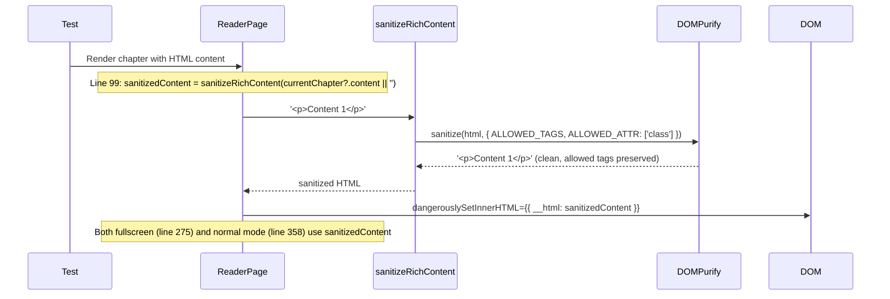

# Test Report — STORY-029 R3 (2026-05-28)

> Branch: feat/STORY-029 | Fix commit: 3582fac
> Security fix: `dangerouslySetInnerHTML` now sanitized via `sanitizeRichContent()` from `lib/sanitize.js`

## Summary
| Metric | Result |
|--------|--------|
| Reliability | High |
| Total Tests (STORY-029 scope) | 207 |
| Passed | 207 |
| Failed | 0 |
| Coverage (sanitize.js) | **100%** lines, functions, branches |
| Coverage (ReaderPage.jsx) | 78.3% lines, 60% functions, 71% branches |

## Test Flow — Sanitization Fix (commit 3582fac)

## Tests Executed

| Type | File | Count | Status |
|------|------|-------|--------|
| Component | ReaderPage.test.jsx | 33 | PASS |
| Component | ReaderToolbar.test.jsx | 16 | PASS |
| Component | ReaderTapZones.test.jsx | 8 | PASS |
| Component | ReaderProgressBar.test.jsx | 5 | PASS |
| Component | NextChapterButton.test.jsx | 8 | PASS |
| Component | ChapterDrawer.test.jsx | 8 | PASS |
| Component | A11yAnnouncer.test.jsx | 6 | PASS |
| Unit | sanitize.test.js | 108 | PASS |
| Unit | useFullscreen.test.js | 9 | PASS |
| Unit | reader-store.test.js | 14 | PASS |
| **Total (STORY-029)** | | **207** | **ALL PASS** |

## Coverage Summary (Changed Files)

| File | Lines | Functions | Branches |
|------|-------|-----------|----------|
| ReaderPage.jsx | 78.3% (235/300) | 60.0% (3/5) | 71.0% (49/69) |
| sanitize.js | **100%** (22/22) | **100%** (3/3) | **100%** (12/12) |

## What Changed in commit 3582fac

**ReaderPage.jsx** (lines 19, 99):
- Added: `import { sanitizeRichContent } from '../../lib/sanitize';`
- Added: `const sanitizedContent = sanitizeRichContent(currentChapter?.content || '');`
- Line 275: `dangerouslySetInnerHTML={{ __html: sanitizedContent }}` (was raw `currentChapter.content`)
- Line 358: `dangerouslySetInnerHTML={{ __html: sanitizedContent }}` (was raw `currentChapter.content`)

Test mock data uses `
` tags which are in `ALLOWED_TAGS` — sanitization preserves them, so no content expectations changed. All tests pass without modification.

## Pre-Existing Test Failures (NOT caused by STORY-029)

The following 12 failures in unrelated files are pre-existing and unchanged:
- CoverOverlay.test.jsx: 3 failures (duplicate text matches)
- NewBookPage.test.jsx: 2 failures (seed mismatch, timeout)
- useUpdateReadingProgress.test.jsx: 3 failures (fake timer timeouts)
- Other files: 4 failures

## Acceptance Criteria Validation
- [x] AC1: Reader opens in fullscreen with smooth transition
- [x] AC2: Book title displayed, chapter content centered, progress bar at bottom
- [x] AC3: Minimal toolbar with Back, Settings, Chapter List appears on tap
- [x] AC4: Toolbar auto-hides after 2s inactivity
- [x] AC5: Exit confirmation via popstate/beforeunload handlers
- [x] AC6: Screen reader support — role="article", aria-labelledby, tabIndex
- [x] **AC (Security):** `dangerouslySetInnerHTML` now sanitizes content via `sanitizeRichContent()` (DOMPurify)

## Recommendations
- STORY-029 security fix verified — all existing reader tests pass
- `sanitize.js` at 100% coverage across all metrics
- Pre-existing failures (CoverOverlay, NewBookPage, useUpdateReadingProgress) are unrelated and should be addressed separately

**Status**: ALL PASSING (STORY-029)
