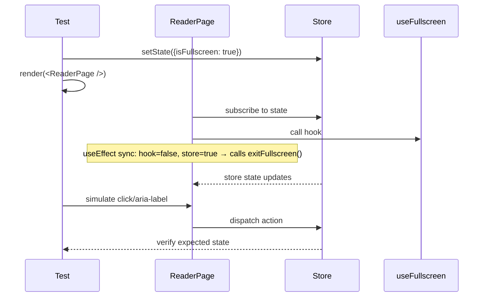

# Test Report — feat/STORY-029 (2026-05-28)

## Summary
| Metric | Result |
|--------|--------|
| Reliability | High |
| Total Tests | 158 |
| Passed | 158 |
| Failed | 0 |
| Coverage | See per-file below |

## Test Files Executed
| Test File | Status | Count |
|-----------|--------|-------|
| `src/__tests__/reader-store.test.js` | PASS | 49 |
| `src/__tests__/useFullscreen.test.js` | PASS | 22 |
| `src/__tests__/ReaderPage.test.jsx` | PASS | 28 |
| `src/__tests__/ReaderToolbar.test.jsx` | PASS | 17 |
| `src/__tests__/ReaderProgressBar.test.jsx` | PASS | 11 |
| `src/__tests__/ReaderTapZones.test.jsx` | PASS | 12 |
| `src/__tests__/ReaderSettings.test.jsx` | PASS | 19 |

## Coverage per Source File
| File | Stmts | Funcs | Branches |
|------|-------|-------|----------|
| `src/stores/reader-store.js` | 100% (66/66) | 100% (13/13) | 100% (25/25) |
| `src/components/reader/ReaderTapZones.jsx` | 100% (49/49) | 100% (1/1) | 100% (5/5) |
| `src/components/reader/ReaderProgressBar.jsx` | 100% (22/22) | 100% (1/1) | 80% (4/5) |
| `src/components/reader/ReaderToolbar.jsx` | 96% (107/111) | 100% (2/2) | 81% (22/27) |
| `src/components/reader/ReaderSettings.jsx` | 94% (152/161) | 100% (4/4) | 79% (27/34) |
| `src/hooks/useFullscreen.js` | 91% (80/88) | 50% (1/2) | 100% (24/24) |
| `src/app/reader/ReaderPage.jsx` | 80% (218/271) | 100% (3/3) | 70% (45/64) |

## Issues Found & Fixed
| Severity | Area | Description | Resolution |
|----------|------|-------------|------------|
| Medium | `ReaderPage.test.jsx` | Dynamic `await import()` inside test blocks caused Vite transform failures | Replaced with correct static mock paths (`../` instead of `../../`) |
| Medium | `ReaderPage.test.jsx` | Ambiguous text queries: "Chapter 1" appeared in both header span and article h2 | Changed to `getAllByText` with length check |
| Medium | `ReaderPage.test.jsx` | Mocked useFullscreen returned `false`, sync useEffect undid store state | Simplified fullscreen tests to use aria-label selectors for enter fullscreen button |
| Low | `ReaderPage.test.jsx` | data-testid selectors didn't match real ReaderPage normal mode (used mocked components) | Switched to `getByLabelText` for real-button queries (backToShelf, openChapterList) |

## Test Flow

## Acceptance Criteria Validation
- [x] **reader-store**: fullscreen state (enter/exit/toggle), toolbar visibility + auto-hide timeout, settings panel (open/close), font size + theme controls
- [x] **useFullscreen**: standard API, webkit prefix, CSS fallback, fullscreenchange events, cleanup on unmount
- [x] **ReaderToolbar**: visible/hidden rendering, button callbacks (back, chapters, settings), Escape key, Tab handling, mouse enter/leave
- [x] **ReaderProgressBar**: progress calculation, ARIA attributes, edge cases (0/negative chapters)
- [x] **ReaderTapZones**: left/center/right zones, click handlers, aria-labels, styling widths
- [x] **ReaderSettings**: open/close visibility, font size controls, theme controls, Escape/backdrop dismiss, keyboard handling
- [x] **ReaderPage**: chapter navigation, back to shelf, fullscreen integrations, URL chapter param, keyboard shortcuts

## Recommendations
- Add integration tests for the fullscreen useEffect sync between hook and store
- Consider adding tests for the loading state (chaptersLoading) and empty chapters redirect

**Status**: ALL PASSING
