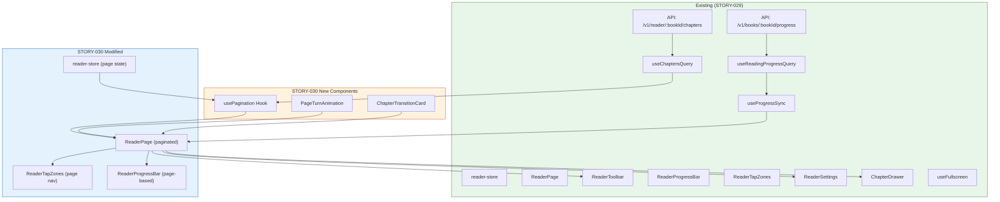
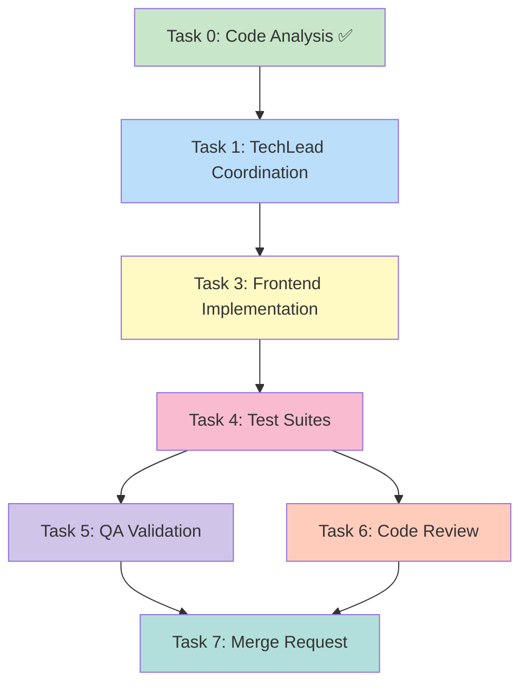

# STORY-030: Paginated Reading Mode — Technical Analysis

**Epic**: EPIC-002
**Persona**: Julia — The Young Author
**Priority**: Must Have | **Story Points**: 5
**Dependencies**: STORY-029 (Reader UI & Fullscreen View)
**Stack Source**: `docs/architecture/TECH-STACK.md`

---

## Language & Framework Detection

| Indicator | Detected | Language/Framework |
|-----------|----------|-------------------|
| `package.json`, `vite.config.*` | ✅ | **Node.js** |
| `react` in deps, `.jsx` files | ✅ | **React 18** |
| `tailwindcss` in deps | ✅ | **Tailwind CSS** |
| `framer-motion` in deps | ✅ | **Framer Motion** |
| `zustand` in deps | ✅ | **Zustand** |

**Frontend Framework**: React → **FrontendDeveloperReact**
**Backend**: Node.js/Express → **BackendDeveloper**
**Integration Pattern**: React SPA → Express API proxy (Vite dev proxy → nginx in prod)

---

## STORY-029 Delivered Assets (Reuse Patterns)

STORY-029 delivered the fullscreen reader UI foundation. Key components to build upon:

| Component | File | What It Provides | STORY-030 Impact |
|-----------|------|------------------|------------------|
| ReaderPage | `frontend/src/app/reader/ReaderPage.jsx` | Fullscreen mode, chapter rendering, keyboard nav, "The End" screen | **MAJOR REFACTOR** — replace scroll with pagination |
| ReaderTapZones | `frontend/src/components/reader/ReaderTapZones.jsx` | 15%/70%/15% tap zones, currently calls chapter navigation | **MODIFY** — wire tap zones to page navigation |
| ReaderToolbar | `frontend/src/components/reader/ReaderToolbar.jsx` | Auto-hiding toolbar overlay | **MINOR** — add page indicator |
| ReaderProgressBar | `frontend/src/components/reader/ReaderProgressBar.jsx` | Bottom progress bar (chapter-based %) | **MODIFY** — switch to page-based % |
| ReaderSettings | `frontend/src/components/reader/ReaderSettings.jsx` | Font size / theme settings | **MODIFY** — trigger repagination on font change |
| reader-store | `frontend/src/stores/reader-store.js` | Fullscreen, toolbar, settings, chapter index state | **EXTEND** — add page index + pagination state |
| useFullscreen | `frontend/src/hooks/useFullscreen.js` | Fullscreen API + CSS fallback | **NO CHANGE** |
| A11yAnnouncer | `frontend/src/components/common/A11yAnnouncer.jsx` | Screen reader announcements | **REUSE** — add page change announcements |
| i18n | `en/reader.json`, `pt-BR/reader.json` | Reader strings | **EXTEND** — add pagination i18n strings |

---

## What's Missing (STORY-030 Scope)

| Feature | Status |
|---------|--------|
| Page-based content rendering (replace scroll) | ❌ Current: full chapter scroll |
| Pagination algorithm (viewport + font metrics → page breaks) | ❌ Not implemented |
| Page-turn animation (slide/fade) | ❌ Not implemented |
| `prefers-reduced-motion` → instant page switch | ⚠️ Hook exists (`useReducedMotion`) but no page animation |
| Next/previous page navigation | ❌ Keyboard has chapter nav, tap zones have chapter nav |
| Chapter boundary transitions | ❌ Not implemented |
| "The End" screen (partially exists) | ⚠️ STORY-029 has `isFinished` state + "The End" UI |
| Page progress tracking (page X of Y) | ❌ Only chapter progress exists |
| Font size change → repagination with position preservation | ❌ Font size changes but no repagination |
| Keyboard: Home/End for chapter start/end | ❌ Only ArrowLeft/Right for chapters |
| Screen reader: "page X of Y" announcements | ❌ Only chapter announcements |

---

## Technical Task Breakdown

### Task 0: Code Analysis ✅ (completed above)

### Task 1: TechLead Coordination
- **Agent**: TechLead
- **Dependencies**: None
- **Output**: Orchestrate Tasks 2-7

### Task 2: Backend — No Changes Required
The backend already exposes:
- `GET /v1/reader/:bookId/chapters` — chapter content for reading
- `GET /v1/books/:bookId/progress` — reading progress
- `PUT /v1/books/:bookId/progress` — save progress

The `lastPosition` field in progress already supports page-level offsets (currently `0`). **No backend modifications needed.**

### Task 3: Frontend — Paginated Reading Mode Implementation
- **Agent**: FrontendDeveloperReact
- **Dependencies**: None (enhances existing STORY-029 components)
- **Files to create**:
  - `frontend/src/hooks/usePagination.js` — Core pagination algorithm hook
  - `frontend/src/components/reader/PageTurnAnimation.jsx` — Page-turn animation wrapper
  - `frontend/src/components/reader/ChapterTransitionCard.jsx` — Chapter title card at chapter boundaries
- **Files to modify**:
  - `frontend/src/app/reader/ReaderPage.jsx` — Replace scroll with paginated mode
  - `frontend/src/stores/reader-store.js` — Add page index + total pages state
  - `frontend/src/components/reader/ReaderTapZones.jsx` — Wire to page navigation instead of chapter navigation
  - `frontend/src/components/reader/ReaderProgressBar.jsx` — Switch to page-based progress
  - `frontend/src/components/reader/ReaderSettings.jsx` — Trigger repagination on font/theme change
  - `frontend/src/i18n/en/reader.json` — Add pagination i18n strings
  - `frontend/src/i18n/pt-BR/reader.json` — Add pagination i18n strings

### Task 4: Test Suites
- **Agent**: TestEngineer
- **Dependencies**: Task 3 complete
- **Scope**:
  - Unit tests for `usePagination` hook (page break calculation, edge cases)
  - Unit tests for reader store (new page state)
  - Integration tests for ReaderPage paginated mode
  - Page-turn animation tests (Framer Motion mocked)
  - Accessibility tests (`prefers-reduced-motion`, screen reader "page X of Y")
  - Font size change → repagination tests
  - Edge cases: empty chapter, single-page chapter, last-page-of-book

### Task 5: QA Validation
- **Agent**: QAAnalyst
- **Dependencies**: Task 4 complete
- **Scope**: Verify all 7 acceptance criteria against implementation

### Task 6: Code Review
- **Agent**: CodeReviewer
- **Dependencies**: Task 4 complete
- **Scope**: Full frontend PR review (pagination algorithm, animation performance)

### Task 7: Merge Request
- **Agent**: MergeRequestCreator
- **Dependencies**: Tasks 5 + 6 complete

---

## Architecture Diagram



## Execution Flow



---

## Detailed Implementation Plan

### 3.1 Pagination Hook (`usePagination.js`)

**Core algorithm** — determines how chapter content splits into pages:

```
Input: chapter HTML content, fontSize (small|medium|large), theme, containerWidth, containerHeight
Output: pages[] (array of page content fragments), totalPages, currentPageIndex
```

**Algorithm approach** (virtual rendering):
1. Render chapter HTML into a hidden offscreen `<div>` matching the reader container dimensions and font settings
2. Measure the total content height using `scrollHeight`
3. Calculate `pageHeight = containerHeight - padding - headerMargin`
4. Split into pages: `totalPages = Math.ceil(scrollHeight / pageHeight)`
5. Each "page" is a vertical slice: `pageStart = pageIndex * pageHeight`, `pageEnd = (pageIndex + 1) * pageHeight`
6. Use CSS `transforms` or `marginTop`/`overflow hidden` to show only the current "slice"

**Alternative (simpler, recommended for MVP)**: CSS column-based pagination:
1. Apply `column-width` matching viewport width on the chapter content container
2. Set `column-gap: 0` and `height: [viewport height]`
3. Content naturally flows into columns = pages
4. Navigate by translating the container horizontally
5. Total pages = `Math.ceil(scrollWidth / containerWidth)`

**Decision: CSS column-based approach** — simpler, performant, no DOM measurement needed, native CSS handles text reflow.

**State in `reader-store.js`**:

New state fields:
- `currentPageIndex: 0` — Current page within current chapter
- `totalPagesInChapter: 1` — Total pages in current chapter
- `isPageAnimating: false` — Animation in progress lock

New actions:
- `setCurrentPageIndex(idx)` — Set current page
- `setTotalPagesInChapter(total)` — Update total pages for chapter
- `nextPage()` — Increment page (cross chapter boundary)
- `previousPage()` — Decrement page (cross chapter boundary)
- `setIsPageAnimating(val)` — Animation lock

### 3.2 ReaderPage Refactor — Paginated Mode

**Current**: `<div className="overflow-y-auto">` scrolls entire chapter content.
**New**: Paginated view showing one page at a time.

Key changes:
1. Replace `overflow-y-auto` scrolling with a fixed-size container
2. Apply CSS `column-width` + `column-fill: auto` for column-based pagination
3. Wrap content in `PageTurnAnimation` component for transitions
4. Show `ChapterTransitionCard` when crossing chapter boundaries
5. Update "The End" logic: last page of last chapter → end screen

**Container CSS approach**:
```css
.reader-paginated-content {
  column-width: var(--page-width);
  column-gap: 0;
  column-fill: auto;
  height: var(--page-height);
  overflow: hidden;
  transform: translateX(calc(var(--page-index) * -100%));
}
```

### 3.3 PageTurnAnimation Component

**Animation strategy** (from story Technical Notes: "avoid complex curl animation; use simple slide or fade"):

- **Default**: Horizontal slide (`translateX`) — book-like feel
- **Framer Motion**: `AnimatePresence` with `initial={{ x: direction > 0 ? '100%' : '-100%' }}`, `animate={{ x: 0 }}`, `exit={{ x: direction > 0 ? '-100%' : '100%' }}`
- **`prefers-reduced-motion`**: No animation, instant switch (already handled by `useReducedMotion()`)
- **Performance target**: ≥60fps per AC3 — CSS transforms use GPU compositing, no layout thrash

### 3.4 ChapterTransitionCard Component

- Shown briefly when entering a new chapter from page navigation
- Displays chapter title + subtle fade-in animation
- Auto-dismisses after 1.5s or on next tap
- `prefers-reduced-motion`: Show for 0.5s with no animation

### 3.5 Reader Tap Zones Modification

- **Left zone (15% → 30%)**: Previous page (not chapter)
- **Center zone (70% → 40%)**: Toggle toolbar (unchanged)
- **Right zone (15% → 30%)**: Next page (not chapter)
- Updated per AC spec: "Left 30% = previous page, Right 30% = next page, Center 40% = toggle toolbar"

### 3.6 Keyboard Navigation Update

Current (STORY-029):
- `Space` / `ArrowRight` → next **chapter**
- `ArrowLeft` → previous **chapter**

New (STORY-030):
- `Space` / `ArrowRight` → next **page**
- `ArrowLeft` → previous **page**
- `Home` → jump to first page of current chapter
- `End` → jump to last page of current chapter

### 3.7 ReaderProgressBar Update

Current: Progress = `(currentChapterIndex + 1) / totalChapters * 100`

New: Progress = `currentPageIndex / totalPagesInBook * 100`
Where `totalPagesInBook` = sum of all chapter page counts, and `currentPageIndex` = cumulative page index across chapters.

### 3.8 Font Size Change → Repagination + Position Preservation

When font size changes:
1. Recalculate total pages for current chapter with new font metrics
2. Preserve **proportional position**: `newPageIndex = Math.round((oldPageIndex / oldTotalPages) * newTotalPages)`
3. Clamp to valid range: `Math.min(newPageIndex, newTotalPages - 1)`
4. Update `currentPageIndex` and `totalPagesInChapter` in store

### 3.9 "The End" Screen

Already partially implemented in STORY-029 (`isFinished` state). Enhancement:
- Trigger when `currentPageIndex === totalPagesInBook - 1` (last page of last chapter)
- Tapping "next page" on last page triggers "The End" screen
- Options: "Return to Shelf" / "Read Again" (already present)

### 3.10 Accessibility Enhancements

- Screen reader: Announce "Page X of Y" on each page change (via `A11yAnnouncer`)
- Chapter transition: Announce "Chapter [title], page 1 of [N]"
- Tap zones: Focusable buttons with `aria-label` (already implemented in STORY-029)
- Keyboard: Arrow keys, Home, End per AC7

---

## NFR Analysis

| NFR | Requirement | Implementation Strategy | Verification |
|-----|-------------|------------------------|--------------|
| NFR-PERF-02 | First page ≤1s, subsequent immediate | Only render current chapter; CSS columns render instantly; TanStack Query caches chapters | Lighthouse timing + manual test |
| NFR-PERF-04 | Page-turn animation ≥60fps | CSS transforms (GPU-composited `translateX`); no JS layout calc per frame | Chrome DevTools Performance panel |
| NFR-ACC-01 | WCAG 2.1 AA — tap zones focusable/keyboard | Tap zones use `<button>` elements; keyboard nav for all actions | axe-core + manual keyboard test |
| NFR-ACC-03 | Screen reader announces page changes | `A11yAnnouncer` on every page turn: "Page X of Y, Chapter [title]" | VoiceOver/NVDA test |
| NFR-ACC-04 | Text contrast ≥4.5:1 in all themes | Existing theme system from STORY-029; no new theme colors | axe-core contrast check |
| NFR-ACC-05 | `prefers-reduced-motion` → instant switch | `useReducedMotion()` from Framer Motion + CSS `@media` fallback | Manual test |

---

## Persona Impact

**Julia — The Young Author**: This is the core reading experience transformation. Paginated reading creates the "turning pages of a real book" feeling that Julia expects. The page-by-page navigation is more intuitive for young readers than continuous scrolling. Chapter transition cards provide natural breathing room between story sections. The "The End" screen gives satisfying closure.

---

## Impacted Files

| File | Action | Description |
|------|--------|-------------|
| `frontend/src/app/reader/ReaderPage.jsx` | **MODIFY** | Refactor from scroll to paginated mode; add page state, page-turn animation, chapter transitions |
| `frontend/src/stores/reader-store.js` | **MODIFY** | Add `currentPageIndex`, `totalPagesInChapter`, `isPageAnimating`, page navigation actions |
| `frontend/src/components/reader/ReaderTapZones.jsx` | **MODIFY** | Change zone sizes (30/40/30) and wire to `nextPage`/`previousPage` |
| `frontend/src/components/reader/ReaderProgressBar.jsx` | **MODIFY** | Switch from chapter-based to page-based progress calculation |
| `frontend/src/components/reader/ReaderSettings.jsx` | **MODIFY** | Trigger repagination on font size/theme change |
| `frontend/src/i18n/en/reader.json` | **MODIFY** | Add pagination strings (pageOf, chapterTransition, etc.) |
| `frontend/src/i18n/pt-BR/reader.json` | **MODIFY** | Add pagination strings (pageOf, chapterTransition, etc.) |
| `frontend/src/hooks/usePagination.js` | **CREATE** | Core pagination algorithm hook (CSS columns + page calculation) |
| `frontend/src/components/reader/PageTurnAnimation.jsx` | **CREATE** | Framer Motion wrapper for page-turn slide/fade transitions |
| `frontend/src/components/reader/ChapterTransitionCard.jsx` | **CREATE** | Chapter title card overlay at chapter boundaries |

---

## Risk Assessment

| Risk | Likelihood | Impact | Mitigation |
|------|-----------|--------|------------|
| CSS columns + images/lists may break page flow | Medium | High | Test with rich content (unordered lists, images from TipTap). Fallback: hide unsupported content in MVP. |
| Performance with very long chapters (>50 pages) | Low | Medium | Virtual rendering: only render current + 1 adjacent page DOM. Measure scrollWidth once, translate for navigation. |
| Column-based pagination doesn't work in older browsers | Low | Low | Target: modern browsers (Chrome 90+, Safari 15+, Firefox 90+). Columns supported 95%+ globally. |
| Font size change causes layout thrash during repagination | Medium | Medium | Debounce font size changes (300ms); use `requestAnimationFrame` for column recalculation; preserve proportional position. |
| Page-turn animation stutters on low-end mobile | Medium | High | Use `will-change: transform` + `transform: translate3d()` for GPU compositing; test on mid-range device (AC3). |
| Swipe gesture conflicts with tap zones | Medium | Medium | MVP: tap zones only (per Technical Notes). Swipe is "optional enhancement". Use `touch-action` CSS to prevent conflicts. |

---

## Execution Summary

- **Task 2 (Backend)**: SKIPPED — no backend changes needed (progress API already supports `lastPosition`)
- **Task 3 (Frontend)**: Primary implementation — 3 new files + 6 modifications. Key: `usePagination` hook + `ReaderPage` refactor
- **Tasks 4-7**: Standard test → QA → review → MR pipeline
- **Parallelization**: Task 3 is the sole implementation task; all others are sequential dependencies
- **CSS column pagination** chosen over DOM measurement for simplicity and performance

**Estimated Effort**: 5 story points → ~3-5 days (complex frontend algorithm + animation + accessibility)