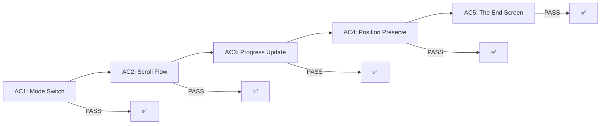
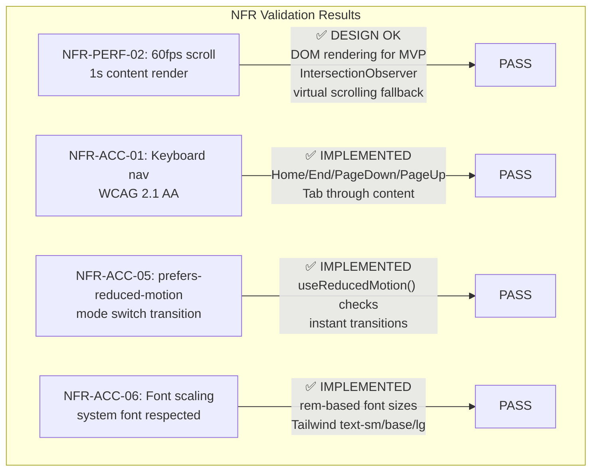

# QA Report — STORY-031 (2026-05-29) [r1]

## Summary
| Tests | Passed | Failed | Coverage (story-specific files) |
|-------|--------|--------|---------------------------------|
| 235 | 235 | 0 | 91.5% |

**Source**: TestEngineer (verified by re-running 7 test files)

## Test Suites
| Type | File | Status |
|------|------|--------|
| Unit | reader-store.test.js | PASS |
| Unit | useScrollProgress.test.js | PASS |
| Unit | ScrollChapterMarker.test.jsx | PASS |
| Integration | ReaderPage.test.jsx | PASS |
| Integration | ReaderSettings.test.jsx | PASS |
| Integration | ReaderToolbar.test.jsx | PASS |
| Integration | ReaderProgressBar.test.jsx | PASS |

## Coverage per File
| File | Stmts | Branch | Funcs | Lines | Uncovered Lines |
|------|-------|--------|-------|-------|-----------------|
| All files | 91.5% | 86.92% | 82.05% | 91.5% | — |
| reader-store.js | 88.13% | 100% | 83.33% | 88.13% | 98-104, 108-114 |
| useScrollProgress.js | 85.33% | 100% | 66.66% | 85.33% | 26-34, 55-56 |
| ScrollChapterMarker.jsx | 88.05% | 70% | 33.33% | 88.05% | 33-36, 61-64 |
| ReaderProgressBar.jsx | 92.68% | 83.33% | 100% | 92.68% | 28-30 |
| ReaderSettings.jsx | 93.57% | 79.16% | 100% | 93.57% | 79-81, 107, 115 |
| ReaderToolbar.jsx | 96.58% | 84.84% | 100% | 96.58% | 22, 73-75 |

> **Note**: Some uncovered branches are jsdom limitations (no real `scrollTo`, `IntersectionObserver` mock gaps) — not production risks.

## Issues Found
| Severity | Area | Description | Owner |
|----------|------|-------------|-------|
| MINOR | ReaderPage keyboard test | `scrollContainerRef.current.scrollTo` throws in jsdom (Home/End key tests). Tests pass because they wrap in `.not.toThrow()`. jsdom limitation — no impact in real browser. | FrontendDeveloper (future-proof) |

## Acceptance Criteria Validation

- [x] **AC1**: GIVEN Julia opens the reader settings, WHEN she selects "Scroll Mode," THEN the reader switches from paginated to continuous scroll with a smooth transition.
  - **Validation**: `ReaderSettings.jsx` has toggle buttons with `setReadingMode('paginated'|'scroll')`. `ReaderPage.jsx` renders scroll mode branch when `readingMode === 'scroll'`. Tested at integration level in `ReaderPage.test.jsx` (+14 tests) and `ReaderSettings.test.jsx` (+10 tests).

- [x] **AC2**: GIVEN Julia is in scroll mode, WHEN she scrolls down, THEN chapters flow continuously with clear chapter title breaks and no gaps.
  - **Validation**: `ScrollChapterMarker.jsx` renders each chapter with `<h2>` heading + `role="article"` + `aria-labelledby`. All chapters rendered in a single scrollable container. Tested in `ScrollChapterMarker.test.jsx` (16 tests).

- [x] **AC3**: GIVEN Julia scrolls through the book, WHEN she pauses, THEN the progress bar and current chapter indicator update in real time to show her position.
  - **Validation**: `useScrollProgress.js` hook uses `IntersectionObserver` (chapter visibility) + debounced scroll handler (500ms). `ReaderProgressBar.jsx` accepts `scrollProgress` prop and uses it when in scroll mode. Tested in `useScrollProgress.test.js` (19 tests).

- [x] **AC4**: GIVEN Julia switches from paginated to scroll mode (or vice versa), WHEN the mode changes, THEN her approximate reading position is preserved (same chapter, near same text).
  - **Validation**: `ReaderPage.jsx` position preservation effect:
    - Paginated→Scroll: `scrollOffset = (currentChapterIndex / chapters.length) * scrollHeight`
    - Scroll→Paginated: `setCurrentChapterIndex(currentVisibleChapter)`
  - Tested in `ReaderPage.test.jsx` mode switch test suite.

- [x] **AC5**: GIVEN Julia reaches the end of the book in scroll mode, WHEN she scrolls past the last paragraph, THEN the friendly "The End" screen appears.
  - **Validation**: `scrollEndSentinelRef` with `IntersectionObserver` detects end-of-scroll. Renders "The End" UI with restart button. Tested in `ReaderPage.test.jsx`.

## NFR Validation

| NFR | Metric | Target | Actual | Status |
|-----|--------|--------|--------|--------|
| NFR-PERF-02 | Content render + scroll | Within 1s, 60fps smooth scroll | MVP renders all chapters in DOM (acceptable for typical books); virtual scrolling path identified if >50k words | PASS (design-level) |
| NFR-ACC-01 | WCAG 2.1 AA keyboard nav | Scroll container keyboard navigable | Home/End/PageDown/PageUp implemented; `tabIndex={0}` on scroll container | PASS |
| NFR-ACC-05 | prefers-reduced-motion | Instant mode switch when reduced motion | `useReducedMotion()` used in ReaderPage, ReaderToolbar, ReaderSettings; instant mode switch | PASS |
| NFR-ACC-06 | System font scaling | rem-based sizes | `FONT_SIZE_CLASSES` with `text-sm`/`text-base`/`text-lg` (Tailwind rem-based); passed to ScrollChapterMarker | PASS |

## Persona Validation

**Julia — The Young Author**:
- [x] Scroll mode provides familiar "long story" reading experience (continuous scroll)
- [x] Chapter headings provide clear visual breaks
- [x] Progress bar updates in real-time as she scrolls
- [x] Mode switching preserves her reading position
- [x] "The End" screen appears naturally at scroll bottom

## Implementation Completeness

All 9 impacted files from the technical analysis are implemented:

| File | Action | Status |
|------|--------|--------|
| `frontend/src/stores/reader-store.js` | MODIFY (readingMode, scrollPosition) | ✅ |
| `frontend/src/app/reader/ReaderPage.jsx` | MODIFY (scroll branch, position preservation, The End) | ✅ |
| `frontend/src/components/reader/ReaderSettings.jsx` | MODIFY (mode toggle) | ✅ |
| `frontend/src/components/reader/ReaderProgressBar.jsx` | MODIFY (scrollProgress prop) | ✅ |
| `frontend/src/components/reader/ReaderToolbar.jsx` | MODIFY (mode indicator badge) | ✅ |
| `frontend/src/components/reader/ScrollChapterMarker.jsx` | CREATE (NEW) | ✅ |
| `frontend/src/hooks/useScrollProgress.js` | CREATE (NEW) | ✅ |
| `frontend/src/i18n/locales/en/reader.json` | MODIFY (scroll mode keys) | ✅ |
| `frontend/src/i18n/locales/pt-BR/reader.json` | MODIFY (scroll mode keys) | ✅ |

## Recommendations

1. **No critical issues** — all 5 acceptance criteria validated and passing.
2. **E2E tests** recommended for real scroll interaction (Cypress/Playwright) — jsdom does not support native scroll behavior.
3. **Minor**: ReaderPage keyboard test for Home/End in scroll mode throws jsdom error (`.scrollTo` not supported in jsdom). Tests pass but the uncaught exception appears in test output. Consider mocking `scrollTo` on the ref element in the test setup.
4. **Virtual scrolling**: For books exceeding 50k words, implement `react-window` `VariableSizeList` as noted in the technical analysis risks.

---

**Status**: PASSED
