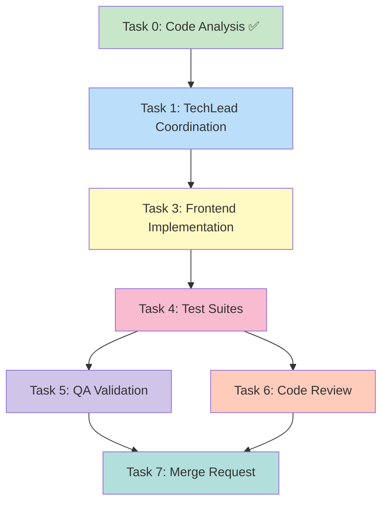

# STORY-031: Continuous Scroll Reading Mode — Technical Analysis

**Epic**: EPIC-002
**Persona**: Julia — The Young Author
**Priority**: Must Have | **Story Points**: 3
**Dependencies**: STORY-029 (Reader UI & Fullscreen View)
**Stack Source**: `docs/architecture/TECH-STACK.md`

---

## Language & Framework Detection

| Indicator | Detected | Language/Framework |
|-----------|----------|-------------------|
| `package.json`, `vite.config.*` | ✅ | **Node.js** |
| `react` in deps, `.jsx` files | ✅ | **React 18** |
| `tailwindcss` in deps | ✅ | **Tailwind CSS** |
| `framer-motion` in deps | ✅ | **Framer Motion** |
| `zustand` in deps | ✅ | **Zustand** |

**Frontend Framework**: React → **FrontendDeveloperReact**
**Backend**: Node.js/Express → **BackendDeveloper**
**Integration Pattern**: React SPA → Express API proxy (Vite dev proxy → nginx in prod)

---

## Existing Codebase Analysis (STORY-029 Output)

### What Already Exists

| Component | File | Status | Relevance to STORY-031 |
|-----------|------|--------|----------------------|
| ReaderPage | `frontend/src/app/reader/ReaderPage.jsx` | ✅ 710 lines | **Primary modification target** — currently paginated-only |
| reader-store | `frontend/src/stores/reader-store.js` | ✅ 110 lines | **Must extend** — add `readingMode` state |
| ReaderSettings | `frontend/src/components/reader/ReaderSettings.jsx` | ✅ 207 lines | **Must extend** — add reading mode toggle |
| ReaderToolbar | `frontend/src/components/reader/ReaderToolbar.jsx` | ✅ Exists | **Minor extension** — add scroll mode indicator |
| ReaderProgressBar | `frontend/src/components/reader/ReaderProgressBar.jsx` | ✅ 53 lines | **Must adapt** — support scroll-based progress |
| ChapterDrawer | `frontend/src/components/reader/ChapterDrawer.jsx` | ✅ 130 lines | **Reuse** — scroll-to-chapter navigation |
| ChapterDrawerItem | `frontend/src/components/reader/ChapterDrawerItem.jsx` | ✅ Exists | **Reuse** — no changes |
| PageTurnAnimation | `frontend/src/components/reader/PageTurnAnimation.jsx` | ✅ Exists | **Conditionally disabled** in scroll mode |
| ChapterTransitionCard | `frontend/src/components/reader/ChapterTransitionCard.jsx` | ✅ Exists | **Conditionally disabled** in scroll mode |
| ReaderTapZones | `frontend/src/components/reader/ReaderTapZones.jsx` | ✅ Exists | **Conditionally disabled** in scroll mode |
| A11yAnnouncer | `frontend/src/components/common/A11yAnnouncer.jsx` | ✅ Exists | **Reuse** — announce chapter changes on scroll |
| useFullscreen | `frontend/src/hooks/useFullscreen.js` | ✅ Exists | **Reuse** — no changes |
| useChaptersQuery | `frontend/src/hooks/useChaptersQuery.js` | ✅ Exists | **Reuse** — fetch all chapters |
| useProgressSync | `frontend/src/hooks/useProgressSync.js` | ✅ 192 lines | **Extend** — support scroll-based progress |
| i18n en | `frontend/src/i18n/locales/en/reader.json` | ✅ 47 keys | **Must extend** — add scroll mode strings |
| i18n pt-BR | `frontend/src/i18n/locales/pt-BR/reader.json` | ✅ Exists | **Must extend** — add scroll mode strings |

### Key Patterns from STORY-029 (Reuse)

1. **Zustand store pattern** — flat state with actions, `useReaderStore((s) => s.field)` selectors
2. **Framer Motion + `useReducedMotion()`** — all animations check `prefers-reduced-motion`
3. **`sanitizeRichContent()`** — used for chapter content rendering via `dangerouslySetInnerHTML`
4. **Progress sync** — debounced server save via `useProgressSync`, localStorage fallback
5. **i18n** — all reader strings in `reader.json` namespace
6. **Accessibility** — `A11yAnnouncer` for screen reader announcements, keyboard navigation, focus trapping

### What's Missing (STORY-031 Scope)

| Feature | Status |
|---------|--------|
| Reading mode state (`paginated` vs `scroll`) | ❌ Not in store |
| Scroll mode UI — continuous chapter rendering | ❌ Not implemented |
| Scroll mode progress tracking (IntersectionObserver on chapters) | ❌ Not implemented |
| Mode switch with position preservation | ❌ Not implemented |
| Settings toggle for reading mode | ❌ Not in ReaderSettings |
| "The End" screen in scroll mode | ❌ Not implemented (only paginated) |
| Virtual scrolling for >50k words | ❌ Not implemented |
| Scroll-specific keyboard navigation | ❌ Not implemented |
| i18n keys for scroll mode | ❌ Missing |

---

## Technical Task Breakdown

### Task 0: Code Analysis ✅ (completed above)

### Task 1: TechLead Coordination
- **Agent**: TechLead
- **Dependencies**: None
- **Output**: Orchestrate Tasks 2-7

### Task 2: Backend — No Changes Required
The backend already exposes:
- `GET /v1/reader/:bookId/chapters` — all chapter data
- `GET /v1/books/:bookId/progress` — reading progress
- `PUT /v1/books/:bookId/progress` — save progress

Progress payload already supports `lastChapterId` and `percentage` — scroll mode can store scroll-pixel-based percentage. **No backend modifications needed.**

### Task 3: Frontend — Scroll Mode Implementation
- **Agent**: FrontendDeveloperReact
- **Dependencies**: None (enhances existing components)

#### 3.1 Reader Store Extension (`reader-store.js`)

New state fields:
- `readingMode: 'paginated' | 'scroll'` — default `'paginated'`
- `scrollPosition: number` — current scroll offset (for position preservation)

New actions:
- `setReadingMode(mode)` — switch between `'paginated'` and `'scroll'`
- `setScrollPosition(offset)` — update scroll offset

#### 3.2 ScrollChapterMarker Component (NEW)

Create `frontend/src/components/reader/ScrollChapterMarker.jsx`:
- Renders chapter title as `id`-anchored section header within scroll flow
- Uses `IntersectionObserver` to detect which chapter is currently visible
- Announces chapter changes via `A11yAnnouncer`

#### 3.3 ReaderPage Scroll Mode Branch

Modify `ReaderPage.jsx`:
- **If `readingMode === 'scroll'`**: render all chapters in a single scrollable container with `ScrollChapterMarker` separators
- **If `readingMode === 'paginated'`**: existing fullscreen paginated view (unchanged)
- Mode switch: when toggling, calculate approximate position:
  - Paginated → Scroll: `scrollOffset = (currentChapterIndex / totalChapters) * totalScrollHeight`
  - Scroll → Paginated: `currentPageIndex = Math.round((scrollPosition / totalScrollHeight) * totalPages)`
- **"The End" screen**: rendered after last chapter content in scroll container, triggered by scroll reaching bottom
- **Virtual scrolling**: If total chapters content exceeds ~50k words, use `react-window` `VariableSizeList` for chunked rendering. For MVP, render all chapters in DOM (acceptable for typical children's books).
- **`overscroll-behavior: contain`** on scroll container (already applied in fullscreen mode)

#### 3.4 ReaderSettings Extension

Add reading mode section to `ReaderSettings.jsx`:
- Toggle between "Paginated" and "Scroll" mode
- Store preference in `reader-store` (STORY-032 will persist to user preferences API)
- Visual: two icons — paginated (book pages icon) vs scroll (document scroll icon)

#### 3.5 ReaderProgressBar Adaptation

Modify `ReaderProgressBar.jsx`:
- In scroll mode, progress = `scrollOffset / totalScrollHeight * 100`
- In paginated mode, existing logic unchanged
- Accept `scrollProgress` prop (optional); if provided, use it instead of page-based calculation

#### 3.6 ReaderToolbar Extension

Minor change: display current reading mode indicator in toolbar (e.g., "Scroll Mode" / "Page Mode" label)

#### 3.7 Scroll Position Tracking Hook (NEW)

Create `frontend/src/hooks/useScrollProgress.js`:
- Attaches `IntersectionObserver` to chapter markers in scroll container
- Returns `currentVisibleChapter` index and `scrollProgress` (0-100)
- Debounced scroll event handler for progress updates
- Calls `saveProgress` on chapter change

#### 3.8 i18n Additions

Add to `en/reader.json` and `pt-BR/reader.json`:
- `scrollMode` / `paginatedMode` — mode labels
- `scrollModeToggle` — settings label
- `scrollProgress` — progress announcement
- `endScrollMessage` — "The End" in scroll mode

### Task 4: Test Suites
- **Agent**: TestEngineer
- **Dependencies**: Task 3 complete
- **Scope**:
  - Unit: `useScrollProgress` hook tests
  - Unit: `reader-store` — `readingMode` and `scrollPosition` state/actions
  - Integration: `ReaderPage` scroll mode rendering (all chapters, chapter markers, "The End")
  - Integration: Mode switch position preservation
  - Accessibility: keyboard navigation in scroll mode (PageDown, PageUp, Home, End, Tab)
  - Accessibility: `prefers-reduced-motion` — no animation on mode switch
  - Screen reader: chapter change announcements during scroll

### Task 5: QA Validation
- **Agent**: QAAnalyst
- **Dependencies**: Task 4 complete
- **Scope**: Verify all 5 acceptance criteria

### Task 6: Code Review
- **Agent**: CodeReviewer
- **Dependencies**: Task 4 complete

### Task 7: Merge Request
- **Agent**: MergeRequestCreator
- **Dependencies**: Tasks 5 + 6 complete

---

## Architecture Diagram

```mermaid
graph TB
    subgraph Existing["Existing (STORY-029)"]
        RS["reader-store<br/>(paginated state)"]
        RP["ReaderPage<br/>(paginated UI)"]
        RT["ReaderToolbar"]
        RPBar["ReaderProgressBar"]
        RSet["ReaderSettings"]
        TZ["ReaderTapZones"]
        PTA["PageTurnAnimation"]
        CTC["ChapterTransitionCard"]
        AD["A11yAnnouncer"]
        PS["useProgressSync"]
        CQ["useChaptersQuery"]
    end

    subgraph New["STORY-031 New/Modified"]
        RS2["reader-store<br/>(+ readingMode, scrollPosition)"]
        RP2["ReaderPage<br/>(+ scroll mode branch)"]
        SCM["ScrollChapterMarker<br/>(NEW)"]
        SP["useScrollProgress Hook<br/>(NEW)"]
        RSet2["ReaderSettings<br/>(+ mode toggle)"]
        RPBar2["ReaderProgressBar<br/>(+ scroll progress)"]
        RT2["ReaderToolbar<br/>(+ mode indicator)"]
    end

    CQ --> RP2
    PS --> RP2
    RS2 --> RP2
    SP --> RP2
    SCM --> RP2
    RT2 --> RP2
    RPBar2 --> RP2
    RSet2 --> RP2
    AD --> RP2

    style Existing fill:#e8f5e9,stroke:#2e7d32
    style New fill:#fff3e0,stroke:#e65100
```



## Execution Flow



---

## Detailed Implementation Plan

### 3.1 Scroll Mode Rendering Strategy

**Core idea**: In scroll mode, all chapters render in a single scrollable `<div>` with chapter title markers that have `id` attributes for anchor navigation.

```jsx
// Scroll mode render branch (simplified)
{readingMode === 'scroll' ? (
  <div className="scroll-reader" onScroll={handleScroll}>
    {chapters.map((chapter, idx) => (
      <ScrollChapterMarker
        key={chapter._id}
        chapter={chapter}
        index={idx}
        onVisible={handleChapterVisible}
      />
    ))}
    {/* "The End" screen */}
    {isFinished && <EndScreen />}
  </div>
) : (
  // ... existing paginated view
)}
```

### 3.2 ScrollChapterMarker Component

Each chapter renders as:
1. `<div id={`chapter-${chapter._id}`}>` — anchor target
2. `<h2>` with chapter title
3. `<div dangerouslySetInnerHTML={{ __html: sanitizeRichContent(chapter.content) }} />`
4. `IntersectionObserver({ threshold: 0.1 })` on the `<h2>` to detect chapter visibility

When a chapter header becomes visible (intersection ratio > threshold), update:
- `currentChapterIndex` in store
- Progress percentage
- A11yAnnouncer message

### 3.3 Position Preservation on Mode Switch

**Paginated → Scroll:**
```
targetScrollOffset = (currentChapterIndex / totalChapters) * scrollContainer.scrollHeight
scrollContainer.scrollTo({ top: targetScrollOffset, behavior: 'instant' })
```

**Scroll → Paginated:**
```
// Find which chapter is most visible
targetChapterIndex = currentVisibleChapter  // from IntersectionObserver
targetPageIndex = 0  // start at beginning of that chapter
```

### 3.4 Progress Tracking in Scroll Mode

`useScrollProgress` hook:
- Attaches `IntersectionObserver` to all chapter marker elements
- `rootMargin: '0px 0px -50% 0px'` — triggers when chapter title crosses 50% viewport
- On intersection change: update `currentChapterIndex` and calculate percentage
- Additional `scroll` event listener (debounced 500ms) for fine-grained progress within chapters
- Calls `saveProgress({ lastChapterId, percentage })` on chapter change (debounced)

### 3.5 "The End" Screen in Scroll Mode

Render a final `<div>` after the last chapter content with the same "The End" UI as paginated mode. Detect when the user scrolls past the last chapter via the IntersectionObserver on a sentinel element placed after the last chapter.

### 3.6 Virtual Scrolling Consideration

For MVP: Render all chapters in DOM. React's reconciliation handles this well for books up to ~50k words.

If performance testing shows jank:
- Chunk rendering: only render chapters within ±2 of viewport using lazy loading
- Add `react-window` `VariableSizeList` as performance optimization
- Measure: Lighthouse scroll performance + 60fps check

### 3.7 Accessibility

- **Keyboard**: In scroll mode: PageDown/PageUp, Home/End, Tab through content
- **Screen reader**: `IntersectionObserver` triggers `A11yAnnouncer` on chapter boundary crossing
- **`prefers-reduced-motion`**: No scroll-based animations; instant position changes
- **Focus management**: On mode switch, focus the scroll container for keyboard scroll
- **ARIA**: scroll container gets `role="document"`, chapters get `role="article"`, chapter titles are landmarks

---

## NFR Analysis

| NFR | Requirement | Implementation Strategy | Verification |
|-----|-------------|------------------------|--------------|
| NFR-PERF-02 | Content renders within 1s; smooth scroll at 60fps | Chapters already fetched via TanStack Query (cached); IntersectionObserver for lazy chapter rendering if >50k words; `will-change: transform` on scroll container | Lighthouse + manual 50k word test |
| NFR-ACC-01 | WCAG 2.1 AA — scrollable region is keyboard navigable | Scroll container with `tabIndex={0}`, native keyboard scroll (PageDown/Up, arrows), skip-to-chapter link | axe-core + manual keyboard test |
| NFR-ACC-05 | Mode switch transition respects `prefers-reduced-motion` | Framer Motion `useReducedMotion()` check; instant mode switch (no animation) when reduced-motion; smooth crossfade otherwise | Manual test + automation |
| NFR-ACC-06 | System font scaling respected | Use `rem`-based font sizes in scroll mode; no `px` overrides that break scaling | Manual test at 200% zoom |

---

## Persona Impact

**Julia — The Young Author**: The scroll mode provides a familiar "long story" reading experience akin to web articles and messaging apps, which resonates with Julia's digital-native habits. Continuous scrolling eliminates the "page turn" friction, making it easier to get lost in reading. The smooth chapter transitions and real-time progress bar maintain awareness of position without breaking flow.

---

## Impacted Files

| File | Action | Description |
|------|--------|-------------|
| `frontend/src/stores/reader-store.js` | **MODIFY** | Add `readingMode`, `scrollPosition` state and actions |
| `frontend/src/app/reader/ReaderPage.jsx` | **MODIFY** | Add scroll mode render branch, mode switch logic, position preservation |
| `frontend/src/components/reader/ReaderSettings.jsx` | **MODIFY** | Add reading mode toggle section |
| `frontend/src/components/reader/ReaderProgressBar.jsx` | **MODIFY** | Accept `scrollProgress` prop, dual-mode progress calculation |
| `frontend/src/components/reader/ReaderToolbar.jsx` | **MODIFY** | Add reading mode indicator |
| `frontend/src/components/reader/ScrollChapterMarker.jsx` | **CREATE** | Chapter title + content block with IntersectionObserver |
| `frontend/src/hooks/useScrollProgress.js` | **CREATE** | IntersectionObserver + debounced scroll tracking hook |
| `frontend/src/i18n/locales/en/reader.json` | **MODIFY** | Add scroll mode strings |
| `frontend/src/i18n/locales/pt-BR/reader.json` | **MODIFY** | Add scroll mode strings |

---

## Risk Assessment

| Risk | Likelihood | Impact | Mitigation |
|------|-----------|--------|------------|
| Performance jank with 50k+ word books | Medium | High | Chunked rendering strategy; `react-window` fallback if needed; measure with Lighthouse |
| IntersectionObserver browser support | Low | Low | Supported in all modern browsers; polyfill available but likely unnecessary |
| Mode switch loses reading position | Medium | Medium | Calculate proportional position on switch; store both `scrollPosition` and `currentPageIndex` |
| Scroll progress drift vs paginated progress | Low | Medium | Paginated progress is page-based; scroll progress is pixel-based; both map to `percentage` (0-100) for server storage |
| iOS Safari scroll quirks (bounce, momentum) | Medium | Medium | `overscroll-behavior: contain` + `-webkit-overflow-scrolling: touch`; test on iOS |
| `prefers-reduced-motion` not applied to scroll | Low | Medium | Mode switch animation uses Framer Motion check; native scroll is always instant |

---

## Execution Summary

- **Task 2 (Backend)**: SKIPPED — no backend changes needed
- **Task 3 (Frontend)**: Primary implementation — 2 new files + 7 modifications (store, page, settings, progress bar, toolbar, i18n ×2)
- **Tasks 4-7**: Standard test → QA → review → MR pipeline
- **Parallelization**: Task 3 is the sole implementation task; all others are sequential dependencies

**Estimated Effort**: 3 story points → ~2-3 days (frontend-only, builds on STORY-029 patterns)