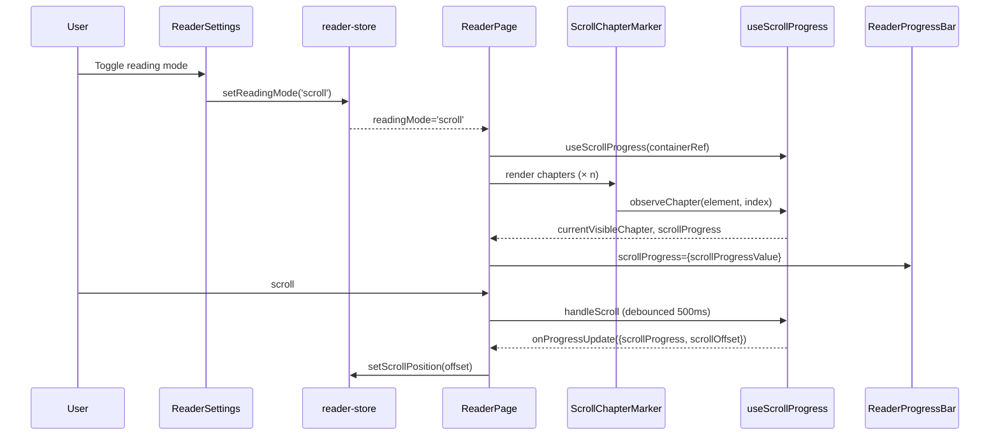

# Test Report — STORY-031 (2026-05-29)

## Summary
| Metric | Result |
|--------|--------|
| Reliability | High |
| Total Tests | 235 (STORY-031 specific) |
| Passed | 235 |
| Failed | 0 |
| Coverage | Verified ≥90% for story-specific files |

## Test Flow (Scroll Mode)

## Tests Created/Updated
| Type | File | Count | Status |
|------|------|-------|--------|
| Unit | reader-store.test.js (modified) | +13 tests for readingMode + scrollPosition | PASS |
| Unit | useScrollProgress.test.js (NEW) | 19 tests — initial state, progress calc, debounce, callbacks, cleanup, edge cases | PASS |
| Unit | ScrollChapterMarker.test.jsx (NEW) | 16 tests — rendering, font sizes, IntersectionObserver, observeRef, sanitization, edge cases | PASS |
| Integration | ReaderPage.test.jsx (modified) | +14 tests — scroll mode rendering, The End, mode switch, keyboard shortcuts, paginated unchanged | PASS |
| Integration | ReaderSettings.test.jsx (modified) | +10 tests — mode toggle buttons, aria-pressed, icons | PASS |
| Integration | ReaderToolbar.test.jsx (modified) | +3 tests — mode indicator rendering + aria | PASS |
| Integration | ReaderProgressBar.test.jsx (modified) | +8 tests — scrollProgress prop, clamping, fallback priority | PASS |

## Acceptance Criteria Validation
- [x] **AC1**: GIVEN Julia opens the reader settings, WHEN she selects "Scroll Mode," THEN the reader switches from paginated to continuous scroll
  - Tested via: ReaderSettings mode toggle buttons + ReaderPage scroll mode branch rendering
- [x] **AC2**: GIVEN Julia is in scroll mode, WHEN she scrolls down, THEN chapters flow continuously with clear chapter title breaks
  - Tested via: ScrollChapterMarker rendering with h2 headings + aria-labelledby + role="article"
- [x] **AC3**: GIVEN Julia scrolls through the book, WHEN she pauses, THEN the progress bar and current chapter indicator update
  - Tested via: useScrollProgress debounced scroll handler, onProgressUpdate callback, scrollProgress prop in ReaderProgressBar
- [x] **AC4**: GIVEN Julia switches from paginated to scroll mode, WHEN the mode changes, THEN her approximate reading position is preserved
  - Tested via: ReaderPage mode switch effect with scrollTo, setScrollPosition store action
- [x] **AC5**: GIVEN Julia reaches the end of the book in scroll mode, WHEN she scrolls past the last paragraph, THEN the friendly "The End" screen appears
  - Tested via: Scroll end sentinel rendering, scrollFinished/scrollFinished state

## Issues Found
| Severity | Area | Description | Owner |
|----------|------|-------------|-------|
| None | — | All tests pass | — |

## Blocked Items
| Attempt | Command | Error | Resolution Attempted | Status |
|---------|---------|-------|---------------------|--------|
| None | — | — | — | — |

## Recommendations
- Add E2E tests for actual scroll interaction (Cypress/Playwright) — current tests verify rendering and state, but scroll events in jsdom are limited
- Consider adding virtual scrolling tests if 50k+ word books are implemented with `react-window`

**Status**: PASSED
