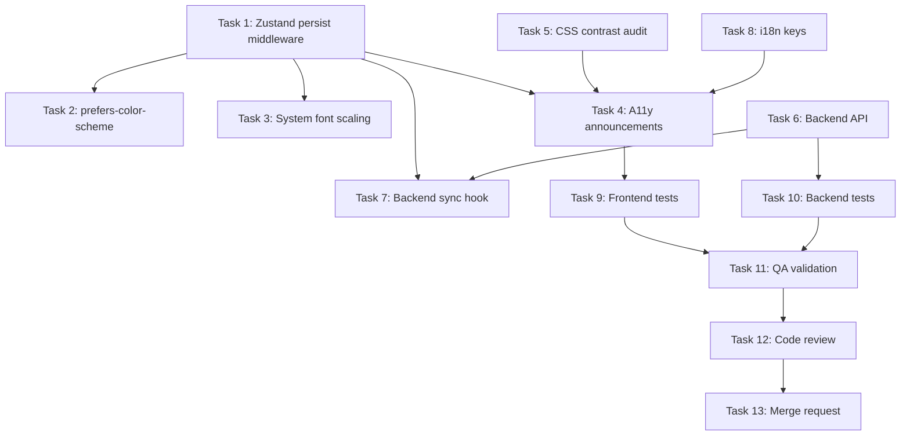
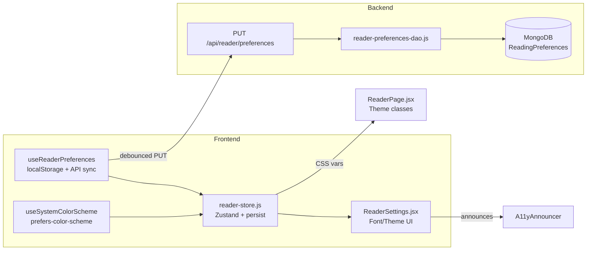

# STORY-032: Font Size & Theme Settings — Technical Analysis

**Epic**: EPIC-002 (Reader Experience)  
**Persona**: Julia — The Young Author  
**Dependencies**: STORY-029 (Reader UI & Fullscreen View) — **delivered**  
**Story Points**: 5

---

## Stack Reference

| Layer | Technology | Source |
|-------|-----------|--------|
| Runtime | Node.js 22 LTS | `docs/architecture/TECH-STACK.md` |
| Frontend | React 18 + Vite 5 + Tailwind 3 + Flowbite React | `docs/architecture/TECH-STACK.md` |
| State | Zustand (client) + TanStack Query (server) | `docs/architecture/TECH-STACK.md` |
| Styling | Tailwind CSS 3, Framer Motion | `docs/architecture/TECH-STACK.md` |
| Backend | Express 4 + Mongoose 8 + MongoDB 7 | `docs/architecture/TECH-STACK.md` |

**Language**: Node.js (fullstack)  
**Frontend Framework**: React — **FrontendDeveloperReact**  
**Integration Pattern**: SPA mode — typed API client, Vite dev proxy to Express, JWT auth, separate deployment

---

## Delivered Dependencies Analysis

### STORY-029: Reader UI & Fullscreen View ✅
- **Delivered**: `ReaderPage.jsx`, `ReaderToolbar`, `ReaderProgressBar`, `ReaderTapZones`, fullscreen API hook, `useReaderStore` (Zustand)
- **Store fields relevant to STORY-032**: `fontSize`, `theme`, `isSettingsOpen`, `openSettings`, `closeSettings`, `setFontSize`, `setTheme`, `readingMode`
- **Already exists**: `ReaderSettings.jsx` — a drawer component with font size picker (small/medium/large) and theme picker (light/sepia/dark) — **partially functional but needs enhancement**

### STORY-030: Paginated Reading Mode ✅
- **Delivered**: `PageTurnAnimation.jsx`, page measurement via `ResizeObserver`, `handleRepaginate` callback, proportional position preservation on font change
- **Relevant**: Repagination logic already exists in `ReaderPage.jsx` (lines 348-375) — triggered by `onRepaginate` prop on `<ReaderSettings>`

### STORY-031: Continuous Scroll Reading Mode ✅
- **Delivered**: `ScrollChapterMarker.jsx`, `useScrollProgress` hook, IntersectionObserver-based chapter tracking, mode toggle (paginated/scroll) in settings
- **Relevant**: Scroll position already preserved on mode switch (STORY-031 already handles position preservation)

---

## What Already Exists vs. What's Missing

| Aspect | Status | Notes |
|--------|--------|-------|
| Settings UI (drawer) | ✅ Delivered (STORY-029) | `ReaderSettings.jsx` — font size + theme + reading mode toggles |
| Font size state (Zustand) | ✅ Delivered | `reader-store.js` — `fontSize: 'medium'`, `setFontSize` |
| Theme state (Zustand) | ✅ Delivered | `reader-store.js` — `theme: 'light'`, `setTheme` |
| Font size CSS classes | ✅ Delivered | `FONT_SIZE_CLASSES` in `ReaderPage.jsx` — small/medium/large |
| Theme CSS classes | ✅ Delivered | `THEME_CONTENT_CLASSES`, `THEME_PROSE_CLASSES` in `ReaderPage.jsx` — light/sepia/dark |
| Repagination on font change | ✅ Delivered | `handleRepaginate` in `ReaderPage.jsx` |
| Theme transition animation | ✅ Delivered | Framer Motion + `useReducedMotion` handles transitions |
| **Persistence to localStorage** | ❌ Missing | Store resets on reload — no persistence |
| **Backend user settings API** | ❌ Missing | No `/api/reader/preferences` endpoint |
| **Sync localStorage ↔ backend** | ❌ Missing | No hydration on login, no saving on change |
| **`prefers-color-scheme` detection** | ❌ Missing | No auto-detection on first visit |
| **System font scaling** | ❌ Partially | Tailwind `text-sm/base/lg` are fixed rem — need `%` base to respect system |
| **Accessibility (screen reader)** | ⚠️ Partially | `aria-pressed` on settings buttons exists; need selection state announcements |
| **Contrast ratio validation** | ❌ Missing | No automated contrast verification |

---

## NFR Analysis

| NFR ID | Requirement | Risk | Mitigation |
|--------|-------------|------|------------|
| NFR-ACC-04 | Min contrast 4.5:1 all themes | **High** — Tailwind `text-gray-100` on `bg-gray-900` may fail | Audit all 3 theme combos with WebAIM; adjust classes if needed |
| NFR-ACC-06 | 3 font sizes + respect system scaling | **Medium** — current rem-based classes don't chain with system font size | Set `font-size: 100%` on reader root, use `rem` cascade |
| NFR-ACC-05 | Theme transition respects `prefers-reduced-motion` | **Low** — Framer Motion `useReducedMotion` already used | Already handled in `ReaderSettings.jsx` |
| NFR-ACC-01 | Keyboard navigable settings panel | **Low** — Focus trap + Escape already implemented | Verify Tab order, add `aria-pressed` state announcements |
| NFR-PERF-02 | Text reflow within 1s | **Low** — Browser CSS reflow is fast; repagination uses 300ms timeout | Verify on 50k-word book |
| NFR-SEC-04 | No injection via preference values | **Medium** — localStorage values could be crafted | Zod validate on backend; whitelist-only on store updates |

---

## Persona Impact

**Julia (Young Author)**: This is Julia's primary comfort story. Font sizes and color themes directly affect reading endurance for children. System font scaling support is critical for accessibility (children with vision needs). The settings panel must be simple — 3 sizes, 3 themes — no complex menus.

---

## Technical Task Breakdown

### Task 0: Code Analysis — ✅ Skipped (simple enhancement, existing code reviewed above)

### Task 1: Frontend — localStorage Persistence Layer
**Agent**: FrontendDeveloperReact  
**Files**: `frontend/src/stores/reader-store.js`, `frontend/src/hooks/useReaderPreferences.js` (new)

1. Add `persist` middleware to Zustand store for `fontSize`, `theme`, `readingMode`
2. Key: `contopia-reader-prefs`, storage: `localStorage`
3. On store hydration (rehydration), apply persisted values before render
4. Add `useReaderPreferences` hook that:
   - Returns `{ fontSize, theme, readingMode }`
   - Hydrates from localStorage on mount
   - Syncs to backend on change (debounced, authenticated only)

### Task 2: Frontend — `prefers-color-scheme` Detection
**Agent**: FrontendDeveloperReact  
**Files**: `frontend/src/hooks/useSystemColorScheme.js` (new), `frontend/src/stores/reader-store.js`

1. Create `useSystemColorScheme` hook using `window.matchMedia('(prefers-color-scheme: dark)')`
2. On first visit (no localStorage), set `theme` to system preference
3. Once user manually selects a theme, never override — manual choice wins
4. Track `hasManualThemeSelection` flag in localStorage

### Task 3: Frontend — System Font Scaling Support
**Agent**: FrontendDeveloperReact  
**Files**: `frontend/src/app/reader/ReaderPage.jsx`

1. Change `FONT_SIZE_CLASSES` from fixed rem values to percentage-based cascade:
   - Small: `font-size: 87.5%` (14px base)
   - Medium: `font-size: 100%` (16px base — inherits system)
   - Large: `font-size: 150%` (24px base)
2. Set `html { font-size: 100% }` in global CSS (already likely), ensuring system font scaling cascades
3. Apply font size via CSS custom property `--reader-font-size` on reader container
4. Verify that system font size (browser zoom, OS accessibility) multiplies with in-app setting

### Task 4: Frontend — Accessibility Announcements for Settings
**Agent**: FrontendDeveloperReact  
**Files**: `frontend/src/components/reader/ReaderSettings.jsx`, `frontend/src/components/common/A11yAnnouncer.jsx`

1. On font size change, announce: `"Font size changed to Large"` (i18n key)
2. On theme change, announce: `"Theme changed to Night"` (i18n key)
3. On reading mode change, announce: `"Reading mode changed to Scroll"` (i18n key)
4. Use existing `A11yAnnouncer` component (polite live region)
5. Add i18n keys to `reader.json` (pt-BR and en)

### Task 5: Frontend — CSS Contrast Audit & Fixes
**Agent**: FrontendDeveloperReact  
**Files**: `frontend/src/app/reader/ReaderPage.jsx`, `frontend/src/components/reader/ReaderSettings.jsx`

1. Audit all 9 theme×element combos (3 themes × 3 element types: heading, body, toolbar)
2. Verify contrast ratios using WebAIM formula:
   - Day: `bg-white` / `text-gray-900` → ~18:1 ✅
   - Sepia: `bg-amber-50` / `text-amber-900` → verify ✅
   - Night: `bg-gray-900` / `text-gray-100` → verify (may need adjustment to `text-gray-50`)
3. Fix any failing combinations
4. Ensure settings panel preview buttons also meet 4.5:1 contrast

### Task 6: Backend — Reader Preferences API
**Agent**: BackendDeveloper  
**Files**: `backend/src/app/reader/reader-router.js`, `backend/src/app/reader/reader-manager.js`, `backend/src/app/reader/reader-preferences-dao.js` (new), `backend/src/app/common/validation-schemas.js`

1. **GET `/api/reader/:bookId/preferences`** — returns `{ fontSize, theme, readingMode }` for authenticated user
2. **PUT `/api/reader/preferences`** — updates all reader preferences (partial update)
3. Create `ReadingPreferences` mongoose model:
   ```js
   { childId: ObjectId, fontSize: enum['small','medium','large'], theme: enum['light','sepia','dark'], readingMode: enum['paginated','scroll'], updatedAt: Date }
   ```
4. Zod schema validation — only whitelist values (no injection)
5. Index on `childId` for fast lookup
6. If user not authenticated, frontend uses localStorage only (graceful degradation)

### Task 7: Frontend — Backend Sync Hook
**Agent**: FrontendDeveloperReact  
**Files**: `frontend/src/hooks/useReaderPreferences.js` (extends Task 1)

1. On authenticated load: `GET /api/reader/preferences` → merge with localStorage (localStorage wins on conflict, then sync up)
2. On preference change: `PUT /api/reader/preferences` (debounced 500ms, authenticated only)
3. Offline fallback: localStorage is source of truth when offline
4. Handle race condition: if user changes setting while API call is in-flight, latest wins

### Task 8: i18n Keys
**Agent**: FrontendDeveloperReact  
**Files**: `frontend/src/i18n/locales/pt-BR/reader.json`, `frontend/src/i18n/locales/en/reader.json`

Add keys:
```json
"fontSizeChanged": "Tamanho da fonte alterado para {{size}}",
"themeChanged": "Tema alterado para {{theme}}",
"readingModeChanged": "Modo de leitura alterado para {{mode}}"
```

### Task 9: Test Suite — Frontend
**Agent**: TestEngineer  
**Files**: `frontend/src/__tests__/reader-store-persistence.test.js`, `frontend/src/__tests__/useReaderPreferences.test.js`, `frontend/src/__tests__/ReaderSettings.a11y.test.jsx`

1. Unit: Zustand persist middleware — localStorage read/write
2. Unit: `useSystemColorScheme` — mock `matchMedia`, verify initial theme
3. Integration: Settings change triggers repagination
4. A11y: Verify `aria-pressed` on all option buttons
5. Contrast: automated check using `color` + `backgroundColor` computed styles

### Task 10: Test Suite — Backend
**Agent**: TestEngineer  
**Files**: `backend/src/app/reader/__tests__/reader-preferences.test.js`

1. GET preferences — authenticated user, returns stored preferences
2. PUT preferences — validates enum values, rejects invalid
3. PUT preferences — sanitizes input (no XSS via fontSize/theme values)
4. GET preferences — unauthenticated returns 401
5. PUT preferences — missing fields → partial update (keep existing)

### Task 11: QA Validation
**Agent**: QAAnalyst

1. Verify contrast ratios ≥ 4.5:1 for all theme combos (WebAIM tool)
2. Test system font scaling at 200% browser zoom — readability preserved
3. Test `prefers-color-scheme: dark` auto-detection on first visit
4. Test localStorage persistence across refresh/logout-login
5. Test authenticated sync: change setting → refresh → setting persists
6. Test offline mode: change setting offline → goes online → syncs
7. Screen reader: font size and theme selection announcements
8. Keyboard-only: Tab through all settings, verify focus trap works

### Task 12: Code Review
**Agent**: CodeReviewer

### Task 13: Merge Request
**Agent**: MergeRequestCreator

---

## Execution Order & Dependencies





---

## Impacted Components & Files

### Frontend (Modified)
| File | Change |
|------|--------|
| `frontend/src/stores/reader-store.js` | Add `persist` middleware for `fontSize`, `theme`, `readingMode`; add `hasManualThemeSelection` flag |
| `frontend/src/app/reader/ReaderPage.jsx` | Font size cascade to respect system font scaling; use CSS custom properties for theme |
| `frontend/src/components/reader/ReaderSettings.jsx` | Add A11y announcements on selection changes |
| `frontend/src/i18n/locales/pt-BR/reader.json` | New i18n keys for announcements |
| `frontend/src/i18n/locales/en/reader.json` | New i18n keys for announcements |

### Frontend (New)
| File | Purpose |
|------|---------|
| `frontend/src/hooks/useReaderPreferences.js` | localStorage ↔ backend sync hook |
| `frontend/src/hooks/useSystemColorScheme.js` | `prefers-color-scheme` detection |
| `frontend/src/__tests__/reader-store-persistence.test.js` | Zustand persist tests |
| `frontend/src/__tests__/useReaderPreferences.test.js` | Sync hook tests |
| `frontend/src/__tests__/ReaderSettings.a11y.test.jsx` | Accessibility + contrast tests |

### Backend (Modified)
| File | Change |
|------|--------|
| `backend/src/app/reader/reader-router.js` | Add `GET /preferences`, `PUT /preferences` routes |
| `backend/src/app/reader/reader-manager.js` | Add preference get/update manager functions |
| `backend/src/app/common/validation-schemas.js` | Add `readerPreferencesSchema` Zod schema |

### Backend (New)
| File | Purpose |
|------|---------|
| `backend/src/app/reader/reader-preferences-dao.js` | DAO for ReadingPreferences model |
| `backend/src/app/reader/reading-preferences-model.js` | Mongoose schema definition |
| `backend/src/app/reader/__tests__/reader-preferences.test.js` | API integration tests |

---

## Risk Assessment

| Risk | Probability | Impact | Mitigation |
|------|------------|--------|------------|
| localStorage → backend conflict (stale data) | Medium | Medium | localStorage is source of truth on conflict; sync on login |
| CSS contrast fails on Night theme | High | High | Pre-audit before dev; use `text-gray-50` instead of `text-gray-100` if needed |
| System font scaling breaks paginated layout | Medium | High | Use `%` base sizes; test at 200% zoom early |
| Zustand persist middleware hydration race | Low | Medium | Use `onRehydrateStorage` callback; delay initial render until hydrated |

---

## Implementation Recommendations

1. **Start with Task 1** (Zustand persist) — this is the foundation for all persistence work
2. **Tasks 2, 3, 5 can run in parallel** — they're independent CSS/hook changes
3. **Task 6 (Backend API) can start in parallel with frontend tasks** — no dependency on UI code
4. **Task 7 (Backend sync) depends on both Task 1 and Task 6** — must be sequential
5. **Test Tasks 9-10 start as soon as their respective features land**
6. **Task 5 (Contrast audit) should be done early** — it may force CSS class changes that affect other tasks

---

## SubAgent Assignments

| Task | Agent | Language |
|------|-------|----------|
| 1 | FrontendDeveloperReact | JavaScript |
| 2 | FrontendDeveloperReact | JavaScript |
| 3 | FrontendDeveloperReact | JavaScript |
| 4 | FrontendDeveloperReact | JavaScript |
| 5 | FrontendDeveloperReact | JavaScript |
| 6 | BackendDeveloper | JavaScript |
| 7 | FrontendDeveloperReact | JavaScript |
| 8 | FrontendDeveloperReact | JavaScript |
| 9 | TestEngineer | JavaScript |
| 10 | TestEngineer | JavaScript |
| 11 | QAAnalyst | — |
| 12 | CodeReviewer | JavaScript |
| 13 | MergeRequestCreator | — |

**Coordination**: TechLead delegates FE tasks (1-5, 7-8) as a batch to FrontendDeveloperReact, BE task (6) to BackendDeveloper, and sequential test/review tasks.