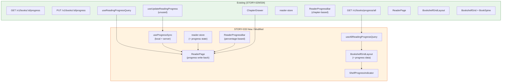
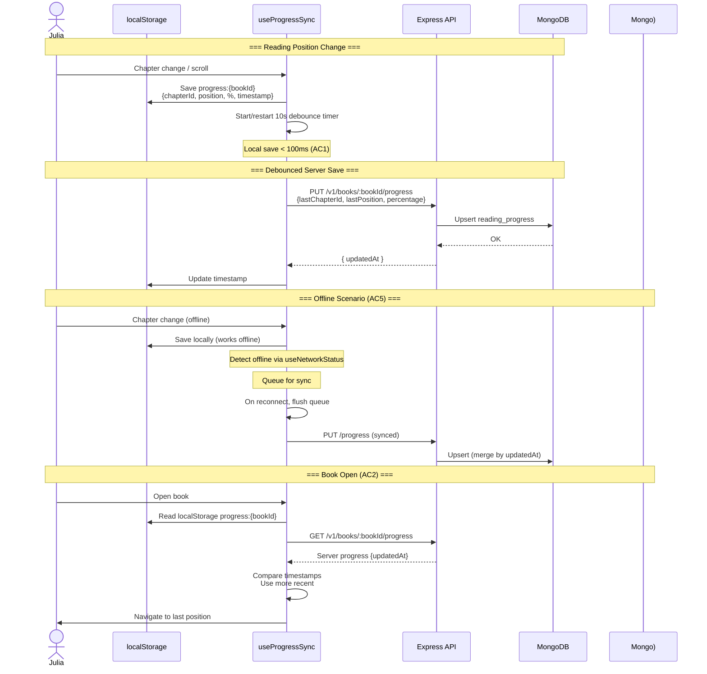
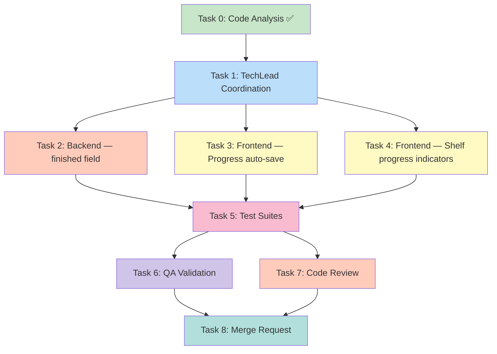

# STORY-033: Reading Progress Tracking — Technical Analysis

**Epic**: EPIC-002
**Persona**: Julia — The Young Author
**Priority**: Must Have | **Story Points**: 3
**Dependencies**: STORY-029 (Reader UI), STORY-030 (Bookshelf)
**Stack Source**: `docs/architecture/TECH-STACK.md`

---

## Language & Framework Detection

| Indicator | Detected | Language/Framework |
|-----------|----------|-------------------|
| `package.json`, `vite.config.*` | ✅ | **Node.js** |
| `react` in deps, `.jsx` files | ✅ | **React 18** |
| `tailwindcss` in deps | ✅ | **Tailwind CSS** |
| `zustand` in deps | ✅ | **Zustand** |
| `@tanstack/react-query` in deps | ✅ | **TanStack Query** |

**Frontend Framework**: React → **FrontendDeveloperReact**
**Backend**: Node.js/Express → **BackendDeveloper**
**Integration Pattern**: React SPA → Express API proxy (Vite dev proxy → nginx in prod)

---

## Existing Codebase Analysis

### Backend — Fully Implemented (No Changes Needed)

| Component | File | Status | Details |
|-----------|------|--------|---------|
| ReadingProgress model | `backend/src/app/book/book-model.js` L327-369 | ✅ Complete | Schema: `userId`, `bookId`, `lastChapterId`, `lastPosition`, `percentage`, unique index `{userId,bookId}` |
| Progress DAO | `backend/src/app/book/book-dao.js` L293-329 | ✅ Complete | CRUD + upsert + findByUser + softDelete |
| Progress manager | `backend/src/app/book/book-manager.js` L357-380 | ✅ Complete | `updateReadingProgressManager`, `getReadingProgressManager`, `getReadingProgressByUserManager` |
| Progress routes | `backend/src/app/book/book-router.js` L193-237 | ✅ Complete | `GET /:bookId/progress`, `PUT /:bookId/progress`, `GET /progress/all` |
| Validation | `backend/src/app/book/validation-schemas.js` L152-156 | ✅ Complete | `progressUpdateSchema`: optional `lastChapterId`, `lastPosition`, `percentage` |
| Tests | `backend/src/app/reader/__tests__/reading-progress-*.test.js` | ✅ Complete | Model tests (206 lines) + DAO tests (237 lines) |

**Conclusion: Zero backend changes required.** All API endpoints, model, DAO, and validation are complete and tested.

### Frontend — Partially Implemented (Primary Work Area)

| Component | File | Lines | Status | Gap |
|-----------|------|-------|--------|-----|
| Progress query hook | `frontend/src/hooks/useReadingProgressQuery.js` | 16 | ✅ Works | — |
| Progress mutation hook | `frontend/src/hooks/useUpdateReadingProgress.js` | 36 | ⚠️ Unused | Not called anywhere |
| reader-store | `frontend/src/stores/reader-store.js` | 66 | ⚠️ No progress state | Missing percentage, position sync logic |
| ReaderPage | `frontend/src/app/reader/ReaderPage.jsx` | 378 | ⚠️ Read-only | Reads progress but never writes back |
| ReaderProgressBar | `frontend/src/components/reader/ReaderProgressBar.jsx` | 29 | ⚠️ Inaccurate | Uses `(chapterIndex+1)/total*100` not server `percentage` |
| ChapterDrawer | `frontend/src/components/reader/ChapterDrawer.jsx` | 130 | ✅ Works | Uses `progress.lastChapterId` for status |
| Bookshelf/Shelf | `frontend/src/app/shelf/` | — | ❌ No progress | No progress data fetched or displayed |
| i18n (en) | `frontend/src/i18n/en/reader.json` | 36 | ⚠️ Missing | No shelf progress strings |
| Network status | `frontend/src/hooks/useNetworkStatus.js` | — | ✅ Exists | Can detect online/offline |
| useDebouncedResize | `frontend/src/hooks/useDebouncedResize.js` | — | ✅ Exists | — |

### Key Gaps (STORY-033 Scope)

| # | Gap | AC Reference |
|---|-----|-------------|
| 1 | **No progress write-back** — `useUpdateReadingProgress` exists but is never called | AC1, AC2 |
| 2 | **No debounced auto-save** — progress must save every 10s or on page turn | AC1 |
| 3 | **No local persistence** — no localStorage for offline-first saving | AC5 |
| 4 | **No sync merge logic** — no timestamp-based merge of local vs server progress | AC5 |
| 5 | **Progress bar uses chapter index** instead of server `percentage` field | AC4 (indirect) |
| 6 | **No shelf progress indicators** — no visual progress on bookshelf spines/covers | AC4 |
| 7 | **No bulk progress fetch hook** — `GET /progress/all` exists but no frontend hook | AC4 |
| 8 | **No "finished" state handling** — no `finished` boolean in model or UI | AC3 |
| 9 | **No "restart" flow** — no UI for restarting a finished book | AC3 |
| 10 | **No shelf i18n strings** — no progress labels for bookshelf view | AC4 |

---

## Technical Task Breakdown

### Task 0: Code Analysis ✅ (completed above)

### Task 1: TechLead Coordination
- **Agent**: TechLead
- **Dependencies**: None
- **Output**: Orchestrate Tasks 2-7

### Task 2: Backend — Add `finished` Field to ReadingProgress

The story's AC3 requires a "finished" state. The current schema has `percentage` (0-100) but no explicit `finished` boolean. The Technical Notes say: *"when `percentage >= 99%`, set `finished = true`"* — this requires a schema change.

**Changes:**
- `book-model.js`: Add `finished: { type: Boolean, default: false }` to `readingProgressSchema`
- `book-dao.js`: No change needed (upsert already handles arbitrary fields)
- `book-manager.js`: In `updateReadingProgressManager`, auto-set `finished = true` when `percentage >= 99`; reset `finished = false` when `percentage < 99`
- `validation-schemas.js`: Add `finished: z.boolean().optional()` to `progressUpdateSchema`
- Tests: Add test cases for finished state transitions

**Agent**: BackendDeveloper

### Task 3: Frontend — Progress Auto-Save + Local Persistence

**Primary implementation task.** Wire up the full progress tracking cycle.

**3.1 New Hook: `useProgressSync.js`**
- Orchestrates local-first progress saving with server sync
- On position change: save to `localStorage` key `progress:{bookId}` immediately
- Debounced server save (10s or on chapter change) via `useUpdateReadingProgress.debouncedMutate`
- On mount: compare `localStorage` timestamp vs server `updatedAt`; use more recent
- On network reconnect: flush pending local progress to server
- Uses `useNetworkStatus` for online/offline detection
- Returns: `{ saveProgress, localProgress, syncStatus }`

**3.2 Modify: `ReaderPage.jsx`**
- Integrate `useProgressSync` hook
- On chapter change: call `saveProgress({ lastChapterId, lastPosition, percentage })`
- Calculate `percentage` as `(currentChapterIndex + 1) / totalChapters * 100`
- On mount: restore position from merged progress (local + server)
- On book finish (last page of last chapter): set `finished: true`, show "The End" screen
- "Restart" option: call `saveProgress({ percentage: 0, lastChapterId: null, lastPosition: 0, finished: false })`

**3.3 Modify: `reader-store.js`**
- Add `localProgress: null` state field
- Add `syncStatus: 'idle' | 'saving' | 'error'` state field
- Add `setLocalProgress(progress)` action
- Add `setSyncStatus(status)` action

**3.4 Modify: `ReaderProgressBar.jsx`**
- Accept `percentage` prop from server/local data instead of computing from chapter index
- Fallback: if no percentage, estimate from `(chapterIndex + 1) / total * 100`

**Agent**: FrontendDeveloperReact

### Task 4: Frontend — Shelf Progress Indicators

**4.1 New Hook: `useAllReadingProgressQuery.js`**
- Calls `GET /v1/books/progress/all`
- Returns: `{ data: ReadingProgress[] }` — array of all user progress entries
- TanStack Query config: `staleTime: 60s`, `gcTime: 5min`, `refetchOnWindowFocus: true`
- Used by bookshelf to display progress on each book

**4.2 New Component: `ShelfProgressIndicator.jsx`**
- Thin progress bar overlay on book spine (bottom 10% height by default)
- Color: green for in-progress, gold for finished
- Accessible: `aria-label` with `t('shelf:progressLabel', { percentage })` 
- `aria-valuenow={percentage}` `aria-valuemin={0}` `aria-valuemax={100}` role="progressbar"

**4.3 Modify: `BookshelfGridLayout.jsx`**
- Fetch all reading progress via `useAllReadingProgressQuery`
- Pass progress map to `BookshelfGrid`

**4.4 Modify: `BookshelfGrid.jsx` → `BookSpine.jsx`**
- Add `progress` prop → render `ShelfProgressIndicator` overlay when progress exists

**4.5 i18n Updates:**
- `shelf.json` (en): Add `progressLabel`, `finishedLabel`, `continueReadingLabel`
- `shelf.json` (pt-BR): Add translations

**Agent**: FrontendDeveloperReact (can parallelize with Task 3 since no shared state)

### Task 5: Test Suites
- **Agent**: TestEngineer
- **Dependencies**: Tasks 2, 3, 4 complete
- **Scope**:
  - Unit: `useProgressSync` hook (local save, debounce, merge logic, offline flush)
  - Unit: `useAllReadingProgressQuery` hook
  - Unit: `ShelfProgressIndicator` component (render with percentage, accessibility)
  - Unit: reader-store new state/actions
  - Integration: ReaderPage progress save on chapter change
  - Integration: "finished" state → restart flow
  - Integration: offline → online sync
  - Backend: `finished` field model/manager tests
  - E2E: progress saves on page turn and appears on shelf

### Task 6: QA Validation
- **Agent**: QAAnalyst
- **Dependencies**: Task 5 complete
- **Scope**: Verify all 5 acceptance criteria

### Task 7: Code Review
- **Agent**: CodeReviewer
- **Dependencies**: Task 5 complete
- **Scope**: Full PR review (backend model change + frontend progress flow)

### Task 8: Merge Request
- **Agent**: MergeRequestCreator
- **Dependencies**: Tasks 6 + 7 complete

---

## Architecture Diagram

## Progress Sync Flow

## Execution Flow

---

## NFR Analysis

| NFR | Requirement | Implementation Strategy | Verification |
|-----|-------------|------------------------|--------------|
| NFR-PERF-05 | Progress save API P95 < 500ms | Upsert is indexed (`{userId, bookId}` unique); Redis cache not needed for single-doc upsert | k6 load test, p95 timing |
| NFR-PERF-06 | Local save < 100ms | `localStorage.setItem` is synchronous and < 10ms; wrapped in try/catch for quota errors | Unit test with timing mock |
| NFR-ACC-03 | Screen reader announces reading position on book open | Aria-live region: "Resuming Chapter 3, page 12" announced on book open | VoiceOver/NVDA test |
| NFR-ACC-01 | Progress indicators have accessible labels | `ShelfProgressIndicator`: `role="progressbar"`, `aria-valuenow`, `aria-valuemin`, `aria-valuemax`, `aria-label` | axe-core audit |
| NFR-AVL-04 | Graceful degradation — local save when offline | `useProgressSync`: detect offline via `useNetworkStatus`, save to `localStorage`, queue sync on reconnect | Integration test: disconnect network → save → reconnect → verify sync |
| NFR-SEC-04 | Progress data validated on save | Existing Zod `progressUpdateSchema` validates `lastChapterId`, `lastPosition` (min 0), `percentage` (0-100), `finished` (boolean) | Existing test suite + new `finished` field tests |

---

## Persona Impact

**Julia — The Young Author**: Primary beneficiary. Progress tracking lets Julia resume reading exactly where she left off — essential for young readers who may read in short sessions. The shelf indicator provides a sense of accomplishment ("I'm 60% through!"). The offline support ensures progress is never lost even on unstable connections. The "finished" state and restart flow create a satisfying completion experience.

---

## Impacted Files

| File | Action | Description |
|------|--------|-------------|
| `backend/src/app/book/book-model.js` | **MODIFY** | Add `finished: Boolean` field to `readingProgressSchema` |
| `backend/src/app/book/book-manager.js` | **MODIFY** | Auto-set `finished=true` when `percentage >= 99` |
| `backend/src/app/book/validation-schemas.js` | **MODIFY** | Add `finished: z.boolean().optional()` to `progressUpdateSchema` |
| `frontend/src/hooks/useProgressSync.js` | **CREATE** | Local-first progress sync orchestrator hook |
| `frontend/src/hooks/useAllReadingProgressQuery.js` | **CREATE** | Bulk progress fetch for shelf |
| `frontend/src/components/reader/ShelfProgressIndicator.jsx` | **CREATE** | Progress bar overlay for book spines |
| `frontend/src/app/reader/ReaderPage.jsx` | **MODIFY** | Integrate progress write-back, finished state, restart flow |
| `frontend/src/stores/reader-store.js` | **MODIFY** | Add `localProgress`, `syncStatus` state |
| `frontend/src/components/reader/ReaderProgressBar.jsx` | **MODIFY** | Accept `percentage` prop from server data |
| `frontend/src/app/shelf/BookshelfGridLayout.jsx` | **MODIFY** | Fetch all progress, pass to grid |
| `frontend/src/components/shelf/BookSpine.jsx` | **MODIFY** | Render `ShelfProgressIndicator` overlay |
| `frontend/src/i18n/en/shelf.json` | **MODIFY** | Add progress label strings |
| `frontend/src/i18n/pt-BR/shelf.json` | **MODIFY** | Add progress label translations |

---

## Risk Assessment

| Risk | Likelihood | Impact | Mitigation |
|------|-----------|--------|------------|
| localStorage quota exceeded (many books) | Low | Medium | Try/catch on setItem; fallback to server-only if quota exceeded; store only most recent 20 books |
| Timestamp drift between client and server | Low | Medium | Use server `updatedAt` as source of truth; client timestamps only for local comparison |
| Progress percentage calculation inconsistent (chapter vs scroll) | Medium | High | Use `lastChapterIndex / totalChapters * 100` as percentage source; store `lastPosition` for scroll offset restoration |
| Race condition: user reads on 2 tabs simultaneously | Low | Low | Upsert uses `{userId, bookId}` unique index — last write wins; acceptable for reading progress |
| Bookshelf performance with many progress entries | Low | Medium | `GET /progress/all` returns lean data; TanStack Query caches for 60s; lazy load after shelf renders |

---

## Execution Summary

- **Task 2 (Backend)**: Small — add `finished` boolean to model + manager logic
- **Tasks 3 + 4 (Frontend)**: Primary work — progress sync hook (local-first + debounce), ReaderPage integration, shelf progress indicators
- **Tasks 3 & 4 CAN run in parallel** — Task 3 (reader) and Task 4 (shelf) touch independent files
- **Task 2 MUST complete before Task 3** — frontend needs `finished` field in API response
- **Estimated Effort**: 3 story points → ~2-3 days