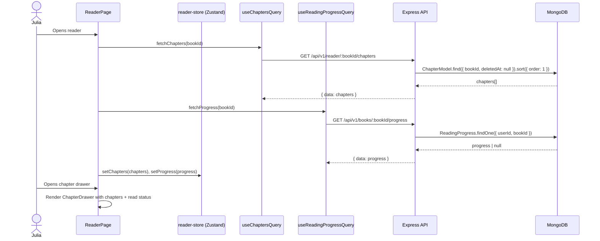
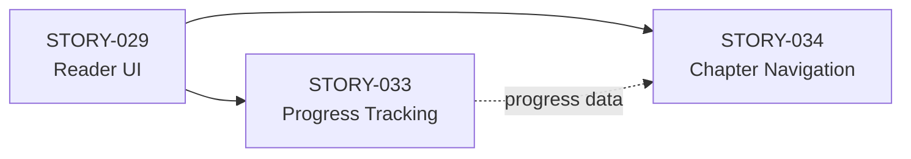
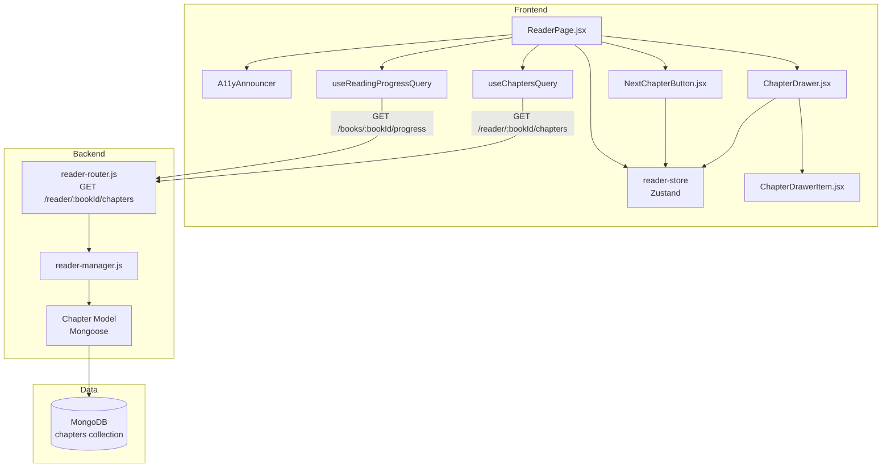
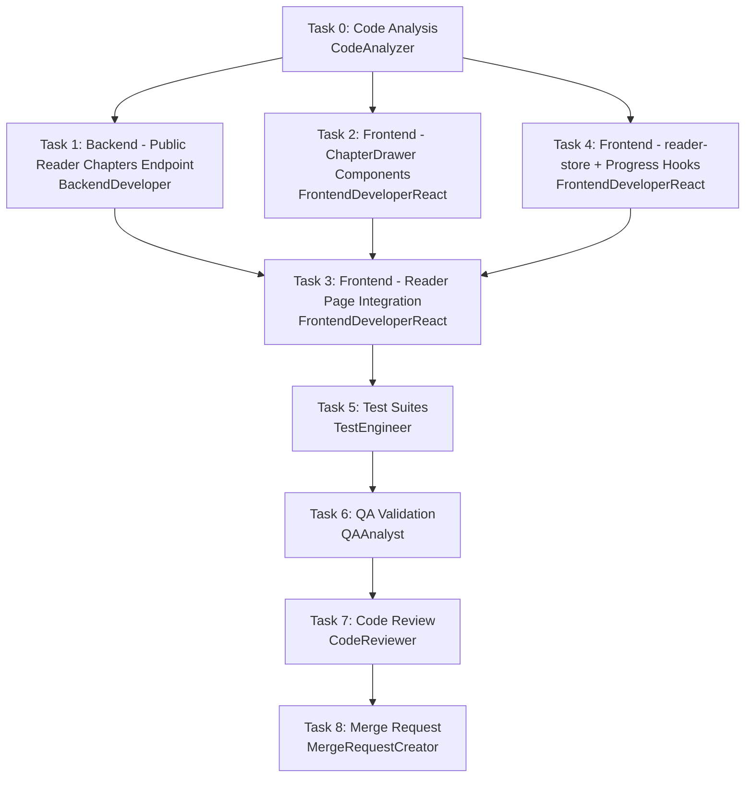

# STORY-034: Chapter Navigation — Technical Analysis

**Epic**: EPIC-002  
**Story Points**: 3  
**Dependencies**: STORY-029 (Reader UI), STORY-033 (Reading Progress)  
**Tech Stack**: React 18 + Zustand + TanStack Query + Framer Motion + Flowbite + Tailwind | Express + Mongoose + Redis

---

## 1. Story Summary

Julia needs to jump to any chapter in her book directly from a chapter navigation panel. The panel shows all chapters with titles and read-status indicators. Tapping a chapter navigates to that chapter's start. A "Next Chapter" button appears when applicable. Single-chapter books hide chapter navigation entirely. Must meet WCAG 2.1 AA and render chapter jumps under 1s.

---

## 2. Component / File Inventory

### New Files (Frontend)

| # | Path | Purpose |
|---|------|---------|
| 1 | `frontend/src/components/reader/ChapterDrawer.jsx` | Drawer/sidebar listing chapters with read status. Responsive: left panel on desktop, bottom sheet on mobile. |
| 2 | `frontend/src/components/reader/ChapterDrawerItem.jsx` | Single chapter row: title, read-status icon, click handler. Keyboard-focusable. |
| 3 | `frontend/src/components/reader/NextChapterButton.jsx` | "Next Chapter" toolbar button. Hidden when on last chapter or single-chapter book. |
| 4 | `frontend/src/hooks/useReadingProgressQuery.js` | TanStack Query hook: `GET /api/v1/books/:bookId/progress`. Returns `{ lastChapterId, lastPosition, percentage }`. |
| 5 | `frontend/src/hooks/useUpdateReadingProgress.js` | TanStack Query mutation: `PUT /api/v1/books/:bookId/progress`. Debounced. |
| 6 | `frontend/src/stores/reader-store.js` | Zustand store for reader UI state: current chapter index, drawer open/close, reading mode. |
| 7 | `frontend/src/i18n/locales/en/reader.json` | Add keys: `chapterList`, `chapterRead`, `chapterUnread`, `chapterInProgress`, `openChapterList`, `nextChapterBtn` |
| 8 | `frontend/src/i18n/locales/pt-BR/reader.json` | Same keys, Portuguese. |

### Modified Files (Frontend)

| # | Path | Change |
|---|------|--------|
| 9 | `frontend/src/app/reader/ReaderPage.jsx` | Replace placeholder. Wire up: chapter list from `useChaptersQuery`, progress from `useReadingProgressQuery`, Zustand `reader-store`. Render `ChapterDrawer` + `NextChapterButton`. |
| 10 | `frontend/src/hooks/useChaptersQuery.js` | Add `refetchOnWindowFocus: false` for reader usage (avoid stale refetch during reading). No code change needed if already set; verify. |
| 11 | `frontend/src/hooks/usePulledOutBook.js` | Pass `chapterId` query param on navigation: `/reader/:bookId?chapter=<id>` for direct chapter linking. |

### New Files (Backend)

| # | Path | Purpose |
|---|------|---------|
| 12 | `backend/src/app/reader/reader-router.js` | Reader-specific routes: `GET /api/v1/reader/:bookId/chapters` (public, no ownership guard). |
| 13 | `backend/src/app/reader/reader-manager.js` | Business logic: fetch book chapters for reading (allows published books without ownership check). |

### Modified Files (Backend)

| # | Path | Change |
|---|------|--------|
| 14 | `backend/src/app/book/book-router.js` | No changes needed — existing `GET /:bookId/chapters` has ownership guard. New public route in `reader-router`. |
| 15 | `backend/src/app/common/validation-schemas.js` | Add `readerChaptersParamsSchema` for the public reader chapters endpoint. |
| 16 | `backend/src/routes.js` (or main app mount) | Mount `reader-router` at `/api/v1/reader`. |

### Test Files

| # | Path | Purpose |
|---|------|---------|
| 17 | `frontend/src/components/reader/ChapterDrawer.test.jsx` | Unit tests: renders chapters, read status, click navigation, keyboard nav. |
| 18 | `frontend/src/components/reader/ChapterDrawerItem.test.jsx` | Unit tests: a11y, screen reader text, focus states. |
| 19 | `frontend/src/components/reader/NextChapterButton.test.jsx` | Unit tests: visibility logic, single-chapter hide, last-chapter hide. |
| 20 | `frontend/src/hooks/useReadingProgressQuery.test.js` | Hook tests: query key, stale time, caching. |
| 21 | `backend/src/app/reader/__tests__/reader-manager.test.js` | Unit tests: public chapter fetching, published-only guard. |

---

## 3. Data States, Patterns, and Flows

### 3.1 Chapter List Data Flow



### 3.2 Chapter Read Status Derivation

```
For each chapter:
  IF progress.lastChapterId === chapter._id:
    IF progress.percentage === 100 OR (isLastChapter AND progress.percentage >= 95):
      status = "read"
    ELSE:
      status = "in-progress"
  ELSE IF chapter order < chapter of lastChapterId:
    status = "read"
  ELSE:
    status = "unread"
```

**Important**: Status is derived client-side by comparing `chapter.order` against the chapter referenced by `progress.lastChapterId`. Chapters with lower `order` than the current chapter are marked "read".

### 3.3 Chapter Navigation Flow

```mermaid
flowchart TD
    A[Julia taps chapter in drawer] --> B{Current reading mode?}
    B -->|Paginated| C[Calculate page offset for chapter start]
    B -->|Scroll| D[Calculate scroll offset for chapter start]
    C --> E[Animate transition to page]
    D --> F[Animate scroll to position]
    E --> G[Update reader-store: currentChapterIndex]
    F --> G
    G --> H[Close chapter drawer]
    H --> I[Announce: "Navigated to Chapter X" via A11yAnnouncer]
```

### 3.4 Zustand Store Shape (reader-store.js)

```javascript
{
  // Chapter navigation
  currentChapterIndex: 0,     // index into chapters array
  isChapterDrawerOpen: false,
  
  // Actions
  setCurrentChapterIndex: (idx) => ...,
  openChapterDrawer: () => ...,
  closeChapterDrawer: () => ...,
  toggleChapterDrawer: () => ...,
}
```

### 3.5 Reader Route Structure

Current route: `/reader/:bookId`  
Recommended: `/reader/:bookId?chapter=<chapterId>` (query param, not path param)

- URL query param allows direct linking to a specific chapter
- `chapterId` defaults to `progress.lastChapterId` if not provided, or first chapter
- No route registration changes needed — `useSearchParams` handles this

---

## 4. Key Technical Decisions

| Decision | Choice | Rationale |
|----------|--------|-----------|
| **Chapter drawer UI** | Responsive sidebar (desktop) / bottom sheet (mobile) | Matches STORY-029 "drawer/sidebar (left on tablet/desktop, bottom sheet on mobile)" |
| **Chapter data source** | New public endpoint `GET /api/v1/reader/:bookId/chapters` | Existing `GET /books/:bookId/chapters` has ownership guard — readers of published books would get 403 |
| **Read status source** | Client-side derivation from `reading_progress` | No new backend field needed. Compare `lastChapterId` + `percentage` against ordered chapter list |
| **Navigation target** | Chapter-first-paragraph scroll offset | `lastPosition` in progress model is a number; for chapter navigation, we scroll to chapter's `order` position. Page-calculation or DOM scroll based on chapter boundary markers |
| **Drawer trigger** | Toolbar button + keyboard shortcut (`g` or `Ctrl+Shift+C`) | Per technical notes in story. Also close on backdrop tap, Escape key |
| **Single chapter behavior** | Hide chapter list button + hide "Next Chapter" | Per AC5 and technical notes |
| **State management** | Zustand `reader-store` + TanStack Query | Zustand for UI state (drawer, current chapter), TanStack Query for server state (chapters, progress) |
| **Animation** | Framer Motion `AnimatePresence` | Respects `prefers-reduced-motion` via `useReducedMotion()` hook. Per NFR-ACC-05 |
| **Accessibility** | `role="dialog"`, `aria-label`, keyboard trap in drawer | Per NFR-ACC-01, NFR-ACC-03. Screen reader announces chapter name + status |
| **Public chapter endpoint** | Checks `book.status === 'published'` OR `book.authorId === userId` | Allows authors to read their own drafts AND any published book |

---

## 5. Dependency Integration

### STORY-029: Reader UI & Fullscreen View

**What STORY-029 provides (must be implemented first):**
- ReaderPage layout with toolbar (back, settings, chapter-list button)
- Fullscreen CSS container (`position: fixed`, `inset: 0`)
- Toolbar auto-hide (tap to show, 2s to fade)
- Route `/reader/:bookId`
- Framer Motion transition on reader open

**What STORY-034 consumes from STORY-029:**
- Chapter-list button in the toolbar → triggers `openChapterDrawer()`
- Reader layout container → `ChapterDrawer` overlays inside it
- Reader route + bookId param → fetch chapters and progress
- `A11yAnnouncer` component (already exists at `components/common/A11yAnnouncer.jsx`)

**If STORY-029 not yet implemented**: `ChapterDrawer` and `NextChapterButton` must be built as standalone components that plug into a `ReaderPage` shell. The shell must be created as part of STORY-029 or as a minimal scaffold in STORY-034.

### STORY-033: Reading Progress Tracking

**What STORY-033 provides (must be implemented before or in parallel):**
- `reading_progress` model and API endpoints (already exist in `book-router.js`)
- `useReadingProgressQuery` hook (new, STORY-034 creates the hook)
- `useUpdateReadingProgress` mutation (new, STORY-034 creates the mutation)
- Progress auto-save on page turn / scroll
- Local storage fallback for offline

**What STORY-034 consumes from STORY-033:**
- `progress.lastChapterId` → determines "in progress" chapter
- `progress.percentage` + chapter order → derives read/unread status per chapter
- `progress.lastPosition` → on chapter jump, reset position to 0 (or chapter start)

**Critical shared concern**: Both stories touch `ReaderPage.jsx` and need `reader-store.js`. STORY-034 creates the store. STORY-033 adds progress-saving side-effects. **Coordinate**: STORY-034 creates the store with chapter navigation state; STORY-033 extends it with progress state.

### Dependency Order



STORY-034 can start once STORY-029 provides the reader shell. Progress query hooks (`useReadingProgressQuery`) are created in STORY-034, but the save/update logic belongs to STORY-033.

---

## 6. Risks and Mitigations

| # | Risk | Severity | Mitigation |
|---|------|----------|------------|
| R1 | **Ownership guard on `GET /books/:bookId/chapters`** blocks readers from reading published books | 🔴 Critical | Create new public endpoint `GET /reader/:bookId/chapters` with published-or-owned check. Do NOT modify existing endpoint (editor uses it). |
| R2 | **`lastPosition` undefined semantics** — is it scroll offset, character index, or page number? | 🟡 Medium | For chapter navigation, we navigate to chapter **start** (position 0 of that chapter). We don't need `lastPosition` semantics for chapter jumps. Resume-reading position is STORY-033's concern. |
| R3 | **Single-chapter book UX** — must hide chapter nav and "Next Chapter" entirely | 🟡 Medium | Add guard: `chapters.length <= 1` → hide chapter drawer button, hide "Next Chapter" button. Derive from `useChaptersQuery` data. |
| R4 | **Chapter data not loaded yet** — drawer opens before chapters fetch completes | 🟡 Medium | Show skeleton/spinner in drawer. Use TanStack Query `isLoading` state. Disable chapter items until data arrives. |
| R5 | **Framer Motion vs `prefers-reduced-motion`** — skip animations for a11y | 🟡 Medium | Use `useReducedMotion()` from Framer Motion. Wrap all transitions: `transition: reducedMotion ? { duration: 0 } : { duration: 0.3 }`. |
| R6 | **Bottom sheet on mobile — gesture conflict with pull-to-refresh** | 🟠 Low | STORY-029 adds `overscroll-behavior: contain`. Drawer uses `Sheet` from Flowbite or custom bottom sheet with `touch-action: none`. |
| R7 | **Large book (20+ chapters)** — drawer scroll performance | 🟠 Low | Virtualize chapter list if >50 items (use `react-window` or simple CSS `overflow-y: auto`). For 20 chapters, plain list is fine. |
| R8 | **State conflicts between STORY-033 and STORY-034 on reader-store** | 🟡 Medium | STORY-034 creates `reader-store.js` with chapter navigation state. STORY-033 adds progress state to same store. Define interface contract early. |

---

## 7. Estimated Scope

| Category | Files | Approx. Lines |
|----------|-------|---------------|
| Frontend components (ChapterDrawer, Item, NextChapterBtn) | 3 | ~350 |
| Frontend hooks (useReadingProgressQuery, useUpdateReadingProgress) | 2 | ~80 |
| Frontend store (reader-store) | 1 | ~60 |
| Frontend i18n (en + pt-BR) | 2 | ~30 |
| Frontend tests | 3 | ~250 |
| Backend (reader-router, reader-manager) | 2 | ~80 |
| Backend (validation schema update) | 1 | ~15 |
| Backend route mounting | 1 | ~5 |
| Backend tests | 1 | ~60 |
| ReaderPage.jsx integration | 1 | ~120 (modify) |
| **Total** | **17** | **~1,050** |

---

## 8. Technical Acceptance Criteria

| # | Criterion | Verification |
|---|-----------|--------------|
| TAC1 | `GET /api/v1/reader/:bookId/chapters` returns chapters for published books without ownership check | Integration test |
| TAC2 | `GET /api/v1/reader/:bookId/chapters` returns 403 for unpublished books not owned by user | Integration test |
| TAC3 | ChapterDrawer renders all chapters with titles and read-status icons (read/in-progress/unread) | Unit test + visual |
| TAC4 | Tapping a chapter navigates to chapter start with smooth Framer Motion transition |Manual + E2E |
| TAC5 | `NextChapterButton` appears only when `currentChapterIndex < chapters.length - 1` AND `chapters.length > 1` | Unit test |
| TAC6 | For single-chapter books, chapter drawer button and "Next Chapter" are hidden | Unit test |
| TAC7 | Chapter drawer is keyboard navigable: `g` or `Ctrl+Shift+C` opens, Escape closes, arrow keys navigate items, Enter selects | Unit test |
| TAC8 | Screen reader announces chapter title + status e.g. "Chapter 2: The Forest, unread" | a11y audit |
| TAC9 | All transitions respect `prefers-reduced-motion` | Visual test with OS setting |
| TAC10 | Chapter jump renders within 1 second (NFR-PERF-02) | Performance test |
| TAC11 | Drawer closes on backdrop tap and Escape key | Unit test |
| TAC12 | Text contrast in chapter list meets 4.5:1 ratio (NFR-ACC-04) | Contrast audit |
| TAC13 | `reader-store` Zustand store created with `currentChapterIndex` and `isChapterDrawerOpen` state | Unit test |
| TAC14 | Read status derived: chapters before `lastChapterId` = "read", current chapter = "in-progress", chapters after = "unread" | Unit test |

---

## 9. Architecture Diagram



## 10. Execution Order



### Parallel Opportunities
- **Tasks 1, 2, 4 can run in parallel** (backend endpoint, frontend components, frontend store/hooks are independent)
- **Task 3 depends on Tasks 1, 2, 4** (integration requires all three)
- **Max 2 agents in parallel** per workflow rules

### Recommended Sequencing
1. **Task 0**: CodeAnalyzer — analyze existing reader code and progress APIs
2. **Task 1 + Task 2** (parallel): BackendDeveloper creates public endpoint; FrontendDeveloperReact creates ChapterDrawer, ChapterDrawerItem, NextChapterButton components
3. **Task 4**: FrontendDeveloperReact creates reader-store + progress hooks
4. **Task 3**: FrontendDeveloperReact integrates everything in ReaderPage.jsx
5. **Tasks 5→6→7→8**: Sequential QA pipeline

---

## 11. Integration Pattern

**Frontend-Backend Integration (Node.js Fullstack):**

| Aspect | Pattern |
|--------|---------|
| API Client | Existing `api-client.js` (Axios with auth interceptor) |
| Type Safety | Shared Mongoose schema informs TypeScript-like JSDoc comments |
| Auth | JWT via httpOnly cookie + Authorization header (existing pattern) |
| Error Handling | Existing `fail()` envelope pattern from `response-envelope.js` |
| Cache | TanStack Query: `staleTime: 2min` for chapters, `staleTime: 30s` for progress |

---

*Analysis generated by Architect agent. Story: STORY-034. Parent Epic: EPIC-002.*