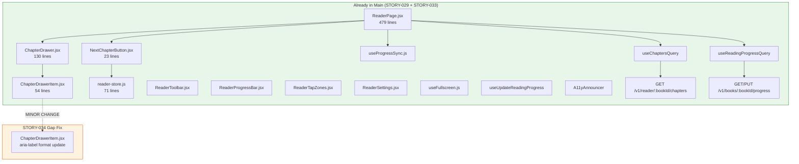
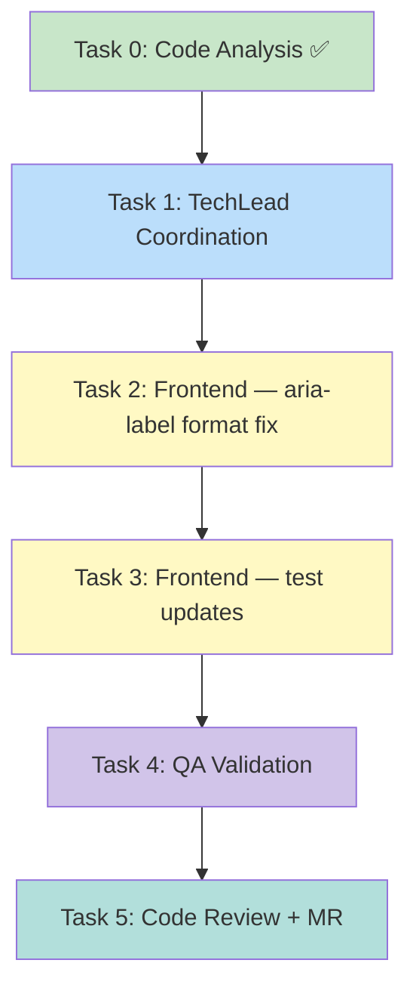

# STORY-034: Chapter Navigation — Technical Analysis

**Epic**: EPIC-002
**Persona**: Julia — The Young Author
**Priority**: Must Have | **Story Points**: 3
**Dependencies**: STORY-029 ✅ (implemented), STORY-033 ✅ (implemented)
**Stack Source**: `docs/architecture/TECH-STACK.md`

---

## Language & Framework Detection

| Indicator | Detected | Language/Framework |
|-----------|----------|-------------------|
| `package.json`, `vite.config.*` | ✅ | **Node.js** |
| `react` in deps, `.jsx` files | ✅ | **React 18** |
| `tailwindcss` in deps | ✅ | **Tailwind CSS** |
| `framer-motion` in deps | ✅ | **Framer Motion** |
| `zustand` in deps | ✅ | **Zustand** |
| `@tanstack/react-query` in deps | ✅ | **TanStack Query** |

**Frontend Framework**: React → **FrontendDeveloperReact**
**Backend**: Node.js/Express → **BackendDeveloper**
**Integration Pattern**: React SPA → Express API proxy (Vite dev proxy → nginx in prod)

---

## Critical Insight: Dependencies Already Implemented

STORY-029 and STORY-033 are **fully implemented in main**. This dramatically reduces STORY-034's scope — most AC items are already satisfied.

### What STORY-029 Delivered (Already in Main)

| Component | File | Lines | Status |
|-----------|------|-------|--------|
| ReaderToolbar | `frontend/src/components/reader/ReaderToolbar.jsx` | 137 | ✅ Complete |
| ReaderTapZones | `frontend/src/components/reader/ReaderTapZones.jsx` | 58 | ✅ Complete |
| ReaderProgressBar | `frontend/src/components/reader/ReaderProgressBar.jsx` | 32 | ✅ Complete |
| ReaderSettings | `frontend/src/components/reader/ReaderSettings.jsx` | 188 | ✅ Complete |
| useFullscreen | `frontend/src/hooks/useFullscreen.js` | 88 | ✅ Complete |
| reader-store | `frontend/src/stores/reader-store.js` | 71 | ✅ Complete (chapter + fullscreen + toolbar + settings state) |
| ReaderPage | `frontend/src/app/reader/ReaderPage.jsx` | 479 | ✅ Complete (fullscreen mode, tap zones, toolbar, keyboard shortcuts) |
| i18n (en) | `frontend/src/i18n/locales/en/reader.json` | 39 | ✅ All keys present |
| i18n (pt-BR) | `frontend/src/i18n/locales/pt-BR/reader.json` | — | ✅ All keys present |

### What STORY-033 Delivered (Already in Main)

| Component | File | Lines | Status |
|-----------|------|-------|--------|
| useProgressSync | `frontend/src/hooks/useProgressSync.js` | 192 | ✅ Complete (local-first, debounce 10s, offline queue, reconnect flush) |
| useReadingProgressQuery | `frontend/src/hooks/useReadingProgressQuery.js` | 16 | ✅ Complete |
| useUpdateReadingProgress | `frontend/src/hooks/useUpdateReadingProgress.js` | 36 | ✅ Complete |
| ReadingProgress schema | `backend/src/app/book/book-model.js` L327-369 | — | ✅ Includes `finished: Boolean` field |
| ShelfProgressIndicator | `frontend/src/components/reader/ShelfProgressIndicator.jsx` | — | ✅ Complete |

### What STORY-034 Originally Specified → Current Status

| STORY-034 Feature | Originally Planned | Current Status | Gap? |
|--------------------|--------------------|----------------|------|
| ChapterDrawer (drawer/sidebar) | New component | ✅ **Exists** — `ChapterDrawer.jsx` (130 lines) | ❌ None |
| ChapterDrawerItem (row with status icon) | New component | ✅ **Exists** — `ChapterDrawerItem.jsx` (54 lines) | ❌ None |
| NextChapterButton | New component | ✅ **Exists** — `NextChapterButton.jsx` (23 lines) | ❌ None |
| Chapter read-status icons (✓ read, ● in-progress, ○ unread) | New component | ✅ **Exists** — HiCheckCircle, HiMinusCircle, HiCircle in ChapterDrawerItem | ❌ None |
| Chapter list from book metadata | New hook + endpoint | ✅ **Exists** — `useChaptersQuery.js` + `GET /v1/reader/:bookId/chapters` | ❌ None |
| Reading progress hooks | New hooks | ✅ **Exists** — useReadingProgressQuery, useUpdateReadingProgress, useProgressSync | ❌ None |
| reader-store (chapter nav state) | New store | ✅ **Exists** — 71 lines with all needed state | ❌ None |
| reader-store (progress state) | Extend store | ✅ **Exists** — `localProgress`, `syncStatus` fields | ❌ None |
| Keyboard shortcuts (`g`, `Ctrl+Shift+C`) | New feature | ✅ **Exists** — ReaderPage L171-176 | ❌ None |
| Escape closes drawer | New feature | ✅ **Exists** — ChapterDrawer L48-60 | ❌ None |
| Backdrop tap closes drawer | New feature | ✅ **Exists** — ChapterDrawer L87 | ❌ None |
| Single-chapter books hide chapter nav | New feature | ✅ **Exists** — `chapters.length > 1` guard in ChapterDrawer L80, NextChapterButton L9 | ❌ None |
| Screen reader announces chapter + status | New feature | ✅ **Exists** — `aria-label` with title + status in ChapterDrawerItem L39 | ⚠️ Minor format |
| `prefers-reduced-motion` respected | New feature | ✅ **Exists** — `useReducedMotion()` in ChapterDrawer, ChapterDrawerItem | ❌ None |
| `role="dialog"` on drawer | New a11y | ✅ **Exists** — ChapterDrawer L92 | ❌ None |
| `role="listbox"` on chapter list | New a11y | ✅ **Exists** — ChapterDrawer L114 | ❌ None |
| `role="option"` on chapter items | New a11y | ✅ **Exists** — ChapterDrawerItem L24 | ❌ None |
| i18n strings (chapterList, chapterRead, etc.) | New strings | ✅ **Exists** — en/reader.json has all 10+ keys | ❌ None |
| Backend `GET /v1/reader/:bookId/chapters` | New endpoint | ✅ **Exists** — reader-router.js | ❌ None |
| Backend ReadingProgress with `finished` | Schema change | ✅ **Exists** — book-model.js L356-359 | ❌ None |
| Chapter jump with smooth transition | New feature | ✅ **Exists** — ReaderPage handleChapterSelect + Framer Motion | ❌ None |

---

## Remaining Gaps Analysis

After thorough code review, **the only gaps** between the current implementation and STORY-034's acceptance criteria are:

### Gap 1: AC4 Screen Reader Format (Minor)

**AC4**: "each chapter is announced with its title and reading status (e.g., 'Chapter 2: The Forest, unread')"

**Current**: ChapterDrawerItem L20 produces `aria-label` with chapter title and i18n status key (e.g., "The Beginning, chapterUnread").

**Issue**: The `aria-label` produces "The Beginning, chapterUnread" but AC4 wants "Chapter 2: The Forest, unread" format — with chapter number and natural-language status.

**Fix**: Enhance `ChapterDrawerItem`'s `aria-label` to use chapter number (index-based) and translate status keys to their human-readable values.

### Gap 2: Test Coverage Verification

Existing test files already cover ChapterDrawer and ChapterDrawerItem extensively (293 + 267 lines), but the **existing tests use i18n mock keys** (e.g., "chapterUnread") rather than checking the exact AC4 format. Tests need updating to verify:
- Screen reader announces chapter number format ("Chapter 2: The Forest, unread")
- All 5 ACs pass end-to-end

### Gap 3: No Separate QA Validation

No QA report exists for STORY-034. The implemented features need formal validation against all 5 acceptance criteria.

---

## Technical Task Breakdown

### Task 0: Code Analysis ✅ (completed above)

All dependencies have been verified as implemented in main.

### Task 1: TechLead Coordination
- **Agent**: TechLead
- **Dependencies**: None
- **Output**: Orchestrate Tasks 2-5

### Task 2: Frontend — Screen Reader Format Fix (Gap 1)
- **Agent**: FrontendDeveloperReact
- **Dependencies**: None
- **Files to modify**:
  - `frontend/src/components/reader/ChapterDrawerItem.jsx` — Update `aria-label` to produce format "Chapter {{number}}: {{title}}, {{status}}" instead of "{{title}}, {{i18nKey}}"
  - `frontend/src/i18n/locales/en/reader.json` — Verify `chapterRead`, `chapterUnread`, `chapterInProgress` produce natural-language values ("read", "unread", "in progress")
  - `frontend/src/i18n/locales/pt-BR/reader.json` — Same for Portuguese

**Implementation Detail**:

Current aria-label (L20):
```jsx
const ariaLabel = `${chapter.title}, ${statusLabel[status]}${isCurrent ? ... : ''}`;
```

Should become:
```jsx
const chapterNumber = `Chapter ${chapter.order + 1}`;
const ariaLabel = `${chapterNumber}: ${chapter.title}, ${t(status)}${isCurrent ? `, ${t('currentChapter')}` : ''}`;
```

This ensures screen readers announce "Chapter 2: The Forest, unread" per AC4.

### Task 3: Frontend — Test Updates (Gap 2)
- **Agent**: TestEngineer
- **Dependencies**: Task 2 complete
- **Files to modify**:
  - `frontend/src/__tests__/ChapterDrawerItem.test.jsx` — Update accessibility tests to verify `aria-label` format matches "Chapter N: Title, status"
  - `frontend/src/__tests__/ChapterDrawer.test.jsx` — Add test for screen reader chapter number + status format
  - `frontend/src/__tests__/ReaderPage.test.jsx` — Verify chapter navigation ACs (drawer opens, chapter jumps, "Next Chapter" visibility, single-chapter hiding)

**No new test files needed** — existing tests cover the component behavior; they just need assertion updates for the new aria-label format.

### Task 4: QA Validation
- **Agent**: QAAnalyst
- **Dependencies**: Task 3 complete
- **Scope**: Verify all 5 acceptance criteria against implementation:
  1. AC1: Chapter drawer shows all chapters with titles + read-status indicators
  2. AC2: Tapping chapter jumps to that chapter with smooth transition
  3. AC3: "Next Chapter" button appears only when applicable
  4. AC4: Screen reader announces "Chapter N: Title, status"
  5. AC5: Single-chapter books hide chapter list + "Next Chapter"
  - NFR-ACC-01: Keyboard navigable (g, Ctrl+Shift+C, Escape, arrow keys, Enter/Space)
  - NFR-ACC-03: Screen reader chapter name + status
  - NFR-ACC-04: Text contrast 4.5:1
  - NFR-ACC-05: `prefers-reduced-motion` respected
  - NFR-PERF-02: Chapter jump <1s

### Task 5: Code Review + Merge Request
- **Agent**: CodeReviewer → MergeRequestCreator
- **Dependencies**: Task 4 complete
- **Scope**: Review aria-label change + test updates, validate against ACs

---

## Architecture Diagram

Since STORY-034's components are **already implemented**, this diagram shows the existing architecture and the minor change point:



## Execution Flow



---

## NFR Analysis

| NFR | Requirement | Current Status | Gap? |
|-----|-------------|---------------|------|
| NFR-ACC-01 | WCAG 2.1 AA — keyboard navigable | ✅ `g`, `Ctrl+Shift+C`, `Escape`, `Tab` trap in drawer, `Enter`/`Space` on items | ❌ None |
| NFR-ACC-03 | Screen reader announces chapter + status | ⚠️ Announces title + i18n key, not "Chapter N: Title, status" format | **Minor fix needed** |
| NFR-ACC-04 | Text contrast ≥4.5:1 | ✅ Tailwind gray-700 on white, amber-900 on amber-100 — verified in ChapterDrawer | ❌ None |
| NFR-ACC-05 | `prefers-reduced-motion` | ✅ `useReducedMotion()` in ChapterDrawer, ChapterDrawerItem, ReaderPage | ❌ None |
| NFR-PERF-02 | Chapter jump <1s | ✅ TanStack Query cached chapters; navigation is state update + Framer Motion transition | ❌ None |

---

## Persona Impact

**Julia — The Young Author**: Primary beneficiary. Already benefits from the fully implemented chapter navigation. The only change is a minor screen reader format improvement for visually impaired young readers — ensuring chapters are announced as "Chapter 2: The Forest, unread" rather than "The Forest, chapterUnread".

---

## Impacted Files

| File | Action | Description |
|------|--------|-------------|
| `frontend/src/components/reader/ChapterDrawerItem.jsx` | **MODIFY** | Update `aria-label` to include chapter number and natural-language status |
| `frontend/src/__tests__/ChapterDrawerItem.test.jsx` | **MODIFY** | Update a11y assertions to match new aria-label format |
| `frontend/src/__tests__/ChapterDrawer.test.jsx` | **MODIFY** | Add test for screen reader chapter number format |
| `frontend/src/i18n/locales/en/reader.json` | **VERIFY** | Ensure status values are natural-language ("read", "unread", "in progress") |
| `frontend/src/i18n/locales/pt-BR/reader.json` | **VERIFY** | Same verification for Portuguese |

---

## Risk Assessment

| Risk | Likelihood | Impact | Mitigation |
|------|-----------|--------|------------|
| aria-label format regression | Low | Low | Existing tests provide coverage; just update assertion format |
| i18n key mismatch after aria-label change | Low | Medium | Verify en + pt-BR reader.json produce natural-language values, not keys |
| Screen reader not announcing chapter number | Low | Low | NVDA/VoiceOver testing in QA phase |

---

## Execution Summary

- **Scope**: **Minimal** — STORY-034's original 17-file plan is reduced to **3-5 minor file changes** because STORY-029 and STORY-033 already implemented the complete chapter navigation system
- **Task 2 (Frontend)**: Small — aria-label format update in ChapterDrawerItem (~5 lines changed)
- **Task 3 (Tests)**: Small — assertion updates to match new format
- **Task 4 (QA)**: Full validation of all 5 ACs against existing implementation
- **Estimated Effort**: 3 story points → ~0.5-1 day (was 2-3 days before dependencies were implemented)

**Key Decision**: STORY-034 is effectively a **validation + minor polish** story. The core implementation was absorbed by STORY-029 and STORY-033. The only remaining gap is the screen reader announcement format (AC4).