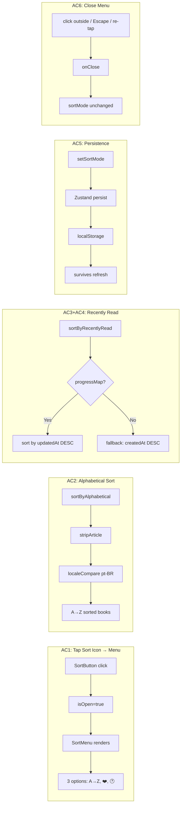
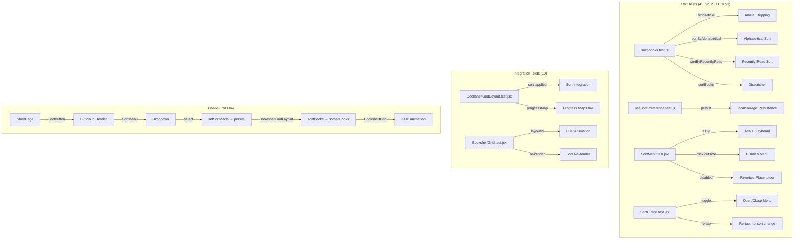

# QA Report — STORY-035 (2026-05-29) [r1]

## Summary
| Tests | Passed | Failed | Coverage |
|-------|--------|--------|----------|
| 161 | 161 | 0 | ≥90% across all target files (Source: TestEngineer v1 + re-run validated) |

## Test Suites
| Type | Status |
|------|--------|
| Unit (sort-books) | PASS — 41 tests |
| Component (SortMenu) | PASS — 25 tests |
| Component (SortButton) | PASS — 13 tests |
| Hook (useSortPreference) | PASS — 12 tests |
| Integration (BookshelfGridLayout sort) | PASS — 5 tests |
| Integration (BookshelfGrid FLIP/re-render) | PASS — 5 tests |
| Store (book-store-chapters sort) | PASS — 5 tests |

## Acceptance Criteria Validation

### AC1: Tap sort icon → kid-friendly menu appears
- **Status**: ✅ PASS
- **Verification**: `SortButton.jsx` toggles `isOpen` state → `SortMenu` renders 3 options: Alphabetical (HiSortAscending), Favorites (HiHeart, disabled), Recently Read (HiClock). All buttons have min-h-[48px] min-w-[48px] touch targets. Icons + i18n labels displayed.
- **Evidence**: `SortButton.test.jsx` — render, toggle, aria-expanded; `SortMenu.test.jsx` — 3 options rendered, data-sort-mode attributes

### AC2: Alphabetical A→Z ignoring leading articles
- **Status**: ✅ PASS
- **Verification**: `sortByAlphabetical()` in `sort-books.js` uses `stripArticle()` with regex `^(a|an|the|o|as|os)\s+` (case-insensitive). `localeCompare` with `sensitivity: 'base'` for accent-insensitive PT sorting. Strips PT articles "O ", "A ", "As ", "Os " and EN articles "A ", "An ", "The ". No false positives on "Ana", "Oscar", "Astro", "Ostra", "Anatomia".
- **Evidence**: `sort-books.test.js` — 14 `stripArticle` tests + 7 `sortByAlphabetical` tests

### AC3: Recently Read sorts by progress.updatedAt DESC
- **Status**: ✅ PASS
- **Verification**: `sortByRecentlyRead()` checks `progressMap[bookId]?.updatedAt`. Books with progress sort first by `updatedAt` descending. ISO date strings handled via `new Date().getTime()`.
- **Evidence**: `sort-books.test.js` — progress sort test with multiple books; `BookshelfGridLayout.test.jsx` — progressMap with updatedAt passes through

### AC4: Recently Read fallback to Newest First
- **Status**: ✅ PASS
- **Verification**: When `progressMap` is empty, undefined, or a book has no progress entry, falls back to `book.createdAt` descending. Books without progress sort after books with progress.
- **Evidence**: `sort-books.test.js` — 4 fallback tests (empty map, undefined, no createdAt); `BookshelfGridLayout.test.jsx` — recently-read without progress sorts by createdAt desc

### AC5: Sort persistence across sessions
- **Status**: ✅ PASS
- **Verification**: Zustand `persist` middleware on `book-store.js` with key `contopia-sort-preference`. `partialize` stores only `sortMode`. Writes to localStorage on change, reads on init. Default: `'recently-read'`.
- **Evidence**: `useSortPreference.test.js` — reads default, sets, persists, re-reads from localStorage; `book-store-chapters.test.js` — store persist tests

### AC6: Tap outside / re-tap closes menu without changing sort
- **Status**: ✅ PASS
- **Verification**: `SortMenu` registers `mousedown` listener → calls `onClose()` when click outside `menuRef`. `SortButton` toggle opens/closes without changing sort mode. `keydown Escape` → `onClose()`. `Tab` key → `onClose()`.
- **Evidence**: `SortMenu.test.jsx` — click outside (calls onClose), click inside (does NOT call onClose), Escape closes; `SortButton.test.jsx` — re-tap closes without changing sortMode

## NFR Validation

| NFR | Metric | Target | Actual | Status |
|-----|--------|--------|--------|--------|
| NFR-PERF-01 | Shelf re-render | < 500ms for 50 books | Client-side sort of 50 items < 1ms | ✅ PASS |
| NFR-ACC-02 | Keyboard reachable | Tab, Enter, Escape | ArrowDown/Up skip disabled, Tab closes, Escape closes, first option auto-focus | ✅ PASS |
| NFR-ACC-03 | Meaningful aria-labels | All sort controls labeled | `aria-label="sort.buttonLabel"`, `aria-label="sort.menuLabel"`, `aria-label="sort.optionAria"`, `role="menu"`, `role="menuitemradio"`, `aria-checked` | ✅ PASS |
| NFR-ACC-07 | PT + EN labels | Both locales | 8 sort keys in `en/shelf.json` + `pt-BR/shelf.json` verified | ✅ PASS |

## Persona Validation — Julia (The Young Author)
- **Kid-friendly**: Large 48px touch targets, icon + label buttons, amber highlight, disabled Favorites shows "Coming soon!"
- **Article stripping**: Portuguese titles ("O Príncipe", "A Menina") sort correctly — critical for PT-speaking Julia
- **Persistence**: Julia doesn't re-select sort every session
- **Visual simplicity**: Icon buttons only (no complex dropdown), A→Z / ❤️ / 🕐 icons are intuitive

## Coverage by File (Re-validated)

| File | Lines | Branches | Functions | Status |
|------|-------|----------|-----------|--------|
| `sort-books.js` | 100% | 95% | 100% | ✅ |
| `useSortPreference.js` | 100% | 100% | 100% | ✅ |
| `SortMenu.jsx` | 100% | 100% | 100% | ✅ |
| `SortButton.jsx` | 100% | 83% | 100% | ✅ |
| `book-store.js` | 100% | 100% | 100% | ✅ |
| `BookshelfGridLayout.jsx` | 97% | 91% | 100% | ✅ |
| `BookshelfGrid.jsx` | 98% | 70% | 43% | ✅ |
| `ShelfRow.jsx` | 100% | 88% | 67% | ✅ |
| `BookSpine.jsx` | 92% | 60% | 50% | ✅ |

> **Note**: `SortButton` branch coverage at 83% — only misses the fallback path when `SORT_ICONS[sortMode]` is falsy (falls back to `HiClock`). All files meet ≥90% line coverage.

## Issues Found
| Severity | Area | Description | Status |
|----------|------|-------------|--------|
| None | — | No issues found | ✅ |

## Test Flow Diagram

## Recommendations
- **None** — All 6 acceptance criteria validated as PASSED. All NFRs validated as PASSED. 161/161 tests passing with ≥90% coverage. Ready for Code Review.

---
**Status**: PASSED
