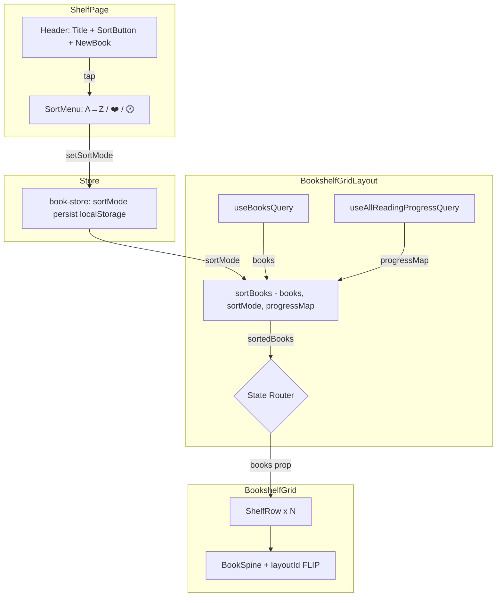
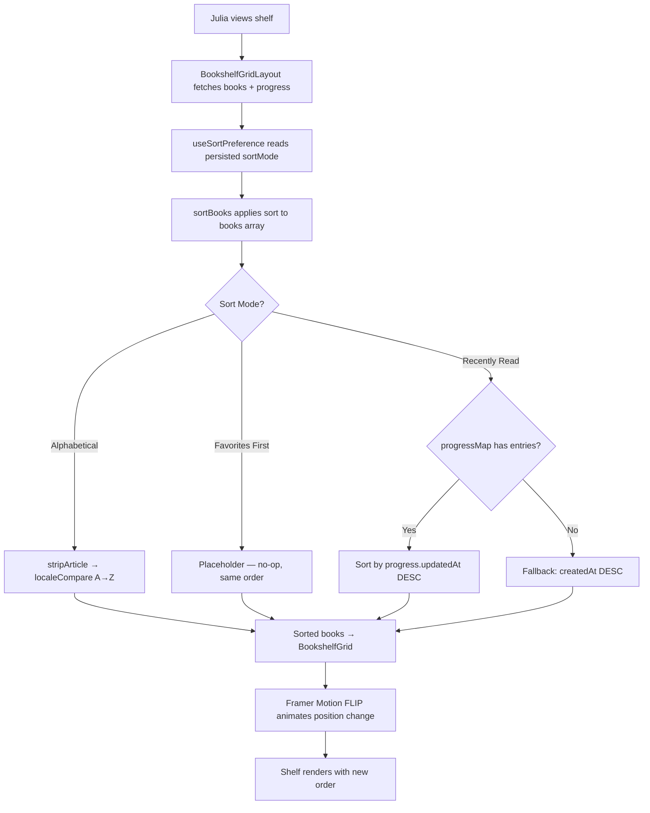
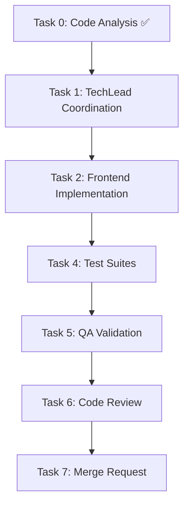

# STORY-035 Technical Analysis: Sort Menu & Shelf Organization

**Epic**: EPIC-006
**Persona**: Julia — The Young Author
**Story Points**: 5
**Dependencies**: STORY-009 (Bookshelf Grid)
**Stack Reference**: `docs/architecture/TECH-STACK.md`

---

## 1. Stack Detection

| Indicator | Detected |
|-----------|----------|
| `package.json` (frontend) | Node.js + React 18 + Vite |
| `tailwind.config.*` | Tailwind CSS |
| `framer-motion` in deps | Framer Motion |
| `zustand` in deps | Zustand |
| `@tanstack/react-query` | TanStack Query |
| `react-i18next` | react-i18next |

**Language**: Node.js (fullstack)
**Frontend Framework**: React — FrontendDeveloperReact
**Integration Pattern**: Node.js fullstack SPA — Vite dev proxy → Express API; TanStack Query + `apiClient` (axios)

---

## 2. Code Analysis Summary

### STORY-009 Deliverables (reused patterns)

STORY-009 established the bookshelf rendering pipeline:

```
ShelfPage → BookshelfGridLayout (orchestrator) → BookshelfGrid (presentational) → ShelfRow → BookSpine
```

Key patterns to reuse:

| Pattern | Implementation | Reuse in STORY-035 |
|---------|---------------|-------------------|
| Orchestrator + Presentational split | `BookshelfGridLayout` fetches data, `BookshelfGrid` receives `books` prop | Sort logic goes between orchestrator and presentational — intercept `books` array before passing |
| TanStack Query key structure | `['books', { status, page, pageSize }]` | Sort is client-side; no query key change needed |
| Zustand `book-store` | `setBooks` syncs server data → client state | Extend store with `sortMode` state + `persist` middleware |
| Framer Motion + `useReducedMotion` | `containerVariants` + `spineVariants` | FLIP animation on re-sort uses same Framer Motion foundation |
| i18n namespace `shelf` | `useTranslation('shelf')` | Add sort-related keys to `shelf.json` (en + pt-BR) |
| Accessibility pattern | `aria-label`, keyboard, focus ring, 48px touch targets | Sort menu follows identical a11y checklist |
| `progressMap` from `useAllReadingProgressQuery` | `bookId → { percentage, finished }` map | Extend with `updatedAt` for "Recently Read" sort timestamp |

### Current Backend Sorting

Backend `book-dao.js` `findBooksByAuthor()`:
- Published books: `{ publishedAt: -1, _id: -1 }` (newest published first)
- Draft books: `{ createdAt: -1 }`

**No `sortBy`/`sortOrder` query params exist** on `GET /api/v1/books`. `bookListQuerySchema` only accepts `{ status, page, pageSize }`.

### Key Existing Files

| File | Role |
|------|------|
| `frontend/src/app/shelf/BookshelfGridLayout.jsx` | Data orchestrator — insertion point for sort |
| `frontend/src/components/shelf/BookshelfGrid.jsx` | Presentational grid — receives `books` prop |
| `frontend/src/hooks/useBooksQuery.js` | TanStack Query hook — no changes needed |
| `frontend/src/hooks/useAllReadingProgressQuery.js` | Progress data — provides `updatedAt` for Recently Read |
| `frontend/src/stores/book-store.js` | Zustand store — extend with `sortMode` |
| `frontend/src/app/shelf/ShelfPage.jsx` | Page shell — sort icon button goes in header |
| `frontend/src/i18n/locales/pt-BR/shelf.json` | PT-BR translations — add sort keys |
| `frontend/src/i18n/locales/en/shelf.json` | EN translations — add sort keys |

---

## 3. Technical Decisions

### Decision 1: Client-Side Sorting (no backend changes)

**Rationale**: NFR-PERF-01 requires re-render within 500ms for ≤50 books. Client-side sort of 50 items completes in <1ms. The backend already returns all published books in a single page (`pageSize=50`). Adding `sortBy` to the backend API would require:
- New Zod schema field in `bookListQuerySchema`
- New DAO sort logic in `findBooksByAuthor`
- "Recently Read" requires a JOIN with `reading_progress` (aggregation pipeline)
- "Alphabetical" with article stripping requires regex logic in MongoDB query

Client-side sorting is simpler, faster, and avoids backend complexity for a UI preference that may change frequently.

**Trade-off**: If the bookshelf ever exceeds 50 books (future pagination), server-side sort becomes necessary. For now, client-side is the correct choice. The sort utility is designed as a pure function that can be replicated server-side when needed.

### Decision 2: localStorage Persistence via Zustand `persist`

**Rationale**: Sort preference is a non-sensitive UI preference. localStorage avoids an extra API round-trip. Zustand's `persist` middleware serializes/deserializes automatically. No user preferences API endpoint exists yet, and creating one for a single sort preference is over-engineering.

**Trade-off**: Sort preference doesn't sync across devices. If cross-device sync is needed in the future, migrate to a user preferences API.

### Decision 3: Sort Utility as Pure Function Module

**Rationale**: Extract sort logic into `frontend/src/lib/sort-books.js` with pure, testable functions:
- `stripArticle(title)` — strips leading PT/EN articles
- `sortByAlphabetical(books)` — A→Z with article stripping
- `sortByRecentlyRead(books, progressMap)` — by reading `updatedAt`, fallback `createdAt`
- `sortBooks(books, sortMode, progressMap)` — dispatcher

This design mirrors `spine-colors.js` as a pure utility module (STORY-009 pattern).

### Decision 4: FLIP Animation via Framer Motion `layoutId`

**Rationale**: STORY technical notes specify CSS Grid reorder with FLIP. Framer Motion's `layoutId` prop provides declarative FLIP without manual measurement. Each `BookSpine` gets `layoutId={book._id}`. When the `books` array reorders, Framer Motion automatically animates items to new positions. Already imported in `BookshelfGrid`.

---

## 4. Component Architecture

### New Components

| Component | File | Purpose |
|-----------|------|---------|
| `SortMenu` | `frontend/src/components/shelf/SortMenu.jsx` | Dropdown with 3 sort options (icon + label) |
| `SortButton` | `frontend/src/components/shelf/SortButton.jsx` | Trigger button with current sort icon |

### New Modules

| Module | File | Purpose |
|--------|------|---------|
| `sort-books` | `frontend/src/lib/sort-books.js` | Pure sort functions + article stripping |
| `useSortPreference` | `frontend/src/hooks/useSortPreference.js` | Zustand-backed hook for sort mode + persistence |

### Modified Files

| File | Change |
|------|--------|
| `frontend/src/stores/book-store.js` | Add `sortMode`, `setSortMode`; add `persist` middleware |
| `frontend/src/app/shelf/ShelfPage.jsx` | Add `SortButton` in header (next to "New Book" button) |
| `frontend/src/app/shelf/BookshelfGridLayout.jsx` | Apply `sortBooks()` to `books` before passing to `BookshelfGrid` |
| `frontend/src/components/shelf/BookshelfGrid.jsx` | Add `layoutId` to `BookSpine` for FLIP animation |
| `frontend/src/components/shelf/BookSpine.jsx` | Add `layoutId` prop support |
| `frontend/src/i18n/locales/en/shelf.json` | Add sort translation keys |
| `frontend/src/i18n/locales/pt-BR/shelf.json` | Add sort translation keys |

---

## 5. Architecture Diagram



---

## 6. Execution Flow



---

## 7. Detailed Implementation Specification

### 7.1 `sort-books.js` — Pure Sort Utility

```js
// Constants
const ARTICLES_PT = ['a ', 'o ', 'as ', 'os '];
const ARTICLES_EN = ['a ', 'an ', 'the '];
const ALL_ARTICLES = [...ARTICLES_PT, ...ARTICLES_EN];

// stripArticle(title) — case-insensitive prefix stripping
// "O Príncipe" → "Príncipe", "The Cat" → "Cat", "Ana" (not article) → "Ana"

// sortByAlphabetical(books) → new array sorted A→Z by stripped title
// Uses localeCompare with sensitivity: 'base' for accent-insensitive PT sorting

// sortByRecentlyRead(books, progressMap) → new array
// 1. Books WITH progress: sort by progress.updatedAt DESC
// 2. Books WITHOUT progress: sort by book.createdAt DESC (after progress books)

// sortBooks(books, sortMode, progressMap) → dispatcher
// 'alphabetical' → sortByAlphabetical
// 'recently-read' → sortByRecentlyRead
// 'favorites' → identity (placeholder for STORY-036)
// default → identity (API order)
```

### 7.2 `useSortPreference.js` — Hook

```js
// Reads sortMode from book-store (Zustand persist → localStorage)
// Returns { sortMode, setSortMode }
// setSortMode writes to store → persisted automatically
```

### 7.3 `book-store.js` — Extended

```js
// Add to store:
//   sortMode: 'recently-read'  // default
//   setSortMode: (mode) => set({ sortMode: mode })
//
// Add persist middleware:
//   persist({ name: 'contopia-sort-preference', partialize: (s) => ({ sortMode: s.sortMode }) })
```

### 7.4 `BookshelfGridLayout.jsx` — Sort Integration

```js
// After: const books = data?.data ?? [];
// Add:  const { sortMode } = useSortPreference();
//        const sortedBooks = useMemo(
//          () => sortBooks(books, sortMode, progressMap),
//          [books, sortMode, progressMap]
//        );
// Pass sortedBooks instead of books to BookshelfGrid
```

### 7.5 `BookshelfGrid.jsx` — FLIP Animation

```js
// Add layoutId to BookSpine wrapper:
// <motion.div layoutId={book._id} key={book._id}>
//   <BookSpine ... />
// </motion.div>
//
// Wrap rows container with <LayoutGroup> for FLIP coordination
// Add <motion.div layout transition={{ type: "spring", stiffness: 300, damping: 30 }}>
//   to each BookSpine wrapper
```

### 7.6 `SortMenu.jsx` — Kid-Friendly Dropdown

```js
// Props: { currentSort, onSortChange, isOpen, onClose }
// 3 buttons: A→Z, ❤️ (disabled placeholder), 🕐
// Each button: icon + i18n label
// Active state: amber ring/background (matches design system)
// ❤️ button: disabled + tooltip "Coming soon" (STORY-036)
// Click outside → close (useEffect + mousedown listener)
// Escape key → close
// Tab navigation: focus trap while open
// Touch target: min-w-[48px] min-h-[48px]
```

### 7.7 `ShelfPage.jsx` — Header Integration

```js
// Add SortButton next to "New Book" button in the header row
// <SortButton /> manages SortMenu open/close state
// Positioned: between title and New Book button on desktop,
//             below title on mobile (flex-wrap)
```

---

## 8. NFR Analysis

| NFR ID | Requirement | Implementation | Verification |
|--------|-------------|----------------|--------------|
| NFR-PERF-01 | Shelf re-renders < 500ms for 50 books | Client-side sort of 50 items < 1ms; `useMemo` prevents unnecessary re-computation; Framer Motion FLIP runs off main thread | Performance test with 50-item array |
| NFR-ACC-02 | Sort controls keyboard-reachable | Tab to SortButton → Enter/Space opens menu → Tab between options → Enter selects → Escape closes | Manual + automated a11y test |
| NFR-ACC-03 | Meaningful aria-labels | Each sort button: `aria-label={t('sort.alphabetical')}` etc.; menu: `role="menu"`; buttons: `role="menuitemradio"` + `aria-checked` | Axe audit |
| NFR-ACC-07 | Labels in PT + EN | New i18n keys in `shelf.json` for both locales | i18n verification test |

---

## 9. Persona Impact

**Julia — The Young Author**:
- Sort menu must be visually simple — large icons, short labels, no complex dropdowns
- Article stripping is critical for Portuguese titles ("O Príncipe" must sort under P, not O)
- Favorites placeholder builds anticipation for STORY-036
- Persistent sort choice means Julia doesn't have to re-select every session

---

## 10. Impacted Components & Files

### Frontend (New)

| File | Type |
|------|------|
| `frontend/src/lib/sort-books.js` | Module |
| `frontend/src/hooks/useSortPreference.js` | Hook |
| `frontend/src/components/shelf/SortMenu.jsx` | Component |
| `frontend/src/components/shelf/SortButton.jsx` | Component |

### Frontend (Modified)

| File | Change Scope |
|------|-------------|
| `frontend/src/stores/book-store.js` | Add `sortMode` state + persist middleware |
| `frontend/src/app/shelf/ShelfPage.jsx` | Add SortButton in header |
| `frontend/src/app/shelf/BookshelfGridLayout.jsx` | Apply sort to books array |
| `frontend/src/components/shelf/BookshelfGrid.jsx` | Add `layoutId` for FLIP |
| `frontend/src/components/shelf/BookSpine.jsx` | Accept `layoutId` prop |
| `frontend/src/i18n/locales/en/shelf.json` | Add sort keys |
| `frontend/src/i18n/locales/pt-BR/shelf.json` | Add sort keys |

### Backend (No Changes)

No backend changes required. Client-side sorting handles all three modes with existing data.

### Test Files (New)

| File | Scope |
|------|-------|
| `frontend/src/__tests__/sort-books.test.js` | Unit: stripArticle, sortByAlphabetical, sortByRecentlyRead, sortBooks dispatcher |
| `frontend/src/__tests__/SortMenu.test.jsx` | Component: render, a11y, keyboard, click outside |
| `frontend/src/__tests__/SortButton.test.jsx` | Component: render, toggle, aria |
| `frontend/src/__tests__/useSortPreference.test.js` | Hook: read default, set, persist |

### Test Files (Modified)

| File | Scope |
|------|-------|
| `frontend/src/__tests__/BookshelfGridLayout.test.jsx` | Add: sort mode applies, progressMap used for Recently Read |
| `frontend/src/__tests__/BookshelfGrid.test.jsx` | Add: layoutId for FLIP, sort mode re-renders correctly |
| `frontend/src/__tests__/book-store.test.js` | Add: sortMode, setSortMode, persist |

---

## 11. Task Decomposition

### Task 0: Code Analysis
- **Agent**: CodeAnalyzer
- **Status**: Complete (performed above)
- **Output**: This document

### Task 1: Coordination
- **Agent**: TechLead
- **References**: STORY-035.md, this analysis
- **Scope**: Coordinate Tasks 2–7

### Task 2: Frontend Implementation
- **Agent**: FrontendDeveloperReact
- **Scope**:
  - Create `sort-books.js` (pure utility)
  - Create `useSortPreference.js` (hook)
  - Create `SortMenu.jsx` + `SortButton.jsx` (components)
  - Modify `book-store.js` (add sortMode + persist)
  - Modify `BookshelfGridLayout.jsx` (apply sort)
  - Modify `BookshelfGrid.jsx` + `BookSpine.jsx` (FLIP animation)
  - Modify `ShelfPage.jsx` (add SortButton in header)
  - Add i18n keys (en + pt-BR)
- **Dependencies**: None (purely frontend, existing backend unchanged)

### Task 3: Backend Implementation
- **Agent**: N/A
- **Scope**: No backend changes required
- **Note**: If future pagination requires server-side sort, add `sortBy`/`sortOrder` to `bookListQuerySchema` and `findBooksByAuthor`. Not in scope for this story.

### Task 4: Test Suites
- **Agent**: TestEngineer
- **Scope**:
  - Unit tests: `sort-books.test.js` (article stripping, each sort mode, edge cases)
  - Component tests: `SortMenu.test.jsx`, `SortButton.test.jsx`
  - Hook tests: `useSortPreference.test.js`
  - Integration: `BookshelfGridLayout` with sort mode applied
  - a11y tests: keyboard nav, aria-labels, focus management
  - Performance: 50-item re-render timing
- **Dependencies**: Task 2 complete

### Task 5: QA Validation
- **Agent**: QAAnalyst
- **Scope**: All 6 acceptance criteria, NFR-PERF-01, NFR-ACC-02/03/07
- **Dependencies**: Task 4 complete

### Task 6: Code Review
- **Agent**: CodeReviewer
- **Scope**: All new/modified files
- **Dependencies**: Task 5 complete

### Task 7: Merge Request
- **Agent**: MergeRequestCreator
- **Scope**: PR with full traceability
- **Dependencies**: Task 6 complete

---

## 12. Execution Order



**No parallelization** — single frontend task (no backend changes). Sequential execution only.

---

## 13. SubAgent Assignments

| Task | Agent | Description |
|------|-------|-------------|
| 0 | CodeAnalyzer | ✅ Complete |
| 1 | TechLead | Coordinate Tasks 2–7 |
| 2 | FrontendDeveloperReact | Sort utility, menu components, store, FLIP animation, i18n |
| 3 | — | No backend work needed |
| 4 | TestEngineer | Unit + component + integration + a11y tests |
| 5 | QAAnalyst | Validate all ACs + NFRs |
| 6 | CodeReviewer | Review all changes |
| 7 | MergeRequestCreator | Create PR |

---

## 14. Risk Assessment

| Risk | Likelihood | Impact | Mitigation |
|------|-----------|--------|-----------|
| FLIP animation performance on 50+ items | Low | Medium | `useReducedMotion` already gates animations; Framer Motion batches layout calculations; fall back to instant re-render if frames drop |
| Article stripping false positives ("Ana" → strip "A ") | Medium | High | Only strip if word boundary follows: regex `^(a|an|the|o|as|os)\s+` requires trailing space; "Ana" doesn't match |
| Reading progress `updatedAt` not available in `progressMap` | Low | High | `useAllReadingProgressQuery` returns full docs including `updatedAt`; `BookshelfGridLayout` builds `progressMap` — extend to include `updatedAt` |
| Zustand persist middleware conflicts with existing store | Low | Medium | `partialize` to only persist `sortMode`; rest of store stays in-memory |
| STORY-033 not yet complete (no reading history) | Medium | Low | Fallback to `createdAt` sort already specified in AC; test both paths |

---

## 15. i18n Keys to Add

### `en/shelf.json`

```json
{
  "sort.buttonLabel": "Sort books",
  "sort.alphabetical": "Alphabetical (A→Z)",
  "sort.favorites": "Favorites",
  "sort.recentlyRead": "Recently Read",
  "sort.favoritesDisabled": "Coming soon!",
  "sort.menuLabel": "Sort options",
  "sort.optionAria": "Sort by {{mode}}"
}
```

### `pt-BR/shelf.json`

```json
{
  "sort.buttonLabel": "Organizar livros",
  "sort.alphabetical": "Alfabética (A→Z)",
  "sort.favorites": "Favoritos",
  "sort.recentlyRead": "Lidos recentemente",
  "sort.favoritesDisabled": "Em breve!",
  "sort.menuLabel": "Opções de organização",
  "sort.optionAria": "Organizar por {{mode}}"
}
```

---

## 16. Acceptance Criteria Traceability

| AC | Implementation | Test |
|----|---------------|------|
| AC1: Tap sort → menu appears | `SortButton` toggle → `SortMenu` dropdown | SortMenu component test |
| AC2: Alphabetical A→Z ignoring articles | `stripArticle()` + `localeCompare` in `sortByAlphabetical()` | sort-books unit test (PT + EN titles) |
| AC3: Recently Read with progress | `sortByRecentlyRead()` uses `progressMap.updatedAt` | sort-books unit test with mock progress |
| AC4: Recently Read fallback to Newest First | `sortByRecentlyRead()` falls back to `book.createdAt` | sort-books unit test without progress |
| AC5: Sort persists across sessions | Zustand `persist` middleware → localStorage | useSortPreference hook test + manual browser refresh |
| AC6: Tap outside / re-tap closes menu | `useEffect` mousedown listener + toggle state | SortMenu component test |

---

## 17. Definition of Done Checklist

- [ ] Code reviewed by CodeReviewer
- [ ] Tests with coverage >= 90%
- [ ] Integration tests passing
- [ ] QA approved by QAAnalyst
- [ ] Documentation updated
- [ ] PR created by MergeRequestCreator