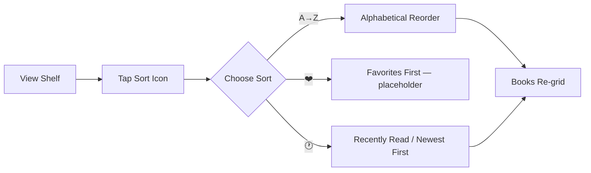

# STORY-035: Sort Menu & Shelf Organization

**Epic**: EPIC-006
**Persona**: Julia — The Young Author
**Priority**: Should Have
**Story Points**: 5
**Dependencies**: STORY-009 (Bookshelf Grid)

## User Story
As a young author, I want to sort my bookshelf by alphabetical order and see recently read books first, so that I can find my books quickly as my collection grows.

## Description
Add a kid-friendly sort selector to the bookshelf view with three modes: **Alphabetical (A–Z)**, **Favorites First** (placeholder; favorites toggle implemented in STORY-036), and **Recently Read**. The sort selector must be simple — icon buttons with labels (e.g., "A→Z", "❤️", "🕐"). Sort preference must persist across sessions.

## Context
Sorting becomes essential once Julia has 5+ books on her shelf. This story establishes the sort UI and two functional modes. Favorites-first sorting will activate once STORY-036 delivers the favorite toggle. "Recently Read" depends on reading progress tracking (STORY-033). If STORY-033 is not yet complete, fallback to **Newest First** based on `createdAt` in the data model.

## Acceptance Criteria (Verifiable)
- [ ] GIVEN Julia has 3+ books on the shelf
      WHEN she taps the sort icon
      THEN a kid-friendly menu appears with Alphabetical, Favorites, and Recently Read options
- [ ] GIVEN "Alphabetical" sort is selected
      WHEN the shelf renders
      THEN books appear in A–Z order by title, ignoring leading articles ("A", "An", "O", "A")
- [ ] GIVEN "Recently Read" is selected AND reading history exists (STORY-033)
      WHEN the shelf renders
      THEN books appear with the most recently read first
- [ ] GIVEN "Recently Read" is selected AND no reading history exists
      WHEN the shelf renders
      THEN books fall back to Newest First (by creation date descending)
- [ ] GIVEN Julia selects a sort option and closes/reopens the app
      WHEN the shelf renders
      THEN the previously selected sort option is applied
- [ ] GIVEN the sort menu is open
      WHEN Julia taps outside the menu or taps the sort icon again
      THEN the menu closes without changing the sort

## NFRs
- NFR-PERF-01: Shelf re-renders with new sort within 500ms for up to 50 books
- NFR-ACC-02: Sort controls reachable via keyboard (Tab, Enter, Escape)
- NFR-ACC-03: Sort buttons have meaningful aria-labels
- NFR-ACC-07: Labels in Portuguese (primary) and English

## Definition of Done (DoD)
- [ ] Code reviewed by CodeReviewer
- [ ] Tests with coverage >= 90%
- [ ] Integration tests passing
- [ ] QA approved by QAAnalyst
- [ ] Documentation updated
- [ ] PR created by MergeRequestCreator

## Technical Notes
- Sort state persisted via localStorage or API user preferences endpoint (coordinate with STORY-004 data model)
- Article-ignoring logic: strip "A ", "An ", "O ", "A " prefix (case-insensitive) before comparison for Portuguese/English
- "Recently Read" reads from reading history table; if STORY-033 not yet implemented, use `Book.createdAt` as fallback
- Use CSS Grid reorder with FLIP animation technique for smooth repositioning (coordinate with EPIC-007)

## User Flow

## Test Scenarios
- Scenario 1: Default sort is "Recently Read" (or Newest First fallback) on first visit
- Scenario 2: Switching from Alphabetical to Recently Read reorders books correctly
- Scenario 3: Sort preference persists after browser refresh
- Scenario 4: Portuguese titles with "O" and "A" articles sort correctly
