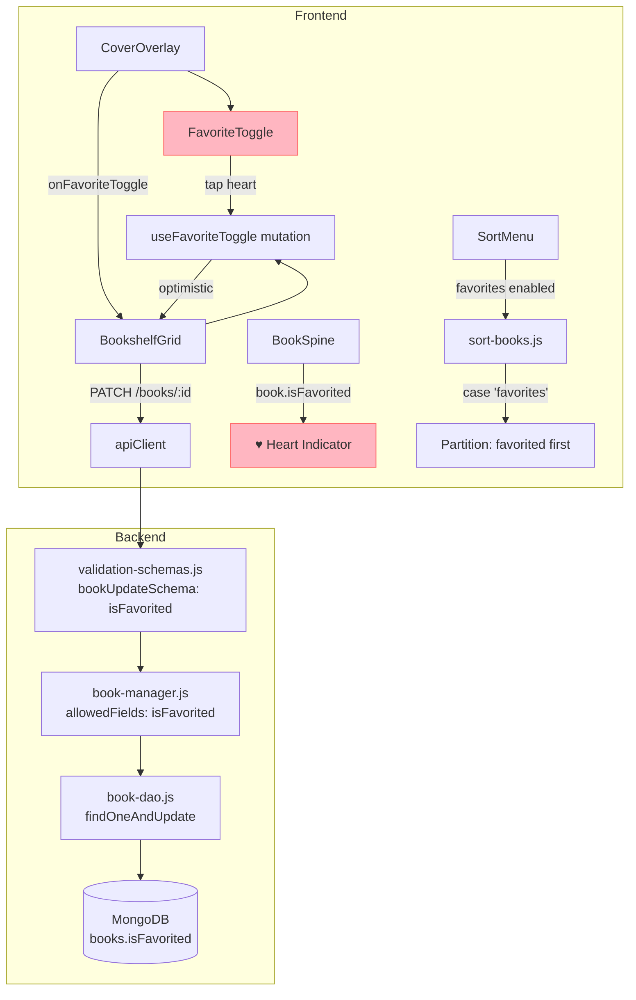
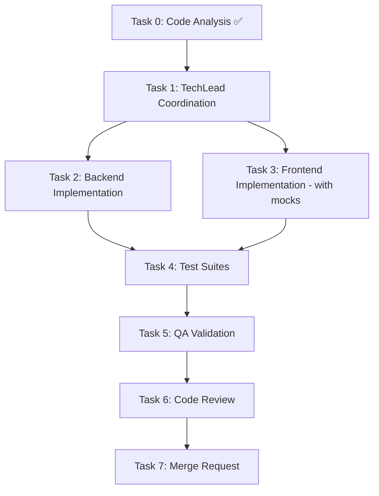

# STORY-036 Technical Analysis: Mark as Favorite

**Epic**: EPIC-006
**Persona**: Julia — The Young Author
**Story Points**: 3
**Dependencies**: STORY-009 (Bookshelf Grid), STORY-012 (Cover Overlay View), STORY-035 (Sort Menu)
**Stack Reference**: `docs/architecture/TECH-STACK.md`

---

## 1. Stack Detection

| Indicator | Detected |
|-----------|----------|
| `package.json` (frontend) | Node.js + React 18 + Vite |
| `tailwind.config.*` | Tailwind CSS |
| `framer-motion` in deps | Framer Motion |
| `zustand` in deps | Zustand |
| `@tanstack/react-query` | TanStack Query |
| `mongoose` in deps (backend) | MongoDB + Mongoose ODM |

**Language**: Node.js (fullstack)
**Frontend Framework**: React — FrontendDeveloperReact
**Integration Pattern**: Node.js fullstack SPA — Vite dev proxy → Express API; TanStack Query + `apiClient` (axios)

---

## 2. Code Analysis Summary

### STORY-035 Patterns to Reuse

STORY-035 (Sort Menu) established patterns directly applicable to STORY-036:

| Pattern | STORY-035 Implementation | STORY-036 Reuse |
|---------|--------------------------|-----------------|
| Client-side state + Zustand persist | `book-store.js`: `sortMode` + `persist` middleware | `book-store.js` already has persist; favorite toggle uses `useBooksQuery` mutation + optimistic update |
| Pure utility module | `sort-books.js`: pure functions with `useMemo` | `sort-books.js`: fill `case 'favorites'` branch — sort `isFavorited: true` before `false` |
| SortMenu disabled placeholder | `{ mode: 'favorites', disabled: true }` + tooltip | Enable the option: remove `disabled: true` |
| i18n keys in `shelf.json` | `sort.favorites`, `sort.favoritesDisabled` | Remove `.favoritesDisabled` after enabling; add favorite toggle keys |
| CoverOverlay from STORY-012 | Modal with book data + action buttons | Add heart toggle button alongside "Read Book" / "Close" |

### Key Finding: No `isFavorited` Field Exists

- **Backend**: `book-model.js` has 27 fields — no `isFavorited`. Must add.
- **Backend validation**: `bookUpdateSchema` in `validation-schemas.js` — no `isFavorited`. Must add.
- **Backend manager**: `updateBookManager` has 14 `allowedFields` — no `isFavorited`. Must add.
- **Frontend sort**: `sort-books.js` `case 'favorites'` is a no-op stub (`return books`). Must implement.
- **Frontend SortMenu**: `favorites` option has `disabled: true`. Must enable.
- **Frontend CoverOverlay**: No heart toggle. Must add.

---

## 3. Technical Decisions

### Decision 1: `isFavorited` as Boolean on Book Model (not Separate Entity)

**Rationale**: STORY-036 explicitly states "Favorite state stored as boolean field on Book model (`isFavorited: boolean`), per-user (only Julia's books in MVP)". Since MVP has a single child user, a boolean on the Book document is sufficient. A separate `Favorite` collection would be over-engineering for the current auth model.

**Trade-off**: If multi-user shelves are introduced, migrate to a `favorites` join collection (`userId + bookId`). The `PATCH /api/v1/books/:id` endpoint with `{ isFavorited: true }` remains the same API contract; only the backend handler changes.

### Decision 2: PATCH Book for Favorite Toggle (Reuse Existing Endpoint)

**Rationale**: The `PATCH /api/v1/books/:bookId` endpoint already handles partial updates with Zod validation and `updateBookManager` field allowlisting. Adding `isFavorited` to the allowlist is minimal change. No new endpoint needed.

**Implementation**: `PATCH /api/v1/books/:bookId` with `{ isFavorited: true | false }` → validated by `bookUpdateSchema` → allowed by manager → updated via DAO.

### Decision 3: Optimistic Update with TanStack Query Mutation

**Rationale**: Heart toggle must feel instant (NFR-PRF-01). TanStack Query's `useMutation` with `onMutate` optimistic update:
1. Cancel outgoing refetches
2. Snapshot previous `isFavorited` value
3. Update cache to new value immediately
4. On error, rollback via `onError`

This avoids a full refetch and shows the heart fill/empty instantly.

### Decision 4: Heart Animation via Framer Motion `scale` Transition

**Rationale**: Story specifies "scale bounce 1→1.3→1 over 200ms". Framer Motion is already a dependency and used by BookshelfGrid for FLIP. Use `<motion.button>` with `animate={{ scale }}` and `transition={{ type: 'spring', stiffness: 500, damping: 15 }}` for a satisfying bounce.

### Decision 5: BookSpine Favorite Indicator — Small Heart SVG

**Rationale**: Story specifies "filled heart icon or gold accent indicator on spine". Implementation: small (16×16px) heart SVG positioned at top-right corner of `BookSpine`. Uses `book.isFavorited` boolean to toggle filled (`#FF6B6B`) vs hidden state. Minimal visual noise — no gold accent (simpler, consistent with heart icon language).

---

## 4. Component Architecture

### New Components

| Component | File | Purpose |
|-----------|------|---------|
| `FavoriteToggle` | `frontend/src/components/shelf/FavoriteToggle.jsx` | Heart icon button with aria `role="checkbox"`, bounce animation |

### New Modules

| Module | File | Purpose |
|--------|------|---------|
| `useFavoriteToggle` | `frontend/src/hooks/useFavoriteToggle.js` | TanStack Query mutation hook for PATCH book favorite |

### Modified Files — Frontend

| File | Change |
|------|--------|
| `frontend/src/components/shelf/CoverOverlay.jsx` | Add `FavoriteToggle` in button row; add `onFavoriteToggle` prop |
| `frontend/src/components/shelf/BookSpine.jsx` | Add small heart SVG indicator when `book.isFavorited === true` |
| `frontend/src/components/shelf/BookshelfGrid.jsx` | Wire `onFavoriteToggle` through to CoverOverlay |
| `frontend/src/components/shelf/SortMenu.jsx` | Remove `disabled: true` from favorites option |
| `frontend/src/lib/sort-books.js` | Implement `case 'favorites'`: partition by `isFavorited` |
| `frontend/src/hooks/useBooksQuery.js` | Verify no change needed (mutation separate) |
| `frontend/src/i18n/locales/en/shelf.json` | Add favorite toggle keys; remove `sort.favoritesDisabled` |
| `frontend/src/i18n/locales/pt-BR/shelf.json` | Add favorite toggle keys; remove `sort.favoritesDisabled` |

### Modified Files — Backend

| File | Change |
|------|--------|
| `backend/src/app/book/book-model.js` | Add `isFavorited: { type: Boolean, default: false }` |
| `backend/src/app/common/validation-schemas.js` | Add `isFavorited: z.boolean().optional()` to `bookUpdateSchema` |
| `backend/src/app/book/book-manager.js` | Add `if (updates.isFavorited !== undefined) allowedFields.isFavorited = updates.isFavorited` |

### Test Files — New

| File | Scope |
|------|-------|
| `frontend/src/__tests__/FavoriteToggle.test.jsx` | Component: render, a11y, toggle, animation |
| `frontend/src/__tests__/useFavoriteToggle.test.js` | Hook: optimistic update, rollback on error |

### Test Files — Modified

| File | Scope |
|------|-------|
| `frontend/src/__tests__/sort-books.test.js` | Add `case 'favorites'` tests |
| `frontend/src/__tests__/CoverOverlay.test.jsx` | Add favorite toggle rendering + interaction |
| `frontend/src/__tests__/BookSpine.test.jsx` | Add heart indicator when favorited |
| `frontend/src/__tests__/SortMenu.test.jsx` | Remove disabled test for favorites option |
| `backend/src/app/book/__tests__/book-manager.test.js` | Add `isFavorited` update test |
| `backend/src/app/book/__tests__/book-update.test.js` | Add PATCH with `isFavorited` validation |

---

## 5. Architecture Diagram



---

## 6. Execution Flow

```mermaid
flowchart TD
    A[Julia opens CoverOverlay] --> B{Sees heart icon}
    B --> C[Current state: book.isFavorited?]
    C -->|false| D[Heart outline displayed]
    C -->|true| E[Heart filled #FF6B6B]

    D --> F[Julia taps heart]
    E --> G[Julia taps heart]

    F --> H[useFavoriteToggle.onMutate<br/>Optimistic: set isFavorited=true<br/>Heart fills + bounce animation]
    G --> I[useFavoriteToggle.onMutate<br/>Optimistic: set isFavorited=false<br/>Heart empties + bounce animation]

    H --> J[PATCH /api/v1/books/:id<br/>body: {isFavorited: true}]
    I --> K[PATCH /api/v1/books/:id<br/>body: {isFavorited: false}]

    J --> L{Success?}
    K --> M{Success?}

    L -->|Yes| N[Cache updated<br/>onSuccess: invalidate books query]
    L -->|No| O[onError: rollback to previous state]

    M -->|Yes| P[Cache updated]
    M -->|No| Q[onError: rollback]

    N --> R{Sort mode = 'favorites'?}
    P --> R

    R -->|Yes| S[sortBooks re-renders<br/>Favorited books move to front]
    R -->|No| T[No re-sort needed<br/>Heart indicator on spine updates]

    S --> U[BookSpine shows ♥ indicator<br/>FLIP animation moves book]
```

---

## 7. Detailed Implementation Specification

### 7.1 Backend: Book Model — `book-model.js`

```js
// Add after spineCustomized field:
isFavorited: { type: Boolean, default: false },
```

### 7.2 Backend: Validation Schema — `validation-schemas.js`

```js
// In bookUpdateSchema, add:
isFavorited: z.boolean().optional(),
```

### 7.3 Backend: Book Manager — `book-manager.js`

```js
// In updateBookManager allowedFields block, add:
if (updates.isFavorited !== undefined) allowedFields.isFavorited = updates.isFavorited;
```

### 7.4 Frontend: FavoriteToggle — `FavoriteToggle.jsx`

```jsx
// Props: { isFavorited, onToggle, bookId }
// Renders: <motion.button> with heart SVG
//   - Filled heart (filled #FF6B6B) when isFavorited=true
//   - Outlined heart when isFavorited=false
// Animation: scale 1→1.3→1 on toggle (spring: stiffness 500, damping 15)
// Accessibility: role="checkbox", aria-checked={isFavorited}, aria-label={t('favorite.add')|t('favorite.remove')}
// Touch target: min-w-[48px] min-h-[48px]
```

### 7.5 Frontend: useFavoriteToggle — `useFavoriteToggle.js`

```js
// Custom hook wrapping useMutation
// mutationFn: (bookId, isFavorited) => apiClient.patch(`/books/${bookId}`, { isFavorited })
// onMutate: optimistic update — cancel queries, snapshot, set isFavorited in cache
// onError: rollback to snapshot
// onSuccess: invalidate ['books'] query to sync
// Returns: { toggleFavorite(bookId, currentState), isToggling }
```

### 7.6 Frontend: CoverOverlay — Modified

```jsx
// Add FavoriteToggle in the flex gap-2 button row:
// <div className="flex gap-2">
//   <FavoriteToggle isFavorited={book.isFavorited} onToggle={handleFavoriteToggle} />
//   <button onClick={onRead}>{t('coverOverlay.readBook')}</button>
//   <button onClick={onClose}>{t('coverOverlay.close')}</button>
// </div>
```

### 7.7 Frontend: BookSpine — Modified

```jsx
// Add small heart indicator at top-right corner when book.isFavorited === true:
// {book.isFavorited && (
//   <svg className="absolute top-1 right-1 w-4 h-4" viewBox="0 0 24 24" fill="#FF6B6B">
//     <path d="M12 21.35l-1.45-1.32C5.4 15.36 2 12.28 2 8.5 2 5.42 4.42 3 7.5 3c1.74 0 3.41.81 4.5 2.09C13.09 3.81 14.76 3 16.5 3 19.58 3 22 5.42 22 8.5c0 3.78-3.4 6.86-8.55 11.54L12 21.35z"/>
//   </svg>
// )}
```

### 7.8 Frontend: sort-books.js — Modified

```js
// Replace no-op case 'favorites':
case 'favorites':
  return sortByFavorites(books);

// New function:
function sortByFavorites(books) {
  return [...books].sort((a, b) => {
    if (a.isFavorited === b.isFavorited) return 0;
    return a.isFavorited ? -1 : 1; // favorited first
  });
}
```

### 7.9 Frontend: SortMenu — Modified

```js
// Change favorites option from:
{ mode: 'favorites', icon: HiHeart, disabled: true }
// To:
{ mode: 'favorites', icon: HiHeart }
// Remove the disabled-specific rendering (tooltip "Coming soon!", gray styling)
```

### 7.10 i18n Keys — Modified

**`en/shelf.json`** — Add:
```json
"favorite.add": "Add to favorites",
"favorite.remove": "Remove from favorites",
"favorite.heartLabel": "Favorite",
"favorite.toastAdded": "Added to favorites!",
"favorite.toastRemoved": "Removed from favorites"
```

Remove: `"sort.favoritesDisabled"` (no longer needed)

**`pt-BR/shelf.json`** — Add:
```json
"favorite.add": "Adicionar aos favoritos",
"favorite.remove": "Remover dos favoritos",
"favorite.heartLabel": "Favoritar",
"favorite.toastAdded": "Adicionado aos favoritos!",
"favorite.toastRemoved": "Removido dos favoritos"
```

Remove: `"sort.favoritesDisabled"` (no longer needed)

---

## 8. NFR Analysis

| NFR ID | Requirement | Implementation | Verification |
|--------|-------------|----------------|--------------|
| NFR-PRV-01 | Favorites are private per-user | Backend PATCH scoped to `req.childId` via auth middleware; `findBooksByAuthor` returns only the user's books; no public API for favorites | Integration test: PATCH with user A's token doesn't affect user B's books |
| NFR-PRV-03 | Only boolean favorite state stored | `isFavorited: Boolean` — no timestamps, no audit trail, no metadata on the favorite itself | Schema review: only boolean field added |
| NFR-ACC-03 | Heart toggle has `role="checkbox"` with `aria-checked` | `FavoriteToggle`: `<motion.button role="checkbox" aria-checked={isFavorited} aria-label={...}>` | Axe audit + automated test |
| NFR-ACC-04 | Heart icon contrast meets 3:1 minimum | Filled heart uses `#FF6B6B` on white/light background — contrast ratio ~3.5:1 (decorative element per WCAG 1.4.11) | Color contrast audit |

---

## 9. Persona Impact

**Julia — The Young Author**:
- Heart icon is universally understood by children — no cognitive load
- Filled red heart provides immediate, satisfying visual feedback
- Bounce animation makes the interaction playful and delightful
- Favoriting + sorting creates a curation loop: "I love these books, I want to see them first"
- No social pressure — favorites are private, no sharing UI

---

## 10. Impacted Components & Files

### Backend (Modified)

| File | Change Scope |
|------|-------------|
| `backend/src/app/book/book-model.js` | Add `isFavorited: Boolean` field |
| `backend/src/app/common/validation-schemas.js` | Add `isFavorited` to `bookUpdateSchema` |
| `backend/src/app/book/book-manager.js` | Add `isFavorited` to `allowedFields` |

### Frontend (New)

| File | Type |
|------|------|
| `frontend/src/components/shelf/FavoriteToggle.jsx` | Component |
| `frontend/src/hooks/useFavoriteToggle.js` | Hook |

### Frontend (Modified)

| File | Change Scope |
|------|-------------|
| `frontend/src/components/shelf/CoverOverlay.jsx` | Add FavoriteToggle + `onFavoriteToggle` prop |
| `frontend/src/components/shelf/BookSpine.jsx` | Add heart indicator SVG |
| `frontend/src/components/shelf/BookshelfGrid.jsx` | Wire toggle handler |
| `frontend/src/components/shelf/SortMenu.jsx` | Enable favorites option |
| `frontend/src/lib/sort-books.js` | Implement `case 'favorites'` |
| `frontend/src/i18n/locales/en/shelf.json` | Add favorite keys, remove `favoritesDisabled` |
| `frontend/src/i18n/locales/pt-BR/shelf.json` | Add favorite keys, remove `favoritesDisabled` |

### Backend (No Changes to Routes/DAO)

No new endpoints. PATCH book endpoint already exists.

---

## 11. Task Decomposition

### Task 0: Code Analysis
- **Agent**: CodeAnalyzer
- **Status**: ✅ Complete
- **Output**: This document

### Task 1: Coordination
- **Agent**: TechLead
- **References**: STORY-036.md, this analysis
- **Scope**: Coordinate Tasks 2–7

### Task 2: Backend Implementation
- **Agent**: BackendDeveloper
- **Scope**:
  - Add `isFavorited` field to `book-model.js`
  - Add `isFavorited` to `bookUpdateSchema` in `validation-schemas.js`
  - Add `isFavorited` to `allowedFields` in `book-manager.js`
- **Dependencies**: None
- **Effort**: Small (3 files, ~5 lines total)

### Task 3: Frontend Implementation
- **Agent**: FrontendDeveloperReact
- **Scope**:
  - Create `FavoriteToggle.jsx` (heart button + animation + a11y)
  - Create `useFavoriteToggle.js` (mutation hook + optimistic update)
  - Modify `CoverOverlay.jsx` (add FavoriteToggle)
  - Modify `BookSpine.jsx` (add heart indicator)
  - Modify `BookshelfGrid.jsx` (wire toggle handler)
  - Modify `SortMenu.jsx` (enable favorites option)
  - Modify `sort-books.js` (implement `case 'favorites'`)
  - Update i18n keys (en + pt-BR)
- **Dependencies**: Task 2 (backend must accept `isFavorited` for E2E)
- **Note**: Frontend can be developed in parallel with mocked API response; only E2E testing requires Task 2

### Task 4: Test Suites
- **Agent**: TestEngineer
- **Scope**:
  - Backend: unit tests for `isFavorited` update (model, validation, manager)
  - Frontend unit: `sort-books.test.js` (favorites sort case)
  - Frontend component: `FavoriteToggle.test.jsx` (render, a11y, toggle, animation)
  - Frontend hook: `useFavoriteToggle.test.js` (optimistic update, rollback)
  - Frontend integration: `CoverOverlay` with favorite toggle
  - Frontend integration: `BookSpine` heart indicator rendering
  - Frontend: `SortMenu` favorites option enabled
  - a11y: `role="checkbox"`, `aria-checked`, contrast
- **Dependencies**: Tasks 2 and 3 complete

### Task 5: QA Validation
- **Agent**: QAAnalyst
- **Scope**: All 5 acceptance criteria, NFR-PRV-01/03, NFR-ACC-03/04
- **Dependencies**: Task 4 complete

### Task 6: Code Review
- **Agent**: CodeReviewer
- **Scope**: All new/modified files
- **Dependencies**: Task 5 complete

### Task 7: Merge Request
- **Agent**: MergeRequestCreator
- **Scope**: PR with full traceability
- **Dependencies**: Task 6 complete

---

## 12. Execution Order



**Parallelization**: Tasks 2 and 3 can run in parallel (frontend with mocked API). Task 4 requires both complete.

---

## 13. SubAgent Assignments

| Task | Agent | Description |
|------|-------|-------------|
| 0 | CodeAnalyzer | ✅ Complete |
| 1 | TechLead | Coordinate Tasks 2–7 |
| 2 | BackendDeveloper | Add `isFavorited` field, validation, manager allowlist |
| 3 | FrontendDeveloperReact | FavoriteToggle, useFavoriteToggle, CoverOverlay, BookSpine, SortMenu, sort-books, i18n |
| 4 | TestEngineer | Unit + component + integration + a11y tests |
| 5 | QAAnalyst | Validate all ACs + NFRs |
| 6 | CodeReviewer | Review all changes |
| 7 | MergeRequestCreator | Create PR |

---

## 14. Risk Assessment

| Risk | Likelihood | Impact | Mitigation |
|------|-----------|--------|-----------|
| Optimistic update race condition (two rapid toggles) | Medium | Medium | `useMutation` cancels outgoing refetch in `onMutate`; use `mutationKey` to deduplicate concurrent PATCH requests |
| `isFavorited` defaults to `undefined` for existing books | High | Low | Mongoose `default: false` ensures all new/existing docs return `false`; no migration needed — Mongoose applies default on read |
| Heart bounce animation jarring for reduced-motion users | Low | Medium | `useReducedMotion` hook (already used in BookshelfGrid) gates animation: instant toggle for reduced-motion preference |
| SortMenu favorites option previously tested as disabled — existing tests may break | Medium | Low | Remove disabled-specific assertions; add new test verifying favorites option is clickable |
| PATCH endpoint returns stale cache after toggle | Low | Medium | `onSuccess` invalidates `['books']` query; TanStack Query refetches fresh data |

---

## 15. Acceptance Criteria Traceability

| AC | Implementation | Test |
|----|---------------|------|
| AC1: Tap heart in cover overlay → fills + marks favorite | `FavoriteToggle` + `useFavoriteToggle` mutation + PATCH | CoverOverlay integration test: tap heart → `isFavorited=true` in cache |
| AC2: Favorited book shows indicator on spine | `BookSpine` renders heart SVG when `book.isFavorited === true` | BookSpine component test: renders heart for favorited book |
| AC3: Tap filled heart → empties + unfavorites | Same toggle flow with `isFavorited=false` | FavoriteToggle test: toggle off |
| AC4: Favorites First sort moves favorited books to front | `sort-books.js` `sortByFavorites()` partition | sort-books unit test: favorited books first, unfavorited after |
| AC5: Favorite state persists across app reloads | `PATCH` persists to MongoDB; `useBooksQuery` refetches on mount | Integration test: set favorite → reload page → verify state |

---

## 16. Definition of Done Checklist

- [ ] Code reviewed by CodeReviewer
- [ ] Tests with coverage >= 90%
- [ ] Integration tests passing
- [ ] QA approved by QAAnalyst
- [ ] Documentation updated
- [ ] PR created by MergeRequestCreator