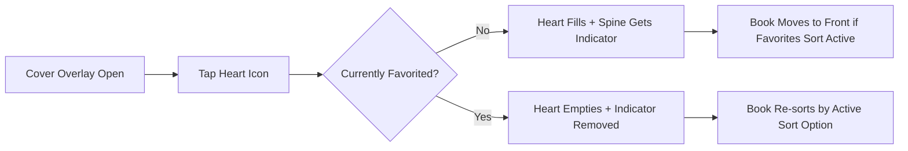

# STORY-036: Mark as Favorite

**Epic**: EPIC-006
**Persona**: Julia — The Young Author
**Priority**: Should Have
**Story Points**: 3
**Dependencies**: STORY-009 (Bookshelf Grid), STORY-012 (Cover Overlay View)

## User Story
As a young author, I want to mark my favorite books with a heart so that they stand out on the shelf and I can find them easily.

## Description
Add a "Mark as Favorite" toggle accessible from the cover overlay view (STORY-012) and/or a long-press context menu on the spine. When toggled on, the book's spine shows a filled heart icon or gold accent. Favorited books are private to the user — no social sharing. The favorite state persists and affects sorting when STORY-035's "Favorites First" mode is active.

## Context
Favoriting is a form of play and curation for children. It deepens emotional attachment to the shelf and provides a second organizational axis. The visual indicator must be subtle but meaningful — a filled heart on the spine or a gold corner accent. This story is the bridge between STORY-035 (sort) and the shelf visual language.

## Acceptance Criteria (Verifiable)
- [ ] GIVEN Julia is viewing a book's cover overlay (STORY-012)
      WHEN she taps the heart icon
      THEN the heart fills and the book is marked as a favorite
- [ ] GIVEN a book is favorited
      WHEN the shelf view renders
      THEN the book's spine shows a filled heart icon or gold accent indicator
- [ ] GIVEN a favorited book's cover overlay is open
      WHEN Julia taps the filled heart
      THEN the heart empties and the book is no longer a favorite; spine indicator is removed
- [ ] GIVEN STORY-035 is implemented and "Favorites First" sort is active
      WHEN Julia favorites a book
      THEN it moves to the front of the shelf on next render
- [ ] GIVEN Julia marks/unmarks a favorite and closes/reopens the app
      WHEN the shelf renders
      THEN the favorite state is preserved

## NFRs
- NFR-PRV-01: Favorites are private per-user; no public visibility
- NFR-PRV-03: Only the boolean favorite state is stored; no additional tracking
- NFR-ACC-03: Heart toggle has accessible role="checkbox" with aria-checked
- NFR-ACC-04: Heart icon contrast meets 3:1 minimum (decorative element)

## Definition of Done (DoD)
- [ ] Code reviewed by CodeReviewer
- [ ] Tests with coverage >= 90%
- [ ] Integration tests passing
- [ ] QA approved by QAAnalyst
- [ ] Documentation updated
- [ ] PR created by MergeRequestCreator

## Technical Notes
- Favorite state stored as boolean field on Book model (`isFavorited: boolean`), per-user (only Julia's books in MVP)
- Visual indicator: SVG heart icon on spine corner, filled #FF6B6B when active, outlined when inactive
- Toggle accessible via cover overlay (STORY-012) as primary; long-press on spine as secondary (defer if complex)
- Heart animation on toggle: scale bounce 1→1.3→1 over 200ms (coordinate with EPIC-007 animation system if available)

## User Flow

## Test Scenarios
- Scenario 1: Toggle favorite on — heart fills, spine indicator appears, state persists
- Scenario 2: Toggle favorite off — heart empties, indicator removed, state persists
- Scenario 3: Multiple books favorited — all show indicators; sort order correct in Favorites mode
- Scenario 4: Favorite a book not yet published — indicator visible once book appears on shelf
