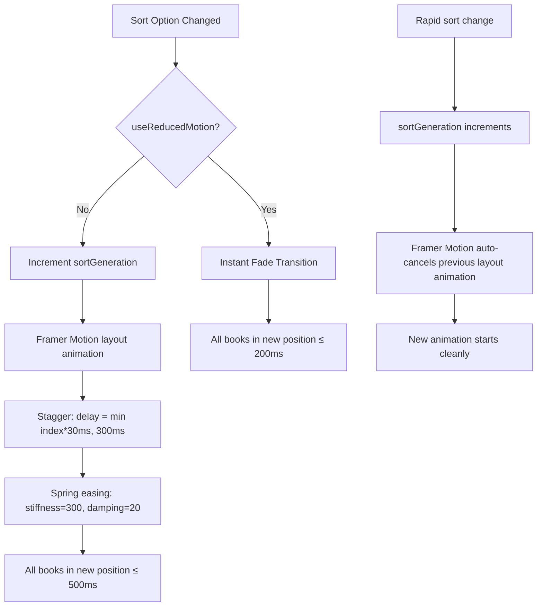
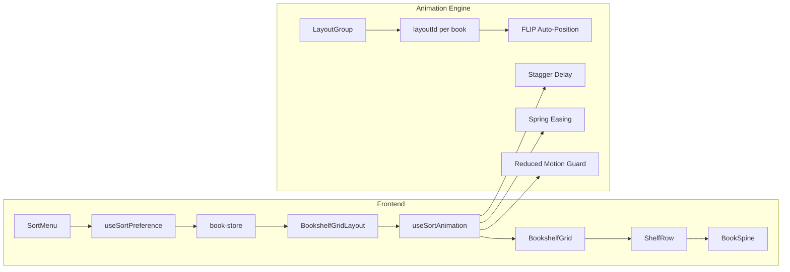
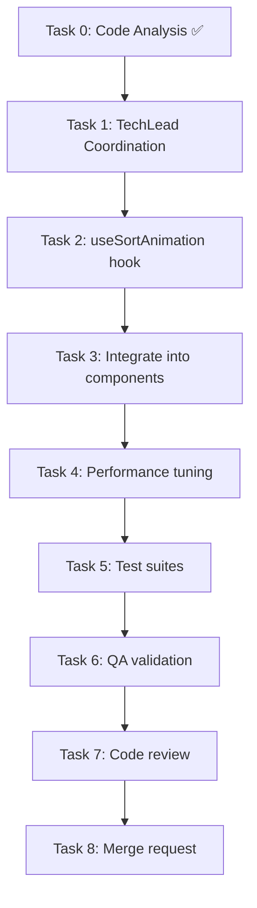

# STORY-037: Sort Animation & Performance Tuning — Technical Analysis

**Epic**: EPIC-006 | **Persona**: Julia — The Young Author | **Priority**: Should Have | **Points**: 3

**Stack**: React 18 + Framer Motion 11 + Zustand + TanStack Query + Vite + Tailwind  
**Source**: `docs/architecture/TECH-STACK.md` (React SPA, Framer Motion for animations)

---

## 1. Code Analysis Summary

- Shelf grid already uses `LayoutGroup` + `layoutId={book._id}` on `ShelfRow` → `BookSpine` for position transitions
- Staggered entrance animation exists (`staggerChildren: 0.03`) in `BookshelfGrid`
- `useReducedMotion()` guard present in every motion component
- Sort state in `book-store.js` (`sortMode` persisted to localStorage)
- Sort applied via `useMemo(() => sortBooks(books, sortMode, progressMap))` in `BookshelfGridLayout`
- **Gap**: No re-sort stagger, no spring easing override, no animation cancellation on rapid sort changes

---

## 2. Impacted Components

| File | Change Type | Description |
|------|-------------|-------------|
| `frontend/src/components/shelf/BookshelfGrid.jsx` | **Modify** | Add re-sort stagger animation, cancel logic, FLIP transition config |
| `frontend/src/components/shelf/ShelfRow.jsx` | **Modify** | Apply per-row stagger delay on re-sort, spring easing |
| `frontend/src/components/shelf/BookSpine.jsx` | **Modify** | Spring easing override for re-sort, reduced-motion instant fade |
| `frontend/src/hooks/useSortPreference.js` | **Modify** | Track animation cancellation state on rapid sort changes |
| `frontend/src/components/shelf/BookshelfGridLayout.jsx` | **Modify** | Reset animation state when sort mode changes |
| `frontend/src/stores/book-store.js` | **Possibly modify** | May need `animationKey` or `sortGeneration` counter for cancellation |
| `frontend/src/i18n/locales/en/shelf.json` | **No change** | No new user-facing strings |
| `frontend/src/__tests__/BookshelfGrid.test.jsx` | **Modify** | Add re-sort animation tests |
| `frontend/src/__tests__/BookSpine.test.jsx` | **Modify** | Add spring easing and reduced-motion tests |
| `frontend/src/__tests__/BookSpineReducedMotion.test.jsx` | **Modify** | Add re-sort fade behavior test |
| **New**: `frontend/src/hooks/useSortAnimation.js` | **Create** | Hook encapsulating FLIP re-sort animation logic, stagger timing, cancellation |
| **New**: `frontend/src/__tests__/useSortAnimation.test.js` | **Create** | Tests for animation hook |

---

## 3. Technical Approach

### 3.1 FLIP Animation via Framer Motion `layout` Prop

Existing `layoutId` pattern on `BookSpine` enables automatic position animation when the DOM order changes. Framer Motion's FLIP engine handles the "First, Last, Invert, Play" cycle internally. **No manual FLIP calculation needed** — leverage `layout` + `layoutId` + `LayoutGroup`.

### 3.2 Stagger Delay (30ms per book)

Framer Motion `variants` with `staggerChildren` already drives the entrance animation. For re-sort:
- Use `transition.staggerChildren: 0.03` on the grid container
- Apply per-item delay via `custom` prop: `transition={{ delay: index * 0.03 }}`
- Maximum stagger: 50 books × 30ms = 1500ms — exceeds 500ms NFR. **Solution**: cap stagger at `Math.min(index * 30, 300)ms` so total animation ≤ 500ms including transition duration.

### 3.3 Spring Easing

- Framer Motion `transition` prop: `{ type: "spring", stiffness: 300, damping: 20 }`
- Equivalent bounce: `cubic-bezier(0.34, 1.56, 0.64, 1)` via `transition: { type: "tween", ease: [0.34, 1.56, 0.64, 1] }`
- Framer Motion spring is GPU-accelerated (`transform: translate`) by default — no layout recalc

### 3.4 Animation Cancellation on Rapid Sort Changes

- Track `sortGeneration` counter in `useSortAnimation` hook
- When `sortMode` changes, increment generation; Framer Motion's `AnimatePresence` + `layout` automatically cancels in-flight animation and starts new one
- Alternative: `animation.cancel()` via refs if using Web Animations API — **not needed** since Framer Motion handles this natively

### 3.5 Reduced Motion: Instant Fade

- Existing `useReducedMotion()` pattern across all motion components
- When `prefers-reduced-motion: reduce` is active:
  - Skip stagger, skip spring
  - Apply `transition: { duration: 0.15, ease: "easeOut" }` (fade) instead of FLIP
  - Target: < 200ms total
- Override `layout` animation via Framer Motion's `transition` prop conditioned on `useReducedMotion()`

### 3.6 Performance (60fps for 50 Books)

- GPU-only: all animations use `transform: translate()` — no layout/paint
- `will-change: transform` on `.shelf-spine-cell` for compositor hint
- Debounce `computeItemsPerRow` via existing `useDebouncedResize`
- Test with Chrome DevTools Performance panel: 50 spines × stagger should maintain 60fps
- Framer Motion batch-renders layout animations in `LayoutGroup`

---

## 4. Execution Architecture

---

## 5. NFR Analysis

| NFR | Requirement | Strategy | Verification |
|-----|-------------|----------|--------------|
| NFR-PERF-01 | Animation completes ≤ 500ms for 50 books | Cap stagger at 300ms, spring duration ~200ms | Vitest: assert total duration; manual: Chrome Performance tab |
| NFR-PERF-04 | 60fps during animation | GPU-only transforms, LayoutGroup batching, will-change | Chrome DevTools fps counter on 50-book dataset |
| NFR-ACC-05 | Instant fade < 200ms when reduced-motion active | `useReducedMotion()` → `duration: 0.15, ease: "easeOut"` | Vitest: reduced-motion test suite |

---

## 6. Persona Impact

**Julia — The Young Author** (primary): The cascading "shuffle" effect makes sorting feel tactile and fun — vital for a children's app. The stagger creates a "wave" that satisfies curiosity about where books moved. The spring overshoot adds delight.Reduced-motion users get instant, accessible feedback instead of motion sickness.

---

## 7. Task Breakdown & Agent Assignment

| Task | Description | Agent | Effort |
|------|-------------|-------|--------|
| 0 | ✅ Code analysis (completed) | CodeAnalyzer | — |
| 1 | Coordination: delegate & sequence tasks | TechLead | S |
| 2 | Create `useSortAnimation` hook: stagger timing, generation counter, reduced-motion guard | FrontendDeveloperReact | M |
| 3 | Integrate hook into `BookshelfGrid`, `ShelfRow`, `BookSpine`: FLIP transition config, spring easing, stagger delay | FrontendDeveloperReact | M |
| 4 | Performance: add `will-change` hints, cap stagger, verify ≤ 50 books / 60fps | FrontendDeveloperReact | S |
| 5 | Test suites: `useSortAnimation.test.js`, update `BookshelfGrid.test.jsx`, `BookSpine.test.jsx`, `BookSpineReducedMotion.test.jsx` | TestEngineer | M |
| 6 | QA validation: all acceptance criteria | QAAnalyst | S |
| 7 | Code review | CodeReviewer | S |
| 8 | Merge request | MergeRequestCreator | S |

---

## 8. Execution Order

**Sequential**: Tasks 2→3→4 (hook must exist before integration, integration before perf tuning)  
**Sequential**: Tasks 5→6→7→8 (tests before QA, QA before review, review before merge)

---

## 9. Risk Assessment

| Risk | Likelihood | Impact | Mitigation |
|------|-----------|--------|------------|
| Framer Motion layout animations janky with 50 items | Medium | High | LayoutGroup batching; benchmark early; fallback to CSS transitions if needed |
| Stagger exceeds 500ms for 50 books | Medium | Medium | Cap per-item delay at `min(index*30, 300)ms` |
| Rapid sort changes cause animation stacking | Low | Medium | `sortGeneration` counter + Framer Motion auto-cancellation |
| Reduced-motion guard missed in new code | Low | High | Mandatory `useReducedMotion()` check in every animate prop; dedicated test |
| `useSortAnimation` hook complexity grows | Low | Medium | Keep hook focused: only stagger + generation + reduced-motion; no state overreach |

---

## 10. Implementation Recommendations

1. **New hook `useSortAnimation`** — single responsibility: compute stagger delay per index, expose `sortGeneration` counter, expose `isReducedMotion` flag, return `getTransition(index)` function
2. **Leverage existing `LayoutGroup` + `layoutId`** — do NOT replace with manual FLIP; Framer Motion handles position diffing
3. **Stagger cap formula**: `delay = Math.min(index * 0.03, 0.3)` — max 300ms stagger + 200ms spring = 500ms total
4. **Spring config**: `{ type: "spring", stiffness: 300, damping: 20 }` — slight overshoot matching `cubic-bezier(0.34, 1.56, 0.64, 1)`
5. **Reduced-motion override**: `{ type: "tween", duration: 0.15, ease: "easeOut" }` — total < 200ms ✅
6. **Rapid cancellation**: Framer Motion `layout` prop auto-cancels; add `sortGeneration` as `key` on container to force remount if needed
7. **Performance**: add `style={{ willChange: 'transform' }}` on each `BookSpine` during animation, remove after settle

---

## 11. Integration Pattern

**Frontend-only** (Node.js fullstack): React SPA → Zustand state → TanStack Query cache. No backend changes required. Animation is purely client-side.

| Aspect | Detail |
|--------|--------|
| State | Zustand `book-store.sortMode` — already persisted |
| Data flow | `sortBooks()` (pure fn) → `BookshelfGridLayout` useMemo → grid |
| Animation | Framer Motion `LayoutGroup` + `layoutId` + `useSortAnimation` hook |
| Testing | Vitest + React Testing Library; jsdom doesn't render layout, so verify prop configs and reduced-motion branching |
| i18n | No new strings (sort labels already exist from STORY-035) |

---

## 12. Documents Referenced

- PM Story: `/docs/stories/STORY-037.md`
- Tech Stack: `/docs/architecture/TECH-STACK.md`
- Code Analysis: `/docs/stories/STORY-037-code-analysis.md` (if separately generated)
- This Analysis: `/docs/stories/STORY-037-technical-analysis.md`