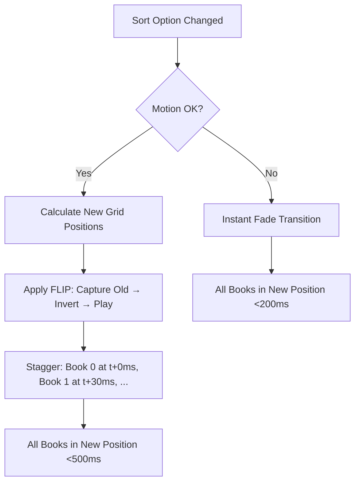

# STORY-037: Sort Animation & Performance Tuning

**Epic**: EPIC-006
**Persona**: Julia — The Young Author
**Priority**: Should Have
**Story Points**: 3
**Dependencies**: STORY-035 (Sort Menu)

## User Story
As a young author, I want the books on my shelf to glide smoothly to their new positions when I change the sort order, so the shelf feels alive and fun to use.

## Description
Implement a smooth, staggered re-sort animation when the user changes the sort option (Alphabetical, Favorites, Recently Read). Books should glide to their new grid positions with a slight stagger delay (30-50ms per book), creating a cascading "shuffle" effect. The animation must respect reduced-motion preferences and maintain 60fps on mid-range devices with up to 50 books.

## Context
The re-sort animation transforms a functional operation into a delightful interaction. Children respond positively to physical, tactile feedback. This story completes the EPIC-006 shelf organization experience and bridges to EPIC-007's animation system. If EPIC-007 is not yet implemented, use standalone CSS transitions/flip technique.

## Acceptance Criteria (Verifiable)
- [ ] GIVEN Julia changes the shelf sort option
      WHEN the sort menu selection is made
      THEN books animate (glide) to their new positions with staggered timing
- [ ] GIVEN 10 books on the shelf with staggered re-sort animation
      WHEN the animation completes
      THEN all books are in their correct sorted positions within 500ms total
- [ ] GIVEN the device has `prefers-reduced-motion` enabled
      WHEN Julia changes the sort option
      THEN books appear in new positions instantly with a subtle fade (no motion), under 200ms
- [ ] GIVEN Julia rapidly changes sort options twice in succession
      WHEN the second sort is selected
      THEN the first animation is cancelled and the second begins without visual glitching
- [ ] GIVEN 50 books on a mid-range mobile device
      WHEN the re-sort animation runs
      THEN frame rate stays at 60fps with no dropped frames

## NFRs
- NFR-PERF-01: Full re-sort animation completes within 500ms for up to 50 books
- NFR-PERF-04: 60fps maintained during animation
- NFR-ACC-05: Instant transitions with fade when `prefers-reduced-motion` is active

## Definition of Done (DoD)
- [ ] Code reviewed by CodeReviewer
- [ ] Tests with coverage >= 90%
- [ ] Integration tests passing
- [ ] QA approved by QAAnalyst
- [ ] Documentation updated
- [ ] PR created by MergeRequestCreator

## Technical Notes
- Use FLIP animation technique (First, Last, Invert, Play) for performant grid reordering
- Stagger delay: 30ms per book index (e.g., book at index 0 moves at t+0ms, index 9 at t+270ms)
- Spring easing: `cubic-bezier(0.34, 1.56, 0.64, 1)` for slight overshoot bounce
- Use CSS `transform: translate()` only (GPU-accelerated, no layout recalc)
- Cancel in-flight animations with `animation.cancel()` or equivalent before starting new sort
- If EPIC-007 animation engine exists, delegate to it; otherwise implement standalone

## User Flow

## Test Scenarios
- Scenario 1: 10 books re-sort from Alphabetical to Recently Read — staggered animation visible
- Scenario 2: 50 books on mobile — no frame drops, animation completes
- Scenario 3: Rapid double-sort change — first animation cancelled, second runs cleanly
- Scenario 4: Reduced motion active — instant fade, no sliding
