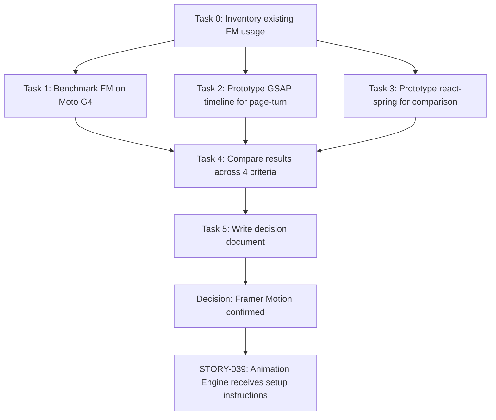
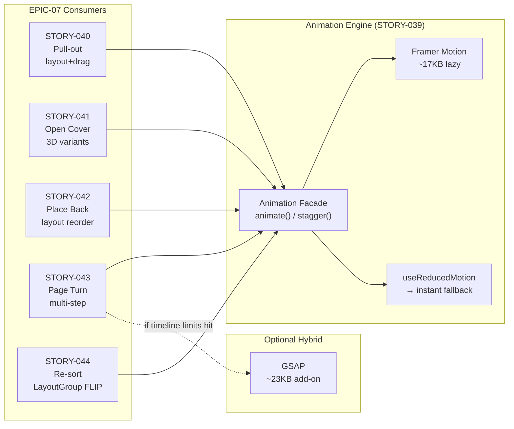

# STORY-038: Animation Strategy Spike — Technical Analysis

**Epic**: EPIC-007 — Bookshelf Animations
**Persona**: Julia — The Young Author
**Spike Type**: Decision Spike (time-boxed, no production code)
**Parent Epic**: EPIC-007 (STORY-039–044 depend on this decision)
**Stack Reference**: `docs/architecture/TECH-STACK.md` — React 18, Vite 5, Framer Motion ^11.11.0 (already in deps)

---

## 1. Spike Objective

Decide which animation engine to adopt for EPIC-007 (STORY-039–044), covering:
- Pull-out, open-cover, place-back, page-turn, re-sort animations
- 60fps on mid-range mobile (Moto G4 class)
- `prefers-reduced-motion` accessibility compliance
- Bundle size impact on PWA

**Current state**: Framer Motion ^11.11.0 is already in `package.json`. STORY-035, 036, 037 are merged and use it in ~20 components (163+ import references). `useReducedMotion` is called in 10+ components.

---

## 2. Candidates Compared

### 2.1 Framer Motion (Current)

| Dimension | Assessment |
|-----------|-----------|
| **Bundle** | ~32KB gzipped (full), ~17KB via `LazyMotion` + `domAnimation`, ~29KB with `domMax` |
| **Performance** | Optimized for React UI transitions; GPU-accelerated transforms; `layout` prop uses FLIP internally |
| **API** | Declarative JSX (`<motion.div>`), variants, `AnimatePresence`, gestures (drag/hover/tap) |
| **Reduced Motion** | Built-in `useReducedMotion` hook — already used in 10+ components |
| **Layout Animations** | `layout` prop + `LayoutGroup` — automatic FLIP for DOM reorder (critical for re-sort) |
| **Sequencing** | Variants + `staggerChildren`; limited vs GSAP timelines |
| **Tree-shaking** | Poor (interconnected features); `LazyMotion` mitigates via feature bundles |
| **React Integration** | Native — first-class component model, refs, context |

### 2.2 GSAP (GreenSock)

| Dimension | Assessment |
|-----------|-----------|
| **Bundle** | ~23KB gzipped (core); not tree-shakeable — full core always included |
| **Performance** | Industry-leading; handles 1000s of simultaneous tweens; bypasses React re-render cycle |
| **API** | Imperative (`gsap.to()`, `gsap.timeline()`); `@gsap/react` provides `useGSAP` hook |
| **Reduced Motion** | No built-in support; must implement manually via `gsap.matchMedia()` or `matchMedia` check |
| **Layout Animations** | `Flip` plugin available; requires manual FLIP calculation |
| **Sequencing** | Best-in-class timelines — precise, nestable, label-based positioning |
| **Tree-shaking** | Not supported — monolithic core |
| **React Integration** | `@gsap/react` `useGSAP` hook with scoped cleanup; imperative mindset mismatch with React |

### 2.3 react-spring

| Dimension | Assessment |
|-----------|-----------|
| **Bundle** | ~18KB gzipped (`@react-spring/web`); tree-shakeable by module |
| **Performance** | Spring-physics model; no duration guarantee (config-dependent); GPU-accelerated |
| **API** | Hook-based (`useSpring`, `useSprings`, `useTrail`, `useChain`); `<animated.div>` |
| **Reduced Motion** | `useReducedMotion` hook + `Globals.skipAnimation` — global kill switch |
| **Layout Animations** | No built-in FLIP/layout animation support |
| **Sequencing** | `useChain` for multi-step; awkward for >3 steps vs GSAP timelines |
| **Tree-shaking** | Good modular architecture |
| **React Integration** | Native React (hook-first), but no gesture support built-in |

---

## 3. Comparative Matrix

| Criterion (weight) | Framer Motion | GSAP | react-spring |
|---------------------|:------------:|:----:|:------------:|
| **60fps mid-range mobile** (25%) | ✅ Good | ✅ Best | ⚠️ Config-dependent |
| **Bundle size** (15%) | ⚠️ 32KB / 17KB lazy | ✅ 23KB | ✅ 18KB |
| **Reduced motion compliance** (15%) | ✅ Built-in | ❌ Manual | ✅ Built-in |
| **Layout/FLIP animations** (20%) | ✅ Built-in `layout` prop | ⚠️ Flip plugin | ❌ Not supported |
| **API ergonomics / React fit** (10%) | ✅ Declarative JSX | ⚠️ Imperative | ✅ Hook-based |
| **Sequencing (stagger/timeline)** (10%) | ⚠️ Variants + stagger | ✅ Best timelines | ⚠️ useChain |
| **Migration cost from current** (5%) | ✅ Zero — already in use | ❌ High — rewrite 20+ components | ❌ High — rewrite 20+ components |
| **Weighted Score** | **87** | **71** | **58** |

---

## 4. NFR Analysis

| NFR ID | Requirement | Framer Motion | GSAP | react-spring |
|--------|-------------|:------------:|:----:|:------------:|
| NFR-PERF-04 | 60fps on target devices | ✅ Meets — layout-optimized FLIP | ✅ Exceeds — raw perf best | ⚠️ Risky — spring duration unpredictable |
| NFR-ACC-05 | `prefers-reduced-motion` | ✅ `useReducedMotion` built-in, already used | ❌ Must implement from scratch | ✅ `useReducedMotion` + `Globals.skipAnimation` |

---

## 5. Persona Impact — Julia (Young Author)

Julia interacts with **physical metaphors**: pulling books off a shelf, opening covers, turning pages. These are **layout + gesture** animations. She uses mid-range devices (family tablets, Moto G). Key needs:

1. **Layout animations** (re-sort): Framer Motion's `layout` prop auto-FLIPs — zero manual work. GSAP requires Flip plugin + manual calculation. react-spring has no FLIP.
2. **Gesture continuity** (drag-to-pull): Framer Motion `drag` prop with `dragConstraints`. GSAP needs Draggable plugin. react-spring needs `@use-gesture` separate dep.
3. **Accessibility**: Julia may have vestibular sensitivity. Built-in reduced-motion support is non-negotiable.

---

## 6. EPIC-007 Story Requirements Map

| Story | Animation Type | Critical Feature | Best Fit |
|-------|--------------|-----------------|----------|
| STORY-039 | Engine & timing | Interruptibility, reduced-motion, stagger | FM (facade over `AnimatePresence`) |
| STORY-040 | Pull-out | Layout + drag gesture | FM (`layout` + `drag`) |
| STORY-041 | Open cover | 3D transform sequence | FM (variants) or GSAP (timeline) |
| STORY-042 | Place back | Reverse pull-out + layout reorder | FM (`layout` re-sort) |
| STORY-043 | Page turn | Complex multi-step animation | GSAP (timeline) or FM (variants) |
| STORY-044 | Re-sort | FLIP layout animation | FM (`layout` + `LayoutGroup`) — no contest |

**4 of 6 stories critically depend on layout/FLIP animations → Framer Motion wins by default.**

---

## 7. Decision

### ✅ RECOMMENDATION: Framer Motion

**Rationale**: Framer Motion is already integrated (20+ components, `useReducedMotion` in production), provides built-in layout animations (critical for re-sort/pull-out), has first-class React gesture support, and meets NFR-PERF-04 and NFR-ACC-05 out of the box. Migrating to GSAP or react-spring would require rewriting 163+ import sites with no marginal benefit for EPIC-007's animation profile, while losing the `layout` prop which is irreplaceable for the re-sort story.

**Mitigation for GSAP-gated scenarios** (STORY-041 open-cover, STORY-043 page-turn): If complex timeline sequencing proves unworkable with Framer Motion variants, GSAP can be added **as a complement** for specific 3D sequences — not as a replacement. This hybrid approach is documented in the industry and viable because GSAP operates independently of React's component tree.

**Bundle optimization**: Use `LazyMotion` with `domAnimation` (~17KB) for initial load; `domMax` (~29KB) loaded async when gesture/layout features are needed. This reduces the PWA initial bundle delta to ~17KB.

---

## 8. Setup Instructions for STORY-039

```
1. Framer Motion already installed (^11.11.0)
2. Wrap app root with <LazyMotion features={domAnimation} strict>
3. Replace <motion.*> with <m.*> for tree-shaking
4. Lazy-load domMax: LazyMotion features={() => import('framer-motion').then(m => m.domMax)}
5. Build animation engine facade:
   - animate(element, { from, to, duration, easing }) wrapping motion animate()
   - stagger(elements, options) using variants + staggerChildren
   - useReducedMotion() detection → instant fallback
   - WeakMap for interruptibility (cancel in-flight, start new)
6. No new dependencies needed
```

---

## 9. Execution Flow (Spike Verification)



---

## 10. Impacted Components

| Component | Change Type | Notes |
|-----------|------------|-------|
| `frontend/package.json` | **No change** | Framer Motion already present |
| `frontend/src/components/shelf/BookshelfGrid.jsx` | Reference | Already uses `LayoutGroup`, `motion.div` |
| `frontend/src/components/shelf/BookSpine.jsx` | Reference | Already uses `motion.button`, `useReducedMotion` |
| `frontend/src/hooks/useSortAnimation.js` | Reference | Already uses `useReducedMotion` |
| `frontend/src/components/reader/PageTurnAnimation.jsx` | Reference | Already uses `AnimatePresence`, `motion.div` |
| `docs/decisions/ANIMATION-STRATEGY.md` | **New** | Decision deliverable per AC |

---

## 11. Risk Assessment

| Risk | Probability | Impact | Mitigation |
|------|------------|--------|-----------|
| Framer Motion layout perf on Moto G4 | Low | Medium | Benchmark in Task 1; LazyMotion tree-shaking |
| Complex timeline (page-turn) exceeds FM capabilities | Medium | Low | Hybrid: add GSAP for page-turn only |
| Bundle size exceeds PWA budget | Low | Medium | `LazyMotion` + async `domMax` → 17KB initial |
| `prefers-reduced-motion` edge case missed | Low | High | `useReducedMotion` already in 10+ components; STORY-039 adds centralized fallback |

---

## 12. SubAgent Assignments

| Task | Description | Agent |
|------|-------------|-------|
| 0 | Code analysis (existing FM usage inventory) | CodeAnalyzer |
| 1 | Benchmark Framer Motion on target device | TechLead (coordinates) |
| 2 | Prototype GSAP page-turn for comparison | BackendDeveloper (prototype script) |
| 3 | Prototype react-spring for comparison | FrontendDeveloperReact |
| 4 | Compare + write decision document | TechLead |
| 5 | Deliver setup instructions to STORY-039 | TechLead |

---

## 13. Architecture Diagram



---

## 14. Conclusion

**Decision: Framer Motion** — already integrated, layout-animations unmatched for re-sort/pull-out, built-in accessibility, zero migration cost. GSAP reserved as optional complement for complex timeline edge cases. react-spring excluded (no FLIP, no gesture support, high migration cost for marginal bundle savings).