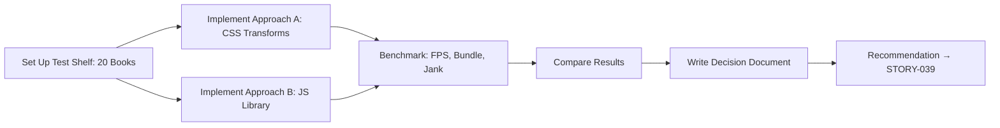

# STORY-038: Animation Strategy Spike

**Epic**: EPIC-007
**Persona**: Julia — The Young Author
**Priority**: Should Have
**Story Points**: 3
**Dependencies**: STORY-009 (Bookshelf Grid)

## User Story
As the development team, I want to evaluate and benchmark animation libraries and techniques so that we can choose the most performant approach for Estante Digital's book interactions on mid-range mobile devices.

## Description
Conduct a time-boxed spike (max 1 sprint) to evaluate animation technology options for the bookshelf interactions: pull-out, open-cover, place-back, page-turn, and re-sort animations. Test at least two approaches (pure CSS transforms vs. a JavaScript animation library such as Framer Motion or GSAP) on a mid-range mobile device with 20 simulated books. Produce a decision document with benchmarks and a recommended approach.

## Context
Animations are core to the product's differentiation — they transform a web app into a "digital toy." However, poor animation performance on mid-range devices would damage the experience. This spike must be time-boxed: the goal is to make a decision, not to build production animations. STORY-009 (Bookshelf Grid) must be functional to provide a realistic test bed.

## Acceptance Criteria (Verifiable)
- [ ] GIVEN a test bookshelf with 20 books rendered
      WHEN at least two animation approaches are benchmarked (pure CSS vs. JS library)
      THEN a decision document is produced comparing: 60fps stability, bundle size impact, API ergonomics, accessibility compliance
- [ ] GIVEN a mid-range mobile device (e.g., Moto G, iPhone SE 2019)
      WHEN pull-out and re-sort animations are prototyped
      THEN frame rate measurements are recorded for each approach
- [ ] GIVEN the spike is complete
      WHEN the decision is made
      THEN the recommended approach is documented with setup instructions for STORY-039 (Animation Engine)
- [ ] GIVEN the spike
      WHEN time-box expires (5 working days)
      THEN the decision is made even if not exhaustive; "no decision" is not an acceptable outcome

## NFRs
- NFR-PERF-04: Benchmark must measure 60fps capability on target devices
- NFR-ACC-05: Each approach must be evaluated for `prefers-reduced-motion` compliance

## Definition of Done (DoD)
- [ ] Code reviewed by CodeReviewer
- [ ] Tests with coverage >= 90% (for evaluation scripts)
- [ ] Integration tests passing
- [ ] QA approved by QAAnalyst
- [ ] Documentation updated
- [ ] PR created by MergeRequestCreator

## Technical Notes
- **Approaches to test**: (A) Pure CSS transforms + CSS transitions/keyframes + FLIP technique, (B) Framer Motion (React), (C) GSAP (framework-agnostic)
- **Benchmark metrics**: frames per second (FPS), jank count, total animation duration, bundle size delta (kB)
- **Device target**: Chrome DevTools device emulation for Moto G4, plus one physical mid-range device if available
- **Deliverable**: `docs/decisions/ANIMATION-STRATEGY.md` with recommendation, setup code, and trade-offs
- **Time box**: 3 story points = ~half sprint for one developer

## User Flow

## Test Scenarios
- Scenario 1: CSS-only approach maintains 60fps on Moto G4 emulation with 20 books
- Scenario 2: JS library approach maintains 60fps on same device with 20 books
- Scenario 3: Both approaches correctly respond to `prefers-reduced-motion`
- Scenario 4: Bundle size delta for each approach is measured and documented
