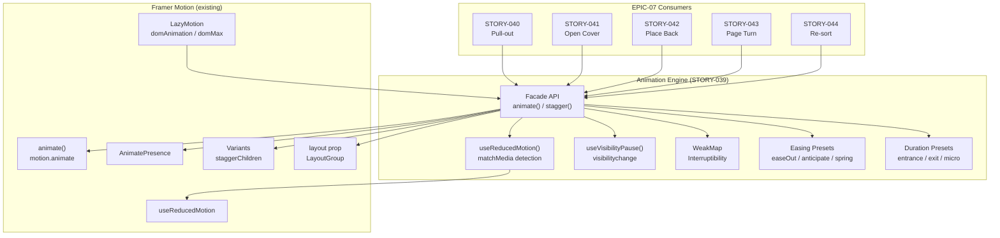
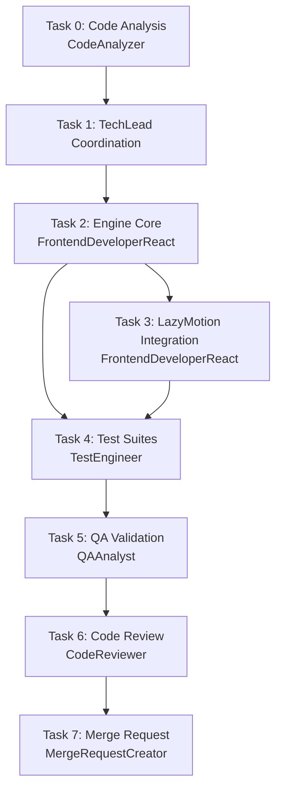

# STORY-039: Animation Engine & Timing System — Technical Analysis

**Epic**: EPIC-007 — Bookshelf Animations
**Persona**: Julia — The Young Author
**Parent Epic**: EPIC-007 (STORY-040–044 depend on this engine)
**Stack Reference**: `docs/architecture/TECH-STACK.md` — React 18, Vite 5, Framer Motion ^11.11.0
**Decision Reference**: `docs/decisions/ANIMATION-STRATEGY.md` — Framer Motion confirmed

---

## 1. Story Summary

Build a reusable animation engine facade over Framer Motion that provides: configurable duration/easing, interruptibility, `prefers-reduced-motion` detection with instant fallback, stagger/timeline support for multi-element sequences, and pause-on-background via `visibilitychange`. This engine is consumed by all subsequent EPIC-007 stories (STORY-040–044).

---

## 2. Detected Tech Stack

| Layer | Technology | Source |
|-------|-----------|--------|
| Runtime | Node.js 22 LTS | `package.json` |
| Frontend | React 18 | `frontend/package.json` |
| Animations | Framer Motion ^11.11.0 | `frontend/package.json` (already installed) |
| Build | Vite 5.x | `frontend/package.json` |
| Testing | Vitest + Testing Library | `frontend/package.json` |
| Styling | Tailwind CSS 3.x | `frontend/package.json` |

**Frontend Framework**: React → **FrontendDeveloperReact**
**Integration Pattern**: React SPA, no backend API needed for this story (pure frontend utility)

---

## 3. Codebase Analysis Summary

### 3.1 Existing Framer Motion Usage

- **20+ components** import from `framer-motion`
- **`useReducedMotion`** called in **10+ components** (BookSpine, BookshelfGrid, PageTurnAnimation, PulledOutOverlay, CoverOverlay, FavoriteToggle, ShelfPage, ReaderSettings, ReaderToolbar, ReaderProgressBar, etc.)
- **`LayoutGroup`** already used in `BookshelfGrid.jsx`
- **`AnimatePresence`** used in `BookshelfGrid`, `PulledOutOverlay`, `PageTurnAnimation`
- **163+ import references** across the codebase

### 3.2 Existing Animation Patterns (to Consolidate)

| Pattern | Location | What It Does |
|---------|----------|-------------|
| `useSortAnimation()` hook | `hooks/useSortAnimation.js` | Stagger delay calculation + `useReducedMotion` check — **engine will absorb this** |
| Inline `prefersReducedMotion` checks | 10+ components | Redundant per-component reduced-motion logic — **engine centralizes** |
| `usePulledOutBook()` hook | `hooks/usePulledOutBook.js` | Duration override based on `useReducedMotion` — **engine will provide `getDuration()`** |
| Inline duration constants | `BookSpine.jsx`, `PageTurnAnimation.jsx` | Hardcoded `300ms`, `0.3s` — **engine will provide named presets** |

### 3.3 Key Insight: Ad-Hoc → Centralized

Current state: every component independently handles reduced-motion, duration, and interruption. STORY-039 creates a single facade that:
1. Eliminates 10+ duplicate `useReducedMotion` calls
2. Provides interruptibility via WeakMap (currently no component handles mid-flight cancellation)
3. Adds `visibilitychange` pause/resume (currently no component handles tab backgrounding)
4. Provides stagger abstraction (currently `useSortAnimation` is the only stagger, hardcoded to sort context)

---

## 4. Technical Task Breakdown

### Task 0: Code Analysis
- **Agent**: CodeAnalyzer
- **Scope**: Inventory all existing Framer Motion usage, identify duplication, map dependency graph
- **Deliverable**: `STORY-039-code-analysis.md`

### Task 1: TechLead Coordination
- **Agent**: TechLead
- **Scope**: Orchestrate Tasks 2–7 using references below
- **References**: PM story, this analysis, code analysis (if created)

### Task 2: Animation Engine Core Implementation
- **Agent**: FrontendDeveloperReact
- **Scope**: Build `frontend/src/lib/animation-engine/` with:
  - `animate()` — single-element animation with duration, easing, interruptibility
  - `stagger()` — multi-element sequential animation
  - `useAnimationEngine()` — React hook exposing engine API
  - `useReducedMotion()` — centralized re-export (replaces 10+ direct imports)
  - `useVisibilityPause()` — `document.visibilitychange` hook for pause/resume
  - Interruptibility: WeakMap keyed by element, cancel in-flight before starting new
  - Reduced-motion: auto-detect via `matchMedia`, skip motion + apply target instantly with fade
  - Visibility: pause animations on background, resume on foreground
  - Preset easings: `easeOut` (entrances), `anticipate` (playful), `spring` (interactions)
  - **No new npm dependencies** — wraps Framer Motion only

### Task 3: LazyMotion Integration
- **Agent**: FrontendDeveloperReact
- **Scope**: Modify `frontend/src/main.jsx` to:
  - Wrap app with `<LazyMotion features={domAnimation} strict>`
  - Replace `<motion.*>` with `<m.*>` in shelf/reader components for tree-shaking
  - Async-load `domMax` for gesture/layout components
- **Dependency**: Must complete after Task 2 (engine must be ready for `<m.*>` migration)

### Task 4: Test Suites
- **Agent**: TestEngineer
- **Scope**:
  - Unit: `animate()` with correct duration/easing, interrupt mid-flight, reduced-motion fallback, stagger timing, visibility pause/resume
  - Integration: engine + LazyMotion, engine + AnimatePresence, engine + LayoutGroup
  - Accessibility: reduced motion detection, instant transition verification
- **Coverage target**: ≥90%

### Task 5: QA Validation
- **Agent**: QAAnalyst
- **Scope**: Validate all acceptance criteria pass, performance overhead <1ms/frame, reduced-motion auto-detection works

### Task 6: Code Review
- **Agent**: CodeReviewer
- **Scope**: Review engine API design, interruptibility correctness, WeakMap memory safety, LazyMigration migration completeness

### Task 7: Merge Request
- **Agent**: MergeRequestCreator
- **Scope**: Create MR with all documentation, traceability to STORY-039

---

## 5. NFR Analysis

| NFR ID | Requirement | Implementation | Verification |
|--------|-------------|----------------|--------------|
| NFR-PERF-04 | Engine overhead <1ms per animation frame | Use `requestAnimationFrame` via Framer Motion internals; avoid JS-driven per-frame calculations; leverage GPU-accelerated transforms only | Vitest benchmark in test suite; Chrome DevTools Performance tab |
| NFR-ACC-05 | Automatic reduced-motion detection; no per-story manual checks | Centralized `useReducedMotion()` in engine facade; all consumers go through engine; `matchMedia('(prefers-reduced-motion: reduce)')` | Test: mock `matchMedia`, verify instant fallback; test: engine consumer doesn't need its own `useReducedMotion` call |
| NFR-ACC-05 | Engine respects `prefers-reduced-motion` media query | Engine checks media query on every `animate()` / `stagger()` call; if true: skip motion, apply target state instantly with opacity fade | Unit test with `matchMedia` mock returning `true` |

---

## 6. Persona Impact — Julia (Young Author)

Julia uses mid-range family devices (tablets, Moto G). She interacts with physical metaphors:

| Need | Engine Feature | Why It Matters |
|------|---------------|----------------|
| **No frame drops** | GPU-accelerated transforms only; <1ms overhead | Mid-range devices choke on JS-layout-thrashing animations |
| **Vestibular sensitivity** | `prefers-reduced-motion` → instant + fade | Some children are sensitive to motion; accessibility non-negotiable |
| **Pull-out feels snappy** | Interruptibility — mid-flight cancellation without glitch | Julia taps quickly; partial animations must not stack/jank |
| **Stagger feels playful** | Stagger with configurable per-element delay | Sequential book reveals feel like a "digital toy" |
| **Tab switching safe** | Visibility-based pause/resume | Julia may switch apps mid-animation; state must be preserved |

---

## 7. Architecture Diagram



---

## 8. Execution Flow



**Parallelization**: Tasks 2 and 3 are **sequential** (Task 3 depends on engine API from Task 2). Task 4 starts after Task 2 but can begin test scaffolding in parallel with Task 3.

---

## 9. Engine API Design

### 9.1 File Structure

```
frontend/src/lib/animation-engine/
├── index.js              # Public API exports
├── animate.js            # animate() function
├── stagger.js            # stagger() function
├── use-animation-engine.js  # React hook
├── use-visibility-pause.js  # visibilitychange hook
├── presets.js            # Easing + duration presets
├── interruptibility.js   # WeakMap-based cancellation
└── __tests__/
    ├── animate.test.js
    ├── stagger.test.js
    ├── use-animation-engine.test.js
    ├── use-visibility-pause.test.js
    └── integration.test.js
```

### 9.2 Public API

```js
// animate(element, options) → AnimationHandle
//   - Handles interruptibility (WeakMap cancel)
//   - Handles reduced-motion (instant + fade)
//   - Handles visibility pause/resume
export function animate(element, {
  from,           // CSS transform start state
  to,             // CSS transform end state
  duration,       // ms or preset string ('entrance', 'exit', 'micro')
  easing,         // string or preset ('easeOut', 'anticipate', 'spring')
  onComplete,      // callback on animation end
  interruptible = true,  // cancel in-flight before starting
})

// stagger(elements, options) → AnimationHandle[]
//   - Each element delayed by perElement ms from previous
//   - Supports all animate() options
export function stagger(elements, {
  perElement,     // delay between each element (ms)
  ...animateOptions  // passed to each animate() call
})

// useAnimationEngine() → { animate, stagger, prefersReducedMotion, isPaused }
//   - React hook providing engine access
export function useAnimationEngine()

// useVisibilityPause() → { isPaused, pause, resume }
//   - Listens to document.visibilitychange
export function useVisibilityPause()

// Re-exports for convenience
export { useReducedMotion } from 'framer-motion';
```

### 9.3 Interruptibility Implementation

```js
// WeakMap keyed by element → current AnimationHandle
const inFlight = new WeakMap();

function safeAnimate(element, options) {
  // Cancel existing animation for this element
  if (inFlight.has(element)) {
    const existing = inFlight.get(element);
    existing.cancel();
    inFlight.delete(element);
  }
  
  const handle = startAnimation(element, options);
  inFlight.set(element, handle);
  
  handle.onComplete(() => {
    inFlight.delete(element);
  });
  
  return handle;
}
```

### 9.4 Reduced-Motion Implementation

```js
function startAnimation(element, options) {
  if (prefersReducedMotion) {
    // Skip motion — apply target state instantly with fade
    element.style.transition = 'opacity 150ms ease';
    element.style.opacity = '0';
    requestAnimationFrame(() => {
      Object.assign(element.style, options.to);
      element.style.opacity = '1';
    });
    return { cancel: () => {}, onComplete: (cb) => cb() };
  }
  
  // Normal animation path via Framer Motion
  return motionAnimate(element, options.to, {
    duration: options.duration / 1000,
    ease: options.easing,
  });
}
```

---

## 10. Impacted Components & Files

| File | Change Type | Notes |
|------|------------|-------|
| `frontend/src/lib/animation-engine/` | **New** | Engine module (7 files + tests) |
| `frontend/src/main.jsx` | **Modify** | Add `LazyMotion` wrapper |
| `frontend/src/hooks/useSortAnimation.js` | **Refactor** | Delegate stagger calculation to engine; engine absorbs this hook's logic |
| `frontend/src/hooks/usePulledOutBook.js` | **Refactor** | Use engine's `getDuration()` instead of inline `useReducedMotion` |
| `frontend/src/components/shelf/BookSpine.jsx` | **Refactor** | Import engine's `useReducedMotion` instead of direct `framer-motion` |
| `frontend/src/components/shelf/BookshelfGrid.jsx` | **Refactor** | Import engine instead of direct `framer-motion` |
| `frontend/src/components/reader/PageTurnAnimation.jsx` | **Refactor** | Use engine's `animate()` wrapper |
| 10+ additional components | **Minor refactor** | Swap `useReducedMotion` imports to engine re-export |

---

## 11. Risk Assessment

| Risk | Probability | Impact | Mitigation |
|------|------------|--------|-------------|
| WeakMap doesn't garbage-collect if element removed mid-animation | Low | Low | `onComplete` cleans up; component unmount should cancel via cleanup |
| `visibilitychange` event timing differs across browsers | Medium | Low | Feature-detect + test on Chrome/Firefox/Safari; use `document.hidden` as source of truth |
| LazyMotion `strict` mode breaks components using `<motion.*>` instead of `<m.*>` | High | Medium | Migration in Task 3 must cover ALL components; grep-based audit before enabling strict |
| Framer Motion `animate()` API differs from `motion.animate()` in ^11.11 | Low | Medium | Use `motion()` from framer-motion, not Web Animations API; verify against docs |
| Reduced-motion fade conflicts with existing opacity transitions | Low | Low | Engine applies 150ms fade only when reduced-motion active; normal path untouched |
| Engine overhead exceeds 1ms per frame | Low | High | Benchmark in tests; avoid JS-driven per-frame calculations; delegate to Framer Motion internals |

---

## 12. SubAgent Assignments

| Task | Description | Agent | Language |
|------|-------------|-------|----------|
| 0 | Code analysis (FM usage inventory) | CodeAnalyzer | Node.js |
| 1 | Coordination | TechLead | - |
| 2 | Engine core implementation | FrontendDeveloperReact | React |
| 3 | LazyMotion integration + component migration | FrontendDeveloperReact | React |
| 4 | Test suites | TestEngineer | Node.js |
| 5 | QA validation | QAAnalyst | - |
| 6 | Code review | CodeReviewer | Node.js |
| 7 | Merge request | MergeRequestCreator | - |

---

## 13. Execution Order

- **Sequential**: Task 0 → Task 1 (analysis before coordination)
- **Sequential**: Task 2 → Task 3 (engine API must exist before LazyMotion migration)
- **Parallel-ish**: Task 4 can begin test scaffolding after Task 2 completes; full test suite needs Task 3
- **Sequential**: Task 4 → Task 5 → Task 6 → Task 7

### Parallelization Rules
- Engines core (Task 2) and test scaffolding: **can overlap** (test file structure before implementation)
- LazyMotion migration (Task 3) and test implementation: **can overlap** (tests mock LazyMotion)
- Tasks 5–7: **strictly sequential** (QA → Review → MR)

---

## 14. Acceptance Criteria → Test Mapping

| AC | Test | Agent |
|----|------|-------|
| Animation executes with specified duration/easing | Unit: `animate()` with mocked timer, verify completion | TestEngineer |
| Interrupt mid-flight: old cancelled, new starts clean | Unit: call `animate()` twice on same element, verify first cancelled | TestEngineer |
| Reduced-motion: instant transition + fade | Unit: mock `matchMedia` to return `reduce`, verify no rAF calls, verify fade applied | TestEngineer |
| Stagger: sequential with specified delay | Unit: `stagger()` with 10 elements at 30ms, verify timing | TestEngineer |
| Backgrounded tab: preserve state, resume correctly | Unit: trigger `visibilitychange`, verify pause flag set, resume restores | TestEngineer |

---

## 15. Dependency on STORY-038

STORY-038 (Animation Spike) is **complete**. Decision: **Framer Motion** confirmed in `docs/decisions/ANIMATION-STRATEGY.md`. Setup instructions from STORY-038 are incorporated into this plan (Section 9, Task 3).

No blocker from STORY-038. Proceed.