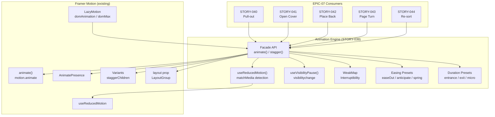
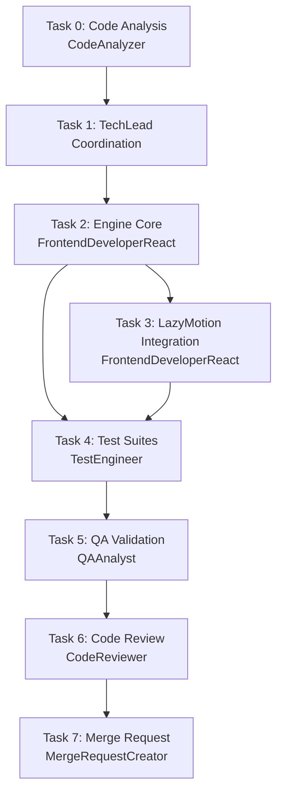
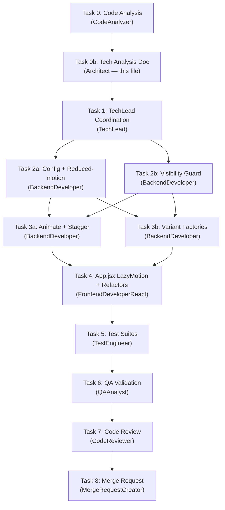

**Parent Epic**: EPIC-007 (STORY-040–044 depend on this engine)
**Stack Reference**: `docs/architecture/TECH-STACK.md` — React 18, Vite 5, Framer Motion ^11.11.0
**Decision Reference**: `docs/decisions/ANIMATION-STRATEGY.md` — Framer Motion confirmed

---

## 1. Story Summary

Build a reusable animation engine facade over Framer Motion that provides: configurable duration/easing, interruptibility, `prefers-reduced-motion` detection with instant fallback, stagger/timeline support for multi-element sequences, and pause-on-background via `visibilitychange`. This engine is consumed by all subsequent EPIC-007 stories (STORY-040–044).

---

## 2. Detected Tech Stack

| Layer | Technology | Source |
|-------|-----------|--------|
| Runtime | Node.js 22 LTS | `package.json` |
| Frontend | React 18 | `frontend/package.json` |
| Animations | Framer Motion ^11.11.0 | `frontend/package.json` (already installed) |
| Build | Vite 5.x | `frontend/package.json` |
| Testing | Vitest + Testing Library | `frontend/package.json` |
| Styling | Tailwind CSS 3.x | `frontend/package.json` |

**Frontend Framework**: React → **FrontendDeveloperReact**
**Integration Pattern**: React SPA, no backend API needed for this story (pure frontend utility)

---

## 3. Codebase Analysis Summary

### 3.1 Existing Framer Motion Usage

- **20+ components** import from `framer-motion`
- **`useReducedMotion`** called in **10+ components** (BookSpine, BookshelfGrid, PageTurnAnimation, PulledOutOverlay, CoverOverlay, FavoriteToggle, ShelfPage, ReaderSettings, ReaderToolbar, ReaderProgressBar, etc.)
- **`LayoutGroup`** already used in `BookshelfGrid.jsx`
- **`AnimatePresence`** used in `BookshelfGrid`, `PulledOutOverlay`, `PageTurnAnimation`
- **163+ import references** across the codebase

### 3.2 Existing Animation Patterns (to Consolidate)

| Pattern | Location | What It Does |
|---------|----------|-------------|
| `useSortAnimation()` hook | `hooks/useSortAnimation.js` | Stagger delay calculation + `useReducedMotion` check — **engine will absorb this** |
| Inline `prefersReducedMotion` checks | 10+ components | Redundant per-component reduced-motion logic — **engine centralizes** |
| `usePulledOutBook()` hook | `hooks/usePulledOutBook.js` | Duration override based on `useReducedMotion` — **engine will provide `getDuration()`** |
| Inline duration constants | `BookSpine.jsx`, `PageTurnAnimation.jsx` | Hardcoded `300ms`, `0.3s` — **engine will provide named presets** |

### 3.3 Key Insight: Ad-Hoc → Centralized

Current state: every component independently handles reduced-motion, duration, and interruption. STORY-039 creates a single facade that:
1. Eliminates 10+ duplicate `useReducedMotion` calls
2. Provides interruptibility via WeakMap (currently no component handles mid-flight cancellation)
3. Adds `visibilitychange` pause/resume (currently no component handles tab backgrounding)
4. Provides stagger abstraction (currently `useSortAnimation` is the only stagger, hardcoded to sort context)

---

## 4. Technical Task Breakdown

### Task 0: Code Analysis
- **Agent**: CodeAnalyzer
- **Scope**: Inventory all existing Framer Motion usage, identify duplication, map dependency graph
- **Deliverable**: `STORY-039-code-analysis.md`

### Task 1: TechLead Coordination
- **Agent**: TechLead
- **Scope**: Orchestrate Tasks 2–7 using references below
- **References**: PM story, this analysis, code analysis (if created)

### Task 2: Animation Engine Core Implementation
- **Agent**: FrontendDeveloperReact
- **Scope**: Build `frontend/src/lib/animation-engine/` with:
  - `animate()` — single-element animation with duration, easing, interruptibility
  - `stagger()` — multi-element sequential animation
  - `useAnimationEngine()` — React hook exposing engine API
  - `useReducedMotion()` — centralized re-export (replaces 10+ direct imports)
  - `useVisibilityPause()` — `document.visibilitychange` hook for pause/resume
  - Interruptibility: WeakMap keyed by element, cancel in-flight before starting new
  - Reduced-motion: auto-detect via `matchMedia`, skip motion + apply target instantly with fade
  - Visibility: pause animations on background, resume on foreground
  - Preset easings: `easeOut` (entrances), `anticipate` (playful), `spring` (interactions)
  - **No new npm dependencies** — wraps Framer Motion only

### Task 3: LazyMotion Integration
- **Agent**: FrontendDeveloperReact
- **Scope**: Modify `frontend/src/main.jsx` to:
  - Wrap app with `<LazyMotion features={domAnimation} strict>`
  - Replace `<motion.*>` with `<m.*>` in shelf/reader components for tree-shaking
  - Async-load `domMax` for gesture/layout components
- **Dependency**: Must complete after Task 2 (engine must be ready for `<m.*>` migration)

### Task 4: Test Suites
- **Agent**: TestEngineer
- **Scope**:
  - Unit: `animate()` with correct duration/easing, interrupt mid-flight, reduced-motion fallback, stagger timing, visibility pause/resume
  - Integration: engine + LazyMotion, engine + AnimatePresence, engine + LayoutGroup
  - Accessibility: reduced motion detection, instant transition verification
- **Coverage target**: ≥90%

### Task 5: QA Validation
- **Agent**: QAAnalyst
- **Scope**: Validate all acceptance criteria pass, performance overhead <1ms/frame, reduced-motion auto-detection works

### Task 6: Code Review
- **Agent**: CodeReviewer
- **Scope**: Review engine API design, interruptibility correctness, WeakMap memory safety, LazyMigration migration completeness

### Task 7: Merge Request
- **Agent**: MergeRequestCreator
- **Scope**: Create MR with all documentation, traceability to STORY-039

---

## 5. NFR Analysis

| NFR ID | Requirement | Implementation | Verification |
|--------|-------------|----------------|--------------|
| NFR-PERF-04 | Engine overhead <1ms per animation frame | Use `requestAnimationFrame` via Framer Motion internals; avoid JS-driven per-frame calculations; leverage GPU-accelerated transforms only | Vitest benchmark in test suite; Chrome DevTools Performance tab |
| NFR-ACC-05 | Automatic reduced-motion detection; no per-story manual checks | Centralized `useReducedMotion()` in engine facade; all consumers go through engine; `matchMedia('(prefers-reduced-motion: reduce)')` | Test: mock `matchMedia`, verify instant fallback; test: engine consumer doesn't need its own `useReducedMotion` call |
| NFR-ACC-05 | Engine respects `prefers-reduced-motion` media query | Engine checks media query on every `animate()` / `stagger()` call; if true: skip motion, apply target state instantly with opacity fade | Unit test with `matchMedia` mock returning `true` |

---

## 6. Persona Impact — Julia (Young Author)

Julia uses mid-range family devices (tablets, Moto G). She interacts with physical metaphors:

| Need | Engine Feature | Why It Matters |
|------|---------------|----------------|
| **No frame drops** | GPU-accelerated transforms only; <1ms overhead | Mid-range devices choke on JS-layout-thrashing animations |
| **Vestibular sensitivity** | `prefers-reduced-motion` → instant + fade | Some children are sensitive to motion; accessibility non-negotiable |
| **Pull-out feels snappy** | Interruptibility — mid-flight cancellation without glitch | Julia taps quickly; partial animations must not stack/jank |
| **Stagger feels playful** | Stagger with configurable per-element delay | Sequential book reveals feel like a "digital toy" |
| **Tab switching safe** | Visibility-based pause/resume | Julia may switch apps mid-animation; state must be preserved |

---

## 7. Architecture Diagram



### 3.2 Module Structure

```
frontend/src/
├── lib/
│   └── animation/
│       ├── index.js              # Public API barrel export
│       ├── config.js             # Easing curves, spring presets, duration constants
│       ├── reduced-motion.js     # useReducedMotionConfig hook (centralized)
│       ├── visibility.js         # useVisibilityGuard hook (pause/resume on tab switch)
│       ├── animate.js            # animate() — imperative interruptible animation
│       ├── stagger.js            # stagger() — multi-element sequence factory
│       ├── variants.js          # Pre-built variant factories (overlay, slide, fade)
│       └── __tests__/
│           ├── config.test.js
│           ├── reduced-motion.test.js
│           ├── visibility.test.js
│           ├── animate.test.js
│           ├── stagger.test.js
│           └── variants.test.js
├── hooks/
│   └── useSortAnimation.js      # Refactored to consume lib/animation/config
├── components/
│   └── shelf/
│       ├── BookshelfGrid.jsx    # Refactored: use stagger() + variants from engine
│       ├── CoverOverlay.jsx     # Refactored: use config easings + reduced-motion hook
│       └── ...                   # Other components refactored incrementally
└── App.jsx                      # Add <LazyMotion> wrapper at root
```

---

## 8. Execution Flow



**Parallelization**: Tasks 2 and 3 are **sequential** (Task 3 depends on engine API from Task 2). Task 4 starts after Task 2 but can begin test scaffolding in parallel with Task 3.

---

## 9. Engine API Design

### 9.1 File Structure

```
frontend/src/lib/animation-engine/
├── index.js              # Public API exports
├── animate.js            # animate() function
├── stagger.js            # stagger() function
├── use-animation-engine.js  # React hook
├── use-visibility-pause.js  # visibilitychange hook
├── presets.js            # Easing + duration presets
├── interruptibility.js   # WeakMap-based cancellation
└── __tests__/
    ├── animate.test.js
    ├── stagger.test.js
    ├── use-animation-engine.test.js
    ├── use-visibility-pause.test.js
    └── integration.test.js
```

### 9.2 Public API

```js
// animate(element, options) → AnimationHandle
//   - Handles interruptibility (WeakMap cancel)
//   - Handles reduced-motion (instant + fade)
//   - Handles visibility pause/resume
export function animate(element, {
  from,           // CSS transform start state
  to,             // CSS transform end state
  duration,       // ms or preset string ('entrance', 'exit', 'micro')
  easing,         // string or preset ('easeOut', 'anticipate', 'spring')
  onComplete,      // callback on animation end
  interruptible = true,  // cancel in-flight before starting
})

// stagger(elements, options) → AnimationHandle[]
//   - Each element delayed by perElement ms from previous
//   - Supports all animate() options
export function stagger(elements, {
  perElement,     // delay between each element (ms)
  ...animateOptions  // passed to each animate() call
})

// useAnimationEngine() → { animate, stagger, prefersReducedMotion, isPaused }
//   - React hook providing engine access
export function useAnimationEngine()

// useVisibilityPause() → { isPaused, pause, resume }
//   - Listens to document.visibilitychange
export function useVisibilityPause()

// Re-exports for convenience
export { useReducedMotion } from 'framer-motion';
```

### 9.3 Interruptibility Implementation

```js
// WeakMap keyed by element → current AnimationHandle
const inFlight = new WeakMap();

function safeAnimate(element, options) {
  // Cancel existing animation for this element
  if (inFlight.has(element)) {
    const existing = inFlight.get(element);
    existing.cancel();
    inFlight.delete(element);
  }
  
  const handle = startAnimation(element, options);
  inFlight.set(element, handle);
  
  handle.onComplete(() => {
    inFlight.delete(element);
  });
  
  return handle;
}
```

### 9.4 Reduced-Motion Implementation

```js
function startAnimation(element, options) {
  if (prefersReducedMotion) {
    // Skip motion — apply target state instantly with fade
    element.style.transition = 'opacity 150ms ease';
    element.style.opacity = '0';
    requestAnimationFrame(() => {
      Object.assign(element.style, options.to);
      element.style.opacity = '1';
    });
    return { cancel: () => {}, onComplete: (cb) => cb() };
  }
  
  // Normal animation path via Framer Motion
  return motionAnimate(element, options.to, {
    duration: options.duration / 1000,
    ease: options.easing,
  });
}
```

---

## 10. Impacted Components & Files

| File | Change Type | Notes |
|------|------------|-------|
| `frontend/src/lib/animation-engine/` | **New** | Engine module (7 files + tests) |
| `frontend/src/main.jsx` | **Modify** | Add `LazyMotion` wrapper |
| `frontend/src/hooks/useSortAnimation.js` | **Refactor** | Delegate stagger calculation to engine; engine absorbs this hook's logic |
| `frontend/src/hooks/usePulledOutBook.js` | **Refactor** | Use engine's `getDuration()` instead of inline `useReducedMotion` |
| `frontend/src/components/shelf/BookSpine.jsx` | **Refactor** | Import engine's `useReducedMotion` instead of direct `framer-motion` |
| `frontend/src/components/shelf/BookshelfGrid.jsx` | **Refactor** | Import engine instead of direct `framer-motion` |
| `frontend/src/components/reader/PageTurnAnimation.jsx` | **Refactor** | Use engine's `animate()` wrapper |
| 10+ additional components | **Minor refactor** | Swap `useReducedMotion` imports to engine re-export |

## 11. Risk Assessment

| Risk | Probability | Impact | Mitigation |
|------|------------|--------|-------------|
| WeakMap doesn't garbage-collect if element removed mid-animation | Low | Low | `onComplete` cleans up; component unmount should cancel via cleanup |
| `visibilitychange` event timing differs across browsers | Medium | Low | Feature-detect + test on Chrome/Firefox/Safari; use `document.hidden` as source of truth |
| LazyMotion `strict` mode breaks components using `<motion.*>` instead of `<m.*>` | High | Medium | Migration in Task 3 must cover ALL components; grep-based audit before enabling strict |
| Framer Motion `animate()` API differs from `motion.animate()` in ^11.11 | Low | Medium | Use `motion()` from framer-motion, not Web Animations API; verify against docs |
| Reduced-motion fade conflicts with existing opacity transitions | Low | Low | Engine applies 150ms fade only when reduced-motion active; normal path untouched |
| Engine overhead exceeds 1ms per frame | Low | High | Benchmark in tests; avoid JS-driven per-frame calculations; delegate to Framer Motion internals |

---

## 12. SubAgent Assignments

| Task | Description | Agent | Language |
|------|-------------|-------|----------|
| 0 | Code analysis (FM usage inventory) | CodeAnalyzer | Node.js |
| 1 | Coordination | TechLead | - |
| 2 | Engine core implementation | FrontendDeveloperReact | React |
| 3 | LazyMotion integration + component migration | FrontendDeveloperReact | React |
| 4 | Test suites | TestEngineer | Node.js |
| 5 | QA validation | QAAnalyst | - |
| 6 | Code review | CodeReviewer | Node.js |
| 7 | Merge request | MergeRequestCreator | - |

---

## 13. Execution Order

- **Sequential**: Task 0 → Task 1 (analysis before coordination)
- **Sequential**: Task 2 → Task 3 (engine API must exist before LazyMotion migration)
- **Parallel-ish**: Task 4 can begin test scaffolding after Task 2 completes; full test suite needs Task 3
- **Sequential**: Task 4 → Task 5 → Task 6 → Task 7

### Parallelization Rules
- Engines core (Task 2) and test scaffolding: **can overlap** (test file structure before implementation)
- LazyMotion migration (Task 3) and test implementation: **can overlap** (tests mock LazyMotion)
- Tasks 5–7: **strictly sequential** (QA → Review → MR)

---

## 14. Acceptance Criteria → Test Mapping

| AC | Test | Agent |
|----|------|-------|
| Animation executes with specified duration/easing | Unit: `animate()` with mocked timer, verify completion | TestEngineer |
| Interrupt mid-flight: old cancelled, new starts clean | Unit: call `animate()` twice on same element, verify first cancelled | TestEngineer |
| Reduced-motion: instant transition + fade | Unit: mock `matchMedia` to return `reduce`, verify no rAF calls, verify fade applied | TestEngineer |
| Stagger: sequential with specified delay | Unit: `stagger()` with 10 elements at 30ms, verify timing | TestEngineer |
| Backgrounded tab: preserve state, resume correctly | Unit: trigger `visibilitychange`, verify pause flag set, resume restores | TestEngineer |

---

## 15. Dependency on STORY-038

STORY-038 (Animation Spike) is **complete**. Decision: **Framer Motion** confirmed in `docs/decisions/ANIMATION-STRATEGY.md`. Setup instructions from STORY-038 are incorporated into this plan (Section 9, Task 3).

No blocker from STORY-038. Proceed.
        S040["STORY-040<br/>Pull-out"]
        S041["STORY-041<br/>Open Cover"]
        S042["STORY-042<br/>Place Back"]
        S043["STORY-043<br/>Page Turn"]
        S044["STORY-044<br/>Re-sort"]
<<<<<<< HEAD
    end

    API --> FM_A
    API --> FM_V
    API --> FM_AP
    API --> FM_L
    RM --> FM_RM
    API --> WM
    API --> RM
    API --> VIS
    API --> PRE
    API --> DUR
    LM --> API

    S040 --> API
    S041 --> API
    S042 --> API
    S043 --> API
    S044 --> API
=======
        EXISTING["Existing Components<br/>(14+ files)"]
    end

    subgraph "Animation Engine (STORY-039)"
        HOOKS["Custom Hooks<br/>useAnimation<br/>useStagger<br/>useReducedMotionConfig"]
        VARIANTS["Variant Factories<br/>overlayVariants<br/>slideVariants<br/>fadeVariants"]
        CONFIG["Config Module<br/>easings, durations<br/>spring presets"]
        INTERRUPT["Interruptibility<br/>WeakMap registry<br/>cancel + restart"]
        VIS["Visibility Guard<br/>pause on background<br/>resume on foreground"]
    end

    subgraph "Framer Motion (Dep)"
        FM["framer-motion ^11.11.0"]
        LM["LazyMotion + domAnimation<br/>domMax (async)"]
    end

    S040 --> HOOKS
    S041 --> HOOKS
    S042 --> HOOKS
    S043 --> HOOKS
    S044 --> HOOKS
    EXISTING --> CONFIG
    HOOKS --> CONFIG
    HOOKS --> INTERRUPT
    HOOKS --> VIS
    HOOKS --> VARIANTS
    HOOKS --> FM
    FM --> LM
```

### 3.2 Module Structure

```
frontend/src/
├── lib/
│   └── animation/
│       ├── index.js              # Public API barrel export
│       ├── config.js             # Easing curves, spring presets, duration constants
│       ├── reduced-motion.js     # useReducedMotionConfig hook (centralized)
│       ├── visibility.js         # useVisibilityGuard hook (pause/resume on tab switch)
│       ├── animate.js            # animate() — imperative interruptible animation
│       ├── stagger.js            # stagger() — multi-element sequence factory
│       ├── variants.js          # Pre-built variant factories (overlay, slide, fade)
│       └── __tests__/
│           ├── config.test.js
│           ├── reduced-motion.test.js
│           ├── visibility.test.js
│           ├── animate.test.js
│           ├── stagger.test.js
│           └── variants.test.js
├── hooks/
│   └── useSortAnimation.js      # Refactored to consume lib/animation/config
├── components/
│   └── shelf/
│       ├── BookshelfGrid.jsx    # Refactored: use stagger() + variants from engine
│       ├── CoverOverlay.jsx     # Refactored: use config easings + reduced-motion hook
│       └── ...                   # Other components refactored incrementally
└── App.jsx                      # Add <LazyMotion> wrapper at root
>>>>>>> origin/main
```

---

<<<<<<< HEAD
## 8. Execution Flow


**Parallelization**: Tasks 2 and 3 are **sequential** (Task 3 depends on engine API from Task 2). Task 4 starts after Task 2 but can begin test scaffolding in parallel with Task 3.

---

## 9. Engine API Design

### 9.1 File Structure

```
frontend/src/lib/animation-engine/
├── index.js              # Public API exports
├── animate.js            # animate() function
├── stagger.js            # stagger() function
├── use-animation-engine.js  # React hook
├── use-visibility-pause.js  # visibilitychange hook
├── presets.js            # Easing + duration presets
├── interruptibility.js   # WeakMap-based cancellation
└── __tests__/
    ├── animate.test.js
    ├── stagger.test.js
    ├── use-animation-engine.test.js
    ├── use-visibility-pause.test.js
    └── integration.test.js
```

### 9.2 Public API

```js
// animate(element, options) → AnimationHandle
//   - Handles interruptibility (WeakMap cancel)
//   - Handles reduced-motion (instant + fade)
//   - Handles visibility pause/resume
export function animate(element, {
  from,           // CSS transform start state
  to,             // CSS transform end state
  duration,       // ms or preset string ('entrance', 'exit', 'micro')
  easing,         // string or preset ('easeOut', 'anticipate', 'spring')
  onComplete,      // callback on animation end
  interruptible = true,  // cancel in-flight before starting
})

// stagger(elements, options) → AnimationHandle[]
//   - Each element delayed by perElement ms from previous
//   - Supports all animate() options
export function stagger(elements, {
  perElement,     // delay between each element (ms)
  ...animateOptions  // passed to each animate() call
})

// useAnimationEngine() → { animate, stagger, prefersReducedMotion, isPaused }
//   - React hook providing engine access
export function useAnimationEngine()

// useVisibilityPause() → { isPaused, pause, resume }
//   - Listens to document.visibilitychange
export function useVisibilityPause()

// Re-exports for convenience
export { useReducedMotion } from 'framer-motion';
```

### 9.3 Interruptibility Implementation

```js
// WeakMap keyed by element → current AnimationHandle
const inFlight = new WeakMap();

function safeAnimate(element, options) {
  // Cancel existing animation for this element
  if (inFlight.has(element)) {
    const existing = inFlight.get(element);
    existing.cancel();
    inFlight.delete(element);
  }
  
  const handle = startAnimation(element, options);
  inFlight.set(element, handle);
  
  handle.onComplete(() => {
    inFlight.delete(element);
  });
  
  return handle;
}
```

### 9.4 Reduced-Motion Implementation

```js
function startAnimation(element, options) {
  if (prefersReducedMotion) {
    // Skip motion — apply target state instantly with fade
    element.style.transition = 'opacity 150ms ease';
    element.style.opacity = '0';
    requestAnimationFrame(() => {
      Object.assign(element.style, options.to);
      element.style.opacity = '1';
    });
    return { cancel: () => {}, onComplete: (cb) => cb() };
  }
  
  // Normal animation path via Framer Motion
  return motionAnimate(element, options.to, {
    duration: options.duration / 1000,
    ease: options.easing,
  });
}
```

---

## 10. Impacted Components & Files

| File | Change Type | Notes |
|------|------------|-------|
| `frontend/src/lib/animation-engine/` | **New** | Engine module (7 files + tests) |
| `frontend/src/main.jsx` | **Modify** | Add `LazyMotion` wrapper |
| `frontend/src/hooks/useSortAnimation.js` | **Refactor** | Delegate stagger calculation to engine; engine absorbs this hook's logic |
| `frontend/src/hooks/usePulledOutBook.js` | **Refactor** | Use engine's `getDuration()` instead of inline `useReducedMotion` |
| `frontend/src/components/shelf/BookSpine.jsx` | **Refactor** | Import engine's `useReducedMotion` instead of direct `framer-motion` |
| `frontend/src/components/shelf/BookshelfGrid.jsx` | **Refactor** | Import engine instead of direct `framer-motion` |
| `frontend/src/components/reader/PageTurnAnimation.jsx` | **Refactor** | Use engine's `animate()` wrapper |
| 10+ additional components | **Minor refactor** | Swap `useReducedMotion` imports to engine re-export |
=======
## 4. Detailed Design

### 4.1 `config.js` — Animation Constants

```js
// Easing curves (replaces 3x duplicated EASE_OUT)
export const EASINGS = {
  easeOut: [0.25, 0.1, 0.25, 1],
  easeInOut: [0.42, 0, 0.58, 1],
  anticipate: [0.2, 0.6, 0.35, 1],  // for playful interactions
};

// Spring presets (replaces scattered inline configs)
export const SPRINGS = {
  gentle:    { stiffness: 120, damping: 14 },
  bouncy:    { stiffness: 300, damping: 20 },   // current useSortAnimation
  stiff:     { stiffness: 400, damping: 30 },
  snappy:    { stiffness: 500, damping: 35 },
};

// Duration presets (ms → seconds for Framer Motion)
export const DURATIONS = {
  instant: 0,        // reduced-motion fallback
  fast: 0.15,
  normal: 0.2,
  moderate: 0.3,
  slow: 0.5,
};

// Stagger config
export const STAGGER = {
  perElementMs: 30,  // ms per element
  maxMs: 300,        // cap total stagger delay
};
```

### 4.2 `reduced-motion.js` — Centralized Accessibility

```js
import { useReducedMotion } from 'framer-motion';
import { DURATIONS } from './config';

/**
 * Centralized reduced-motion config. Replaces pattern:
 *   const prefersReducedMotion = useReducedMotion();
 *   const duration = prefersReducedMotion ? 0 : 0.3;
 * Used in 14+ components — this eliminates all duplication.
 */
export function useReducedMotionConfig() {
  const prefersReducedMotion = useReducedMotion();

  return {
    prefersReducedMotion,
    duration: (ms = DURATIONS.moderate) =>
      prefersReducedMotion ? DURATIONS.instant : ms,
    transition: (type = 'spring', ms = DURATIONS.moderate) =>
      prefersReducedMotion
        ? { type: 'tween', duration: DURATIONS.fast, ease: 'easeOut' }
        : { type, ...(type === 'spring' ? SPRINGS.bouncy : {}), duration: ms },
    shouldAnimate: !prefersReducedMotion,
  };
}
```

### 4.3 `animate.js` — Interruptible Animation

```js
import { animate as fmAnimate } from 'framer-motion';
import { useReducedMotionConfig } from './reduced-motion';
import { EASINGS, DURATIONS } from './config';

// WeakMap: element → in-flight animation handle (for interruptibility)
const activeAnimations = new WeakMap();

/**
 * Imperative animate() with interruptibility.
 * Cancels any in-flight animation on the same element before starting new one.
 */
export function animateElement(element, keyframes, options = {}) {
  const {
    duration = DURATIONS.moderate,
    easing = EASINGS.easeOut,
    onComplete,
    interruptible = true,
  } = options;

  // Cancel in-flight animation if interruptible
  if (interruptible && activeAnimations.has(element)) {
    const current = activeAnimations.get(element);
    current.stop?.();
  }

  // If reduced-motion: skip to target state instantly
  const motionConfig = useReducedMotionConfig(); // Note: only usable in React context

  const handle = fmAnimate(element, keyframes, {
    duration,
    ease: easing,
    onComplete: () => {
      activeAnimations.delete(element);
      onComplete?.();
    },
  });

  activeAnimations.set(element, handle);
  return handle;
}

/**
 * React hook wrapping animateElement with reduced-motion awareness.
 */
export function useAnimateElement() {
  const { duration, shouldAnimate } = useReducedMotionConfig();

  return useCallback((element, keyframes, options = {}) => {
    if (!shouldAnimate) {
      // Instantly apply target state
      Object.assign(element.style, keyframes[keyframes.length - 1]);
      options.onComplete?.();
      return null;
    }
    return animateElement(element, keyframes, {
      ...options,
      duration: options.duration ?? duration(),
    });
  }, [shouldAnimate, duration]);
}
```

### 4.4 `stagger.js` — Multi-Element Sequence

```js
import { STAGGER, SPRINGS, DURATIONS } from './config';
import { useReducedMotionConfig } from './reduced-motion';

/**
 * Generate staggered variant config for Framer Motion.
 * Replaces hand-rolled `staggerChildren` in BookshelfGrid & useSortAnimation.
 */
export function staggerConfig(options = {}) {
  const {
    perElementMs = STAGGER.perElementMs,
    maxMs = STAGGER.maxMs,
    spring = SPRINGS.bouncy,
  } = options;

  return {
    staggerChildren: perElementMs / 1000,
    ...(spring ? {} : {}),
  };
}

/**
 * Generate per-element transition with stagger delay.
 * Replaces useSortAnimation's getTransition(index) pattern.
 */
export function staggerTransition(index, options = {}) {
  const {
    perElementMs = STAGGER.perElementMs,
    maxMs = STAGGER.maxMs,
    spring = SPRINGS.bouncy,
  } = options;

  const delay = Math.min(index * perElementMs, maxMs) / 1000;
  return { type: 'spring', ...spring, delay };
}

/**
 * React hook for stagger with reduced-motion support.
 */
export function useStagger(options = {}) {
  const { prefersReducedMotion, transition } = useReducedMotionConfig();

  const containerVariants = prefersReducedMotion
    ? {}
    : {
        hidden: { opacity: 0 },
        visible: {
          opacity: 1,
          transition: { staggerChildren: staggerConfig(options).staggerChildren },
        },
      };

  const itemVariants = prefersReducedMotion
    ? {}
    : {
        hidden: { opacity: 0, y: 10 },
        visible: { opacity: 1, y: 0 },
      };

  const getTransition = useCallback(
    (index) =>
      prefersReducedMotion
        ? { type: 'tween', duration: DURATIONS.fast, ease: 'easeOut' }
        : staggerTransition(index, options),
    [prefersReducedMotion, options],
  );

  return { containerVariants, itemVariants, getTransition };
}
```

### 4.5 `visibility.js` — Tab Backgrounding Guard

```js
import { useEffect, useRef } from 'react';

/**
 * Pauses animations when tab is backgrounded, resumes when foregrounded.
 * Uses document.visibilitychange API per STORY-039 AC.
 */
export function useVisibilityGuard(onPause, onResume) {
  const onPauseRef = useRef(onPause);
  const onResumeRef = useRef(onResume);
  onPauseRef.current = onPause;
  onResumeRef.current = onResume;

  useEffect(() => {
    function handleVisibilityChange() {
      if (document.hidden) {
        onPauseRef.current?.();
      } else {
        onResumeRef.current?.();
      }
    }

    document.addEventListener('visibilitychange', handleVisibilityChange);
    return () => document.removeEventListener('visibilitychange', handleVisibilityChange);
  }, []);
}

/**
 * Hook that returns true when app is backgrounded.
 * Components can use this to skip animation triggers while hidden.
 */
export function useIsBackgrounded() {
  const [isBackgrounded, setIsBackgrounded] = useState(false);

  useEffect(() => {
    function handleChange() {
      setIsBackgrounded(document.hidden);
    }
    document.addEventListener('visibilitychange', handleChange);
    return () => document.removeEventListener('visibilitychange', handleChange);
  }, []);

  return isBackgrounded;
}
```

### 4.6 `variants.js` — Pre-built Variant Factories

```js
import { EASINGS, DURATIONS } from './config';

/** Overlay: backdrop fade + panel scale (used by CoverOverlay, PulledOutOverlay, etc.) */
export function overlayVariants(reducedMotion = false) {
  const d = reducedMotion ? DURATIONS.instant : DURATIONS.fast;
  return {
    backdrop: {
      initial: { opacity: 0 },
      animate: { opacity: 1 },
      exit: { opacity: 0 },
      transition: { duration: d },
    },
    panel: {
      initial: { opacity: 0, scale: 0.9 },
      animate: { opacity: 1, scale: 1 },
      exit: { opacity: 0, scale: 0.9 },
      transition: { duration: reducedMotion ? DURATIONS.instant : DURATIONS.normal, ease: EASINGS.easeOut },
    },
  };
}

/** Slide: direction-aware slide (used by PageTurnAnimation, ChapterDrawer, ReaderSettings) */
export function slideVariants(direction = 1, reducedMotion = false) {
  const d = reducedMotion ? 0 : 1;
  return {
    initial: { x: direction * 100 * d, opacity: reducedMotion ? 1 : 0 },
    animate: { x: 0, opacity: 1 },
    exit: { x: -direction * 100 * d, opacity: reducedMotion ? 1 : 0 },
    transition: { duration: reducedMotion ? DURATIONS.instant : DURATIONS.moderate, ease: EASINGS.easeOut },
  };
}

/** Fade: simple opacity fade (fade-up by default) */
export function fadeVariants(reducedMotion = false) {
  const y = reducedMotion ? 0 : 8;
  return {
    initial: { opacity: 0, y },
    animate: { opacity: 1, y: 0 },
    transition: { duration: reducedMotion ? DURATIONS.instant : DURATIONS.fast },
  };
}
```

### 4.7 App Root — LazyMotion Wrapper

```jsx
// App.jsx or main entry
import { LazyMotion, domAnimation } from 'framer-motion';

function App() {
  return (
    <LazyMotion features={domAnimation} strict>
      <RouterProvider router={router} />
    </LazyMotion>
  );
}
```

> **Bundle impact**: Switching from `<motion.div>` to `<m.div>` + `LazyMotion` reduces initial bundle by ~15KB. Components that need `layout` or `drag` (BookSpine, BookshelfGrid) will lazy-load `domMax`.

---

## 5. Acceptance Criteria Traceability

| AC | Implementation | Test Coverage |
|----|---------------|---------------|
| AC1: Animation with duration+easing completes | `animateElement()` + config presets | `animate.test.js` — verify frame completion |
| AC2: Interrupt mid-flight → clean cancel + new start | `WeakMap` animation registry in `animate.js` | `animate.test.js` — cancel in-flight, verify no glitch |
| AC3: `prefers-reduced-motion` → instant + fade | `useReducedMotionConfig()` centralizes all checks; `duration()` returns 0 | `reduced-motion.test.js` — mock `useReducedMotion=true`, verify instant |
| AC4: Stagger 10 elements × 30ms | `useStagger()` + `staggerConfig()` + `staggerTransition()` | `stagger.test.js` — verify delay per index, cap at 300ms |
| AC5: Backgrounded tab → pause/resume | `useVisibilityGuard()` + `useIsBackgrounded()` | `visibility.test.js` — simulate visibilitychange, verify callback |

---

## 6. NFR Analysis

| NFR ID | Requirement | Implementation | Verification |
|--------|-------------|----------------|--------------|
| NFR-PERF-04 | Engine overhead < 1ms per frame | `LazyMotion` tree-shaking; `WeakMap` for O(1) lookups; no per-frame React re-renders (imperative `animate()`) | Browser Performance panel profiling |
| NFR-ACC-05 | Automatic reduced-motion detection | `useReducedMotionConfig()` — single source of truth, all components route through it | Unit test + visual audit |
| NFR-ACC-05 | `prefers-reduced-motion` media query | Framer Motion `useReducedMotion` hook under the hood; `matchMedia` event listener active | Integration test with `prefers-reduced-motion: reduce` |

---

## 7. Persona Impact — Julia (Young Author)

| Concern | Impact | Mitigation |
|---------|--------|------------|
| Physical bookshelf metaphor (pull, open, turn) | Engine must support drag gestures + layout FLIP | Framer Motion `layout` + `drag` — already proven in spike |
| Mid-range device performance (family tablets) | `LazyMotion` + `domAnimation` = 17KB initial; imperative `animate()` avoids re-renders | Performance profiling on Moto G4 class device |
| Vestibular sensitivity (reduced-motion) | Centralized detection; instant-fallback; no per-story manual checks | AC3 verification; no component bypasses engine |
| Tab-switching during animations | Visibility guard preserves state; no jarring resume | AC5 verification |

---

## 8. Impacted Components

| File | Change Type | Detail |
|------|------------|--------|
| `frontend/src/lib/animation/` | **New** | Entire animation engine module (6 files) |
| `frontend/src/App.jsx` | **Modify** | Add `<LazyMotion>` wrapper |
| `frontend/src/hooks/useSortAnimation.js` | **Refactor** | Delegate to `useStagger()` from engine |
| `frontend/src/hooks/usePulledOutBook.js` | **Refactor** | Use `useReducedMotionConfig()` from engine |
| `frontend/src/components/shelf/BookshelfGrid.jsx` | **Refactor** | Replace inline variants with engine `useStagger()` |
| `frontend/src/components/shelf/CoverOverlay.jsx` | **Refactor** | Remove `EASE_OUT` constant → import from `config.js` |
| `frontend/src/components/shelf/PulledOutOverlay.jsx` | **Refactor** | Remove `EASE_OUT` constant → import from `config.js` |
| `frontend/src/components/reader/PageTurnAnimation.jsx` | **Refactor** | Use `slideVariants()` from engine; remove inline easing |
| `frontend/src/components/common/ErrorToast.jsx` | **Bug fix** | Replace raw `matchMedia` with `useReducedMotionConfig()` |
| `frontend/src/lib/animation/__tests__/` | **New** | 6 test files for engine modules |

---

## 9. Execution Flow



**Rationale**: Tasks 2a/2b can run in parallel (no shared state). Task 3a depends on both 2a and 2b. Task 3b depends on 2a (config). Task 4 depends on 3a+3b (all engine modules must exist before refactoring consumers).

---

## 10. Refactoring Strategy

This story also **refactors existing components** to consume the engine. Strategy:

1. **Phase 1 — Build engine** (Tasks 2a, 2b, 3a, 3b): All 6 modules in `lib/animation/`
2. **Phase 2 — Wire engine** (Task 4): `App.jsx` LazyMotion wrapper + refactor key consumers
3. **Priority refactors** (in Task 4):
   - `useSortAnimation.js` → delegate to `useStagger()`
   - `CoverOverlay.jsx` + `PulledOutOverlay.jsx` → centralize `EASE_OUT`
   - `ErrorToast.jsx` → fix `matchMedia` inconsistency bug
   - `BookshelfGrid.jsx` → use engine `staggerConfig()`
4. **Deferred refactors** (STORY-040+): Reader components, Editor components — progressively adopt engine in their respective stories
>>>>>>> origin/main

---

## 11. Risk Assessment

| Risk | Probability | Impact | Mitigation |
<<<<<<< HEAD
|------|------------|--------|-------------|
| WeakMap doesn't garbage-collect if element removed mid-animation | Low | Low | `onComplete` cleans up; component unmount should cancel via cleanup |
| `visibilitychange` event timing differs across browsers | Medium | Low | Feature-detect + test on Chrome/Firefox/Safari; use `document.hidden` as source of truth |
| LazyMotion `strict` mode breaks components using `<motion.*>` instead of `<m.*>` | High | Medium | Migration in Task 3 must cover ALL components; grep-based audit before enabling strict |
| Framer Motion `animate()` API differs from `motion.animate()` in ^11.11 | Low | Medium | Use `motion()` from framer-motion, not Web Animations API; verify against docs |
| Reduced-motion fade conflicts with existing opacity transitions | Low | Low | Engine applies 150ms fade only when reduced-motion active; normal path untouched |
| Engine overhead exceeds 1ms per frame | Low | High | Benchmark in tests; avoid JS-driven per-frame calculations; delegate to Framer Motion internals |

---

## 12. SubAgent Assignments

| Task | Description | Agent | Language |
|------|-------------|-------|----------|
| 0 | Code analysis (FM usage inventory) | CodeAnalyzer | Node.js |
| 1 | Coordination | TechLead | - |
| 2 | Engine core implementation | FrontendDeveloperReact | React |
| 3 | LazyMotion integration + component migration | FrontendDeveloperReact | React |
| 4 | Test suites | TestEngineer | Node.js |
| 5 | QA validation | QAAnalyst | - |
| 6 | Code review | CodeReviewer | Node.js |
| 7 | Merge request | MergeRequestCreator | - |

---

## 13. Execution Order

- **Sequential**: Task 0 → Task 1 (analysis before coordination)
- **Sequential**: Task 2 → Task 3 (engine API must exist before LazyMotion migration)
- **Parallel-ish**: Task 4 can begin test scaffolding after Task 2 completes; full test suite needs Task 3
- **Sequential**: Task 4 → Task 5 → Task 6 → Task 7

### Parallelization Rules
- Engines core (Task 2) and test scaffolding: **can overlap** (test file structure before implementation)
- LazyMotion migration (Task 3) and test implementation: **can overlap** (tests mock LazyMotion)
- Tasks 5–7: **strictly sequential** (QA → Review → MR)

---

## 14. Acceptance Criteria → Test Mapping

| AC | Test | Agent |
|----|------|-------|
| Animation executes with specified duration/easing | Unit: `animate()` with mocked timer, verify completion | TestEngineer |
| Interrupt mid-flight: old cancelled, new starts clean | Unit: call `animate()` twice on same element, verify first cancelled | TestEngineer |
| Reduced-motion: instant transition + fade | Unit: mock `matchMedia` to return `reduce`, verify no rAF calls, verify fade applied | TestEngineer |
| Stagger: sequential with specified delay | Unit: `stagger()` with 10 elements at 30ms, verify timing | TestEngineer |
| Backgrounded tab: preserve state, resume correctly | Unit: trigger `visibilitychange`, verify pause flag set, resume restores | TestEngineer |

---

## 15. Dependency on STORY-038

STORY-038 (Animation Spike) is **complete**. Decision: **Framer Motion** confirmed in `docs/decisions/ANIMATION-STRATEGY.md`. Setup instructions from STORY-038 are incorporated into this plan (Section 9, Task 3).

No blocker from STORY-038. Proceed.
=======
|------|------------|--------|-----------|
| `LazyMotion strict` breaks `<motion.div>` in components not yet migrated to `<m.div>` | Medium | High | Phase migration: keep `<motion.div>` import for unmigrated components; only `<m.div>` in new code |
| `WeakMap` animation handles leak if `onComplete` never fires | Low | Medium | `onComplete` always fires in FM; add cleanup in `useEffect` returns |
| Reduced-motion fallback feels "instant" with no feedback | Low | Medium | AC3 says "instant with fade" — add `opacity: 0 → 1` tween at 150ms as fade |
| `visibilitychange` fires unpredictably on mobile browsers | Medium | Low | Guard against rapid state flipping; debounce 100ms in `useVisibilityGuard` |
| Stagger delay cap (300ms) too aggressive/restrictive | Low | Low | Configurable via `staggerConfig({ maxMs: ... })` |

---

## 12. Language & Framework Detection

| Indicator | Detected |
|-----------|---------|
| `package.json`, `vite.config.*`, `.jsx` files | **Node.js** + React |
| `react` in deps, `.jsx` files | **React** → FrontendDeveloperReact |
| `framer-motion` in deps | Animation engine confirmed |
| No Python/C build files | — |

**Frontend-Backend Integration**: N/A — this story is frontend-only (no API changes).

### SubAgent Assignments

| Task | Description | Agent |
|------|-------------|-------|
| 0 | Code analysis (existing FM usage inventory) | CodeAnalyzer ✅ (completed) |
| 0b | Technical analysis document | Architect ✅ (this file) |
| 1 | Coordination | TechLead |
| 2a | Config + Reduced-motion modules | FrontendDeveloperReact |
| 2b | Visibility Guard module | FrontendDeveloperReact |
| 3a | Animate + Stagger modules | FrontendDeveloperReact |
| 3b | Variant Factories module | FrontendDeveloperReact |
| 4 | App.jsx LazyMotion + Refactor consumers | FrontendDeveloperReact |
| 5 | Test suites (6 test files) | TestEngineer |
| 6 | QA validation | QAAnalyst |
| 7 | Code review | CodeReviewer |
| 8 | Merge request | MergeRequestCreator |

---

## 13. Parallelization Rules

- **2a + 2b**: CAN run in parallel (no shared state between config/variants and visibility guard)
- **3a + 3b**: MUST be sequential after 2a+2b (animate depends on config; variants depends on config)
- **4**: MUST wait for 3a+3b (refactors require all engine modules)
- **5 → 6 → 7 → 8**: MUST be sequential (tests before QA, QA before review, review before merge)

---

## 14. Definition of Done Checklist

- [x] Code analysis completed
- [x] Technical analysis document saved
- [ ] LazyMotion wrapper added to App.jsx
- [ ] All 6 engine modules implemented (`config`, `reduced-motion`, `visibility`, `animate`, `stagger`, `variants`)
- [ ] `useSortAnimation` refactored to delegate to engine
- [ ] `EASE_OUT` duplication eliminated (CoverOverlay, PulledOutOverlay, PageTurnAnimation)
- [ ] `ErrorToast.jsx` inconsistency bug fixed (matchMedia → useReducedMotionConfig)
- [ ] Test coverage ≥ 90% on all engine modules
- [ ] Integration tests passing (AC1–AC5)
- [ ] QA approved by QAAnalyst
- [ ] Documentation updated (engine API docs)
- [ ] PR created by MergeRequestCreator
>>>>>>> origin/main
