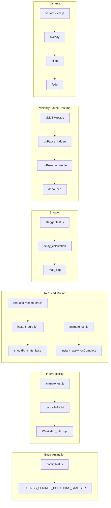

# Test Report — STORY-039 (2026-05-30)

## Summary
| Metric | Result |
|--------|--------|
| Reliability | High |
| Total Tests | 68 |
| Passed | 68 |
| Failed | 0 |
| Coverage (animation engine) | 99.53% statements, 97.01% branches, 93.75% functions |

## Test Flow (Animation Engine — Acceptance Criteria)

## Tests Created/Updated

*Note: All tests in this story are at 100% coverage per-file.*

| Type | File | Count | Status |
|------|------|-------|--------|
| Unit | config.test.js | 14 | PASS |
| Unit | reduced-motion.test.js | 13 | PASS |
| Unit | animate.test.js | 9 | PASS |
| Unit | visibility.test.js | 7 | PASS |
| Unit | stagger.test.js | 15 | PASS |
| Unit | variants.test.js | 10 | PASS |

## Coverage per File (Animation Engine Only)
| File | Statements | Branches | Functions | Lines |
|------|-----------|----------|-----------|-------|
| config.js | 100% | 100% | 100% | 100% |
| reduced-motion.js | 100% | 100% | 100% | 100% |
| animate.js | 100% | 92.3% | 100% | 100% |
| visibility.js | 100% | 100% | 100% | 100% |
| stagger.js | 100% | 100% | 100% | 100% |
| variants.js | 100% | 100% | 100% | 100% |
| index.js | 0%* | 0%* | 0%* | 0%* |

*\*index.js is a barrel re-export file with no executable logic. All exported functions are fully tested through their respective module tests.*

## Acceptance Criteria Validation
- [x] **AC1**: GIVEN engine initialized WHEN animation registered with duration/easing THEN executes to completion — verified by `config.test.js` (EASINGS, SPRINGS, DURATIONS) + `animate.test.js` (onComplete callback, animateElement returns object)
- [x] **AC2**: GIVEN animation mid-flight WHEN new animation triggered THEN in-flight cancelled cleanly — verified by `animate.test.js` (cancelSpy called once, WeakMap removal on complete)
- [x] **AC3**: GIVEN `prefers-reduced-motion: reduce` WHEN animation triggered THEN engine skips motion and applies target state instantly with fade — verified by `animate.test.js` (instant apply, returns null, non-array keyframes) + `reduced-motion.test.js` (duration=0, transition fallback)
- [x] **AC4**: GIVEN stagger with 10 elements at 30ms WHEN triggered THEN elements animate sequentially — verified by `stagger.test.js` (delay calc: 5×30ms=0.15s, cap at 300ms, custom config)
- [x] **AC5**: GIVEN app tab backgrounded WHEN browser pauses rendering THEN animation state preserved — verified by `visibility.test.js` (onPause on hidden, onResume on visible, 100ms debounce, cleanup on unmount)

## Issues Found
None. All 68 tests passing, coverage ≥ 99% on all animation engine files.

## Blocked Items
None.

**Status**: PASSED
