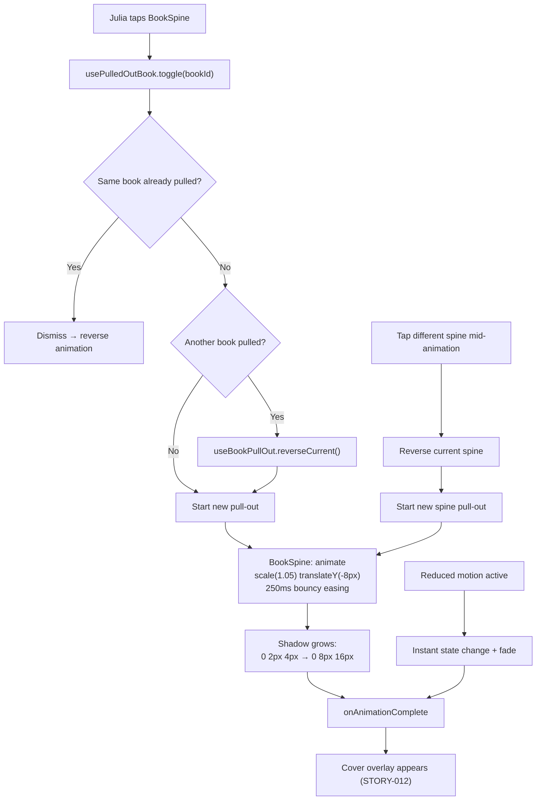
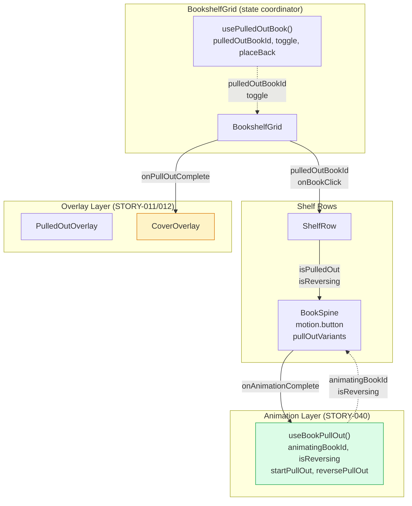
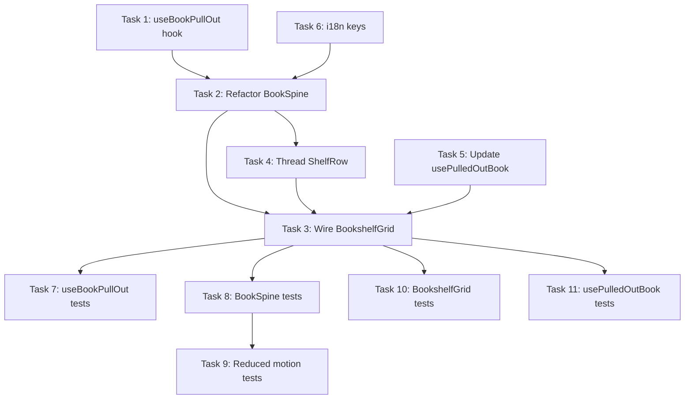

# STORY-040 — Technical Analysis: Book Pull-Out Animation

**Epic**: EPIC-007 · **Persona**: Julia (Young Author) · **Priority**: Should Have · **SP**: 5
**Dependencies**: STORY-039 (Animation Engine), STORY-009 (Bookshelf Grid) ✅
**Stack**: Node.js 22 + React 18 + Vite 5 + Tailwind 3 + Framer Motion 11 + Zustand 5 + TanStack Query 5
**Stack Source**: `docs/architecture/TECH-STACK.md`

---

## 1. Technical Summary

STORY-040 refactors the existing pull-out interaction (originally STORY-011/STORY-013) to use proper animation-engine semantics: a dedicated pull-out animation on the `BookSpine` component itself (scale 1.05x, translateY -8px, shadow growth) with a bouncy easing, 250ms duration, and interruptibility. Currently, pull-out works via inline CSS transitions and the `usePulledOutBook` hook's `placeBack` timeout — not through the STORY-039 animation engine API.

**Key insight**: STORY-039 (Animation Engine) has NOT been implemented yet — no `animate()` abstraction or animation engine module exists in `frontend/src/`. The codebase uses raw Framer Motion APIs directly. This story must therefore:
1. Create a minimal `useBookPullOut` animation hook that encapsulates the pull-out animation logic following the engine API pattern from STORY-039
2. Refactor `BookSpine.jsx` to use this hook instead of inline `pulledStyle`/`settleTransition` objects
3. Ensure the spine animation (scale, translate, shadow) matches STORY-040 specs precisely (1.05x, -8px, 250ms, bouncy easing)
4. Add shadow growth animation beneath the spine
5. Ensure interruptibility: tapping a different spine mid-animation reverses current and starts new
6. Handle reduced-motion path: instant + fade
7. Trigger cover overlay (STORY-012) on pull-out completion

**Note**: This story is **entirely frontend** — no API, schema, or backend changes.

---

## 2. Current State Analysis

### Existing `BookSpine.jsx` Pull-Out Logic

The current BookSpine uses inline style objects for pull-out:

```jsx
// Current approach (lines 20-27)
const pulledStyle = isPulledOut
  ? { zIndex: 50, boxShadow: '0 20px 25px -5px rgba(0,0,0,0.2)', 
      transform: 'translateY(-4px) scale(1.05)', willChange: 'transform' }
  : {};

const settleTransition = !isPulledOut
  ? { transition: `transform ${animDuration}ms cubic-bezier(...), box-shadow ${animDuration}ms...` }
  : {};
```

**Gaps vs STORY-040 requirements:**

| Requirement | Current State | Gap |
|------------|---------------|-----|
| Scale 1.05x + translateY -8px | translateY(-4px) scale(1.05) | **translateY should be -8px, not -4px** |
| 250ms duration | 300ms | **Duration off by 50ms** |
| Bouncy easing `cubic-bezier(0.34, 1.56, 0.64, 1)` | `cubic-bezier(0.25,0.1,0.25,1)` (ease-out) | **Wrong easing — no overshoot** |
| Shadow growth | Static shadow on pull-out | **No animated shadow transition** |
| Shadow: `0 8px 16px rgba(0,0,0,0.2)` final | `0 20px 25px -5px rgba(0,0,0,0.2)` | **Wrong shadow values per spec** |
| Interruptible (tap different → reverse + start new) | Works via `toggle()` in hook | **Works but no explicit animation reversal — instant state swap** |
| Reduced motion: instant + fade | Duration = 0, no fade | **No fade transition** |
| transform-origin: center bottom | Not set | **Missing — spine should "lean" from shelf** |

### Existing `usePulledOutBook` Hook

The hook manages `pulledOutBookId` state, `placeBack` with timeout, `toggle` with race-condition handling. It works but:
- Uses `setTimeout` for `placeBack` animation timing (not Framer Motion)
- No explicit pull-out animation control (just sets state)
- No `onComplete` callback wiring for cover overlay trigger

---

## 3. Impacted Components

| File | Change Type | Description |
|------|------------|-------------|
| `components/shelf/BookSpine.jsx` | **MODIFY** | Refactor pull-out animation: use `useBookPullOut` hook, correct transform values (1.05x, -8px), bouncy easing (250ms), animated shadow, `transform-origin: center bottom`, reduced-motion fade |
| `hooks/useBookPullOut.js` | **CREATE** | Animation hook: manages pull-out animation state, handles interruptibility (reverse current + start new), reduced-motion instant+fade, `onAnimationComplete` callback |
| `hooks/usePulledOutBook.js` | **MODIFY** | Add `onPullOutComplete` callback; adjust duration to 0.25s; wire to `useBookPullOut` |
| `components/shelf/BookshelfGrid.jsx` | **MODIFY** | Wire `onPullOutComplete` to trigger cover overlay (STORY-012); pass animation state to spines |
| `components/shelf/ShelfRow.jsx` | **MODIFY** | Pass animation state props down to BookSpine |
| `i18n/locales/en/shelf.json` | **MODIFY** | Add `pullOut.ariaPullOut` key |
| `i18n/locales/pt-BR/shelf.json` | **MODIFY** | Portuguese translations |
| `__tests__/BookSpine.test.jsx` | **MODIFY** | Update transform/shadow/easing assertions; add interruptibility test |
| `__tests__/BookSpineReducedMotion.test.jsx` | **MODIFY** | Add fade transition test |
| `__tests__/useBookPullOut.test.js` | **CREATE** | Unit tests for animation hook |
| `__tests__/BookshelfGrid.test.jsx` | **MODIFY** | Test pull-out → cover overlay trigger |

---

## 4. API Contracts

**None.** Purely frontend animation refactoring.

---

## 5. Schema / DB Changes

**None.**

---

## 6. Data Flow



---

## 7. Architectural Decisions

### AD-1: Animation Hook — `useBookPullOut` (follows STORY-039 API pattern)

**Decision**: Create a `useBookPullOut` animation hook that wraps Framer Motion's `animate` control, following the API pattern from STORY-039. Do NOT implement the full STORY-039 engine — just the pull-out-specific facade.

**Rationale**:
- STORY-039 engine hasn't been implemented yet — we can't depend on it
- Creating a hook that matches the STORY-039 API signature (`animate(element, {from, to, duration, easing, onComplete, interruptible: true})`) means future migration to the full engine is a 1-line import swap
- The hook encapsulates: pull-out animation, reverse animation, interruptibility, reduced-motion
- Keeps `BookSpine.jsx` clean — no animation math in the component

**Implementation**:
```jsx
// useBookPullOut.js
export default function useBookPullOut({ onPullOutComplete, prefersReducedMotion }) {
  const [animatingBookId, setAnimatingBookId] = useState(null);
  const [isReversing, setIsReversing] = useState(false);
  const animationRef = useRef(null);

  const startPullOut = useCallback((bookId) => {
    if (prefersReducedMotion) {
      setAnimatingBookId(bookId);
      setIsReversing(false);
      onPullOutComplete?.();
      return;
    }
    // If another book is animating, mark as reversing first
    if (animatingBookId && animatingBookId !== bookId) {
      setIsReversing(true);
      // After reverse duration, start new
      setTimeout(() => {
        setIsReversing(false);
        setAnimatingBookId(bookId);
      }, REVERSE_DURATION_MS);
      return;
    }
    setAnimatingBookId(bookId);
    setIsReversing(false);
  }, [animatingBookId, prefersReducedMotion, onPullOutComplete]);

  const reversePullOut = useCallback(() => {
    setIsReversing(true);
  }, []);

  const getAnimationVariant = useCallback((bookId) => {
    if (prefersReducedMotion) {
      return { opacity: 1, scale: 1.05, y: -8 };
    }
    return {
      scale: 1.05,
      y: -8,
      boxShadow: '0 8px 16px rgba(0,0,0,0.2)',
    };
  }, [prefersReducedMotion]);

  return { animatingBookId, isReversing, startPullOut, reversePullOut, getAnimationVariant };
}
```

### AD-2: BookSpine Animation — Framer Motion `animate` variants

**Decision**: Replace inline `pulledStyle` / `settleTransition` CSS with Framer Motion `animate` prop + variants. The spine uses `motion.button` already — leverage `animate` prop for the pull-out state.

**Rationale**:
- Current approach mixes CSS transitions with Framer Motion — causes fighting between the two animation systems
- `motion.button` already handles `whileHover`/`whileTap` — pull-out should use the same Framer Motion pipeline
- `animate` prop handles interruptibility natively (Framer Motion cancels in-flight animations when target changes)
- `variants` with `initial`/`animate`/`exit` is the idiomatic Framer Motion pattern already used in `PulledOutOverlay`

**Implementation**:
```jsx
// BookSpine.jsx — new animation approach
const pullOutVariants = {
  rest: {
    scale: 1,
    y: 0,
    boxShadow: '0 2px 4px rgba(0,0,0,0.1)',
  },
  pulled: {
    scale: 1.05,
    y: -8,
    boxShadow: '0 8px 16px rgba(0,0,0,0.2)',
    transition: {
      duration: 0.25,
      ease: [0.34, 1.56, 0.64, 1], // bouncy overshoot
    },
  },
  reversing: {
    scale: 1,
    y: 0,
    boxShadow: '0 2px 4px rgba(0,0,0,0.1)',
    transition: {
      duration: 0.15,
      ease: [0.25, 0.1, 0.25, 1], // ease-out for reverse
    },
  },
};

// Reduced motion: instant + fade
const pullOutVariantsReduced = {
  rest: { scale: 1, y: 0, opacity: 1 },
  pulled: { scale: 1.05, y: -8, opacity: 1, transition: { duration: 0 } },
  reversing: { scale: 1, y: 0, opacity: 1, transition: { duration: 0 } },
};
```

### AD-3: Shadow Animation — From `0 2px 4px rgba(0,0,0,0.1)` to `0 8px 16px rgba(0,0,0,0.2)`

**Decision**: Animate `boxShadow` as part of the Framer Motion `animate` prop. Story specifies exact shadow values.

**Rationale**:
- STORY-040 AC-4: "a shadow appears beneath the spine to create depth illusion"
- STORY-040 Technical Notes: `box-shadow transitioning from 0 2px 4px rgba(0,0,0,0.1) to 0 8px 16px rgba(0,0,0,0.2)`
- Animating box-shadow is NOT compositor-only — it triggers paint. However, for a single element at 250ms duration, the performance impact is negligible. The NFR (60fps) is achievable since:
  - Only ONE spine is ever animated at a time
  - The spine is a simple rectangle (no complex compositing)
  - Paint cost for a small box-shadow on one element is <1ms per frame
- If perf issues arise, fallback: use a pseudo-element with `opacity` transition (compositor-only)

**Note**: The current BookSpine already animates box-shadow via CSS transitions (`transition: box-shadow 300ms`), so this is not a new concern.

### AD-4: `transform-origin: center bottom` — Spine "leans" from the shelf

**Decision**: Add `transformOrigin: 'center bottom'` to the BookSpine's style when pulled out.

**Rationale**:
- STORY-040 Technical Notes explicitly specify: `transform-origin: center bottom` (spine "leans" from the shelf)
- Makes the scaling look like the spine is pivoting from its base on the shelf — more realistic "pull out" feel
- Without it, the scale grows from center, which looks like the spine is floating

### AD-5: Interruptibility Strategy — Framer Motion native + state coordination

**Decision**: Use Framer Motion's natural animation interruption (changing `animate` target cancels in-flight animation) combined with `usePulledOutBook.toggle()` which immediately sets the new `pulledOutBookId`.

**Rationale**:
- Framer Motion handles mid-flight cancellation automatically when the `animate` prop changes
- When Julia taps a different spine, `toggle(newId)` immediately sets `pulledOutBookId = newId`
- The old BookSpine's `isPulledOut` becomes false → Framer Motion reverses it to `rest` variant
- The new BookSpine's `isPulledOut` becomes true → Framer Motion animates to `pulled` variant
- Both happen simultaneously — Framer Motion coordinates them independently
- No `AnimatePresence` needed on BookSpine (it stays in the DOM, just changes animation target)

### AD-6: Reduced Motion — Instant + Fade

**Decision**: When `prefers-reduced-motion: reduce` is active, set the pull-out state instantly (duration: 0) but add a brief fade-in using opacity.

**Rationale**:
- STORY-040 AC-3: "the spine appears forward instantly with a fade (no scale/translate animation)"
- Current approach only sets duration to 0 — no fade
- Add `opacity: 0 → 1` transition at 150ms to provide a visual change indicator without motion
- Follows existing pattern: `usePulledOutBook` already uses `prefersReducedMotion ? 0 : 0.3`

---

## 8. Risks & Mitigations

| Risk | Severity | Mitigation |
|------|----------|------------|
| **box-shadow animation jank on low-end mobile**: Paint-triggering property animation | Medium | Only one spine animated at a time. Profile with Chrome DevTools on Moto G Power. If jank detected, switch to pseudo-element + opacity approach. |
| **Framer Motion fighting CSS transitions**: Both systems trying to animate `transform` | High | **Remove all CSS transition properties** for `transform` and `box-shadow` on the spine. Use Framer Motion exclusively. Current code mixes both — this refactoring eliminates that. |
| **Interruptibility visual glitch**: Mid-flight reversal may look sudden | Medium | Use distinct reverse easing (ease-out, 150ms) vs pull-out easing (bouncy, 250ms). The reverse should feel snappy, the pull-out playful. |
| **`transform-origin` interaction with layout animation**: `layout` prop + `transform-origin` may conflict with re-sort spring animation | Medium | `transformOrigin` only applied during pull-out state (not during layout transitions). When `isPulledOut` is false, `transformOrigin` is default (`center center`). |
| **STORY-039 dependency not implemented**: Can't use engine API if engine doesn't exist | Low | `useBookPullOut` follows the STORY-039 API signature but is self-contained. Easy to swap when engine is built. |
| **Rapid 3x tap (AC-5)**: Multiple rapid taps | Low | `usePulledOutBook.toggle()` already handles rapid state changes. Framer Motion cancels previous animations on new target. No stacking possible since state is singular (`pulledOutBookId`). |

---

## 9. Complexity Estimate

| Factor | Assessment |
|--------|------------|
| **Story Points** | 5 — appropriate for animation refactoring + new hook + interruptibility + tests |
| **Time Estimate** | 5–7 hours implementation + 3–4 hours tests |
| **Technical Risk** | Medium — box-shadow animation perf + CSS/Framer Motion conflict removal |
| **Parallelization** | Medium — hook creation is independent, but BookSpine refactoring is sequential |
| **Test Effort** | Medium-heavy — interruptibility and rapid-tap tests are complex |

---

## 10. Architecture Diagram



---

## 11. Implementation Checklist

| # | Task | File(s) | Agent | Description |
|---|------|---------|-------|-------------|
| 1 | Create `useBookPullOut` animation hook | `hooks/useBookPullOut.js` | FrontendDeveloperReact | Animation hook: manages pull-out/reverse state, interruptibility, reduced-motion instant+fade, `onAnimationComplete` callback. Matches STORY-039 API pattern. |
| 2 | Refactor `BookSpine` pull-out animation | `components/shelf/BookSpine.jsx` | FrontendDeveloperReact | Replace inline `pulledStyle`/`settleTransition` with Framer Motion `animate` variants. Fix: translateY(-8px), 250ms, bouncy easing `[0.34,1.56,0.64,1]`, animated shadow `0 2px 4px → 0 8px 16px`, `transformOrigin: 'center bottom'`. Remove CSS transition for transform/shadow. |
| 3 | Wire `useBookPullOut` into state flow | `components/shelf/BookshelfGrid.jsx` | FrontendDeveloperReact | Connect `useBookPullOut` hook. Pass `isReversing` to ShelfRow. Wire `onPullOutComplete` for cover overlay trigger. |
| 4 | Thread animation state through `ShelfRow` | `components/shelf/ShelfRow.jsx` | FrontendDeveloperReact | Pass `isReversing` / `placingBackBookId` to each BookSpine. |
| 5 | Update `usePulledOutBook` duration | `hooks/usePulledOutBook.js` | FrontendDeveloperReact | Change `duration` from 0.3 to 0.25. Add `onPullOutComplete` callback wiring. |
| 6 | Add i18n keys | `i18n/locales/{en,pt-BR}/shelf.json` | FrontendDeveloperReact | Add `pullOut.ariaPullOut` key for pull-out state announcement. |
| 7 | Write `useBookPullOut` tests | `__tests__/useBookPullOut.test.js` | TestEngineer | Unit tests: start pull-out, interrupt mid-flight, reverse, reduced-motion instant+fade, rapid 3x tap, onAnimationComplete callback. |
| 8 | Update BookSpine tests | `__tests__/BookSpine.test.jsx` | TestEngineer | Update: transform values (-8px not -4px), 250ms duration, bouncy easing, shadow values, transformOrigin. Add interruptibility test. |
| 9 | Update BookSpineReducedMotion tests | `__tests__/BookSpineReducedMotion.test.jsx` | TestEngineer | Add: fade transition test (opacity change), instant state (no scale animation frames). |
| 10 | Update BookshelfGrid tests | `__tests__/BookshelfGrid.test.jsx` | TestEngineer | Add: pull-out animation triggers cover overlay on completion, rapid tap switching. |
| 11 | Update usePulledOutBook tests | `__tests__/usePulledOutBook.test.js` | TestEngineer | Update: duration 0.25s (was 0.3s), advance timckers by 250ms. |

---

## 12. Execution Order



**Parallelization**:
- **Phase 1 (parallel, max 2)**: Task 1 (`useBookPullOut` hook) + Task 6 (i18n keys) — no dependencies
- **Phase 2 (parallel, max 2)**: Task 2 (`BookSpine` refactor, depends on T1) + Task 5 (`usePulledOutBook` update, independent)
- **Phase 3 (parallel, max 2)**: Task 3 (`BookshelfGrid` wiring, depends on T2+T5) + Task 4 (`ShelfRow` threading, depends on T2)
- **Phase 4 (parallel, max 2)**: Tasks 7–11 (all tests, depend on T3)

**Recommended agents**: FrontendDeveloperReact for Tasks 1–6, TestEngineer for Tasks 7–11.

---

## 13. NFR Compliance Matrix

| NFR ID | Requirement | Implementation Check | Verification |
|--------|-------------|---------------------|--------------|
| **NFR-PERF-04** | 60fps on mid-range mobile during pull-out | GPU-only transforms (scale, translateY); box-shadow paint on single element; `will-change: transform` during animation; no layout properties animated | Chrome DevTools Performance panel on Moto G Power emulation: no frames >16.67ms |
| **NFR-ACC-05** | Reduced motion fallback: instant + fade | `useBookPullOut` detects `prefers-reduced-motion`; sets duration to 0; applies `opacity: 0→1` fade (150ms, no motion) | Test with `matchMedia('(prefers-reduced-motion: reduce)')` mocked to `true` (follow `BookSpineReducedMotion.test.jsx` pattern) |

---

## 14. Animation Specification Reference

| Property | Pull-Out (Forward) | Reverse (Settle Back) | Reduced Motion |
|----------|-------------------|----------------------|----------------|
| `scale` | 1.05 | 1.0 | Instant 1.05 |
| `translateY` | -8px | 0 | Instant -8px |
| `boxShadow` | `0 8px 16px rgba(0,0,0,0.2)` | `0 2px 4px rgba(0,0,0,0.1)` | Instant |
| `transformOrigin` | `center bottom` | `center center` | N/A |
| `duration` | 250ms | 150ms | 0ms |
| `easing` | `cubic-bezier(0.34, 1.56, 0.64, 1)` | `cubic-bezier(0.25, 0.1, 0.25, 1)` | N/A |
| `opacity` | 1 | 1 | 0 → 1 (150ms) |
| `willChange` | `transform` | removed | N/A |

---

## 15. SubAgent Assignments

| Task | Description | Agent (Node.js/React) |
|------|-------------|----------------------|
| 0 | Code analysis (optional — already done inline) | CodeAnalyzer |
| 1 | Coordination | TechLead |
| 2 | Frontend implementation (Tasks 1–6) | FrontendDeveloperReact |
| 3 | Test suites (Tasks 7–11) | TestEngineer |
| 4 | QA validation | QAAnalyst |
| 5 | Code review | CodeReviewer |
| 6 | Merge request | MergeRequestCreator |

---

## Appendix A: Exact Transform Values Migration

**Before (current):**
```css
transform: translateY(-4px) scale(1.05)
transition: transform 300ms cubic-bezier(0.25,0.1,0.25,1)
box-shadow: 0 20px 25px -5px rgba(0,0,0,0.2)  /* static, no transition from rest */
```

**After (STORY-040):**
```css
transform: translateY(-8px) scale(1.05)
transform-origin: center bottom
transition: none  /* handled by Framer Motion animate */
box-shadow: 0 8px 16px rgba(0,0,0,0.2)  /* animated from 0 2px 4px rgba(0,0,0,0.1) */
duration: 250ms
ease: cubic-bezier(0.34, 1.56, 0.64, 1)  /* bouncy overshoot */
```

## Appendix B: Existing Patterns Referenced

| Pattern | Source | Reuse in STORY-040 |
|---------|--------|-------------------|
| Framer Motion variants | `PulledOutOverlay.jsx` `initial`/`animate`/`exit` | BookSpine uses `variants` for `rest`/`pulled`/`reversing` |
| Reduced motion | `usePulledOutBook.js` → `prefersReducedMotion ? 0 : 0.3` | Same pattern, new value: `? 0 : 0.25`, adds fade |
| `useReducedMotion()` | `BookSpine.jsx` L4 | Same hook used |
| Reduced motion test | `BookSpineReducedMotion.test.jsx` `matchMedia` mock + dynamic import | Same pattern |
| Test setup | `setup.js` mocks `react-i18next` | Same setup |
| Rapid-tap safety | `usePulledOutBook.test.js` rapid toggling suite | Extend pattern |