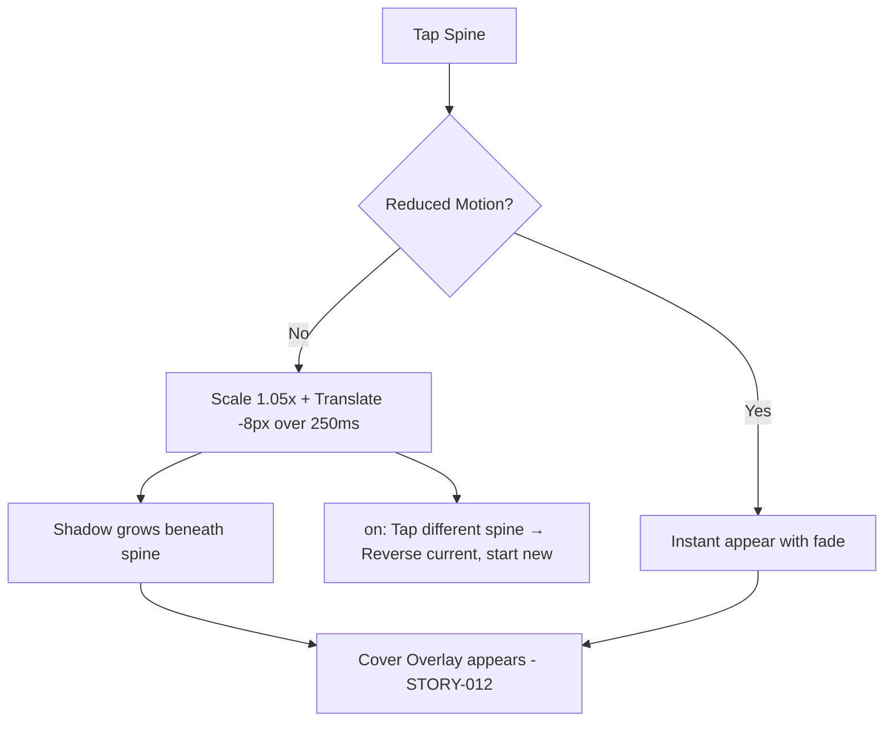

# STORY-040: Book Pull-Out Animation

**Epic**: EPIC-007
**Persona**: Julia — The Young Author
**Priority**: Should Have
**Story Points**: 5
**Dependencies**: STORY-039 (Animation Engine), STORY-009 (Bookshelf Grid)

## User Story
As a young author, I want to see my book slide forward and grow slightly when I tap its spine, so that it feels like I'm actually pulling a real book off a shelf.

## Description
Implement the pull-out animation triggered when Julia taps a book spine on the shelf. The spine scales up slightly (1.05x) and translates forward (z-axis or translateY for 2D), with a growing shadow beneath it. Duration: 200-300ms. The animation must be interruptible — if Julia taps another spine mid-animation, the current pull-out reverses and the new one begins. On completion, the cover overlay (STORY-012) appears.

## Context
Pull-out is the most-triggered animation in the app — every book interaction starts here. It must feel snappy and tactile. The shadow growth provides the illusion of depth without 3D WebGL. This story replaces or wraps the existing STORY-011 "Tap-to-Pull" with the animation engine from STORY-039.

## Acceptance Criteria (Verifiable)
- [ ] GIVEN Julia taps a book spine on the shelf
      WHEN the tap is registered
      THEN the spine scales to 1.05x and translates forward 8px over 250ms
- [ ] GIVEN a spine is animating forward
      WHEN Julia taps a different spine
      THEN the first spine reverses back to its original position and the new spine begins pulling forward
- [ ] GIVEN reduced motion is active
      WHEN Julia taps a spine
      THEN the spine appears forward instantly with a fade (no scale/translate animation)
- [ ] GIVEN the pull-out animation completes
      WHEN the spine reaches its forward position
      THEN a shadow appears beneath the spine to create depth illusion
- [ ] GIVEN Julia taps a spine rapidly 3 times
      WHEN the third tap fires
      THEN no visual glitches, stacking, or layout shifts occur

## NFRs
- NFR-PERF-04: 60fps on mid-range mobile during pull-out
- NFR-ACC-05: Reduced motion fallback: instant + fade

## Definition of Done (DoD)
- [ ] Code reviewed by CodeReviewer
- [ ] Tests with coverage >= 90%
- [ ] Integration tests passing
- [ ] QA approved by QAAnalyst
- [ ] Documentation updated
- [ ] PR created by MergeRequestCreator

## Technical Notes
- Use `transform: scale(1.05) translateY(-8px)` with `transform-origin: center bottom` (spine "leans" from the shelf)
- Shadow: `box-shadow` transitioning from `0 2px 4px rgba(0,0,0,0.1)` to `0 8px 16px rgba(0,0,0,0.2)`
- Easing: `cubic-bezier(0.34, 1.56, 0.64, 1)` — slight overshoot for "bouncy" feel
- On animation complete → trigger STORY-012 cover overlay
- If STORY-011 already implemented, refactor to use STORY-039 engine instead of inline transitions
- Must not cause layout reflow — all transforms are compositor-only properties

## User Flow

## Test Scenarios
- Scenario 1: Single tap on spine — smooth pull-out in ~250ms with shadow
- Scenario 2: Tap two different spines rapidly — first reverses, second pulls forward
- Scenario 3: Reduced motion — instant transition, no motion
- Scenario 4: 50 books rendered — pull-out maintains 60fps
