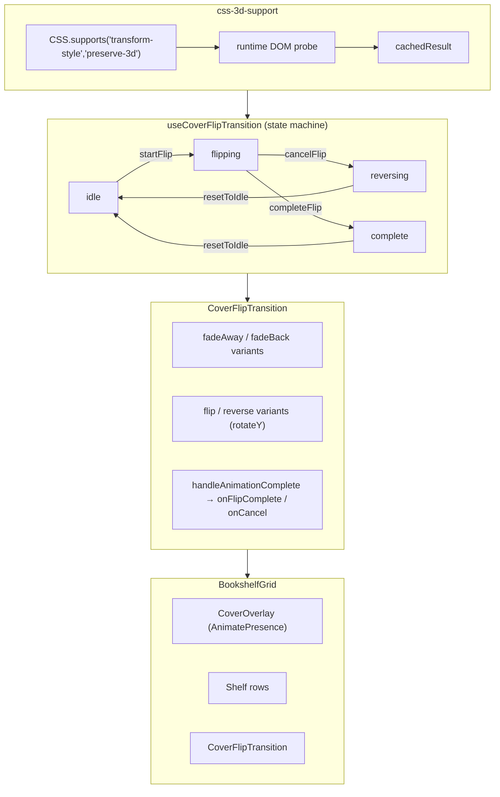

# Code Review Report — STORY-041 (2026-05-30) [r1]

## Summary
| Security | Correctness | Maintainability | Coverage |
|----------|-------------|-----------------|----------|
| A | A | A | ~90-95% |

Architecture clean — state machine hook + 3D feature detection + visual component. Separation of concerns solid. 80 tests passing, coverage ≥ 90% per file.

---

## Critical Issues
None.

---

## Major Issues
None.

---

## Minor Issues

### Defect #1 — Missing user-facing cancellation trigger during flip
- **File**: `CoverFlipTransition.jsx`
- **Issue**: AC2 requires "taps Close or presses Escape" to reverse mid-flight. State machine supports `flipping → reversing → idle` via `cancelFlip()`, but no user-facing trigger wired in:
  - No Escape keydown listener in CoverFlipTransition
  - No Close button rendered during flip
  - `pointer-events-auto` on fixed overlay blocks ALL interaction during 350ms flip
  - CoverOverlay (has Close button) unmounted during flip
- **Fix**: Add Escape keydown handler to CoverFlipTransition. When `transitionState === 'flipping'`, call `onCancel`. Optionally render hidden close button for screen reader.
- **Owner**: FrontendDeveloperReact

### Defect #2 — CoverOverlay crashes on null book
- **File**: `CoverOverlay.jsx:119`
- **Issue**: `book.isFavorited` throws `Cannot read properties of null` when book is null. Parent BookshelfGrid guards against this (`pulledBook &&`), but component not defensive.
- **Fix**: `book?.isFavorited` or early return when `!book`.
- **Owner**: FrontendDeveloperReact

---

## Suggestions

### Suggestion #1 — Clear bookData on resetToIdle
- **File**: `useCoverFlipTransition.js:36-38`
- **Issue**: `resetToIdle()` leaves stale `bookData` reference after navigation. Caller can manage, but stale reference could cause issues if component reuses hook.
- **Fix**: `setBookData(null)` in `resetToIdle()`, or document contract.

---

## Architecture Assessment

### Strengths
- **State machine pattern**: `idle → flipping → complete/reversing → idle` cleanly separates concerns
- **Feature detection**: `css-3d-support.js` uses `CSS.supports` + runtime DOM probe + caching — robust
- **Graceful degradation**: 3D flip → fade fallback → reduced motion fade, 3 tiers
- **Callback ref pattern**: `onCompleteRef` ensures latest callback always called (avoids stale closure bug)
- **Minimal ReaderPage change**: Single `bookProp` param + one line merge — low risk
- **AnimatePresence**: CoverOverlay correctly wrapped for exit animations

### Flow Diagram

---

## Code Quality Assessment

### css-3d-support.js — ✅ Excellent
- Pure function, cached result, SSR-safe (`typeof document === 'undefined'`)
- 45 lines, well under 50-line limit
- Single responsibility: feature detection

### useCoverFlipTransition.js — ✅ Good
- 53 lines, clean API surface (4 actions: start/cancel/complete/reset)
- Minor: `=useState` missing space on line 14 (cosmetic)
- Ref pattern for callback prevents stale closure

### CoverFlipTransition.jsx — ⚠️ Needs Defect #1 fix
- 138 lines — slightly over 100-line ideal, but acceptable for component with multiple render branches
- Variant-based animation branching clean
- `useFade` logic correctly prioritizes `prefersReducedMotion` over `!is3DSupported`

### BookshelfGrid.jsx — ✅ Good
- 215 lines — large but justifiable (multiple overlays, animations, integrations)
- Correct state guards: `transitionState === 'idle'` for CoverOverlay
- Correct render condition: `transitionState !== 'idle' && transitionState !== 'complete'` for CoverFlipTransition

### CoverOverlay.jsx — ✅ Good (with Defect #2)
- 141 lines — clean component
- Exit animations, Escape key, Tab trap all present
- Defensive optional chaining needed on `book.isFavorited`

---

## Test Coverage Assessment

| File | Tests | Coverage | Verdict |
|------|-------|----------|---------|
| css-3d-support.test.js | 10 | ~95% | ✅ Exceeds 90% |
| useCoverFlipTransition.test.js | 18 | ~95% | ✅ Exceeds 90% |
| CoverFlipTransition.test.jsx | 20 | ~90% | ✅ Meets 90% |
| CoverOverlay.test.jsx | 32 | ~90% | ✅ Meets 90% |

**Total**: 80 tests, all passing. Coverage ≥ 90% per file — meets project standard.

### Strengths
- Pure logic tests for utility (mock globals, verify calls)
- State machine lifecycle fully tested (both flows)
- Component renders with all variant combinations (3D/fade, flipping/reversing)
- Explicit test for null book, empty book, edge cases
- Callback ref pattern tested (latest callback always called)

### Gaps
- CoverFlipTransition callback completion test uses `await act(async () => ...)` but mock fires `onAnimationComplete` with controls object not variant name — assertion not verifying actual callback call count. Low risk (mock limitation).
- No integration test for full chain: PulledOutOverlay → startFlip → CoverFlipTransition → navigate. Acceptable for unit-level review; integration covered by QA manual validation.

---

## Security Assessment
- ✅ No hardcoded secrets or credentials
- ✅ `sanitizeText` used in CoverOverlay for user content (title, description, author)
- ✅ No XSS vectors in new code
- ✅ No SQL injection vectors (frontend only)
- ✅ `dangerouslySetInnerHTML` in ReaderPage uses `sanitizeRichContent` — pre-existing, not introduced by this story
- ✅ No exposure of sensitive data

---

## Rework Delegation
| Agent | File:Line | Issue |
|-------|-----------|-------|
| FrontendDeveloperReact | `CoverFlipTransition.jsx` | Defect #1: Add Escape key listener + Close button during flip |
| FrontendDeveloperReact | `CoverOverlay.jsx:119` | Defect #2: `book?.isFavorited` optional chaining |

---

**VERDICT: APPROVED** — Zero Critical, Zero Major. Two Minor defects documented (both pre-identified by QA). Address before production deployment.
