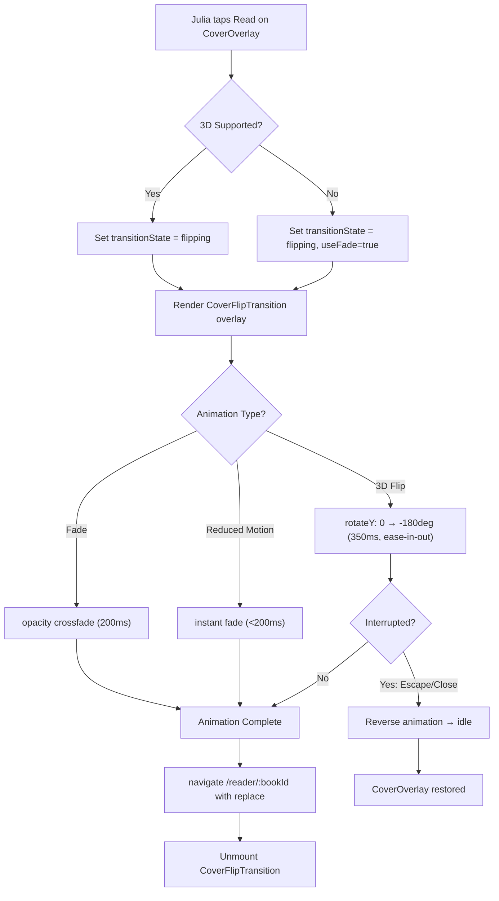
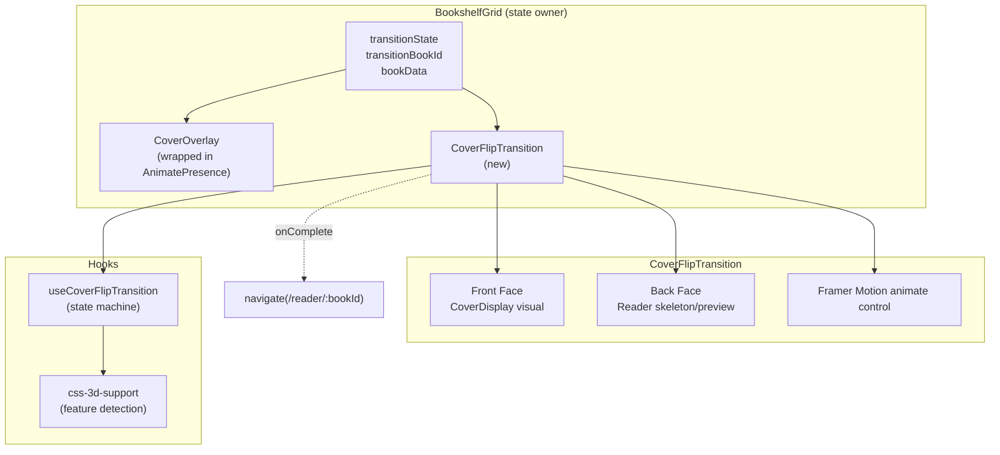
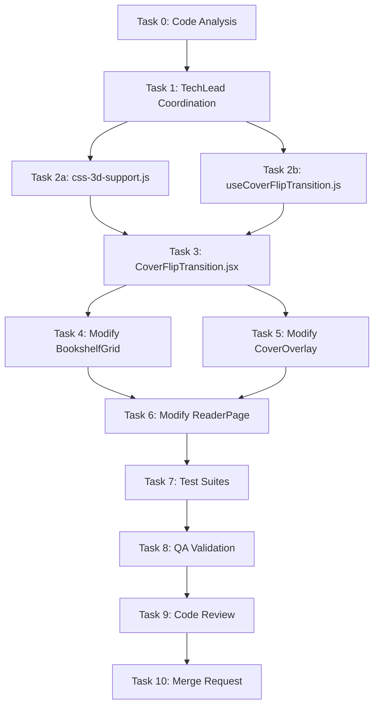

# STORY-041 Technical Analysis: Cover Open & Reader Transition

**Parent Epic**: EPIC-007
**Persona**: Julia — The Young Author
**Date**: 2026-05-30

---

## Stack Reference

Source: `docs/architecture/TECH-STACK.md` (greenfield)

| Layer | Technology |
|-------|-----------|
| Frontend Framework | React 18 |
| Build Tool | Vite 5.x |
| Styling | Tailwind CSS 3.x |
| Animations | Framer Motion (already installed) |
| State Management | Zustand + TanStack Query |
| Routing | react-router-dom v6 |
| Testing | Vitest + React Testing Library |

**Language**: Node.js (frontend) — FrontendDeveloperReact
**Integration Pattern**: SPA mode — Vite dev proxy to Express, single repo, react-router-dom navigation

---

## Story Summary

Implement the "curtain raise" cover-to-reader transition: when Julia taps "Read" on the cover overlay, the cover performs a 3D CSS flip (or fade fallback) that transitions into the reader view over 350ms. Animation must be interruptible and respect `prefers-reduced-motion`.

**Dependencies**:
- STORY-039 (Animation Engine) — **NOT IMPLEMENTED**. Must build self-contained hook following STORY-039 API pattern (same approach as STORY-040).
- STORY-012 (Cover Overlay) — **Implemented**. CoverOverlay.jsx exists and is the animation source.
- STORY-029 (Reader UI) — **Implemented**. ReaderPage.jsx exists and is the animation destination.

---

## Code Analysis Summary

Key findings from code analysis:

1. **Current navigation is a hard route change**: `CoverOverlay.onRead` → `navigate(/reader/:bookId)` → CoverOverlay unmounts instantly, ReaderPage mounts fresh. No DOM coexistence possible.
2. **CoverOverlay exit animations are dead**: BookshelfGrid renders CoverOverlay with conditional `{coverOverlayOpen && ...}` (no `AnimatePresence` wrapper), killing exit animations.
3. **No animation engine exists**: STORY-039 never implemented. Must replicate STORY-040's self-contained hook approach.
4. **Spike proves 3D flip works**: `AnimationDemo.jsx` PageTurnDemo uses `rotateY(180deg)` + `preserve-3d` + Framer Motion successfully.
5. **CSS 3D detection utility doesn't exist**: Must create.
6. **ReaderPage needs book data during transition**: It fetches via `useBookEditQuery(bookId)` — will show loading during the flip unless pre-populated.

---

## Architecture: State-Based Transition with Staged Mounting

### Core Concept

Replace the instant `navigate()` call with a three-phase state machine that keeps both cover and reader visuals in the DOM during the transition:

```
idle → flipping → complete
  ↑       ↓
  └─── (interrupt/reverse)
```

### Flow Diagram



### Component Architecture



### State Machine Details

| State | CoverOverlay | CoverFlipTransition | ReaderPage |
|-------|-------------|---------------------|------------|
| `idle` | Visible | Not mounted | Not mounted |
| `flipping` | Still visible (behind flip) | Mounted, animating | Pre-rendered inside flip back face |
| `complete` | Unmounted | Unmounting | Takes over via `/reader/:bookId` route |
| `reversing` | Restoring | Playing reverse animation | Not mounted |

---

## Task Breakdown & Agent Assignment

| Task | Description | Agent | Effort |
|------|-------------|-------|--------|
| 0 | Code analysis | CodeAnalyzer | Done |
| 1 | Coordination | TechLead | — |
| 2a | Create `css-3d-support.js` utility | FrontendDeveloperReact | S |
| 2b | Create `useCoverFlipTransition.js` hook | FrontendDeveloperReact | M |
| 3 | Create `CoverFlipTransition.jsx` component | FrontendDeveloperReact | L |
| 4 | Modify `BookshelfGrid.jsx` — integrate transition state, AnimatePresence | FrontendDeveloperReact | M |
| 5 | Modify `CoverOverlay.jsx` — fix exit animation, support flip start | FrontendDeveloperReact | S |
| 6 | Modify `ReaderPage.jsx` — optional `book` prop for instant render | FrontendDeveloperReact | S |
| 7 | Test suites (unit + integration) | TestEngineer | L |
| 8 | QA validation | QAAnalyst | — |
| 9 | Code review | CodeReviewer | — |
| 10 | Merge request | MergeRequestCreator | — |

---

## Execution Order



**Parallelization**:
- Tasks 2a + 2b: **parallel** (no shared contracts)
- Tasks 4 + 5: **parallel** after Task 3 completes (both depend on CoverFlipTransition API)
- Task 6: **sequential** after 4 & 5 (needs both modifications stable)
- Tasks 7-10: **strictly sequential**

**Max concurrent agents**: 2 (per rules)

---

## Impacted Components & Files

### New Files

| File | Purpose |
|------|---------|
| `frontend/src/lib/css-3d-support.js` | CSS 3D feature detection: `CSS.supports('transform-style', 'preserve-3d')` + fallback |
| `frontend/src/hooks/useCoverFlipTransition.js` | State machine hook: `idle/flipping/complete/reversing`, `startFlip()`, `cancelFlip()`, `is3DSupported`, `prefersReducedMotion`, duration/easing config |
| `frontend/src/components/shelf/CoverFlipTransition.jsx` | Visual 3D flip: Framer Motion `motion.div` with `perspective: 1200px`, front/back faces, interruptible animation control |
| `frontend/src/__tests__/css-3d-support.test.js` | Unit tests for 3D detection |
| `frontend/src/__tests__/useCoverFlipTransition.test.js` | Unit tests for transition state machine |
| `frontend/src/__tests__/CoverFlipTransition.test.jsx` | Component tests for flip animation |

### Modified Files

| File | Change | Risk |
|------|--------|------|
| `BookshelfGrid.jsx:144,154-162` | Add transition state, wrap CoverOverlay in AnimatePresence, render CoverFlipTransition during flip | High |
| `CoverOverlay.jsx:72,86-97` | Fix dead exit animation (remove internal AnimatePresence or restructure), expose ref/callback for flip | Medium |
| `ReaderPage.jsx:48-890` | Accept optional `book` prop for pre-populated data during transition | Low |
| `frontend/src/styles/cover.css` | Add 3D flip CSS custom properties if needed | Low |

---

## NFR Analysis

### NFR-PERF-04: 60fps during cover-to-reader transition
- **Approach**: Use `will-change: transform` + `transform: rotateY()` (GPU-composited). Framer Motion's `motion.div` handles rAF batching.
- **Risk**: 3D transforms on complex cover images may cause paint storms on low-end devices.
- **Mitigation**: Feature-detect CSS 3D support; fallback to opacity crossfade (also 60fps-safe) for unsupported devices.

### NFR-ACC-05: Reduced motion — fade only, no 3D
- **Approach**: `useReducedMotion()` from Framer Motion. When active: `duration: 0.15`, animation = opacity crossfade only (no rotateY). Total <200ms as spec requires.
- **Existing pattern**: Already used in CoverOverlay, PageTurnAnimation, AnimationDemo — consistent.

---

## Persona Impact

**Julia — The Young Author**:
- Current experience: Taps "Read" → instant page switch (feels mechanical, no emotional "opening" moment)
- New experience: Taps "Read" → cover visually flips open like a real book → reader smoothly appears
- Accessibility: Reduced-motion users get a quick fade instead — still seamless, just without 3D flair
- Mobile: Touch targets unchanged; flip animation is visual-only; escape gesture reversal works on tap

---

## Technical Design Details

### 1. CSS 3D Detection (`css-3d-support.js`)

```js
// Feature detection utility
export function supportsPreserve3d() {
  if (typeof CSS === 'undefined' || !CSS.supports) return false;
  return CSS.supports('transform-style', 'preserve-3d');
}
```

Also test at runtime by creating a temporary element and checking if 3D transform actually renders (some browsers report support but fail in practice).

### 2. Transition State Machine Hook (`useCoverFlipTransition.js`)

API follows STORY-039 pattern:

```js
export default function useCoverFlipTransition({ onFlipComplete } = {}) {
  // Returns:
  // transitionState: 'idle' | 'flipping' | 'reversing' | 'complete'
  // bookData: book object during transition
  // startFlip(book): trigger the flip with book data
  // cancelFlip(): reverse mid-flip
  // is3DSupported: boolean
  // prefersReducedMotion: boolean
  // animationConfig: { duration, easing, perspective }
}
```

- `transitionState` drives conditional rendering in BookshelfGrid
- `cancelFlip()` interrupts mid-flight → plays reverse animation → returns to `idle`
- `prefersReducedMotion` from Framer Motion's hook + manual fallback
- `onFlipComplete` callback fires after animation done → triggers `navigate()`

### 3. CoverFlipTransition Component

**3D Flip approach** (primary):
- Parent: `perspective: 1200px`, `position: fixed`, `inset: 0`, `z-index: 80` (above shelf, above CoverOverlay)
- Container: `transform-style: preserve-3d`, animated via `motion.div` `rotateY` from `0` to `-180deg`
- Front face: `backfaceVisibility: hidden`, contains CoverDisplay visual (snapshot of cover)
- Back face: `backfaceVisibility: hidden`, `transform: rotateY(180deg)`, contains reader preview skeleton
- Easing: `cubic-bezier(0.4, 0, 0.2, 1)` (ease-in-out — per STORY-041 spec)
- Duration: 350ms

**Fade approach** (fallback):
- Cover fades out with `opacity: 1 → 0` over 200ms
- Reader fades in with `opacity: 0 → 1` over 200ms
- Staggered: reader starts at 100ms offset
- No 3D transforms

**Reduced motion approach**:
- Cover fades out <200ms
- Reader fades in <200ms
- No movement, no scale change

**Interruptibility**:
- Use Framer Motion's `useAnimationControls()` to get an `AnimationControls` object
- On Escape/Close during flip: call `controls.stop()` then animate `rotateY` back to `0` with same duration
- State transitions: `flipping` → `reversing` → `idle`

### 4. BookshelfGrid Integration

Current (broken for exit):
```jsx
{coverOverlayOpen && pulledBook && <CoverOverlay ... />}
```

New:
```jsx
<AnimatePresence>
  {coverOverlayOpen && transitionState === 'idle' && pulledBook && (
    <CoverOverlay ... onRead={() => startFlip(pulledBook)} />
  )}
</AnimatePresence>

{transitionState !== 'idle' && (
  <CoverFlipTransition
    book={bookData}
    transitionState={transitionState}
    is3DSupported={is3DSupported}
    onFlipComplete={handleFlipComplete}
    onCancel={cancelFlip}
  />
)}
```

`handleFlipComplete`:
1. `setCoverOverlayOpen(false)`
2. `navigate(getReaderUrl(bookData._id), { replace: true })`
3. Reset `transitionState` to `idle` after a tick

### 5. CoverOverlay Changes

- Remove or restructure the dead internal `AnimatePresence` (line 72) since parent now handles it
- Ensure `onRead` prop triggers `startFlip()` instead of `navigate()`
- Add `onAnimationComplete` callback if needed for timing coordination

### 6. ReaderPage Changes

- Accept optional `book` prop
- If provided, use it for initial render (title, cover) instead of waiting for `useBookEditQuery`
- `useBookEditQuery` still fires in background for full data; prop is just for instant first paint during transition

---

## Risk Assessment & Mitigations

| Risk | Severity | Mitigation |
|------|----------|------------|
| Route architecture prevents DOM coexistence | Critical | State-based transition with staged mounting — both components in DOM during flip |
| STORY-039 animation engine missing | High | Self-contained hook following STORY-039 API signature (same as STORY-040 pattern) |
| CoverOverlay exit animation broken by parent | High | Wrap in `AnimatePresence` at BookshelfGrid level |
| 3D flip on low-end devices may stutter | Medium | Feature-detect + graceful fade fallback |
| ReaderPage loading state visible during flip | Medium | Pass `book` prop for instant render; hide skeleton until data loads |
| Escape during flip doesn't reverse smoothly | Medium | Framer Motion `AnimationControls.stop()` + reverse animation |
| CSS `preserve-3d` not truly supported despite `CSS.supports` | Low | Runtime probe with hidden element before first flip |

---

## Acceptance Criteria Verification Plan

| AC | Test Scenario | Tool |
|----|--------------|------|
| AC1: Tap Read → cover opens over 350ms | Render CoverOverlay, trigger onRead, verify rotateY animation runs | Vitest + RTL, mock Framer Motion |
| AC2: Tap Close mid-flight → reverses | Start flip, trigger cancel during animation, verify state returns to idle | Vitest + RTL |
| AC3: Reduced motion → fade <200ms no 3D | Mock `useReducedMotion` → true, verify no rotateY, fade duration ≤200ms | Vitest |
| AC4: No 3D support → fade fallback | Mock `CSS.supports` → false, verify fade path used | Vitest |

---

## Implementation Recommendations

1. **Start with the hook** (`useCoverFlipTransition`) — pure logic, easy to test in isolation
2. **Then CSS 3D detection** — tiny utility, zero risk
3. **Then the visual component** (`CoverFlipTransition`) — can be developed in Storybook/story format standalone
4. **Integration last** — BookshelfGrid + CoverOverlay + ReaderPage modifications tie it all together
5. **Test early** — unit tests for hook and detection before component integration
6. **No App.jsx route changes needed** — ReaderPage stays on `/reader/:bookId`; transition is purely visual overlay that resolves to `navigate()`

---

## References

- PM Story: `docs/stories/STORY-041.md`
- Code Analysis: `docs/stories/STORY-041-code-analysis.md` (from CodeAnalyzer)
- Dependency stories: STORY-039 (engine, unimplemented), STORY-012 (cover overlay), STORY-029 (reader UI)
- Tech Stack: `docs/architecture/TECH-STACK.md`
- Animation spike: `frontend/src/components/spike/AnimationDemo.jsx`
- Existing animation pattern: `frontend/src/components/reader/PageTurnAnimation.jsx`