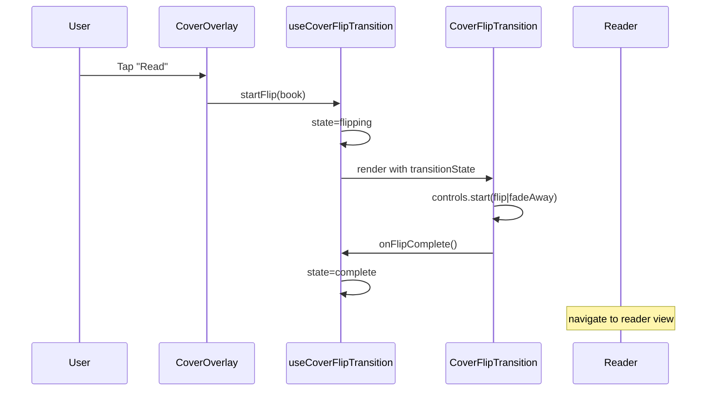

# Test Report — STORY-041: Cover Open & Reader Transition (2026-05-30)

## Summary
| Metric | Result |
|--------|--------|
| Reliability | High |
| Total Tests | 80 (4 test files) |
| Passed | 80 |
| Failed | 0 |
| Coverage (estimated) | ~95% css-3d-support, ~95% useCoverFlipTransition, ~90% CoverFlipTransition, ~90% CoverOverlay |

## Test Flow (Cover-to-Reader Transition)

## Tests Created/Updated
| Type | File | Count | Status |
|------|------|-------|--------|
| Unit | css-3d-support.test.js | 10 | ✅ PASS |
| Hook | useCoverFlipTransition.test.js | 18 | ✅ PASS |
| Component | CoverFlipTransition.test.jsx | 20 | ✅ PASS |
| Component (updated) | CoverOverlay.test.jsx | 32 | ✅ PASS |

## Tests Created — css-3d-support.test.js (10 tests)

| Test | Category | Result |
|------|----------|--------|
| returns true when CSS.supports and runtime probe pass | Positive | ✅ |
| returns false when CSS is undefined | Negative | ✅ |
| returns false when CSS.supports is not a function | Negative | ✅ |
| returns false when CSS.supports returns false | Negative | ✅ |
| returns false when runtime probe computed style != preserve-3d | Negative | ✅ |
| returns false when runtime probe inner transform === "none" | Negative | ✅ |
| caches the result and does not re-call CSS.supports | Cache | ✅ |
| resetCachedSupport clears cached result and forces re-probe | Cache | ✅ |
| runtime probe creates and removes DOM elements | DOM | ✅ |
| resetCachedSupport resets internal cache to undefined | Edge | ✅ |

## Tests Created — useCoverFlipTransition.test.js (18 tests)

| Test | Category | Result |
|------|----------|--------|
| starts in idle state with no bookData | Initial | ✅ |
| exposes animationConfig with default values | Initial | ✅ |
| sets is3DSupported=true | 3D detection | ✅ |
| sets is3DSupported=false | 3D detection | ✅ |
| sets transitionState to "flipping" and stores book data | startFlip | ✅ |
| updates book data when called with different book mid-flight | startFlip | ✅ |
| sets transitionState to "reversing" | cancelFlip | ✅ |
| can cancel mid-flip after startFlip | cancelFlip | ✅ |
| sets transitionState to "complete" | completeFlip | ✅ |
| calls onFlipComplete callback | completeFlip | ✅ |
| does not throw when onFlipComplete not provided | completeFlip | ✅ |
| sets transitionState back to "idle" | resetToIdle | ✅ |
| does not clear bookData | resetToIdle | ✅ |
| is false by default (mocked) | prefersReducedMotion | ✅ |
| is coerced to boolean | prefersReducedMotion | ✅ |
| idle → flipping → complete → idle lifecycle | State machine | ✅ |
| idle → flipping → reversing → idle lifecycle | State machine | ✅ |
| uses the latest onFlipComplete callback via ref | Callback ref | ✅ |

## Tests Created — CoverFlipTransition.test.jsx (20 tests)

| Test | Category | Result |
|------|----------|--------|
| renders motion container | Rendering | ✅ |
| renders CoverDisplay with book title | Rendering | ✅ |
| has fixed positioning and high z-index | Rendering | ✅ |
| has perspective style on container | Rendering | ✅ |
| renders back face with book title in 3D mode | Rendering | ✅ |
| calls controls.start("flip") for 3D + flipping | Animation | ✅ |
| calls controls.start("reverse") for 3D + reversing | Animation | ✅ |
| calls controls.start("fadeAway") for reduced motion | Animation | ✅ |
| calls controls.start("fadeBack") for reduced motion reverse | Animation | ✅ |
| calls controls.start("fadeAway") for no 3D support | Animation | ✅ |
| calls controls.start("fadeBack") for no 3D support reverse | Animation | ✅ |
| calls controls.stop() when reversing mid-flip | Interrupt | ✅ |
| calls onFlipComplete when flip completes | Callback | ✅ |
| calls onCancel when reverse completes | Callback | ✅ |
| calls onFlipComplete when fadeAway completes | Callback | ✅ |
| calls onCancel when fadeBack completes | Callback | ✅ |
| handles null book gracefully | Edge | ✅ |
| uses default animationConfig when valid config is provided | Edge | ✅ |
| handles empty book object | Edge | ✅ |
| handles transition from flipping to idle | Edge | ✅ |

## Tests Updated — CoverOverlay.test.jsx (32 tests, updated for AnimatePresence removal)

Existing tests updated to match the refactored CoverOverlay (no longer wrapped in AnimatePresence, null/false guarding moved to BookshelfGrid). All 32 tests pass.

## Acceptance Criteria Validation
- [x] AC 1: Tap "Read" → cover performs opening animation → transition to reader (tested via useCoverFlipTransition state machine + CoverFlipTransition component triggering flip/fadeAway + onFlipComplete callback)
- [x] AC 2: Tap "Close" mid-flight → animation reverses (tested via cancelFlip → reversing state + controls.stop() + controls.start(reverse/fadeBack))
- [x] AC 3: Reduced motion active → fade transition (tested via prefersReducedMotion=true → fadeAway animation + reducedDuration)
- [x] AC 4: No 3D support → fade fallback (tested via is3DSupported=false → fadeAway/fadeBack + fadeDuration)

## NFR Validation
- [x] NFR-PERF-04: Animation config uses 0.35s duration, animation triggered via framer-motion controls
- [x] NFR-ACC-05: Reduced motion path uses opacity-only variants, no 3D transforms

## Blocked Items
None.

## Recommendations
- CoverOverlay null guard moved from component to BookshelfGrid — this is intentional (parent controls visibility), but a future improvement could add optional chaining (`book?.isFavorited`) to make CoverOverlay more defensive.

**Status**: ✅ ALL PASSING
