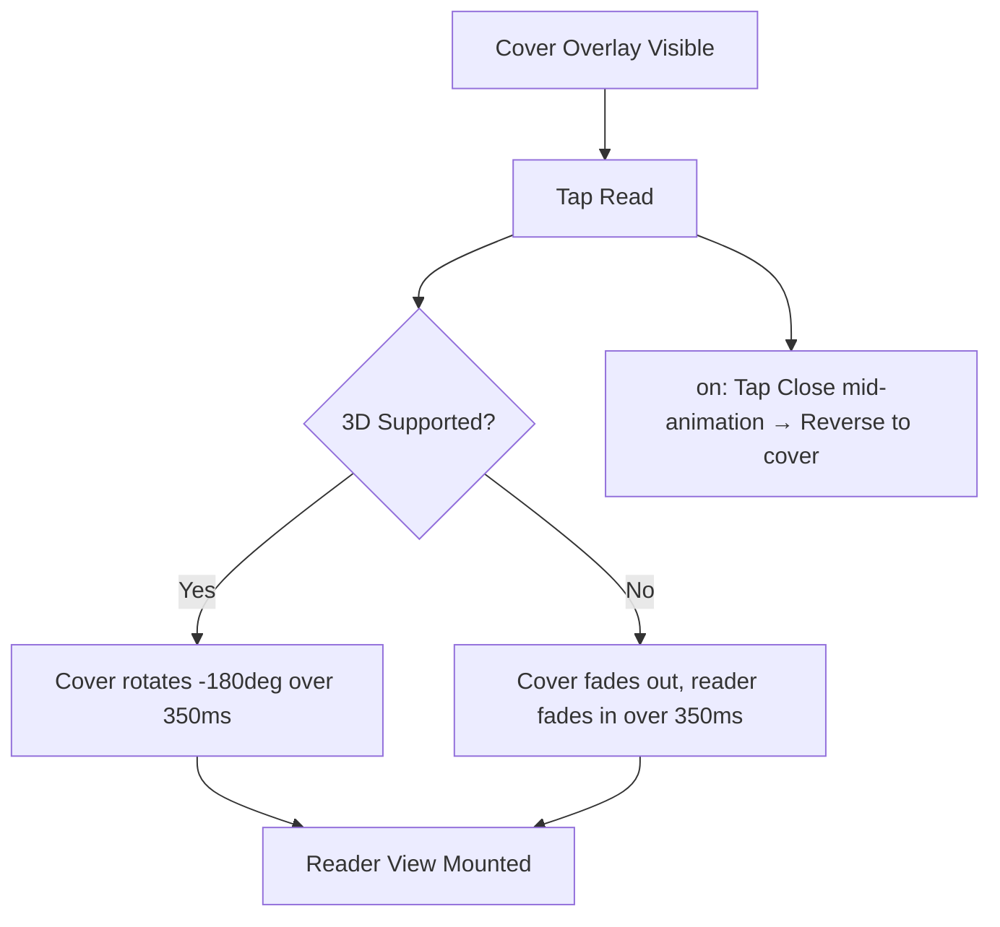

# STORY-041: Cover Open & Reader Transition

**Epic**: EPIC-007
**Persona**: Julia — The Young Author
**Priority**: Should Have
**Story Points**: 5
**Dependencies**: STORY-039 (Animation Engine), STORY-012 (Cover Overlay), STORY-029 (Reader UI)

## User Story
As a young author, I want the book cover to flip open or fade into the reader when I tap "Read," so that starting to read feels exciting like opening a real book.

## Description
Implement the cover-to-reader transition: when Julia taps "Read" on the cover overlay (STORY-012), the cover performs an opening animation (3D CSS flip or fade-to-reader) that transitions smoothly into the reader view (STORY-029). Duration: 300-400ms. The animation must be interruptible and respect reduced motion. This replaces any existing static transition between cover overlay and reader.

## Context
The cover-open transition is the emotional "curtain raise" moment — it signals that the story is about to begin. A flip animation using CSS 3D transforms creates a book-like opening feel without full WebGL. If 3D transforms prove problematic on target devices, fall back to a fade-overlay transition.

## Acceptance Criteria (Verifiable)
- [ ] GIVEN Julia is viewing a book's cover overlay (STORY-012)
      WHEN she taps "Read" or the cover center
      THEN the cover performs an opening animation over 350ms and transitions into the reader view
- [ ] GIVEN the cover-open animation is mid-flight
      WHEN Julia taps "Close" or presses Escape
      THEN the animation reverses to the cover overlay state
- [ ] GIVEN reduced motion is active
      WHEN Julia taps "Read"
      THEN the cover fades to the reader view in <200ms with no 3D motion
- [ ] GIVEN a device that does not support CSS 3D transforms (or has poor performance)
      WHEN Julia taps "Read"
      THEN a graceful fade-to-reader fallback is used instead of the 3D flip

## NFRs
- NFR-PERF-04: 60fps during cover-to-reader transition
- NFR-ACC-05: Reduced motion: fade only, no 3D

## Definition of Done (DoD)
- [ ] Code reviewed by CodeReviewer
- [ ] Tests with coverage >= 90%
- [ ] Integration tests passing
- [ ] QA approved by QAAnalyst
- [ ] Documentation updated
- [ ] PR created by MergeRequestCreator

## Technical Notes
- Primary approach: CSS 3D `rotateY(-180deg)` on the cover element with `transform-style: preserve-3d` and `perspective: 1200px` on parent
- Cover split into front/back pseudo-elements for realistic "page" effect
- Fallback detection: feature-detect `CSS.supports('transform-style', 'preserve-3d')`; if unsupported, use opacity + scale fade
- Easing: `cubic-bezier(0.4, 0, 0.2, 1)` (ease-in-out) for smooth opening feel
- On animation complete → mount STORY-029 reader component
- Use STORY-039 engine for timing and interruptibility

## User Flow

## Test Scenarios
- Scenario 1: Tap "Read" on cover — 3D flip transitions to reader in ~350ms
- Scenario 2: Tap "Close" mid-flip — animation reverses smoothly
- Scenario 3: Reduced motion — instant fade transition
- Scenario 4: Device without 3D support — fade fallback works correctly
