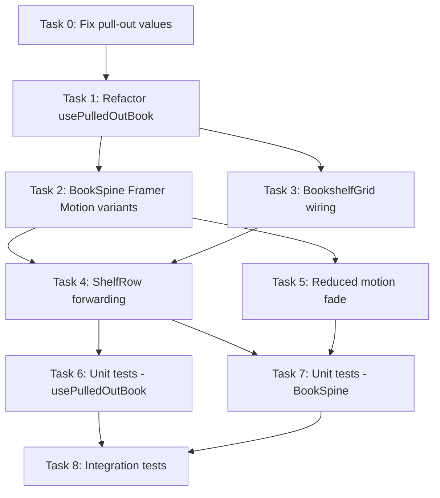

# STORY-042 Implementation Plan: Place-Back Animation

**Epic**: EPIC-007  
**Dependencies**: STORY-039 (Animation Engine), STORY-040 (Pull-Out Animation), STORY-013 (Place-Back)  
**Technical Analysis**: `/docs/stories/STORY-042-technical-analysis.md`  
**Stack**: React 18 + Framer Motion 11 + Vite 5 + Tailwind 3  

---

## Prerequisite: STORY-039 Status

The animation engine (STORY-039) is **not yet implemented** (`frontend/src/lib/animation-engine/` is empty). This plan implements place-back using Framer Motion directly, with `// TODO: STORY-039` markers for future engine migration. The code structure mirrors STORY-039's planned API (`animate(element, { from, to, duration, easing, onComplete, interruptible })`, making the refactor trivial.

---

## Subtask Breakdown

### Task 0: Fix Pull-Out Transform Values (STORY-040 alignment)

**Why**: Place-back is the *reverse* of pull-out. Current pull-out values don't match STORY-040 spec, so place-back can't be correct without fixing the source.

**Files to modify:**
- `frontend/src/components/shelf/BookSpine.jsx`

**Changes:**
1. Line 21: Change `translateY(-4px) scale(1.05)` → `translateY(-8px) scale(1.05)`
2. Line 21: Change `boxShadow: '0 20px 25px -5px rgba(0,0,0,0.2)'` → `'0 8px 16px rgba(0,0,0,0.2)'`
3. Both align with STORY-040 technical notes

**Verification:** Pulled-out spine shows 8px lift and lighter shadow.

---

### Task 1: Refactor `usePulledOutBook` — Replace setTimeout with Animation Lifecycle

**Files to modify:**
- `frontend/src/hooks/usePulledOutBook.js`

**Changes:**

1. **Remove `placeBackTimeoutRef` and `setTimeout` pattern** — Replace with `onAnimationComplete` callback approach.
2. **Change duration**: `0.3` → `0.25` (250ms per spec)
3. **Add `cancelPlaceBack()` function** — Clears `isPlacingBack` immediately for interrupt on re-tap
4. **Add `animationPhase` state** — Track `idle | pullOut | placeBack` for BookSpine to know which Framer Motion variant to apply

**New API:**
```javascript
return {
  pulledOutBookId,
  animationPhase,       // 'idle' | 'pullOut' | 'placeBack'
  pullOut,              // (bookId) => sets phase='pullOut', then 'idle' after animation
  placeBack,            // () => sets phase='placeBack'
  cancelPlaceBack,      // () => clears placeBack, returns to pulled-out
  dismiss,              // () => instant clear
  toggle,               // handles interruptibility during place-back
  isPulledOut,          // (bookId) => boolean
  duration,             // 0.25 (or 0 for reduced motion)
  getReaderUrl,
};
```

**Key logic for `placeBack()`:**
```javascript
const placeBack = useCallback(() => {
  setIsPlacingBack(true);
  setAnimationPhase('placeBack');
  // NO setTimeout — BookSpine's onAnimationComplete will call onComplete callback
}, []);
```

**Key logic for `cancelPlaceBack()`:**
```javascript
const cancelPlaceBack = useCallback(() => {
  if (placeBackTimeoutRef.current) {
    clearTimeout(placeBackTimeoutRef.current);
    placeBackTimeoutRef.current = null;
  }
  setIsPlacingBack(false);
  setAnimationPhase('idle');
  // pulledOutBookId stays set — book returns to pulled-out state
}, []);
```

**Handle `toggle()` during place-back:**
```javascript
const toggle = useCallback((bookId) => {
  if (animationPhase === 'placeBack' && bookId === pulledOutBookId) {
    // Re-tap same spine during place-back → cancel place-back, start pull-out
    cancelPlaceBack();
    return;
  }
  // ... existing toggle logic
}, [animationPhase, pulledOutBookId, cancelPlaceBack]);
```

**`onPlaceBackComplete` callback** (called by BookSpine's `onAnimationComplete`):
```javascript
const onPlaceBackComplete = useCallback(() => {
  setPulledOutBookId(null);
  setIsPlacingBack(false);
  setAnimationPhase('idle');
  // Focus management: spineRefs.current[previousBookId]?.focus()
}, []);
```

**Risk mitigation**: Keep `placeBackTimeoutRef` as a safety fallback — if `onAnimationComplete` doesn't fire (edge case: tab hidden), timeout at `duration + 100ms` clears state.

---

### Task 2: BookSpine — Framer Motion Place-Back Variants

**Files to modify:**
- `frontend/src/components/shelf/BookSpine.jsx`

**Changes:**

1. **Remove inline CSS `settleTransition`** — Replace with Framer Motion `animate`/`exit` variants driven by `animationPhase` prop
2. **Add new props**: `animationPhase`, `onPlaceBackComplete`
3. **Define Framer Motion variants:**
```javascript
const spineVariants = {
  idle: {
    scale: 1,
    y: 0,
    boxShadow: '0 2px 4px rgba(0,0,0,0.1)',
  },
  pulledOut: {
    scale: 1.05,
    y: -8,
    boxShadow: '0 8px 16px rgba(0,0,0,0.2)',
  },
  placeBack: {
    scale: 1,
    y: 0,
    boxShadow: '0 2px 4px rgba(0,0,0,0.1)',
  },
};
```

4. **Transition config:**
```javascript
const placeBackTransition = {
  duration: 0.25,
  ease: [0.22, 1, 0.36, 1],  // settle overshoot
  // Bounce: add spring-like overshoot via Framer Motion
};

const pullOutTransition = {
  duration: 0.25,
  ease: [0.34, 1.56, 0.64, 1], // STORY-040 overshoot
};
```

5. **Implement settle bounce**: Use Framer Motion's spring with `overshootClamping: false`:
```javascript
const placeBackTransition = prefersReducedMotion
  ? { duration: 0 }
  : {
      type: 'spring',
      stiffness: 400,
      damping: 25,
      mass: 0.8,
      // This gives ~250ms settle with slight bounce at end
    };
```
Test spring values to match `cubic-bezier(0.22,1,0.36,1)` feel. Spring gives natural bounce; cubic-bezier gives programmed overshoot. **Spring preferred** for the "settle" feel.

6. **Animate presence for re-tap interruptibility:**
```jsx
<motion.button
  animate={animationPhase === 'placeBack' ? 'placeBack' : isPulledOut ? 'pulledOut' : 'idle'}
  variants={spineVariants}
  transition={animationPhase === 'placeBack' ? placeBackTransition : pullOutTransition}
  onAnimationComplete={() => {
    if (animationPhase === 'placeBack') {
      onPlaceBackComplete?.();
    }
  }}
  // ... rest
/>
```

7. **Remove `pulledStyle` and `settleTransition` from `style` prop** — All animation now via Framer Motion `animate` + `variants`

8. **Reduced motion**: Framer Motion's `animate` with `duration: 0` gives instant transition. Add opacity fade:
```jsx
const reducedMotionVariants = {
  idle: { scale: 1, y: 0, boxShadow: '0 2px 4px rgba(0,0,0,0.1)', opacity: 1 },
  pulledOut: { scale: 1.05, y: -8, boxShadow: '0 8px 16px rgba(0,0,0,0.2)', opacity: 1 },
  placeBack: { scale: 1, y: 0, boxShadow: '0 2px 4px rgba(0,0,0,0.1)', opacity: 1 },
};
// Use opacity: 0 → 1 transition for reduced-motion place-back
```

9. **Keep `willChange: 'transform'`** when `animationPhase !== 'idle'` for GPU compositing hint

10. **z-index**: `isPulledOut || animationPhase === 'placeBack'` → `zIndex: 50`, else `zIndex: 'auto'`

---

### Task 3: BookshelfGrid — Wire Up Animation Lifecycle

**Files to modify:**
- `frontend/src/components/shelf/BookshelfGrid.jsx`

**Changes:**

1. **Add `onPlaceBackComplete` handler**: Called by BookSpine after place-back animation finishes
2. **Pass `animationPhase` to ShelfRow/BookSpine**: New prop from `usePulledOutBook`
3. **Handle re-tap during place-back**: In `handleBookClick`, check if `animationPhase === 'placeBack'` and same book → cancel place-back, re-pull-out
4. **Focus management**: After `onPlaceBackComplete`, focus the spine element via `spineRefs.current[bookId]?.focus()`

**Key changes in `handleBookClick`:**
```javascript
const handleBookClick = useCallback((bookId) => {
  if (animationPhase === 'placeBack' && bookId === pulledOutBookId) {
    // Re-tap same spine during place-back → reverse
    cancelPlaceBack();
    return;
  }
  toggle(bookId);
  onBookClick?.(bookId);
}, [onBookClick, toggle, animationPhase, pulledOutBookId, cancelPlaceBack]);
```

5. **Pass new props to ShelfRow:**
```jsx
<ShelfRow
  books={row}
  onBookClick={handleBookClick}
  pulledOutBookId={pulledOutBookId}
  placingBackBookId={isPlacingBack ? pulledOutBookId : null}
  animationPhase={animationPhase}       // NEW
  onPlaceBackComplete={onPlaceBackComplete} // NEW
  // ... existing props
/>
```

---

### Task 4: ShelfRow — Forward Animation Props

**Files to modify:**
- `frontend/src/components/shelf/ShelfRow.jsx`

**Changes:**

1. Add `animationPhase` and `onPlaceBackComplete` props
2. Forward to `BookSpine`:
```jsx
<BookSpine
  book={book}
  onClick={() => onBookClick(book._id)}
  isPulledOut={book._id === pulledOutBookId}
  animationPhase={book._id === pulledOutBookId ? animationPhase : 'idle'}
  onPlaceBackComplete={onPlaceBackComplete}
  // ... existing props
/>
```

3. Keep existing shelf shadow `hasPlacingBack` logic — triggers shelf row shadow during place-back

---

### Task 5: Reduced Motion — Fade on Instant Return

**Files to modify:**
- `frontend/src/components/shelf/BookSpine.jsx`

**AC2 Requirement**: "spine appears back in its grid position instantly with a fade"

**Implementation**: When `prefersReducedMotion` and `animationPhase === 'placeBack'`:
- `duration: 0` for transform (instant position reset)
- `duration: 0.15` for opacity (0 → 1 fade-in)
- Variants:
```javascript
const reducedPlaceBackVariant = {
  scale: 1,
  y: 0,
  boxShadow: '0 2px 4px rgba(0,0,0,0.1)',
  opacity: { from: 0.3, to: 1 },  // fade in from dimmed
  transition: { scale: { duration: 0 }, y: { duration: 0 }, opacity: { duration: 0.15 } },
};
```

---

### Task 6: Unit Tests — usePulledOutBook

**Files to modify:**
- `frontend/src/__tests__/usePulledOutBook.test.js`

**New/updated test cases:**

1. **Duration change**: `expect(result.current.duration).toBe(0.25)` (was 0.3)
2. **Reduced motion duration**: `expect(result.current.duration).toBe(0)` (unchanged)
3. **`cancelPlaceBack()` during place-back**: sets `isPlacingBack=false`, `animationPhase='idle'`, keeps `pulledOutBookId` set
4. **`onPlaceBackComplete()` callback**: clears `pulledOutBookId`, `isPlacingBack=false`, `animationPhase='idle'`
5. **Re-tap same spine during place-back**: `toggle(sameBookId)` → `cancelPlaceBack()`, spine returns to pulled-out
6. **Animation phase tracking**: `pullOut` → phase='pullOut', `placeBack` → phase='placeBack', complete → phase='idle'
7. **Timeout fallback**: If `onPlaceBackComplete` never called, timeout fires at 350ms (250+100)
8. **Rapid place-back cycles**: No state corruption

---

### Task 7: Unit Tests — BookSpine Animation

**Files to create / modify:**
- `frontend/src/__tests__/BookSpine.test.jsx`
- `frontend/src/__tests__/BookSpineReducedMotion.test.jsx`

**New test cases:**

1. **Place-back variants applied**: When `animationPhase='placeBack'` and `isPulledOut=true`, motion.button receives `animate="placeBack"` and matching variants
2. **Place-back transition**: Spring config with stiffness ~400, damping ~25
3. **Settle bounce**: After place-back completes, no residual transform
4. **Re-tap during place-back**: `cancelPlaceBack` → spine returns to pulled-out variant
5. **z-index during place-back**: `zIndex: 50` while `animationPhase='placeBack'`, resets to `'auto'` on complete
6. **Box-shadow during place-back**: Transitions from `0 8px 16px rgba(0,0,0,0.2)` to `0 2px 4px rgba(0,0,0,0.1)`
7. **Pull-out transform**: Now uses `translateY(-8px)` (was -4px)
8. **Reduced motion place-back**: Duration 0 for transform, 0.15s for opacity fade
9. **No layout shift on sibling spines**: When one spine places back, sibling `motion.div` with `layoutId` doesn't shift
10. **Focus returns to spine after place-back complete**

---

### Task 8: Integration Tests — BookshelfGrid Place-Back Flow

**Files to create:**
- `frontend/src/__tests__/BookshelfGrid.placeBack.test.jsx`

**Test scenarios:**

1. Click spine → pull out → close overlay → place-back → spine returns to idle position
2. Click spine → pull out → re-tap same spine during place-back → spine re-pulls-out
3. Reduced motion: place-back → instant return with fade
4. Place-back while cover overlay is open → cover closes separately (no auto-place-back)
5. Rapid cycle: pull-out → place-back → pull-out → place-back (5x) → no stuck state
6. Neighboring spines don't shift during place-back
7. Keyboard: Escape on pulled-out overlay → place-back → focus returns to spine

---

## Execution Order



**Sequential:**
- Task 0 → Task 1 (pull-out values must be correct before place-back reverse)
- Task 1 → Tasks 2, 3 (hook API must be stable before components consume it)
- Task 4 → Tasks 6, 7 (all components wired before testing)

**Parallel:**
- Tasks 2 and 3 can run in parallel (BookSpine and BookshelfGrid changes are independent if hook API is finalized)
- Tasks 6 and 7 can run in parallel (different test files)

---

## SubAgent Assignments

| Task | Agent | Description |
|------|-------|-------------|
| 0 | FrontendDeveloperReact | Fix pull-out transform values in BookSpine |
| 1 | FrontendDeveloperReact | Refactor usePulledOutBook hook |
| 2 | FrontendDeveloperReact | BookSpine Framer Motion place-back variants |
| 3 | FrontendDeveloperReact | BookshelfGrid animation lifecycle wiring |
| 4 | FrontendDeveloperReact | ShelfRow prop forwarding |
| 5 | FrontendDeveloperReact | Reduced motion fade implementation |
| 6 | TestEngineer | usePulledOutBook unit tests |
| 7 | TestEngineer | BookSpine + reduced motion unit tests |
| 8 | TestEngineer | BookshelfGrid place-back integration tests |
| - | QAAnalyst | Validate all 4 acceptance criteria |
| - | CodeReviewer | Review implementation quality |
| - | MergeRequestCreator | Create PR |

---

## Acceptance Criteria → Test Mapping

| AC | Description | Test |
|----|-------------|------|
| AC1 | Spine animates back over 250ms with settle bounce | Task 7 (BookSpine spring variant), Task 8 (integration) |
| AC2 | Reduced motion: instant + fade | Task 5 (implementation), Task 7 (unit test), Task 8 (integration) |
| AC3 | Re-tap during place-back → reverses to pull-out | Task 1 (hook cancelPlaceBack), Task 6 (unit), Task 8 (integration) |
| AC4 | Neighboring books don't shift | Task 7 (unit test on siblings), Task 8 (integration) |
| NFR-PERF-04 | 60fps during place-back | Task 8 (manual perf check); CSS `transform` only = compositor |
| NFR-ACC-05 | Reduced motion fallback | Task 5, Task 7, Task 8 |

---

## Definition of Done Checklist

- [ ] Pull-out transform values match STORY-040 spec (`-8px`, correct shadow)
- [ ] `usePulledOutBook` uses animation lifecycle (no `setTimeout` hack)
- [ ] Place-back: 250ms, spring settle, `cubic-bezier(0.22,1,0.36,1)` feel
- [ ] Re-tap interruptibility works via `cancelPlaceBack`
- [ ] Reduced motion: instant + opacity fade
- [ ] No layout shift on neighboring spines
- [ ] Focus returns to spine after place-back complete
- [ ] Shelf row shadow activates during place-back (existing feature preserved)
- [ ] Cover overlay close does NOT auto-trigger place-back (STORY-013 AC4 preserved)
- [ ] Tests coverage >= 90%
- [ ] `// TODO: STORY-039` markers added for future engine migration
- [ ] Code reviewed, QA approved, PR created