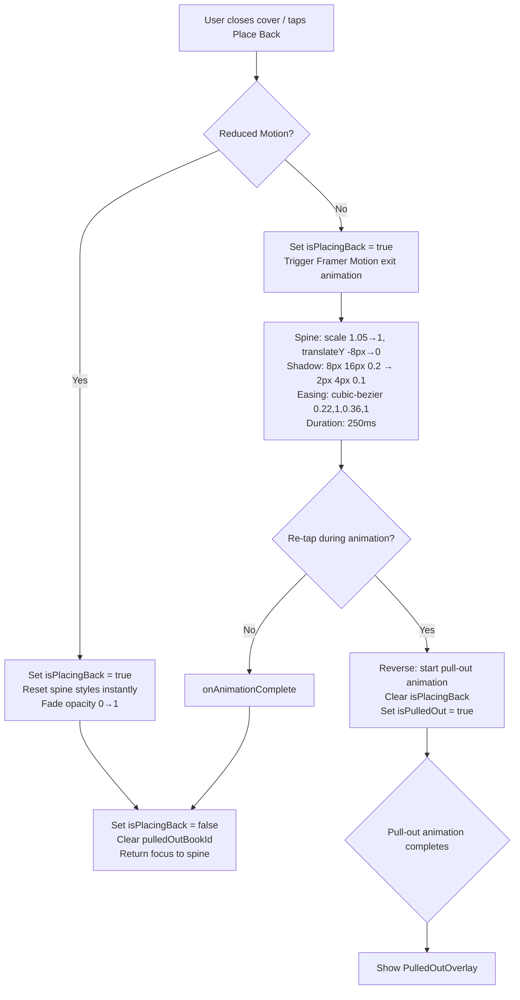
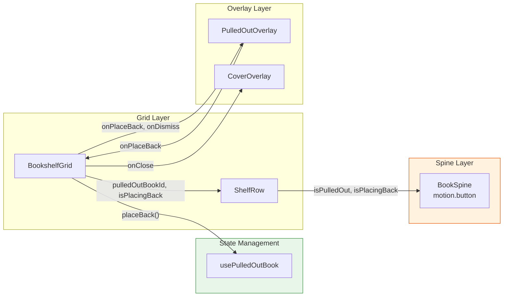

# STORY-042 Technical Analysis: Place-Back Animation

**Epic**: EPIC-007  
**Persona**: Julia — The Young Author  
**Priority**: Should Have | **Story Points**: 3  
**Dependencies**: STORY-039 (Animation Engine), STORY-040 (Pull-Out Animation), STORY-013 (Place-Back)  
**Stack Reference**: `docs/architecture/TECH-STACK.md` — Node.js 22 + Express 4 + MongoDB 7 + React 18 + Vite 5 + Framer Motion 11 + Tailwind 3  

---

## 1. Current State Analysis

### 1.1 Animation Engine (STORY-039) — NOT YET IMPLEMENTED

The animation engine directory `frontend/src/lib/animation-engine/` is **empty**. STORY-039 has not been delivered. All 20+ components use Framer Motion directly with ad-hoc inline patterns — no centralized facade exists.

**Implication**: STORY-042 cannot "integrate with the STORY-039 engine" because it doesn't exist yet. This plan assumes either:
- (a) STORY-039 is completed before STORY-042 starts, OR
- (b) STORY-042 implements place-back animation using Framer Motion directly, with a refactoring note to migrate to the engine later when STORY-039 lands.

**Recommendation**: Option (b) — implement with Framer Motion patterns consistent with STORY-039's planned API (`animate(element, { from, to, duration, easing, onComplete, interruptible: true })`), making the future refactor trivial.

### 1.2 Pull-Out Animation (STORY-040) — PARTIALLY IMPLEMENTED

No dedicated STORY-040 implementation exists. The current "pull-out" behavior lives in STORY-013's code:

| File | Current Pull-Out Values | STORY-040 Spec Values | Delta |
|------|------------------------|----------------------|-------|
| `BookSpine.jsx:21` | `translateY(-4px) scale(1.05)` | `translateY(-8px) scale(1.05)` | **-4px → -8px** |
| `PulledOutOverlay.jsx:6` | `EASE_OUT = [0.25,0.1,0.25,1]` | `cubic-bezier(0.34,1.56,0.64,1)` | **Different easing** |
| `BookSpine.jsx:24` | `duration: 300ms` | `250ms` | **300→250** |
| `BookSpine.jsx:21` | `box-shadow: 0 20px 25px -5px rgba(0,0,0,0.2)` | `0 8px 16px rgba(0,0,0,0.2)` | **Different shadow** |

**Implication**: STORY-040 values need to be corrected as part of or before STORY-042, since place-back is the *reverse* of pull-out.

### 1.3 Existing Place-Back (STORY-013) — FULLY FUNCTIONAL

The current place-back implementation uses timeout-based state management:

| Component | Current Behavior | STORY-042 Target |
|-----------|------------------|-----------------|
| `usePulledOutBook.js:19-25` | `placeBack()` → sets `isPlacingBack=true` → setTimeout(300ms) → clears state | Replace timeout with Framer Motion `onAnimationComplete` |
| `BookSpine.jsx:25-27` | CSS `settleTransition`: `transform 300ms cubic-bezier(0.25,0.1,0.25,1), box-shadow 300ms...` | `transform 250ms cubic-bezier(0.22,1,0.36,1), box-shadow 250ms...` |
| `BookSpine.jsx:20-22` | Pulled-out style: `translateY(-4px) scale(1.05)`, shadow `0 20px 25px -5px` | Should match STORY-040 spec: `translateY(-8px) scale(1.05)`, shadow `0 8px 16px` |
| `ShelfRow.jsx:30-34` | Shelf shadow: `hasPlacingBack` triggers `shadow-lg` on shelf row | Keep — provides shelf dimming during place-back |

### 1.4 Reduced Motion — PERVASIVE

`useReducedMotion()` from Framer Motion is used in 15+ components. Pattern:
- `const duration = prefersReducedMotion ? 0 : 0.3;`
- CSS `@media (prefers-reduced-motion: reduce)` in `index.css:43-47` and `cover.css:520-538`
- `BookSpine.jsx:15` already calls `useReducedMotion()`

### 1.5 Book Spine Component

- `<motion.button>` with `layout` prop, `layoutId={book._id}` via `ShelfRow.jsx:15`
- Grid: CSS `auto-fill, minmax(var(--shelf-col-min), 1fr)`
- State tracked by `isPulledOut` boolean prop (`pulledOutBookId === book._id`)
- Focus management: `spineRefs.current[pulledOutBookId]` stored in `BookshelfGrid.jsx:39`

### 1.6 Cover Overlay — DOES NOT Trigger Place-Back

- `CoverOverlay.jsx:23-25`: `onClose` → `handleCloseCover()` → only closes overlay, does NOT call `placeBack()`
- `BookshelfGrid.jsx:62-64`: `handleCloseCover` → `setCoverOverlayOpen(false)` — no placeBack
- `BookshelfGrid.jsx:66-69`: `handlePlaceBack` → `setCoverOverlayOpen(false)` + `placeBack()`

**This matches STORY-013 AC4**: "the overlay is closed, do not auto-trigger place-back."

### 1.7 Framer Motion Usage

- Version: 11.18.2
- 20+ components use `<motion.*>` + `AnimatePresence` + variants
- No `LazyMotion` tree-shaking — full bundle loaded
- Pattern: inline transitions, no centralized animation registry

---

## 2. Gap Analysis: Current → Target

| Area | Current | Target (STORY-042) | Gap Size |
|------|---------|-------------------|----------|
| Place-back easing | `cubic-bezier(0.25,0.1,0.25,1)` | `cubic-bezier(0.22,1,0.36,1)` with settle bounce | Medium — new easing + bounce |
| Place-back duration | 300ms | 250ms | Small |
| Place-back state mgmt | `setTimeout` hack | Framer Motion `onAnimationComplete` | Medium — architectural change |
| Pull-out transform | `translateY(-4px)` | `translateY(-8px)` (STORY-040 spec) | Small — but STORY-040 scope |
| Shadow target | `0 20px 25px -5px` | `0 8px 16px rgba(0,0,0,0.2)` → `0 2px 4px rgba(0,0,0,0.1)` | Small |
| Re-tap interruptibility | `toggle()` clears timeout | Framer Motion `AnimatePresence` + exit before animate | Medium |
| Reduced motion | `duration: 0` | Instant + fade (opacity transition 0ms) | Tiny — already close |
| Story-039 engine integration | N/A | Future refactor | Deferred |

---

## 3. Architecture & Flow

### 3.1 Place-Back Animation Flow

### 3.2 Component Interaction Diagram

---

## 4. NFR Analysis

| NFR | Requirement | Current Status | STORY-042 Impact |
|-----|-------------|----------------|-----------------|
| NFR-PERF-04 | 60fps during animation | CSS transitions on `transform` + `box-shadow` (compositor-only for transform, paint for shadow) | **Risk**: `box-shadow` triggers paint on every frame. **Mitigation**: Use `filter: drop-shadow()` or pseudo-element for shadow to keep on compositor. Or accept minor paint cost since place-back is 250ms and single element. |
| NFR-ACC-05 | Reduced motion: instant + fade | `duration: 0` already works | STORY-042 AC2 adds "fade" — add opacity transition for reduced-motion case |

### Performance Consideration: box-shadow vs filter:drop-shadow

`box-shadow` requires paint on every frame. For a single element over 250ms, this is acceptable. If 60fps drops on low-end devices, refactor to `filter: drop-shadow()` which is compositor-friendly. **Recommendation**: Keep `box-shadow` for now (matches existing pull-out); add performance TODO.

---

## 5. Persona Impact

**Julia — The Young Author**: Place-back is the "closing" gesture in the book interaction cycle. The settle bounce provides tactile satisfaction — the book "finds its home." This is especially important for Julia because:
- Young users expect responsive, playful feedback
- The bounce reinforces the spatial mental model of a physical shelf
- Re-tap interruptibility prevents accidental "trapped" states

---

## 6. Impacted Components & Files

| File | Change Type | Description |
|------|-------------|-------------|
| `frontend/src/hooks/usePulledOutBook.js` | **Refactor** | Replace `setTimeout` with `onAnimationComplete` callback; add re-tap interruptibility state; change duration 300→250ms |
| `frontend/src/components/shelf/BookSpine.jsx` | **Modify** | Update pulled-out transform `-4px→-8px`; update settle easing/duration; add Framer Motion animate/exit variants for place-back; add bounce settle |
| `frontend/src/components/shelf/BookshelfGrid.jsx` | **Modify** | Wire up `onAnimationComplete`; pass place-back animation state; handle re-tap during place-back |
| `frontend/src/components/shelf/ShelfRow.jsx` | **Minor** | May need to pass `isPlacingBack` animation props differently |
| `frontend/src/components/shelf/PulledOutOverlay.jsx` | **No change** | Already triggers `onPlaceBack` correctly |
| `frontend/src/__tests__/usePulledOutBook.test.js` | **Update** | Update duration expectations (300→250ms); add re-tap interruptibility tests |
| `frontend/src/__tests__/BookSpine.test.jsx` | **Update** | Update settle transition duration/easing expectations; add place-back animation tests |
| `frontend/src/__tests__/BookSpineReducedMotion.test.jsx` | **Update** | Add fade transition test for reduced-motion place-back |

---

## 7. Risk Assessment

| Risk | Likelihood | Impact | Mitigation |
|------|-----------|--------|------------|
| STORY-039 not delivered before STORY-042 | High | Low | Implement with Framer Motion directly; add TODO markers for engine migration |
| Pull-out transform mismatch (STORY-040 values) | High | Medium | Fix pull-out values as part of STORY-042 (tight coupling); or file separate PR |
| `box-shadow` paint causing frame drops | Low | Low | Single element, 250ms; fallback to `filter: drop-shadow` if needed |
| `setTimeout` → `onAnimationComplete` migration breaks focus management | Medium | High | Ensure `onAnimationComplete` fires before focus reset; test keyboard focus path |
| Re-tap during place-back causes visual glitch | Medium | Medium | Use `AnimatePresence` with `mode="wait"` or custom interrupt via `useAnimation()` controls |

---

## 8. Recommendations

1. **Fix pull-out values first** — STORY-040's transform values (`-8px`, shadow `0 8px 16px 0.2`) are the *source* for place-back's reverse. Without correct pull-out, place-back can't be correct. Bundle as Task 0.

2. **Convert `setTimeout` → Framer Motion animation lifecycle** — The timeout hack is fragile. Use `useAnimation()` controls or `onAnimationComplete` callback. This makes re-tap interruptibility natural (Framer Motion handles mid-animation state changes).

3. **Add settle bounce via keyframes or spring** — The `cubic-bezier(0.22,1,0.36,1)` provides slight overshoot but may not be "bouncy" enough. Consider a two-phase animation: 250ms ease-out + 50ms spring bounce. Test with Julia persona.

4. **Keep reduced-motion pattern consistent** — `useReducedMotion() ? 0 : 250` for duration; add opacity fade for AC2 compliance.

5. **Document STORY-039 migration path** — Add `// TODO: STORY-039` comments where the animation engine API would replace Framer Motion inline calls.