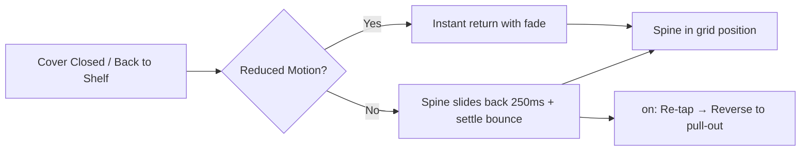

# STORY-042: Place-Back Animation

**Epic**: EPIC-007
**Persona**: Julia — The Young Author
**Priority**: Should Have
**Story Points**: 3
**Dependencies**: STORY-039 (Animation Engine), STORY-040 (Pull-Out Animation), STORY-013 (Place-Back)

## User Story
As a young author, I want to see my book slide smoothly back into the shelf when I close the cover, so that it feels like I'm placing a real book back carefully.

## Description
Implement the place-back animation: the reverse of pull-out (STORY-040). When Julia closes the cover overlay or finishes reading, the spine slides back into its grid position with a subtle bounce/settle at the end. Duration: 250ms. Must integrate with existing STORY-013 "Place-Back" functionality, replacing inline animations with the STORY-039 engine.

## Context
Place-back completes the tactile book interaction cycle: tap-to-pull → read → place-back. The bounce at the end provides a satisfying "settling" feel — the book finds its home. This story is lower-complexity than pull-out because it's essentially the reverse animation with a slightly different easing.

## Acceptance Criteria (Verifiable)
- [ ] GIVEN a book spine is in the "pulled out" position (cover overlay visible)
      WHEN Julia closes the cover or navigates back to shelf
      THEN the spine animates back to its grid position over 250ms with a subtle bounce at the end
- [ ] GIVEN reduced motion is active
      WHEN Julia closes the cover
      THEN the spine appears back in its grid position instantly with a fade
- [ ] GIVEN Julia rapidly re-taps the same spine during the place-back animation
      WHEN the tap is registered
      THEN the place-back reverses and the pull-out animation begins again
- [ ] GIVEN the place-back animation completes
      WHEN the spine returns to position
      THEN other books on the shelf do not shift or react (no layout recalculation)

## NFRs
- NFR-PERF-04: 60fps during place-back
- NFR-ACC-05: Reduced motion: instant + fade

## Definition of Done (DoD)
- [ ] Code reviewed by CodeReviewer
- [ ] Tests with coverage >= 90%
- [ ] Integration tests passing
- [ ] QA approved by QAAnalyst
- [ ] Documentation updated
- [ ] PR created by MergeRequestCreator

## Technical Notes
- Reverse of STORY-040: `transform: scale(1) translateY(0)` from `scale(1.05) translateY(-8px)`
- Shadow: `box-shadow` transitions from `0 8px 16px rgba(0,0,0,0.2)` to `0 2px 4px rgba(0,0,0,0.1)`
- Easing: `cubic-bezier(0.22, 1, 0.36, 1)` (ease-out with very slight overshoot at end for "settle" feel)
- Use STORY-039 engine's interruptibility for rapid re-tap handling
- If STORY-013 already has a place-back implementation, refactor to use STORY-039 engine

## User Flow

## Test Scenarios
- Scenario 1: Close cover → spine slides back with settle bounce in ~250ms
- Scenario 2: Rapid re-tap during place-back → reverses to pull-out cleanly
- Scenario 3: Reduced motion → instant return
- Scenario 4: Neighboring books unaffected by place-back
