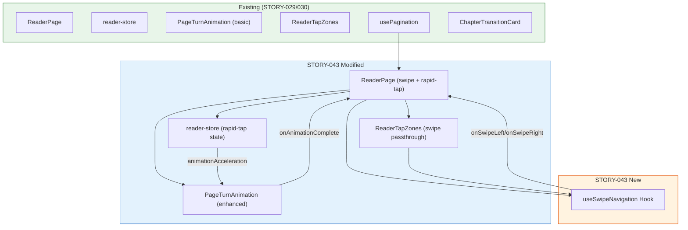
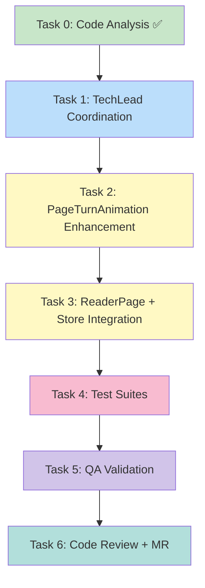

# STORY-043: Page-Turn Animation — Technical Analysis

**Epic**: EPIC-007  
**Persona**: Julia — The Young Author  
**Priority**: Should Have | **Story Points**: 3  
**Dependencies**: STORY-039 (Animation Engine), STORY-029 (Reader UI), STORY-030 (Paginated Reading)  
**Stack Source**: `docs/architecture/TECH-STACK.md`

---

## Language & Framework Detection

| Indicator | Detected | Language/Framework |
|-----------|----------|-------------------|
| `package.json`, `vite.config.*` | ✅ | **Node.js** |
| `react` in deps, `.jsx` files | ✅ | **React 18** |
| `tailwindcss` in deps | ✅ | **Tailwind CSS** |
| `framer-motion` in deps | ✅ | **Framer Motion** |
| `zustand` in deps | ✅ | **Zustand** |

**Frontend Framework**: React → **FrontendDeveloperReact**  
**Backend**: Node.js/Express → **BackendDeveloper**  
**Integration Pattern**: React SPA → Express API proxy (Vite dev proxy → nginx in prod)

---

## Existing Codebase Analysis

### Delivered Assets from Dependencies

| Component | File | What It Provides | STORY-043 Impact |
|-----------|------|------------------|------------------|
| PageTurnAnimation | `frontend/src/components/reader/PageTurnAnimation.jsx` | Basic AnimatePresence slide wrapper (64 lines) | **MAJOR REFACTOR** — add cross-fade, rapid-tap handling, duration tuning, reduced-motion fade |
| ReaderPage | `frontend/src/app/reader/ReaderPage.jsx` | Full paginated reader with page nav, animation integration (890 lines) | **MODIFY** — wire swipe detection, rapid-tap skip logic, animation lock refinement |
| ReaderTapZones | `frontend/src/components/reader/ReaderTapZones.jsx` | 30/40/30 tap zones for page nav (62 lines) | **MODIFY** — add swipe gesture detection, integrate with animation lock |
| usePagination | `frontend/src/hooks/usePagination.js` | Page state management, chapter boundary signals (124 lines) | **MINOR** — add rapid-tap queue/skip support |
| reader-store | `frontend/src/stores/reader-store.js` | Page index, animation lock, page navigation (136 lines) | **EXTEND** — add `pendingPageNav` queue or animation-acceleration logic |
| ChapterTransitionCard | `frontend/src/components/reader/ChapterTransitionCard.jsx` | Chapter boundary overlay | **NO CHANGE** |
| useFullscreen | `frontend/src/hooks/useFullscreen.js` | Fullscreen API | **NO CHANGE** |
| ReaderSettings | `frontend/src/components/reader/ReaderSettings.jsx` | Font/theme settings | **NO CHANGE** |

### Story-039 Dependency: Animation Engine

STORY-039 defined an animation engine API:
```ts
animate(element, { from, to, duration, easing, onComplete, interruptible: true })
stagger(elements, { perElement, ...options })
```

**Status of STORY-039 implementation**: No `frontend/src/lib/animation*` files found. The animation engine from STORY-039 has **NOT been implemented as a separate library**. Instead, all animation logic is currently **inline within PageTurnAnimation.jsx** using Framer Motion directly.

**Decision**: STORY-043 will enhance `PageTurnAnimation.jsx` directly (matching current pattern) rather than building a separate animation engine facade. If STORY-039 engine is built later, PageTurnAnimation can be refactored to use it.

---

## Gap Analysis: What STORY-043 Must Add

| Feature | Current State | Required Change |
|---------|---------------|-----------------|
| Slide direction (next/prev) | ✅ Working — `direction` prop drives translateX(±100%) | **KEEP** — matches AC1/AC2 |
| Slide duration 250ms | ⚠️ Current: 300ms | **CHANGE** → 250ms per story spec |
| Opacity cross-fade | ❌ Current: opacity stays at 1 (no fade) | **ADD** — outgoing fade 1→0, incoming fade 0→1 |
| Easing curve | ⚠️ Current: `[0.25, 0.1, 0.25, 1]` | **CHANGE** → `cubic-bezier(0.4, 0, 0.2, 1)` per spec |
| Reduced motion: instant + fade | ⚠️ Current: instant swap, NO fade | **ADD** — instant position change + short opacity fade (~150ms) |
| Rapid tap handling | ❌ Current: `isPageAnimating` blocks ALL taps | **REFACTOR** — accelerate current animation to 100ms, then process next |
| Touch swipe detection | ❌ Not implemented | **ADD** — pointer events with 50px horizontal threshold |
| Keyboard triggers same animation | ✅ ArrowLeft/Right wired in ReaderPage | **VERIFY** — ensure animation triggers, not instant page change |

---

## Technical Task Breakdown

### Task 0: Code Analysis ✅ (completed above)

### Task 1: TechLead Coordination
- **Agent**: TechLead
- **Dependencies**: None
- **Output**: Orchestrate Tasks 2-6

### Task 2: Frontend — PageTurnAnimation Enhancement
- **Agent**: FrontendDeveloperReact
- **Dependencies**: None
- **Files to modify**:
  - `frontend/src/components/reader/PageTurnAnimation.jsx` — Add opacity cross-fade, tune duration/easing, add reduced-motion fade, add rapid-tap acceleration support
- **Files to create**:
  - `frontend/src/hooks/useSwipeNavigation.js` — Touch swipe detection hook (pointer events, 50px threshold, direction callback)

### Task 3: Frontend — ReaderPage + Store Integration
- **Agent**: FrontendDeveloperReact
- **Dependencies**: Task 2 complete (PageTurnAnimation API finalized)
- **Files to modify**:
  - `frontend/src/app/reader/ReaderPage.jsx` — Integrate useSwipeNavigation, wire rapid-tap skip logic, refactor animation lock from blocking to acceleration
  - `frontend/src/stores/reader-store.js` — Add `animationAcceleration` state or `pendingPageTarget` for rapid-tap handling
  - `frontend/src/components/reader/ReaderTapZones.jsx` — Add swipe event passthrough to useSwipeNavigation

### Task 4: Test Suites
- **Agent**: TestEngineer
- **Dependencies**: Task 3 complete
- **Scope**:
  - Unit tests for PageTurnAnimation (variants, reduced-motion path, cross-fade logic)
  - Unit tests for useSwipeNavigation (threshold, direction detection, edge cases)
  - Unit tests for reader-store rapid-tap state
  - Integration tests: rapid 3x tap lands on correct page
  - Accessibility tests: reduced motion → instant+fade, keyboard triggers animation
  - Performance: animation at 60fps (Framer Motion mocked + will-change verification)

### Task 5: QA Validation
- **Agent**: QAAnalyst
- **Dependencies**: Task 4 complete
- **Scope**: Verify all 5 acceptance criteria against implementation

### Task 6: Code Review + Merge Request
- **Agent**: CodeReviewer → MergeRequestCreator
- **Dependencies**: Task 5 complete

---

## Architecture Diagram



## Execution Flow



---

## Detailed Implementation Plan

### 2.1 PageTurnAnimation Enhancement

**Current** (64 lines) — basic AnimatePresence slide with fixed 300ms, opacity=1, blocking `isEnabled` flag.

**Required changes**:

1. **Duration**: 300ms → 250ms
2. **Easing**: `[0.25, 0.1, 0.25, 1]` → `[0.4, 0, 0.2, 1]` (Material ease-out per spec)
3. **Opacity cross-fade**:
   - `initial`: `{ x: direction > 0 ? '100%' : '-100%', opacity: 0 }`
   - `animate`: `{ x: 0, opacity: 1 }`
   - `exit`: `{ x: direction > 0 ? '-100%' : '100%', opacity: 0 }`
4. **Reduced-motion path**: Instead of rendering without animation, render with a **short fade** (~150ms) and instant position swap:
   - `initial`: `{ opacity: 0 }`
   - `animate`: `{ opacity: 1 }`
   - `exit`: `{ opacity: 0 }`
   - `transition`: `{ duration: 0.15 }`
5. **Rapid-tap acceleration prop**: Accept `accelerateDuration` (default: null). When set, use this instead of default 250ms for the current transition. Consumer sets it to ~100ms when a tap arrives mid-flight.

**API change**:
```jsx
<PageTurnAnimation
  direction={pageDirection}      // 1 or -1
  pageKey={pageKey}              // unique key for AnimatePresence
  onAnimationComplete={handleAnimationComplete}
  isEnabled={true}               // always enabled now (reduced-motion uses fade)
  accelerateDuration={null}     // 100ms when rapid tap detected
/>
```

### 2.2 useSwipeNavigation Hook

New hook for touch swipe detection:

```
Input: ref to scrollable container, minThreshold (default 50px)
Output: { onSwipeLeft, onSwipeRight } callbacks
```

**Implementation**:
1. Attach `pointerdown`, `pointermove`, `pointerup` to container
2. On `pointerdown`: record `startX`, `startY`
3. On `pointermove`: track `deltaX = currentX - startX`. If `|deltaX| > |deltaY|` (horizontal swipe), prevent default scroll
4. On `pointerup`: if `|deltaX| >= threshold` (50px), fire `onSwipeLeft` (ΔX < -50) or `onSwipeRight` (ΔX > 50)
5. Ignore vertical swipes (`|deltaY| > |deltaX| * 1.5`)
6. Use `touch-action: pan-y` on container to allow vertical scroll but capture horizontal

**Touch event strategy**: Use pointer events (unified mouse+touch+pen). Single API, better browser support.

### 2.3 ReaderPage — Rapid Tap Handling

**Current behavior**: `isPageAnimating` flag blocks ALL navigation during animation → taps during animation are silently dropped.

**New behavior** (per AC4): "Accelerate current to completion (reduce remaining duration to 100ms) then start next."

**Implementation**:
1. Replace boolean `isPageAnimating` block with a **state machine**:
   - `idle` — no animation in flight
   - `animating` — animation in flight, normal duration
   - `accelerating` — animation in flight, reduced to 100ms
2. When a tap arrives while `animating`:
   - Set `animationAcceleration = true` in store
   - PageTurnAnimation reads this prop → uses `duration: 100ms` for remaining transition
   - On `onAnimationComplete` → process the queued navigation
3. Only queue ONE pending navigation (discard intermediate):
   - 3 rapid taps: animating page 1→2, tap2 sets `pendingTarget = 3`, tap3 updates `pendingTarget = 4`
   - When 1→2 animation completes: immediately navigate to page 4 with normal 250ms

**Store changes** (reader-store.js):
```js
// New state
pendingPageDirection: null,  // null | 1 | -1 — queued page direction from rapid tap
animationAcceleration: false, // true when current animation should accelerate

// New actions
setPendingPageDirection: (dir) => set({ pendingPageDirection: dir }),
setAnimationAcceleration: (val) => set({ animationAcceleration: val }),
clearPendingNavigation: () => set({ pendingPageDirection: null, animationAcceleration: false }),
```

**ReaderPage navigation handler update**:
```js
const handleNextPage = useCallback(() => {
  const { isPageAnimating, animationAcceleration, pendingPageDirection } = get();
  
  if (isPageAnimating && !animationAcceleration) {
    // Mid-flight, first interrupt → accelerate current, queue this one
    setAnimationAcceleration(true);
    setPendingPageDirection(1);
    return;
  }
  
  if (isPageAnimating && animationAcceleration) {
    // Already accelerating → update queued target (discard intermediate)
    setPendingPageDirection(1);
    return;
  }
  
  // Normal navigation
  setPageDirection(1);
  nextPage();
}, [...]);

// Animation complete handler
const handleAnimationComplete = useCallback(() => {
  setIsPageAnimating(false);
  setAnimationAcceleration(false);
  
  const pending = get().pendingPageDirection;
  if (pending === 1) {
    clearPendingNavigation();
    handleNextPage();
  } else if (pending === -1) {
    clearPendingNavigation();
    handlePreviousPage();
  } else {
    clearPendingNavigation();
  }
}, [...]);
```

### 2.4 ReaderTapZones — Swipe Integration

**Current**: Three `<button>` elements with `onClick` handlers only.  
**New**: Wrap in a container that also listens for swipe gestures.

```jsx
<div ref={containerRef} className="reader-tap-zones ...">
  <button ... onClick={handleLeftTap} />
  <button ... onClick={handleCenterTap} />
  <button ... onClick={handleRightTap} />
</div>
```

- Ref forwarded from ReaderPage via `useSwipeNavigation`
- Or: ReaderPage renders `useSwipeNavigation` on its own container ref, and tap zones pass through swipe events naturally

**Chosen approach**: Attach `useSwipeNavigation` to the outer content container in ReaderPage (not inside TapZones). This avoids event conflicts — pointer events on the content container capture swipes, while tap zones handle discrete click events. Both can coexist because:
- Swipe = pointer held + move > 50px
- Tap = pointer down + up without significant move

### 2.5 Reduced-Motion: Instant + Fade

**Current**: `if (prefersReducedMotion) return <div>{children}</div>` — instant swap, zero fade.

**New**: Reduced-motion users get a subtle fade transition (no slide motion):
```jsx
if (prefersReducedMotion) {
  return (
    <AnimatePresence mode="wait" onExitComplete={onAnimationComplete}>
      <motion.div
        key={pageKey}
        initial={{ opacity: 0 }}
        animate={{ opacity: 1 }}
        exit={{ opacity: 0 }}
        transition={{ duration: 0.15 }}
      >
        {children}
      </motion.div>
    </AnimatePresence>
  );
}
```

This matches AC3: "pages swap instantly with a fade (no slide or curl motion)."

---

## NFR Analysis

| NFR | Requirement | Implementation Strategy | Verification |
|-----|-------------|------------------------|--------------|
| NFR-PERF-04 | 60fps during page-turn | GPU-composited transforms only (`will-change: transform` on animate container); `translateX` + `opacity` are composited properties; no layout/paint triggers | Chrome DevTools Performance panel — check for layout shifts, confirm compositing |
| NFR-ACC-02 | Keyboard triggers same animation | ArrowRight/ArrowLeft already wired to `handleNextPage`/`handlePreviousPage` which trigger animation; verify animation fires (not instant) | Manual test: press ArrowRight → observe slide animation |
| NFR-ACC-05 | Reduced motion: instant + fade | `useReducedMotion()` from Framer Motion; separate AnimatePresence path with `duration: 0.15`, opacity-only animation | `matchMedia('(prefers-reduced-motion: reduce)')` test |

---

## Persona Impact

**Julia — The Young Author**: Page-turn animation is the "micro-delight" — it provides continuity between pages and reduces cognitive jarring during reading. The slide animation creates the sensation of turning real book pages. Rapid-tap handling prevents frustration when Julia eagerly clicks through pages. Reduced-motion respect ensures accessibility for all young readers.

---

## Impacted Files

| File | Action | Description |
|------|--------|-------------|
| `frontend/src/components/reader/PageTurnAnimation.jsx` | **MODIFY** | Add opacity cross-fade, tune duration 250ms + easing, reduced-motion fade path, acceleration prop |
| `frontend/src/app/reader/ReaderPage.jsx` | **MODIFY** | Integrate useSwipeNavigation, rapid-tap skip logic, refactor animation lock from blocking to acceleration |
| `frontend/src/stores/reader-store.js` | **MODIFY** | Add `pendingPageDirection`, `animationAcceleration` state + actions |
| `frontend/src/components/reader/ReaderTapZones.jsx` | **MODIFY** | Minor: ensure swipe events pass through tap zone layer |
| `frontend/src/hooks/useSwipeNavigation.js` | **CREATE** | Touch/pointer swipe detection hook (50px threshold, directional callbacks) |

---

## Risk Assessment

| Risk | Likelihood | Impact | Mitigation |
|------|-----------|--------|------------|
| Swipe conflicts with tap zones on mobile | Medium | High | Use pointer events (not touch); distinguish swipe (>50px move) vs tap (<10px move); `touch-action: pan-y` on container |
| Rapid-tap animation acceleration causes visual jank | Medium | Medium | Accelerate to 100ms (not 0ms — too jarring); Framer Motion AnimatePresence `mode="wait"` handles cleanup |
| Swipe on iOS Safari has rubber-banding | High | Medium | `overscroll-behavior: contain` + `touch-action: pan-y` + `preventDefault()` on horizontal moves |
| Reduced-motion fade still feels "animated" | Low | Low | 150ms is near-instant; matches WCAG guidance (brief, non-motion transition) |
| PageTurnAnimation refactoring breaks existing paginated mode | Low | High | Existing `direction`/`pageKey`/`isEnabled` API preserved; new props are additive; comprehensive test coverage |

---

## SubAgent Assignments

| Task | Description | Agent |
|------|-------------|-------|
| 0 | Code analysis | CodeAnalyzer ✅ (done above) |
| 1 | Coordination | TechLead |
| 2 | PageTurnAnimation + useSwipeNavigation | FrontendDeveloperReact |
| 3 | ReaderPage + Store integration | FrontendDeveloperReact |
| 4 | Test suites | TestEngineer |
| 5 | QA validation | QAAnalyst |
| 6 | Code review + MR | CodeReviewer → MergeRequestCreator |

---

## Execution Summary

- **Frontend-only story** — No backend changes
- **2 new/modified components**: PageTurnAnimation enhancement + useSwipeNavigation hook
- **3 modified files**: ReaderPage, reader-store, ReaderTapZones
- **Key complexity**: Rapid-tap acceleration logic (state machine replacing boolean lock)
- **Estimated effort**: 3 story points → ~2-3 days (animation tuning + swipe + rapid-tap + tests)