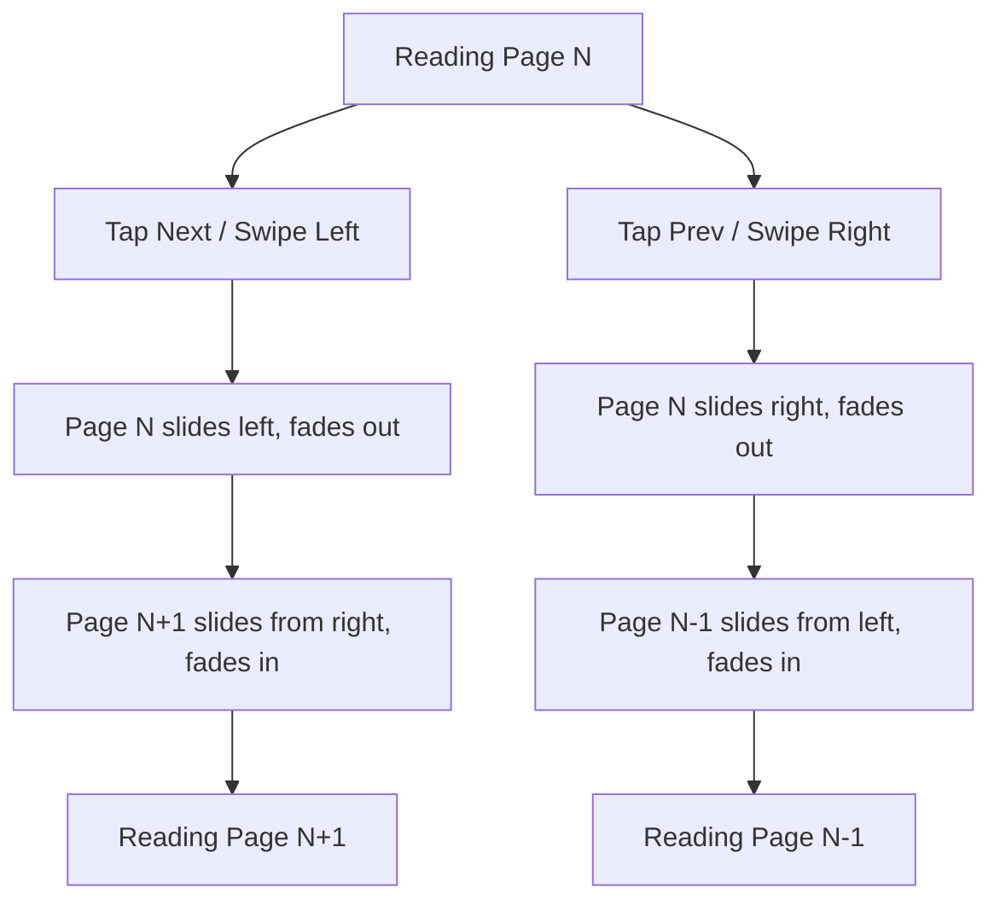

# STORY-043: Page-Turn Animation

**Epic**: EPIC-007
**Persona**: Julia — The Young Author
**Priority**: Should Have
**Story Points**: 3
**Dependencies**: STORY-039 (Animation Engine), STORY-029 (Reader UI), STORY-030 (Paginated Reading)

## User Story
As a young author, I want pages to slide or curl when I turn them in the reader, so that reading my book feels like turning pages in a real book.

## Description
Implement a page-turn animation in the reader (STORY-029) for the paginated reading mode (STORY-030). When Julia navigates to the next or previous page, the content slides horizontally (left-to-right for "back," right-to-left for "forward") or performs a subtle page-curl transition. Duration: 200-300ms. Must respect reduced motion. Must work with touch swipe and keyboard navigation.

## Context
Page-turn animation is the "micro-delight" of the reading experience — it provides continuity between pages and reduces cognitive jarring. The slide approach is simpler and more performant than a full 3D page curl; the curl variant can be an enhancement if performance allows.

## Acceptance Criteria (Verifiable)
- [ ] GIVEN Julia is reading a book in paginated mode (STORY-030)
      WHEN she taps the "next page" arrow or swipes left
      THEN the current page slides out to the left and the next page slides in from the right over 250ms
- [ ] GIVEN Julia taps "previous page" or swipes right
      WHEN the navigation triggers
      THEN the current page slides out to the right and the previous page slides in from the left over 250ms
- [ ] GIVEN reduced motion is active
      WHEN Julia navigates pages
      THEN pages swap instantly with a fade (no slide or curl motion)
- [ ] GIVEN Julia rapidly taps "next page" 3 times
      WHEN the third tap fires
      THEN the animation completes for the first tap, then skips to the third page (or queues efficiently — no 3x animation stack)
- [ ] GIVEN Julia uses the keyboard (ArrowRight / ArrowLeft)
      WHEN the key is pressed
      THEN the same slide animation triggers as touch/swipe

## NFRs
- NFR-PERF-04: 60fps during page-turn with text content rendered
- NFR-ACC-02: Keyboard navigation triggers same animation
- NFR-ACC-05: Reduced motion: instant + fade

## Definition of Done (DoD)
- [ ] Code reviewed by CodeReviewer
- [ ] Tests with coverage >= 90%
- [ ] Integration tests passing
- [ ] QA approved by QAAnalyst
- [ ] Documentation updated
- [ ] PR created by MergeRequestCreator

## Technical Notes
- Slide animation: `transform: translateX(±100%)` with opacity cross-fade (0 → 1 incoming, 1 → 0 outgoing)
- Easing: `cubic-bezier(0.4, 0, 0.2, 1)` for smooth deceleration
- Rapid tap handling: if page transition is mid-flight and another is triggered, accelerate current to completion (reduce remaining duration to 100ms) then start next
- Touch support: use pointer events or touch events for swipe detection (min threshold: 50px horizontal)
- Use STORY-039 engine for timing control
- For STORY-031 (Continuous Scroll), no page-turn animation — scroll is its own animation

## User Flow

## Test Scenarios
- Scenario 1: Tap "next" — page slides left, new page appears in ~250ms
- Scenario 2: Swipe right on mobile — page slides right, previous page appears
- Scenario 3: Rapid 3x tap "next" — no animation stacking, lands on correct page
- Scenario 4: Reduced motion — instant swap with fade
- Scenario 5: Arrow keys trigger same animation as touch
