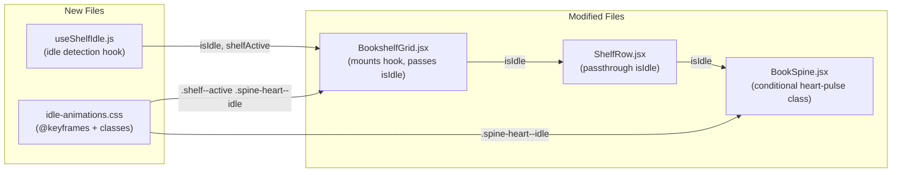
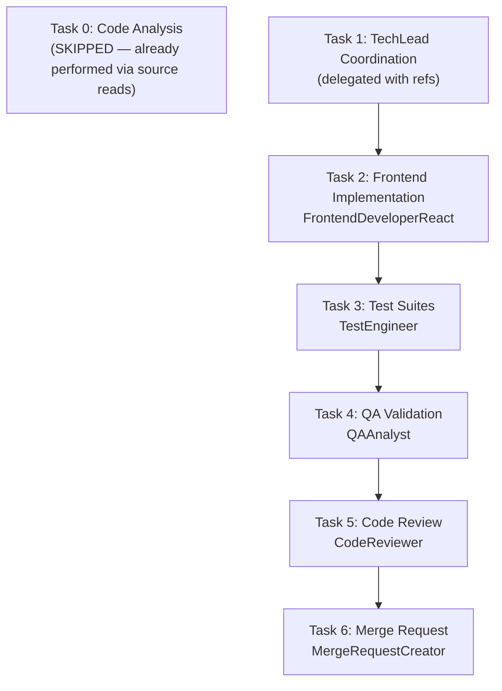

# STORY-044: Idle Micro-Animations — Technical Plan

**Parent Epic**: EPIC-007  
**Persona**: Julia — The Young Author  
**Stack Source**: `docs/architecture/TECH-STACK.md`

---

## Task Analysis

- **Project**: Contopia "Estante Digital" — React 18 SPA, Node.js 22 backend, Framer Motion animations, Tailwind CSS, Zustand state, Vite build
- **Stack**: Node.js 22 / Express 4 / MongoDB 7 / React 18 / Framer Motion / Tailwind CSS 3 / Vite 5 / Vitest
- **Code analysis**: Performed via source reads. No formal CodeAnalyzer delegation needed — scope is frontend-only, purely additive CSS/hook work touching 3 existing components + 1 new hook

---

## Language Detection

| Indicator | Language |
|-----------|----------|
| `package.json`, `vite.config.*`, `.jsx` files | **Node.js** (frontend SPA) |

## Frontend Framework Detection

| Indicator | Framework |
|-----------|-----------|
| `react` in deps, `.jsx` files, `framer-motion` in deps | **React** — FrontendDeveloperReact |

## Frontend-Backend Integration

| Backend | Pattern |
|---------|---------|
| **Node.js** SPA mode | Vite dev proxy → Express. No backend changes in this story. Pure frontend CSS + React hook work. |

---

## Story Summary

Add subtle idle micro-animations to the bookshelf: favorite books show a gentle heart-pulse glow when the shelf is idle (3s no interaction), pause on tab backgrounding and reduced motion, fade out on interaction within 200ms. Must maintain 60fps with 50 books / 10 favorited.

---

## Impacted Components & Files

| File | Change Type | Description |
|------|-------------|-------------|
| `frontend/src/hooks/useShelfIdle.js` | **NEW** | Core idle-detection hook: 3s debounce, `visibilitychange`, `prefers-reduced-motion`, pointer/keyboard activity listeners, returns `{ isIdle, isActive }` |
| `frontend/src/components/shelf/BookSpine.jsx` | **MODIFY** | Add heart-pulse CSS class conditionally when `isIdle && book.isFavorited`; add `animation-delay` inline style for organic stagger |
| `frontend/src/components/shelf/BookshelfGrid.jsx` | **MODIFY** | Mount `useShelfIdle`, pass `isIdle`/`idleActive` down to ShelfRow → BookSpine; add `shelf--active` class on interaction |
| `frontend/src/components/shelf/ShelfRow.jsx` | **MODIFY** | Props passthrough: `isIdle` → BookSpine |
| `frontend/src/styles/idle-animations.css` | **NEW** | `@keyframes heartPulse` (opacity 0.7→1.0, 2s), `.spine-heart--idle` class, `.shelf--active .spine-heart--idle` fade-out rule, `prefers-reduced-motion` media query kill switch |
| `frontend/src/__tests__/useShelfIdle.test.js` | **NEW** | Unit tests for idle detection hook |
| `frontend/src/__tests__/BookSpineIdle.test.jsx` | **NEW** | Integration tests for heart pulse on BookSpine |
| `frontend/src/__tests__/BookshelfGridIdle.test.jsx` | **NEW** | Integration tests for idle state in BookshelfGrid |

---

## Architecture Diagram



---

## Execution Flow



---

## Technical Design

### 1. `useShelfIdle` Hook (NEW)

Purpose: centralize idle-detection logic, tab visibility, and reduced-motion awareness.

```js
// frontend/src/hooks/useShelfIdle.js
import { useState, useEffect, useCallback, useRef } from 'react';
import { useReducedMotion } from 'framer-motion';

const IDLE_TIMEOUT_MS = 3000;
const FADE_OUT_MS = 200;

export default function useShelfIdle(containerRef) {
  const prefersReducedMotion = useReducedMotion();
  const [isIdle, setIsIdle] = useState(false);
  const [shelfActive, setShelfActive] = useState(false);
  const timerRef = useRef(null);
  const activeTimerRef = useRef(null);

  const resetIdleTimer = useCallback(() => {
    // If reduced motion: never go idle for animations
    if (prefersReducedMotion) {
      setIsIdle(false);
      setShelfActive(true);
      return;
    }

    setShelfActive(true);
    setIsIdle(false);
    clearTimeout(timerRef.current);
    clearTimeout(activeTimerRef.current);

    // Fade out window: mark shelfActive=false after 200ms
    activeTimerRef.current = setTimeout(() => {
      setShelfActive(false);
    }, FADE_OUT_MS);

    // Start idle countdown
    timerRef.current = setTimeout(() => {
      setIsIdle(true);
      setShelfActive(false);
    }, IDLE_TIMEOUT_MS);
  }, [prefersReducedMotion]);

  // Listen to pointer/keyboard activity on container
  useEffect(() => {
    const el = containerRef?.current || window;
    const events = ['pointerdown', 'pointermove', 'keydown', 'scroll', 'touchstart'];
    events.forEach((evt) => el.addEventListener(evt, resetIdleTimer, { passive: true }));
    resetIdleTimer(); // start initial idle timer

    return () => {
      events.forEach((evt) => el.removeEventListener(evt, resetIdleTimer));
      clearTimeout(timerRef.current);
      clearTimeout(activeTimerRef.current);
    };
  }, [containerRef, resetIdleTimer]);

  // Tab visibility: pause when backgrounded
  useEffect(() => {
    function onVisibilityChange() {
      if (document.hidden) {
        clearTimeout(timerRef.current);
        setIsIdle(false);
      } else {
        resetIdleTimer();
      }
    }
    document.addEventListener('visibilitychange', onVisibilityChange);
    return () => document.removeEventListener('visibilitychange', onVisibilityChange);
  }, [resetIdleTimer]);

  return { isIdle, shelfActive, prefersReducedMotion };
}
```

**Key behaviors:**
- `isIdle=true` only after 3s no interaction AND not reduced motion AND tab visible
- `shelfActive=true` during interaction (used for CSS fade-out selector)
- Tab background → immediately `isIdle=false`, timer cleared
- Tab foreground → restart idle timer
- Reduced motion → `isIdle` always `false`, `shelfActive` always `true` (no animations ever)

### 2. CSS Animations (NEW: `idle-animations.css`)

```css
/* frontend/src/styles/idle-animations.css */

@keyframes heartPulse {
  0%, 100% { opacity: 0.7; }
  50% { opacity: 1.0; }
}

.spine-heart--idle {
  animation: heartPulse 2s ease-in-out infinite;
  will-change: opacity;
}

/* Organic stagger: set per-element via inline style animation-delay */
/* Random delay 0–2s assigned in BookSpine.jsx */

/* Fade-out when shelf is active (user interacting) */
.shelf--active .spine-heart--idle {
  animation: none;
  opacity: 1;
  transition: opacity 200ms ease-out;
}

/* Reduced motion: kill all idle animations */
@media (prefers-reduced-motion: reduce) {
  .spine-heart--idle {
    animation: none !important;
    opacity: 1;
  }
}
```

**Seizure safety**: Pulse is 0.5 Hz (1 cycle per 2 seconds) — well below the 3 Hz threshold.

### 3. BookSpine Changes

- Import `idle-animations.css` (or add import at app root)
- Accept new props: `isIdle` (boolean)
- When `book.isFavorited && isIdle`: add `spine-heart--idle` class to heart SVG
- Add `animation-delay` inline style: seeded random per `book._id` (0–2s range) for organic stagger

```jsx
// Inside BookSpine, on the heart SVG:
{book.isFavorited && (
  <svg
    className={`absolute top-1 right-1 w-4 h-4 ${isIdle ? 'spine-heart--idle' : ''}`}
    style={isIdle ? { animationDelay: `${(hashId(book._id) % 2000) / 1000}s` } : undefined}
    viewBox="0 0 24 24"
    fill="#FF6B6B"
    aria-hidden="true"
  >
    <path d="M12 21.35l-1.45-1.32C5.4 15.36 2 12.28 2 8.5 2 5.42 4.42 3 7.5 3c1.74 0 3.41.81 4.5 2.09C13.09 3.81 14.76 3 16.5 3 19.58 3 22 5.42 22 8.5c0 3.78-3.4 6.86-8.55 11.54L12 21.35z" />
  </svg>
)}
```

**`hashId` utility**: simple deterministic hash of `book._id` → integer 0–1999 for consistent delay per book.

### 4. BookshelfGrid Changes

- Import + mount `useShelfIdle` with a ref to the `<section>` container
- Pass `isIdle` to ShelfRow
- Add `shelf--active` class to `<section>` when `shelfActive===true`

### 5. ShelfRow Changes

- Accept `isIdle` prop, pass to each `BookSpine`

### 6. Ambient Particles (STRETCH GOAL — DEFERRED)

The story marks ambient particles as optional/stretch. **Recommendation: defer to a follow-up task.** Rationale:
- CSS pseudo-element particles add complexity and GPU layer promotion
- Risk to 60fps with 50 books is non-trivial
- Heart pulse alone fulfills all acceptance criteria
- Can be added later as STORY-044b without architecturally breaking anything

---

## NFR Analysis

| NFR | Requirement | Implementation | Verification |
|-----|-------------|----------------|--------------|
| NFR-PERF-04 | 60fps, no frame drops | CSS-only `opacity` animation (GPU-composited), `will-change: opacity` only on idle elements, no JS layout thrash | Chrome DevTools Performance tab, 50 books / 10 fav stress test |
| NFR-ACC-05 | Reduced motion → no idle animations | Hook returns `isIdle=false` always when reduced motion; CSS `@media (prefers-reduced-motion: reduce)` kills animation | Vitest with `matchMedia` mock |
| NFR-ACC-05 | No flashing >3/s | Heart pulse = 0.5 Hz (2s cycle), well under 3 Hz threshold | Manual + automated timing assertion |

---

## Persona Impact

**Julia — The Young Author**: Primary beneficiary. Idle animations create ambient delight — the shelf feels "alive" when Julia is browsing or thinking. The gentle heart pulse on favorites provides continuous visual warmth without distraction. Reduced-motion users are fully respected.

---

## Risk Assessment

| Risk | Severity | Mitigation |
|------|----------|------------|
| GPU layer promotion from `will-change: opacity` on 10+ heart icons | Low | Only applied when idle; removed on interaction. `will-change` scoped to `.spine-heart--idle` class |
| Idle timer drift or missed cleanup on unmount | Medium | `useEffect` cleanup clears all timers; `useRef` for timer handles |
| `visibilitychange` not firing in some WebView embeds | Low | Fallback: `requestAnimationFrame` gating — but not needed for PWA target |
| Ambient particles (stretch) causing jank | — | **Deferred** — eliminates risk entirely |
| Interaction events not resetting idle on scroll/touch | Low | Hook listens to `pointerdown`, `pointermove`, `keydown`, `scroll`, `touchstart` — comprehensive set |

---

## SubAgent Assignments

| Task | Description | Agent |
|------|-------------|-------|
| 1 | Coordination | TechLead |
| 2 | Frontend implementation (hook, CSS, component changes) | FrontendDeveloperReact |
| 3 | Test suites (unit + integration) | TestEngineer |
| 4 | QA validation | QAAnalyst |
| 5 | Code review | CodeReviewer |
| 6 | Merge request | MergeRequestCreator |

---

## Execution Order

1. **Task 1 → TechLead**: Coordination with refs to this plan, STORY-044.md, and impacted files
2. **Task 2 → FrontendDeveloperReact**: Implement `useShelfIdle` hook, `idle-animations.css`, modify BookSpine/ShelfRow/BookshelfGrid
3. **Task 3 → TestEngineer**: Unit tests for `useShelfIdle`, integration tests for BookSpine idle heart pulse + BookshelfGrid idle behavior, 60fps assertion pattern
4. **Task 4 → QAAnalyst**: Validate all 5 acceptance criteria scenarios
5. **Task 5 → CodeReviewer**: Review implementation against plan + NFRs
6. **Task 6 → MergeRequestCreator**: Create PR

**All tasks sequential** — no parallelization possible (frontend-only, each step depends on prior).

---

## Test Strategy

| Scenario | Test Type | Key Assertions |
|----------|-----------|----------------|
| Heart pulse after 3s idle | Integration (+ timer mock) | `.spine-heart--idle` class present after 3s, `animation-delay` unique per book |
| Tap shelf → idle animations fade out within 200ms | Integration | `shelf--active` class on interaction, heart class removed or `animation: none` applied |
| Tab backgrounded → animations pause | Unit (visibilitychange mock) | `isIdle=false` after `document.hidden=true` |
| Reduced motion → no idle animations ever | Integration (matchMedia mock) | `spine-heart--idle` class never applied |
| 50 books, 10 favorited, 60fps | Performance (manual + automated frame timing) | `requestAnimationFrame` delta check, no >16ms frames |

---

## References

- PM Story: `/docs/stories/STORY-044.md`
- Tech Stack: `/docs/architecture/TECH-STACK.md`
- Dependency: STORY-039 (Animation Engine) — provides reduced-motion and visibility-change patterns already used in codebase
- Dependency: STORY-036 (Mark as Favorite) — `book.isFavorited` field and `useFavoriteToggle` hook
- Dependency: STORY-009 (Bookshelf Grid) — BookshelfGrid, ShelfRow, BookSpine component chain