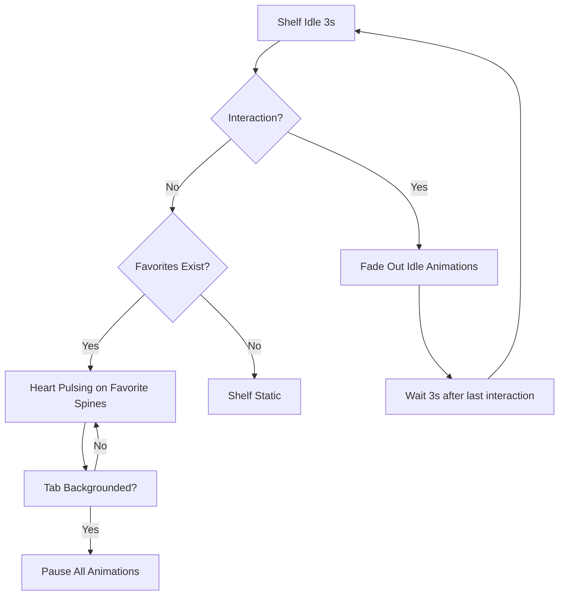

# STORY-044: Idle Micro-Animations

**Epic**: EPIC-007
**Persona**: Julia — The Young Author
**Priority**: Should Have
**Story Points**: 3
**Dependencies**: STORY-039 (Animation Engine), STORY-036 (Mark as Favorite), STORY-009 (Bookshelf Grid)

## User Story
As a young author, I want my favorite books to have a subtle glow or sparkle on the shelf even when I'm not touching them, so my shelf feels alive and magical.

## Description
Add subtle idle micro-animations to the bookshelf: favorite books (STORY-036) show a gentle spine glow (pulsing opacity on the heart icon), and optionally, subtle ambient particle effects (gentle floating dust motes or sparkles). These animations are purely decorative, must pause when the tab is not visible, and must respect reduced motion by not playing at all. They must not impact shelf performance.

## Context
Idle animations create ambient delight — the shelf feels "alive" between interactions. This is the lowest-priority EPIC-007 story; it should only be implemented if all other animation stories (STORY-040 through STORY-043) are stable. The scope is intentionally minimal to avoid performance risk.

## Acceptance Criteria (Verifiable)
- [ ] GIVEN a book is marked as favorite (STORY-036)
      WHEN the shelf is idle (no user interaction for 3 seconds)
      THEN the favorite heart icon on the spine gently pulses opacity between 0.7 and 1.0 over 2 seconds
- [ ] GIVEN the app tab is backgrounded
      WHEN the browser pauses rendering
      THEN all idle animations pause immediately
- [ ] GIVEN reduced motion is active OR the user starts interacting with the shelf
      WHEN either condition is detected
      THEN idle animations stop immediately (don't play at all for reduced motion)
- [ ] GIVEN Julia taps or interacts with any element on the shelf
      WHEN an interaction starts
      THEN idle animations fade out within 200ms
- [ ] GIVEN 50 books on shelf with 10 favorited
      WHEN idle animations play
      THEN shelf renders at 60fps with no performance degradation

## NFRs
- NFR-PERF-04: No frame drops from idle animations; must maintain 60fps
- NFR-ACC-05: Reduced motion → no idle animations at all
- NFR-ACC-05: No flashing >3 per second (seizure safety)

## Definition of Done (DoD)
- [ ] Code reviewed by CodeReviewer
- [ ] Tests with coverage >= 90%
- [ ] Integration tests passing
- [ ] QA approved by QAAnalyst
- [ ] Documentation updated
- [ ] PR created by MergeRequestCreator

## Technical Notes
- Heart pulse: CSS `@keyframes` with `opacity: 0.7 → 1.0` loop, `animation-duration: 2s`, `animation-delay: random(0, 2s)` per book for organic feel
- Ambient particles (optional, stretch goal): subtle pseudo-element dust motes, max 3-5 per shelf, using `transform: translate()` with long, slow keyframes (5-8s)
- Pause detection: use `document.visibilitychange` and `requestAnimationFrame` gating
- Fade-out on interaction: add `.shelf--active` class to shelf container on pointer/touch events; idle animations target `.shelf:not(.shelf--active)`
- Use `will-change: opacity` sparingly — only on elements that actually animate
- This story is the lowest EPIC-007 priority; defer if any performance concerns arise in earlier stories

## User Flow

## Test Scenarios
- Scenario 1: Favorited books show pulsing heart after 3s idle — 60fps maintained
- Scenario 2: Tap shelf → idle animations fade out within 200ms
- Scenario 3: Tab backgrounded → animations pause; foreground → resume
- Scenario 4: Reduced motion → no idle animations at any time
- Scenario 5: 50 books, 10 favorited, idle animation running → no dropped frames
