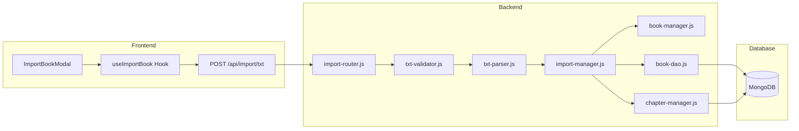
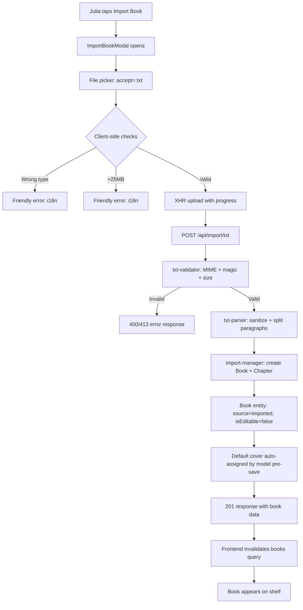
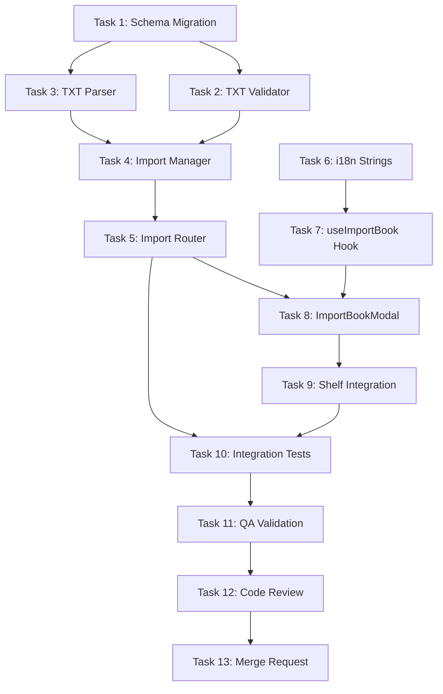

# STORY-045 Technical Analysis — TXT File Import

**Epic**: EPIC-005 | **Persona**: Julia (Young Author) | **Priority**: Could Have (V1.1) | **Points**: 5

---

## Stack Reference

| Layer | Technology |
|-------|-----------|
| Runtime | Node.js 22 LTS |
| API | Express 4.x + Mongoose 8.x (MongoDB 7) |
| Cache/PubSub | Redis 7 |
| Frontend | React 18 + Vite 5 + Tailwind + Flowbite + Framer Motion |
| Storage | MinIO (S3-compatible) |
| Infra | Docker Compose + nginx |

> Source: `docs/architecture/TECH-STACK.md` (greenfield)

**Language**: Node.js (fullstack containerized)
**Frontend Framework**: React — FrontendDeveloperReact
**Integration Pattern**: Node.js fullstack — shared TypeScript not used (JS codebase), single server, Vite proxy → Express

---

## Code Analysis Summary

### Existing Infrastructure (Leverage)

| Component | Status | Notes |
|-----------|--------|-------|
| `book-model.js` | ✅ Exists | Missing `source`, `format`, `isEditable` fields — need schema migration |
| `book-manager.js` | ✅ Exists | `createBookManager` — needs import-specific variant |
| `book-dao.js` | ✅ Exists | `createBook`, `pushChapterIdToBook` — reuse directly |
| `book-router.js` | ✅ Exists | Add `POST /import` route |
| `file-validator.js` | ✅ Exists | Image-only MIME whitelist — need TXT-specific validator (new module) |
| `storage-router.js` | ✅ Exists | Uses multer (5MB limit) — need import-specific multer config (25MB) |
| `DefaultCover.jsx` | ✅ Exists | STORY-028 default cover — reuse directly, no changes needed |
| `BookshelfGrid.jsx` | ✅ Exists | Displays books — no changes needed (imported books render same as others) |
| `BookshelfGridLayout.jsx` | ✅ Exists | Orchestrates shelf — add "Import Book" button |

### Required New Components

| Component | Layer | Description |
|-----------|-------|-------------|
| `import-router.js` | Backend | POST /import/txt endpoint with multer 25MB |
| `import-manager.js` | Backend | TXT parse → Book+Chapter creation pipeline |
| `txt-parser.js` | Backend | Pure function: buffer → paragraphs, sanitize HTML |
| `txt-validator.js` | Backend | MIME + magic bytes + size validation for .txt files |
| `ImportBookModal.jsx` | Frontend | File picker modal with progress bar |
| `useImportBook.js` | Frontend | TanStack mutation hook for import API call |
| `import.json` | Frontend i18n | pt-BR + EN localized strings for import flow |

---

## NFR Analysis

| NFR | Requirement | Mitigation |
|-----|------------|------------|
| NFR-SEC-04 | File content validated + sanitized before storage | `txt-parser.js` strips HTML/control chars, validates UTF-8 |
| NFR-SEC-05 | MIME type validated server-side; non-txt rejected | `txt-validator.js`: check `text/plain` MIME + magic bytes |
| NFR-PERF-07 | Import <60s for 25MB files | Stream parsing, no full-buffer operations post-validation; multer memory limit checked |
| NFR-ACC-07 | Error messages PT-BR (primary) + EN | i18n keys in `import.json` for both locales |

---

## Persona Impact

**Julia (Young Author)**: Primary beneficiary. Enables importing stories written outside Contopia. Key UX concerns:
- Simple, child-friendly file picker (`.txt` only filter)
- Clear progress feedback during upload
- Friendly error messages when wrong file type or too large
- Book appears on shelf immediately after import

---

## Architecture Diagram

## Import Flow

---

## Technical Task Breakdown

### Task 0: Code Analysis ✅ (Done above)

### Task 1: Schema Migration — Book Model

**Agent**: BackendDeveloper
**Files**: `backend/src/app/book/book-model.js`

Add fields to `bookSchema`:
- `source`: `{ type: String, enum: ['created', 'imported'], default: 'created' }`
- `importFormat`: `{ type: String, enum: [null, 'txt', 'pdf', 'epub'], default: null }`
- `isEditable`: `{ type: Boolean, default: true }`

Add compound index: `{ authorId: 1, source: 1, deletedAt: 1 }`

**Risk**: Existing books default to `source: 'created'`, `isEditable: true` — backward compatible.

### Task 2: TXT Validator — Backend

**Agent**: BackendDeveloper
**Files**: NEW `backend/src/app/book/__tests__/txt-validator.test.js`, NEW `backend/src/app/book/txt-validator.js`

Pure functions:
- `validateTxtFile(file)`: checks MIME `text/plain`, magic bytes (no BOM or UTF-8 BOM ok), size ≤25MB
- `sanitizeTxtContent(buffer)`: strips null bytes, control chars (except `\n`, `\r`, `\t`), validates UTF-8
- Export for reuse by STORY-046/047

### Task 3: TXT Parser — Backend

**Agent**: BackendDeveloper
**Files**: NEW `backend/src/app/book/__tests__/txt-parser.test.js`, NEW `backend/src/app/book/txt-parser.js`

Pure functions:
- `parseTxtBuffer(buffer, filename)`: returns `{ title, paragraphs[] }`
  - Title: filename without `.txt` extension, trimmed
  - Paragraphs: split by `\n\n`, filter empty, limit paragraph count (cap at 10,000)
- `extractTitle(filename)`: strip extension, sanitize

### Task 4: Import Manager — Backend

**Agent**: BackendDeveloper
**Files**: NEW `backend/src/app/book/__tests__/import-manager.test.js`, NEW `backend/src/app/book/import-manager.js`

Functions:
- `importTxtBookManager({ authorId, file })`:
  1. Validate via `txt-validator.js`
  2. Parse via `txt-parser.js`
  3. Create Book: `source: 'imported'`, `importFormat: 'txt'`, `isEditable: false`
  4. Create single Chapter: `title: 'Imported Content'`, `content: paragraphs.join('\n\n')`, `wordCount`, `order: 0`
  5. Push chapter ID to book
  6. Audit log: `book.import_txt`
  7. Return book with chapter

### Task 5: Import Router — Backend

**Agent**: BackendDeveloper
**Files**: NEW `backend/src/app/book/__tests__/import-route.test.js`, edit `backend/src/app/book/import-router.js`

- `POST /api/import/txt` — multer config: `memoryStorage()`, `limits.fileSize: 25MB`
- Calls `importTxtBookManager`
- Mount router in app entry point

### Task 6: Frontend — i18n Strings

**Agent**: FrontendDeveloperReact
**Files**: NEW `frontend/src/i18n/locales/pt-BR/import.json`, NEW `frontend/src/i18n/locales/en/import.json`
+ register in i18n config

### Task 7: Frontend — useImportBook Hook

**Agent**: FrontendDeveloperReact
**Files**: NEW `frontend/src/hooks/useImportBook.js`, NEW `frontend/src/__tests__/useImportBook.test.js`

TanStack Query mutation:
- `useImportBook()`: returns `{ mutate, mutateAsync, isPending, progress, error, reset }`
- Uses `XMLHttpRequest` for upload progress tracking
- On success: invalidate `useBooksQuery` cache
- On error: map error codes to i18n messages

### Task 8: Frontend — ImportBookModal Component

**Agent**: FrontendDeveloperReact
**Files**: NEW `frontend/src/components/shelf/ImportBookModal.jsx`, NEW `frontend/src/__tests__/ImportBookModal.test.jsx`

- Flowbite Modal with file input (`accept=".txt,text/plain"`)
- Client-side validation: `file.type === 'text/plain'`, `file.size <= 25MB`
- Progress bar: Framer Motion animated bar showing `%`
- Friendly error display using i18n
- Close on success (book appears on shelf)

### Task 9: Frontend — Shelf Integration

**Agent**: FrontendDeveloperReact
**Files**: Edit `frontend/src/app/shelf/BookshelfGridLayout.jsx`

- Add "Import Book" button (Flowbite Button with icon)
- Opens ImportBookModal
- On import success: refetch books query

### Task 10: Integration Tests

**Agent**: TestEngineer
**Files**: NEW `backend/tests/integration/import-txt.test.js`

Scenarios:
1. Import small .txt → 201, book appears with correct title, isEditable=false
2. Import .txt with paragraphs → chapter content preserved
3. Attempt .docx upload → 400 INVALID_FILE_TYPE
4. Attempt >25MB upload → 413 PAYLOAD_TOO_LARGE
5. Import with XSS content → sanitized before storage (NFR-SEC-04)
6. Import with non-text MIME → 400 (NFR-SEC-05)

### Task 11: QA Validation

**Agent**: QAAnalyst

Validate all 6 acceptance criteria from STORY-045.md against running system.

### Task 12: Code Review

**Agent**: CodeReviewer

### Task 13: Merge Request

**Agent**: MergeRequestCreator

---

## Execution Order & Dependencies

**Parallelization**:
- Tasks 2+3 CAN run in parallel (independent pure functions)
- Task 6 (i18n) CAN run in parallel with Tasks 1-5 (backend)
- Tasks 7-9 MUST run sequentially (hook → modal → shelf)
- Task 10 MUST wait for both backend (Task 5) and frontend (Task 9)
- Tasks 11-13 strictly sequential

---

## SubAgent Assignments

| Task | Agent | Description |
|------|-------|-------------|
| 1 | BackendDeveloper | Schema migration: add source, importFormat, isEditable |
| 2 | BackendDeveloper | TXT validator: MIME + magic bytes + size |
| 3 | BackendDeveloper | TXT parser: buffer → title + paragraphs |
| 4 | BackendDeveloper | Import manager: orchestrate import pipeline |
| 5 | BackendDeveloper | Import router: POST /import/txt endpoint |
| 6 | FrontendDeveloperReact | i18n strings PT-BR + EN |
| 7 | FrontendDeveloperReact | useImportBook mutation hook with progress |
| 8 | FrontendDeveloperReact | ImportBookModal component |
| 9 | FrontendDeveloperReact | Shelf integration: button + modal trigger |
| 10 | TestEngineer | Integration tests (6 scenarios) |
| 11 | QAAnalyst | Validate acceptance criteria |
| 12 | CodeReviewer | Full code review |
| 13 | MergeRequestCreator | PR creation |

---

## Impacted Files

### Backend (Modified)
- `backend/src/app/book/book-model.js` — add `source`, `importFormat`, `isEditable` fields

### Backend (New)
- `backend/src/app/book/txt-validator.js`
- `backend/src/app/book/txt-parser.js`
- `backend/src/app/book/import-manager.js`
- `backend/src/app/book/import-router.js`
- `backend/src/app/book/__tests__/txt-validator.test.js`
- `backend/src/app/book/__tests__/txt-parser.test.js`
- `backend/src/app/book/__tests__/import-manager.test.js`
- `backend/src/app/book/__tests__/import-route.test.js`
- `backend/tests/integration/import-txt.test.js`

### Frontend (New)
- `frontend/src/i18n/locales/pt-BR/import.json`
- `frontend/src/i18n/locales/en/import.json`
- `frontend/src/hooks/useImportBook.js`
- `frontend/src/components/shelf/ImportBookModal.jsx`
- `frontend/src/__tests__/useImportBook.test.js`
- `frontend/src/__tests__/ImportBookModal.test.jsx`

### Frontend (Modified)
- `frontend/src/app/shelf/BookshelfGridLayout.jsx` — add import button
- `frontend/src/i18n/` config — register import namespace

---

## Risk Assessment

| Risk | Severity | Mitigation |
|------|----------|------------|
| Schema migration adds fields to existing model | Low | New fields have defaults, backward compatible |
| 25MB file in memory via multer | Medium | multer `memoryStorage()` holds full buffer; consider `diskStorage` for >25MB but story scopes limit at 25MB, acceptable |
| XSS via TXT content (NFR-SEC-04) | High | `txt-parser.js` sanitizes all HTML/control chars before storage |
| MIME spoofing (NFR-SEC-05) | Medium | Validate both MIME header and content (no binary patterns) |
| Future formats (PDF/EPUB) extend this | Low | `source` + `importFormat` fields designed for extension; parser is pure function, swappable |
| Upload progress via fetch API | Low | Story specifies `XMLHttpRequest` for `progress` event; fallback to spinner if unavailable |

---

## Implementation Recommendations

1. **Schema-first**: Complete Task 1 (schema migration) before any other work — all downstream code depends on the new fields.
2. **Pure function parsers**: `txt-validator.js` and `txt-parser.js` as pure functions for testability and reuse by STORY-046/047.
3. **Separate router**: New `import-router.js` (not added to `book-router.js`) keeps concern separation clean; STORY-046/047 will add routes to the same import router.
4. **Single chapter model**: Per story, imported TXT content becomes a single chapter. This simplifies reader display and matches the "preserved paragraphs" AC.
5. **Progress via XHR**: The `useImportBook` hook should use `XMLHttpRequest` internally for the `upload.progress` event, wrapped in a promise for the TanStack mutation.
6. **Default cover**: No work needed — Book model `pre('save')` hook auto-assigns `default_color`, and `DefaultCover.jsx` renders based on `book.default_color` when `has_custom_cover === false`.